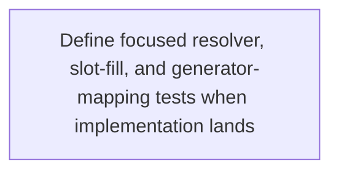
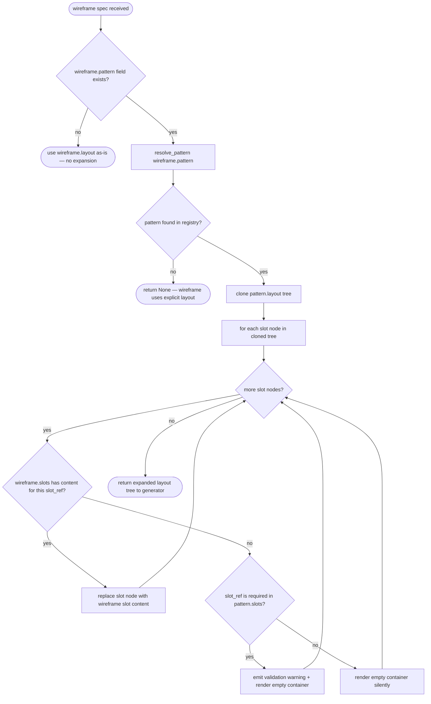
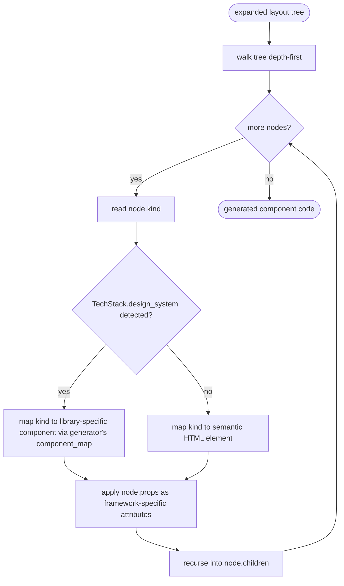

# Ux Pattern Library

## Overview
<!-- type: overview lang: markdown -->

Define the extension point for a design-system-agnostic UX pattern library. Patterns are abstract layout recipes (e.g., `dashboard-with-drawer`, `crud-table`, `form-with-stepper`) that wireframe specs can reference by ID instead of describing full layout structure.

| Aspect | Detail |
|--------|--------|
| Purpose | Decouple wireframe spec authoring from component library choice |
| Trigger | `wireframe` section references a `pattern` by ID |
| Consumer | `SpecIRGenerator` implementations (ReactGenerator, etc.) |
| Data source | Built-in `PATTERN_REGISTRY` (const array, extensible later) |
| Status | Extension point spec only — implementation deferred |

### Design intent

When `tech_stack.design_system` is detected with UX pattern support, wireframe sections can use shorthand:

```yaml
page: order-list
pattern: dashboard-with-drawer
slots:
  main:
    component: DataTable
    props: { columns: [id, customer, amount, status] }
```

The pattern resolver expands `dashboard-with-drawer` into a full layout tree with named slots. The generator then translates abstract layout nodes into library-specific components (MUI `Drawer` + `AppBar`, Antd `Layout.Sider` + `Layout.Header`, etc.).

### Scope boundary

- This spec defines: pattern format, pattern registry interface, slot system, resolution algorithm
- This spec does NOT define: specific pattern content (deferred), generator mapping rules (per-generator specs), wireframe YAML DSL changes (wireframe spec)

## Requirements
<!-- type: requirements lang: mermaid -->

```mermaid
---
id: ux-pattern-library-requirements
---
requirementDiagram
    requirement REQ_1 {
        id: REQ-1
        text: Define each UX pattern as id, name, description, slots, and abstract layout nodes.
        risk: medium
        verifymethod: inspection
    }
    requirement REQ_2 {
        id: REQ-2
        text: Define PatternSlot as a named insertion point with required flag and description.
        risk: medium
        verifymethod: inspection
    }
    requirement REQ_3 {
        id: REQ-3
        text: Define PatternNode as an abstract layout tree node with kind, label, props, and children.
        risk: medium
        verifymethod: inspection
    }
    requirement REQ_4 {
        id: REQ-4
        text: Keep built-in patterns in a code-defined registry.
        risk: medium
        verifymethod: inspection
    }
    requirement REQ_5 {
        id: REQ-5
        text: Resolve pattern IDs from the registry and return None for unknown patterns.
        risk: medium
        verifymethod: test
    }
    requirement REQ_6 {
        id: REQ-6
        text: Expand wireframe pattern references into layout trees and fill named slots.
        risk: high
        verifymethod: test
    }
    requirement REQ_7 {
        id: REQ-7
        text: Pass only expanded abstract layout trees to generators.
        risk: medium
        verifymethod: test
    }
    requirement REQ_8 {
        id: REQ-8
        text: Keep pattern usage independent from TechStack detection.
        risk: low
        verifymethod: inspection
    }
    requirement REQ_9 {
        id: REQ-9
        text: Reserve PatternSource as the deferred extension point for external pattern providers.
        risk: low
        verifymethod: inspection
    }
```

## Scenarios
<!-- type: scenarios lang: yaml -->

```yaml
scenarios:
  - name: known-pattern-all-slots-filled
    given:
      - PATTERN_REGISTRY contains dashboard-with-drawer with main required and drawer optional slots.
      - Wireframe spec has pattern dashboard-with-drawer with main and drawer slot content.
    when: resolve_pattern("dashboard-with-drawer") is called and slots are filled.
    then:
      - The expanded layout tree contains toolbar, drawer(FilterPanel), and main(DataTable).
      - The generator receives the expanded tree with abstract node kinds.
  - name: known-pattern-optional-slot-unfilled
    given:
      - PATTERN_REGISTRY contains dashboard-with-drawer with main required and drawer optional slots.
      - Wireframe spec has only main slot content.
    when: The pattern is resolved and slots are filled.
    then:
      - The drawer slot is rendered as an empty container.
      - No validation warning is produced.
  - name: known-pattern-required-slot-missing
    given:
      - PATTERN_REGISTRY contains crud-table with table and actions required slots.
      - Wireframe spec fills table but omits actions.
    when: The pattern is resolved and slots are filled.
    then:
      - The actions slot is rendered as an empty container.
      - A validation warning is emitted for the missing required slot.
  - name: unknown-pattern
    given: PATTERN_REGISTRY does not contain custom-wizard.
    when: resolve_pattern("custom-wizard") is called.
    then:
      - The resolver returns None.
      - The wireframe falls back to its explicit layout field.
  - name: no-pattern-field
    given: Wireframe spec has no pattern field and only a layout array.
    when: The wireframe is processed by the generator.
    then:
      - No pattern resolution occurs.
      - The layout is used as-is.
  - name: translate-abstract-nodes-to-mui
    given:
      - Expanded layout tree contains a drawer node with left position and width 240.
      - TechStack.design_system.library is mui.
    when: ReactGenerator processes the layout tree.
    then: The generator emits MUI Drawer markup with width 240.
  - name: translate-abstract-nodes-to-antd
    given:
      - Expanded layout tree contains a drawer node with left position and width 240.
      - TechStack.design_system.library is antd.
    when: ReactGenerator processes the layout tree.
    then: The generator emits Antd Layout.Sider markup with width 240.
  - name: external-pattern-source-deferred
    given:
      - A PatternSource implementation is registered.
      - It provides company-dashboard outside the built-in registry.
    when: resolve_pattern("company-dashboard") is called with the external source.
    then:
      - The external source pattern is returned.
      - The built-in registry remains the first lookup source.
```

## Diagrams
<!-- type: doc lang: markdown -->

### Interaction
<!-- type: interaction lang: mermaid -->
<!-- score-td-placeholder -->

### Logic
<!-- type: logic lang: mermaid -->
<!-- score-td-placeholder -->

### Dependencies
<!-- type: dependency lang: mermaid -->
<!-- score-td-placeholder -->

### State Machine
<!-- type: state-machine lang: mermaid -->
<!-- score-td-placeholder -->

### Data Model
<!-- type: db-model lang: mermaid -->
<!-- score-td-placeholder -->

## API Spec
<!-- type: doc lang: markdown -->

### REST API
<!-- type: rest-api lang: yaml -->
<!-- score-td-placeholder -->

### RPC API
<!-- type: rpc-api lang: json -->
<!-- score-td-placeholder -->

### Async API
<!-- type: async-api lang: yaml -->
<!-- score-td-placeholder -->

### CLI
<!-- type: cli lang: yaml -->
<!-- score-td-placeholder -->

### Schema
<!-- type: schema lang: json -->
<!-- score-td-placeholder -->

### Config
<!-- type: config lang: json -->
<!-- score-td-placeholder -->

## Test Plan
<!-- type: test-plan lang: mermaid -->



## Changes
<!-- type: changes lang: yaml -->

```yaml
_sdd:
  id: ux-pattern-library-changes
  refs:
    - $ref: "#pattern-resolve"
    - $ref: "#ux-pattern-library"
    - $ref: "tech-stack-inference#tech-stack-detect"
changes:
  - path: crates/cclab-sdd/src/generate/patterns/mod.rs
    action: create
    section: logic
    impl_mode: hand-written
    description: "Define UxPattern, PatternSlot, PatternNode, SlotContent structs. Define PatternSource trait (extension point, deferred impl). Implement resolve_pattern() lookup."
  - path: crates/cclab-sdd/src/generate/patterns/registry.rs
    action: create
    section: logic
    impl_mode: hand-written
    description: "Define PATTERN_REGISTRY const array with initial empty set. Pattern definitions will be added in a future change."
  - path: crates/cclab-sdd/src/generate/patterns/resolver.rs
    action: create
    section: logic
    impl_mode: hand-written
    description: "Implement expand_pattern() — clone layout tree, fill slots from wireframe content map, emit warnings for unfilled required slots."
  - path: crates/cclab-sdd/src/generate/mod.rs
    action: modify
    section: logic
    impl_mode: hand-written
    description: "Add pub mod patterns and re-export UxPattern, PatternSlot, PatternNode, resolve_pattern, expand_pattern"
  - path: crates/cclab-sdd/src/generate/generators/react.rs
    action: modify
    section: logic
    impl_mode: hand-written
    description: "Add component_map for abstract node kinds to MUI/Antd/HTML elements. Update render_jsx_body to use component_map when TechStack.design_system is available."
  - path: crates/cclab-sdd/src/generate/spec_ir/types.rs
    action: modify
    section: schema
    impl_mode: hand-written
    description: "Extend WireframeSpec with optional pattern: Option<String> and slots: HashMap<String, SlotContent> fields"
  - path: .aw/tech-design/crates/cclab-sdd/generate/ux-pattern-library.md
    action: create
    section: logic
    impl_mode: hand-written
    description: "New main spec — merge target for this change spec"
  - action: annotate
    section: async-api
    impl_mode: hand-written
    description: "Traceability metadata edge for the async-api section."

  - action: annotate
    section: cli
    impl_mode: hand-written
    description: "Traceability metadata edge for the cli section."

  - action: annotate
    section: component
    impl_mode: hand-written
    description: "Traceability metadata edge for the component section."

  - action: annotate
    section: config
    impl_mode: hand-written
    description: "Traceability metadata edge for the config section."

  - action: annotate
    section: db-model
    impl_mode: hand-written
    description: "Traceability metadata edge for the db-model section."

  - action: annotate
    section: dependency
    impl_mode: hand-written
    description: "Traceability metadata edge for the dependency section."

  - action: annotate
    section: design-token
    impl_mode: hand-written
    description: "Traceability metadata edge for the design-token section."

  - action: annotate
    section: interaction
    impl_mode: hand-written
    description: "Traceability metadata edge for the interaction section."

  - action: annotate
    section: requirements
    impl_mode: hand-written
    description: "Traceability metadata edge for the requirements section."

  - action: annotate
    section: rest-api
    impl_mode: hand-written
    description: "Traceability metadata edge for the rest-api section."

  - action: annotate
    section: rpc-api
    impl_mode: hand-written
    description: "Traceability metadata edge for the rpc-api section."

  - action: annotate
    section: scenarios
    impl_mode: hand-written
    description: "Traceability metadata edge for the scenarios section."

  - action: annotate
    section: state-machine
    impl_mode: hand-written
    description: "Traceability metadata edge for the state-machine section."

  - action: annotate
    section: unit-test
    impl_mode: hand-written
    description: "Traceability metadata edge for the unit-test section."

  - action: annotate
    section: wireframe
    impl_mode: hand-written
    description: "Traceability metadata edge for the wireframe section."

```

## Wireframe
<!-- type: wireframe lang: yaml -->

```yaml
wireframes: []
```

## Component
<!-- type: component lang: yaml -->

```yaml
components: []
```

## Design Token
<!-- type: design-token lang: yaml -->

```yaml
design_tokens: []
```

## Doc
<!-- type: doc lang: markdown -->

<!-- TODO -->


## Schema
<!-- type: schema lang: yaml -->

Data model for UX pattern definitions, slots, and layout nodes.

```yaml
{
  "$schema": "https://json-schema.org/draft/2020-12/schema",
  "$id": "ux-pattern-library",
  "title": "UX Pattern Library",
  "description": "Design-system-agnostic layout pattern definitions for wireframe shorthand",
  "type": "object",
  "$defs": {
    "UxPattern": {
      "type": "object",
      "description": "A reusable layout recipe that wireframe specs can reference by ID",
      "properties": {
        "id": {
          "type": "string",
          "pattern": "^[a-z][a-z0-9-]*$",
          "description": "Unique kebab-case identifier (e.g., dashboard-with-drawer)"
        },
        "name": {
          "type": "string",
          "description": "Human-readable pattern name"
        },
        "description": {
          "type": "string",
          "description": "Brief description of the layout pattern's purpose"
        },
        "slots": {
          "type": "array",
          "items": { "$ref": "#/$defs/PatternSlot" },
          "description": "Named insertion points where wireframe content is placed"
        },
        "layout": {
          "type": "array",
          "items": { "$ref": "#/$defs/PatternNode" },
          "description": "Top-level layout tree using abstract node kinds"
        }
      },
      "required": ["id", "name", "slots", "layout"],
      "additionalProperties": false
    },
    "PatternSlot": {
      "type": "object",
      "description": "A named insertion point in the pattern's layout tree",
      "properties": {
        "name": {
          "type": "string",
          "description": "Slot name (unique within pattern), referenced by PatternNode kind=slot"
        },
        "required": {
          "type": "boolean",
          "default": false,
          "description": "If true, wireframe must fill this slot or a validation warning is emitted"
        },
        "description": {
          "type": "string",
          "description": "What content this slot expects"
        }
      },
      "required": ["name"],
      "additionalProperties": false
    },
    "PatternNode": {
      "type": "object",
      "description": "A node in the abstract layout tree",
      "properties": {
        "kind": {
          "type": "string",
          "enum": ["container", "sidebar", "header", "footer", "main", "nav", "drawer", "toolbar", "slot", "split-pane", "tabs", "grid", "stack"],
          "description": "Abstract element kind — generators translate to library-specific components"
        },
        "slot_ref": {
          "type": "string",
          "description": "When kind=slot, references the PatternSlot.name to fill here"
        },
        "label": {
          "type": "string",
          "description": "Optional display label"
        },
        "props": {
          "type": "object",
          "additionalProperties": true,
          "description": "Static layout props (width, position, direction, etc.) — generator maps to framework-specific props"
        },
        "children": {
          "type": "array",
          "items": { "$ref": "#/$defs/PatternNode" },
          "default": [],
          "description": "Child nodes (recursive)"
        }
      },
      "required": ["kind"],
      "additionalProperties": false,
      "if": { "properties": { "kind": { "const": "slot" } } },
      "then": { "required": ["kind", "slot_ref"] }
    },
    "PatternSource": {
      "type": "object",
      "description": "Extension point trait interface — external pattern providers (deferred implementation)",
      "properties": {
        "name": {
          "type": "string",
          "description": "Source identifier (e.g., 'builtin', 'company-patterns')"
        },
        "priority": {
          "type": "integer",
          "default": 0,
          "description": "Resolution priority — lower wins. Built-in registry has priority 0."
        }
      },
      "required": ["name"]
    },
    "SlotContent": {
      "type": "object",
      "description": "Wireframe-provided content to fill a pattern slot",
      "properties": {
        "component": {
          "type": "string",
          "description": "Component name to render in this slot"
        },
        "props": {
          "type": "object",
          "additionalProperties": true,
          "description": "Props passed to the component in this slot"
        },
        "children": {
          "type": "array",
          "items": { "$ref": "#/$defs/PatternNode" },
          "description": "Nested layout within the slot"
        }
      },
      "required": ["component"]
    }
  }
}
```


## Logic
<!-- type: logic lang: mermaid -->

Pattern resolution algorithm — expands wireframe `pattern` field into a full layout tree with slots filled.



### Generator translation (downstream)



### Abstract node kind to component mapping (per generator)

```yaml
node_kind_mapping:
  mui:
    drawer: "Drawer variant='permanent'"
    toolbar: "Toolbar"
    sidebar: "Drawer variant='permanent'"
    header: "AppBar position='static'"
    nav: "List (navigation)"
    container: "Box"
    main: "Box component='main'"
    footer: "Box component='footer'"
    split-pane: "Grid container"
    tabs: "Tabs + TabPanel"
    grid: "Grid container"
    stack: "Stack"
  antd:
    drawer: "Layout.Sider"
    toolbar: "Layout.Header (inner)"
    sidebar: "Layout.Sider"
    header: "Layout.Header"
    nav: "Menu"
    container: "Layout"
    main: "Layout.Content"
    footer: "Layout.Footer"
    split-pane: "Row + Col"
    tabs: "Tabs + Tabs.TabPane"
    grid: "Row + Col"
    stack: "Space direction='vertical'"
  html:
    drawer: "aside"
    toolbar: "div role='toolbar'"
    sidebar: "aside"
    header: "header"
    nav: "nav"
    container: "div"
    main: "main"
    footer: "footer"
    split-pane: "div style='display:flex'"
    tabs: "div role='tablist'"
    grid: "div style='display:grid'"
    stack: "div style='display:flex;flex-direction:column'"
```
