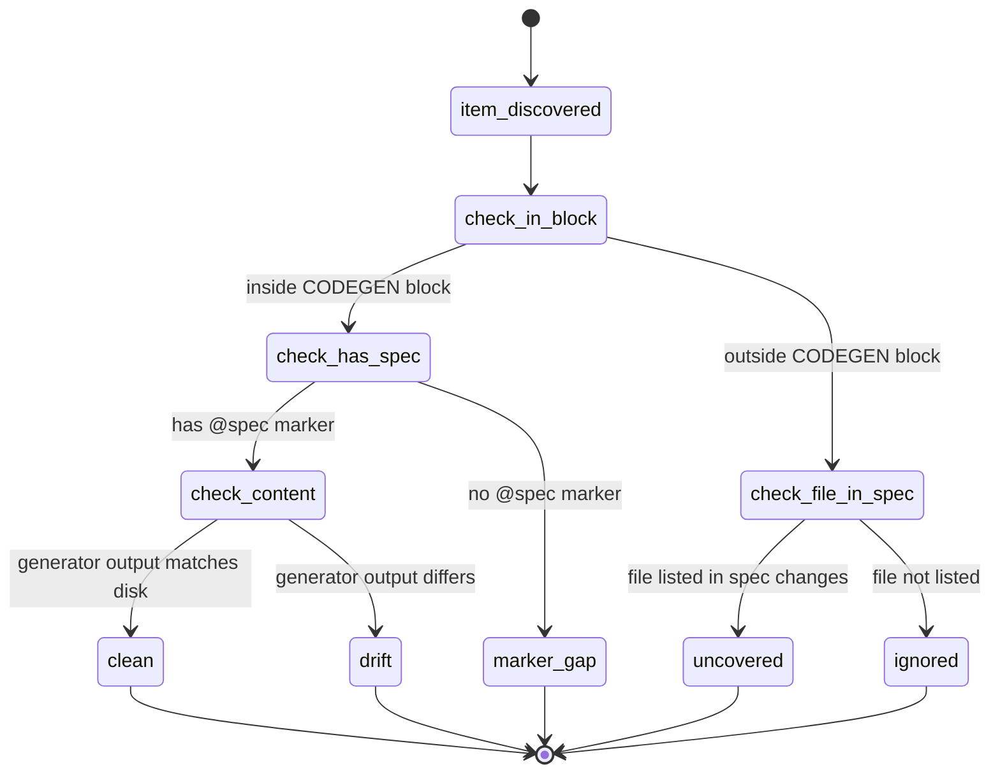

# Validate–Audit Split: spec-side vs code-side

## Overview
<!-- type: overview lang: markdown -->

Splits the `aw td` verb surface on a single axis: **spec-side** vs **code-side**.

`aw td validate <path>` — spec-side only. Accepts (a) a slug (CRRR commit-gate mode, sole commit point), (b) a spec-space prefix (read-only multi-file), or (c) a single spec file (read-only). Enforces 7 structural lint rules and the codegen-ready gate.

`aw td audit <path>` — code-side only. Accepts (a) a code-space prefix or (b) a single source file. Performs one unified single-pass walk that classifies every top-level public item as `Clean`, `Drift`, `MarkerGap`, or `Uncovered`. Slug mode is explicitly rejected with `UnsupportedPathShape`.

Both verbs share a `--json` output flag and a three-value exit-code contract: `0` (clean), `1` (findings), `2` (invocation error).

The existing `--ready-only` and `--drift` flag overloads on `aw td audit` are removed; callers supplying them receive an exit-2 deprecation error with a migration message.

## Requirements

```mermaid
---
id: validate-audit-requirements
requirements:
  R1:
    id: R1
    text: "aw td validate accepts three path shapes: slug (CRRR commit-gate), spec-prefix (read-only), single spec file (read-only)"
    kind: functional
    risk: high
    verify: test
  R2:
    id: R2
    text: "In slug mode, aw td validate is the sole commit point writing Lifecycle-Stage trailer and advancing frontmatter.phase"
    kind: functional
    risk: high
    verify: test
  R3:
    id: R3
    text: "aw td validate enforces all 7 lint rules: double-Option, nullable/required contradiction, orphan x-mamba-binding, lowercase enum in rust_type, impl_mode misuse, codegen-ready gate, cross-section rust_type consistency"
    kind: functional
    risk: high
    verify: test
  R4:
    id: R4
    text: "aw td audit accepts only code-prefix or single file; slug input returns UnsupportedPathShape exit-2 error"
    kind: functional
    risk: high
    verify: test
  R5:
    id: R5
    text: "aw td audit performs a unified single-pass walk emitting Clean / Drift / MarkerGap / Uncovered per top-level item; statuses are mutually exclusive and exhaustive"
    kind: functional
    risk: high
    verify: test
  R6:
    id: R6
    text: "aw td audit exits non-zero when any finding is non-Clean"
    kind: functional
    risk: high
    verify: test
  R7:
    id: R7
    text: "Uncovered flags pub struct/enum/trait/fn/impl outside CODEGEN blocks in files listed in any spec changes section"
    kind: functional
    risk: high
    verify: test
  R8:
    id: R8
    text: "Both verbs support --json flag emitting structured JSON array; exit codes: 0=clean, 1=findings, 2=invocation error"
    kind: interface
    risk: high
    verify: test
  R9:
    id: R9
    text: "--ready-only and --drift flags are removed from aw td audit; supplying them returns exit-2 with migration message"
    kind: functional
    risk: medium
    verify: test
  R10:
    id: R10
    text: "aw td validate and aw td audit are runnable without compiled artifacts (no Cargo build required)"
    kind: performance
    risk: medium
    verify: test
---
requirementDiagram
    requirement R1 {
      id: R1
      text: "validate path-shape router"
      risk: high
      verifymethod: test
    }
    requirement R2 {
      id: R2
      text: "slug mode sole commit point"
      risk: high
      verifymethod: test
    }
    requirement R3 {
      id: R3
      text: "7 lint rules enforced"
      risk: high
      verifymethod: test
    }
    requirement R4 {
      id: R4
      text: "audit path-shape router"
      risk: high
      verifymethod: test
    }
    requirement R5 {
      id: R5
      text: "unified single-pass walk"
      risk: high
      verifymethod: test
    }
    requirement R6 {
      id: R6
      text: "nonzero exit on non-Clean"
      risk: high
      verifymethod: test
    }
    requirement R7 {
      id: R7
      text: "Uncovered classification"
      risk: high
      verifymethod: test
    }
    requirement R8 {
      id: R8
      text: "--json flag and exit codes"
      risk: high
      verifymethod: test
    }
    requirement R9 {
      id: R9
      text: "legacy flag deprecation"
      risk: medium
      verifymethod: test
    }
    requirement R10 {
      id: R10
      text: "no compiled artifacts required"
      risk: medium
      verifymethod: test
    }
```

<!-- type: requirements lang: mermaid -->



## Audit Walk State Machine
<!-- type: state-machine lang: mermaid -->



## Validate Rule Registry and Uncovered Index

```mermaid
---
id: validate-rule-and-uncovered
entry: start
nodes:
  start: { kind: start, label: "Entry: validate spec or build uncovered index" }
  route: { kind: decision, label: "Operation?" }
  v_parse: { kind: process, label: "Parse spec AST" }
  check_r3a: { kind: decision, label: "R3a: double-Option?" }
  check_r3b: { kind: decision, label: "R3b: nullable+required?" }
  check_r3c: { kind: decision, label: "R3c: orphan x-mamba-binding?" }
  check_r3d: { kind: decision, label: "R3d: lowercase enum rust_type?" }
  check_r3e: { kind: decision, label: "R3e: invalid impl_mode?" }
  check_r3f: { kind: decision, label: "R3f: codegen-ready gate?" }
  check_r3g: { kind: decision, label: "R3g: rust_type cross-section?" }
  collect: { kind: process, label: "Collect violation" }
  all_done: { kind: decision, label: "All 7 rules done?" }
  emit_ok: { kind: terminal, label: "Return Ok (validate)" }
  emit_err: { kind: terminal, label: "Return Err findings (validate)" }
  build_idx: { kind: process, label: "Scan .aw/tech-design for changes: sections" }
  extract: { kind: process, label: "Extract file paths; build reverse map file -> specs" }
  walk_item: { kind: process, label: "Walk target file for top-level pub items" }
  in_block: { kind: decision, label: "Item inside CODEGEN block?" }
  file_listed: { kind: decision, label: "File in reverse map?" }
  emit_uncov: { kind: terminal, label: "Emit Uncovered finding" }
  skip: { kind: terminal, label: "Skip (not spec-listed)" }
  defer: { kind: terminal, label: "Handled by in-block walk" }
edges:
  - from: start
    to: route
  - from: route
    to: v_parse
    label: "validate"
  - from: route
    to: build_idx
    label: "uncovered index"
  - from: v_parse
    to: check_r3a
  - from: check_r3a
    to: collect
    label: "violation"
  - from: check_r3a
    to: check_r3b
    label: "pass"
  - from: collect
    to: check_r3b
  - from: check_r3b
    to: collect
    label: "violation"
  - from: check_r3b
    to: check_r3c
    label: "pass"
  - from: collect
    to: check_r3c
  - from: check_r3c
    to: collect
    label: "violation"
  - from: check_r3c
    to: check_r3d
    label: "pass"
  - from: collect
    to: check_r3d
  - from: check_r3d
    to: collect
    label: "violation"
  - from: check_r3d
    to: check_r3e
    label: "pass"
  - from: collect
    to: check_r3e
  - from: check_r3e
    to: collect
    label: "violation"
  - from: check_r3e
    to: check_r3f
    label: "pass"
  - from: collect
    to: check_r3f
  - from: check_r3f
    to: collect
    label: "violation"
  - from: check_r3f
    to: check_r3g
    label: "pass"
  - from: collect
    to: check_r3g
  - from: check_r3g
    to: collect
    label: "violation"
  - from: check_r3g
    to: all_done
    label: "pass"
  - from: collect
    to: all_done
  - from: all_done
    to: emit_err
    label: "errors found"
  - from: all_done
    to: emit_ok
    label: "no errors"
  - from: build_idx
    to: extract
  - from: extract
    to: walk_item
  - from: walk_item
    to: in_block
  - from: in_block
    to: defer
    label: "yes"
  - from: in_block
    to: file_listed
    label: "no"
  - from: file_listed
    to: emit_uncov
    label: "listed"
  - from: file_listed
    to: skip
    label: "not listed"
---
flowchart TD
    start([Entry]) --> route{Operation?}
    route -->|validate| v_parse[Parse spec AST]
    route -->|uncovered index| build_idx[Scan .aw/tech-design for changes: sections]

    v_parse --> check_r3a{R3a: double-Option?}
    check_r3a -->|violation| collect[Collect violation]
    check_r3a -->|pass| check_r3b
    collect --> check_r3b
    check_r3b{R3b: nullable+required?} -->|violation| collect
    check_r3b -->|pass| check_r3c
    check_r3c{R3c: orphan binding?} -->|violation| collect
    check_r3c -->|pass| check_r3d
    check_r3d{R3d: lowercase enum?} -->|violation| collect
    check_r3d -->|pass| check_r3e
    check_r3e{R3e: invalid impl_mode?} -->|violation| collect
    check_r3e -->|pass| check_r3f
    check_r3f{R3f: codegen-ready?} -->|violation| collect
    check_r3f -->|pass| check_r3g
    check_r3g{R3g: rust_type consistency?} -->|violation| collect
    check_r3g -->|pass| all_done
    collect --> all_done
    all_done{Errors found?} -->|yes| emit_err([Return Err findings])
    all_done -->|no| emit_ok([Return Ok])

    build_idx --> extract[Extract file paths; build reverse map]
    extract --> walk_item[Walk top-level pub items in target file]
    walk_item --> in_block{Item inside CODEGEN block?}
    in_block -->|yes| defer([Handled by in-block walk])
    in_block -->|no| file_listed{File in reverse map?}
    file_listed -->|listed| emit_uncov([Emit Uncovered finding])
    file_listed -->|not listed| skip([Skip - not spec-listed])
```

<!-- type: logic lang: mermaid -->



## CLI Interface
<!-- type: cli lang: yaml -->

```yaml
"$schema": "https://json-schema.org/draft/2020-12/schema"
$id: validate-audit-cli
title: aw td validate and audit CLI

definitions:
  ValidateArgs:
    type: object
    description: Arguments for aw td validate
    properties:
      path:
        type: string
        description: |
          Path shape (resolved at runtime):
          - slug: matches an open issue identifier; activates CRRR commit-gate mode
          - spec-prefix: directory path under .aw/tech-design/; validates all specs under it (read-only)
          - spec-file: single .md file path; validates that file only (read-only)
      json:
        type: boolean
        description: Emit machine-readable JSON array of ValidateFinding objects to stdout
        default: false
    required: [path]

  AuditArgs:
    type: object
    description: Arguments for aw td audit
    properties:
      path:
        type: string
        description: |
          Path shape (resolved at runtime):
          - code-prefix: directory path under crates/ or projects/; walks all .rs files under it
          - code-file: single .rs file path
          Slug inputs are rejected with UnsupportedPathShape (exit 2).
      json:
        type: boolean
        description: Emit machine-readable JSON array of AuditFinding objects to stdout
        default: false
    required: [path]

  ValidateFinding:
    type: object
    description: One finding emitted by aw td validate
    properties:
      status:
        type: string
        enum: [violation, ok]
      path:
        type: string
        description: Spec file path (relative to repo root)
      rule:
        type: string
        description: Rule identifier (R3a through R3g)
      message:
        type: string
        description: Human-readable description of the violation
    required: [status, path, rule, message]

  AuditFinding:
    type: object
    description: One finding emitted by aw td audit
    properties:
      status:
        type: string
        enum: [Clean, Drift, MarkerGap, Uncovered]
      path:
        type: string
        description: Source file path (relative to repo root)
      item:
        type: string
        description: Top-level item identifier (e.g. pub fn foo, pub struct Bar)
      message:
        type: string
        description: Human-readable description of the finding
    required: [status, path, item, message]

  ExitCodes:
    type: object
    description: Stable exit code contract for both verbs
    properties:
      "0":
        description: All findings Clean or no findings
      "1":
        description: One or more non-Clean findings
      "2":
        description: Invocation error or environment error (UnsupportedPathShape, unknown flag, etc.)
```

## Output Schema
<!-- type: schema lang: yaml -->

```yaml
"$schema": "https://json-schema.org/draft/2020-12/schema"
$id: validate-audit-output-schema
title: Shared output schema for validate and audit JSON mode

definitions:
  ValidateFindingArray:
    type: array
    items:
      $ref: "#/definitions/ValidateFinding"
    description: JSON output of aw td validate --json

  AuditFindingArray:
    type: array
    items:
      $ref: "#/definitions/AuditFinding"
    description: JSON output of aw td audit --json

  ValidateFinding:
    type: object
    properties:
      status:
        type: string
        enum: [violation, ok]
      path:
        type: string
      rule:
        type: string
        enum: [R3a, R3b, R3c, R3d, R3e, R3f, R3g]
      message:
        type: string
    required: [status, path, rule, message]

  AuditFinding:
    type: object
    properties:
      status:
        type: string
        enum: [Clean, Drift, MarkerGap, Uncovered]
      path:
        type: string
      item:
        type: string
      message:
        type: string
    required: [status, path, item, message]

  LintRule:
    type: object
    description: Registry entry for one validate lint rule
    properties:
      id:
        type: string
        enum: [R3a, R3b, R3c, R3d, R3e, R3f, R3g]
      name:
        type: string
        enum:
          - double_option
          - nullable_required_contradiction
          - orphan_x_mamba_binding
          - lowercase_enum_rust_type
          - impl_mode_misuse
          - codegen_ready_gate
          - rust_type_cross_section_consistency
      impl_module:
        type: string
        description: Rust module path under projects/agentic-workflow/src/validate/rules/
      skip_condition:
        type: string
        description: When Rule 2-2 (is_all_hand_written) applies, this rule is skipped for that spec
    required: [id, name, impl_module]
```

## Test Plan

```mermaid
---
id: validate-audit-test-plan
requirements:
  req_R1:
    id: R1
    text: "validate path-shape router: slug, prefix, file all resolve correctly"
    kind: functional
    risk: high
    verify: test
  req_R2:
    id: R2
    text: "slug mode produces exactly one commit; prefix/file modes produce zero commits"
    kind: functional
    risk: high
    verify: test
  req_R3:
    id: R3
    text: "all 7 lint rules enforced with isolated test fixtures"
    kind: functional
    risk: high
    verify: test
  req_R4:
    id: R4
    text: "audit rejects slug with UnsupportedPathShape exit-2"
    kind: functional
    risk: high
    verify: test
  req_R5:
    id: R5
    text: "unified walk statuses are mutually exclusive and exhaustive"
    kind: functional
    risk: high
    verify: test
  req_R6:
    id: R6
    text: "audit exits 1 on Drift entry; exits 0 on fully clean repo"
    kind: functional
    risk: high
    verify: test
  req_R7:
    id: R7
    text: "Uncovered fires for pub fn in spec-listed file, silent for unlisted file"
    kind: functional
    risk: high
    verify: test
  req_R8:
    id: R8
    text: "--json output passes AuditFindingArray JSON schema; exit codes consistent"
    kind: interface
    risk: high
    verify: test
  req_R9:
    id: R9
    text: "--ready-only and --drift return exit-2 with migration message"
    kind: functional
    risk: medium
    verify: test
  req_R10:
    id: R10
    text: "both commands complete on machine with no compiled artifacts"
    kind: performance
    risk: medium
    verify: test
elements:
  path_shape_router_test:
    kind: test
    type: "rs/integration"
  slug_commit_gate_test:
    kind: test
    type: "rs/integration"
  lint_r3a_double_option:
    kind: test
    type: "rs/#[test]"
  lint_r3b_nullable_required:
    kind: test
    type: "rs/#[test]"
  lint_r3c_orphan_binding:
    kind: test
    type: "rs/#[test]"
  lint_r3d_lowercase_enum:
    kind: test
    type: "rs/#[test]"
  lint_r3e_impl_mode_misuse:
    kind: test
    type: "rs/#[test]"
  lint_r3f_codegen_ready:
    kind: test
    type: "rs/#[test]"
  lint_r3g_rust_type_consistency:
    kind: test
    type: "rs/#[test]"
  audit_slug_rejected:
    kind: test
    type: "rs/integration"
  audit_clean_drift_markergap_uncovered:
    kind: test
    type: "rs/integration"
  audit_exit_code_contract:
    kind: test
    type: "rs/integration"
  audit_json_schema_validation:
    kind: test
    type: "rs/integration"
  audit_legacy_flags_deprecated:
    kind: test
    type: "rs/integration"
  no_build_required:
    kind: test
    type: "rs/integration"
relations:
  - from: path_shape_router_test
    verifies: req_R1
  - from: slug_commit_gate_test
    verifies: req_R2
  - from: lint_r3a_double_option
    verifies: req_R3
  - from: lint_r3b_nullable_required
    verifies: req_R3
  - from: lint_r3c_orphan_binding
    verifies: req_R3
  - from: lint_r3d_lowercase_enum
    verifies: req_R3
  - from: lint_r3e_impl_mode_misuse
    verifies: req_R3
  - from: lint_r3f_codegen_ready
    verifies: req_R3
  - from: lint_r3g_rust_type_consistency
    verifies: req_R3
  - from: audit_slug_rejected
    verifies: req_R4
  - from: audit_clean_drift_markergap_uncovered
    verifies: req_R5
  - from: audit_exit_code_contract
    verifies: req_R6
  - from: audit_clean_drift_markergap_uncovered
    verifies: req_R7
  - from: audit_json_schema_validation
    verifies: req_R8
  - from: audit_exit_code_contract
    verifies: req_R8
  - from: audit_legacy_flags_deprecated
    verifies: req_R9
  - from: no_build_required
    verifies: req_R10
---
requirementDiagram
    requirement R1 {
      id: R1
      text: "validate path-shape router"
      risk: high
      verifymethod: test
    }
    requirement R2 {
      id: R2
      text: "slug mode sole commit"
      risk: high
      verifymethod: test
    }
    requirement R3 {
      id: R3
      text: "7 lint rules with fixtures"
      risk: high
      verifymethod: test
    }
    requirement R4 {
      id: R4
      text: "audit slug rejected"
      risk: high
      verifymethod: test
    }
    requirement R5 {
      id: R5
      text: "unified walk statuses exclusive"
      risk: high
      verifymethod: test
    }
    requirement R6 {
      id: R6
      text: "exit code on non-Clean"
      risk: high
      verifymethod: test
    }
    requirement R7 {
      id: R7
      text: "Uncovered classification"
      risk: high
      verifymethod: test
    }
    requirement R8 {
      id: R8
      text: "--json schema + exit codes"
      risk: high
      verifymethod: test
    }
    requirement R9 {
      id: R9
      text: "legacy flags deprecated"
      risk: medium
      verifymethod: test
    }
    requirement R10 {
      id: R10
      text: "no compiled artifacts"
      risk: medium
      verifymethod: test
    }
    element path_shape_router_test {
      type: "rs/integration"
    }
    element slug_commit_gate_test {
      type: "rs/integration"
    }
    element lint_r3a_double_option {
      type: "rs/#[test]"
    }
    element lint_r3b_nullable_required {
      type: "rs/#[test]"
    }
    element lint_r3c_orphan_binding {
      type: "rs/#[test]"
    }
    element lint_r3d_lowercase_enum {
      type: "rs/#[test]"
    }
    element lint_r3e_impl_mode_misuse {
      type: "rs/#[test]"
    }
    element lint_r3f_codegen_ready {
      type: "rs/#[test]"
    }
    element lint_r3g_rust_type_consistency {
      type: "rs/#[test]"
    }
    element audit_slug_rejected {
      type: "rs/integration"
    }
    element audit_clean_drift_markergap_uncovered {
      type: "rs/integration"
    }
    element audit_exit_code_contract {
      type: "rs/integration"
    }
    element audit_json_schema_validation {
      type: "rs/integration"
    }
    element audit_legacy_flags_deprecated {
      type: "rs/integration"
    }
    element no_build_required {
      type: "rs/integration"
    }
    path_shape_router_test - verifies -> R1
    slug_commit_gate_test - verifies -> R2
    lint_r3a_double_option - verifies -> R3
    lint_r3b_nullable_required - verifies -> R3
    lint_r3c_orphan_binding - verifies -> R3
    lint_r3d_lowercase_enum - verifies -> R3
    lint_r3e_impl_mode_misuse - verifies -> R3
    lint_r3f_codegen_ready - verifies -> R3
    lint_r3g_rust_type_consistency - verifies -> R3
    audit_slug_rejected - verifies -> R4
    audit_clean_drift_markergap_uncovered - verifies -> R5
    audit_exit_code_contract - verifies -> R6
    audit_clean_drift_markergap_uncovered - verifies -> R7
    audit_json_schema_validation - verifies -> R8
    audit_exit_code_contract - verifies -> R8
    audit_legacy_flags_deprecated - verifies -> R9
    no_build_required - verifies -> R10
```

<!-- type: test-plan lang: mermaid -->



## Changes
<!-- type: changes lang: yaml -->

```yaml
changes:
  - path: projects/agentic-workflow/src/cli/td.rs
    action: modify
    section: cli
    impl_mode: hand-written
    description: |
      Add ValidateArgs struct with path (String) and json (bool) fields. Add path-shape router:
      distinguish slug (matches open issue slug pattern), spec-prefix directory, and single
      spec file. Slug mode calls existing CRRR commit-gate flow. Prefix/file modes call new
      read-only validate_spec_path(). Add AuditArgs struct replacing AuditArgs with --ready-only
      and --drift; add path (String) and json (bool); router rejects slug inputs with
      UnsupportedPathShape exit-2. Remove --ready-only and --drift flag variants; return
      exit-2 deprecation error when supplied.

  - path: projects/agentic-workflow/src/validate/mod.rs
    action: create
    section: logic
    impl_mode: hand-written
    description: |
      New module: validate path-shape router and rule dispatch. Exports:
      validate_spec_path(path, json_mode) -> ExitResult dispatches to
      validate_spec_file() for each resolved .md file. Collects ValidateFinding
      per rule per file. Formats human text or JSON array per --json flag.
      Exit codes: 0 (no violations), 1 (violations found), 2 (env error).

  - path: projects/agentic-workflow/src/validate/rules/mod.rs
    action: create
    section: logic
    impl_mode: hand-written
    description: |
      Rule registry: array of LintRule trait objects for rules R3a–R3g in order.
      LintRule trait: fn id() -> &str; fn check(spec_ast: &SpecAst) -> Vec<ValidateFinding>.
      is_all_hand_written() skip guard applied before each rule check.

  - path: projects/agentic-workflow/src/validate/rules/r3a_double_option.rs
    action: create
    section: logic
    impl_mode: hand-written
    description: |
      R3a: detect Option<Option<T>> in any x-constructor arg rust_type field or schema property.
      Parses rust_type string for nested Option pattern. Emits ValidateFinding per occurrence.

  - path: projects/agentic-workflow/src/validate/rules/r3b_nullable_required.rs
    action: create
    section: schema
    impl_mode: hand-written
    description: |
      R3b: detect fields declared both nullable: true and listed under required[].
      Walks schema properties under definitions and top-level object schemas.
      Emits ValidateFinding for each contradicted field.

  - path: projects/agentic-workflow/src/validate/rules/r3c_orphan_binding.rs
    action: create
    section: logic
    impl_mode: hand-written
    description: |
      R3c: detect x-mamba-binding entries without a matching interface entry.
      Builds interface entry set from rpc-api / rest-api sections; cross-checks
      x-mamba-binding symbols. Emits ValidateFinding per orphan binding.

  - path: projects/agentic-workflow/src/validate/rules/r3d_lowercase_enum.rs
    action: create
    section: logic
    impl_mode: hand-written
    description: |
      R3d: detect enum values in rust_type fields that are not PascalCase.
      Applies to schema enum[] arrays where parent field has rust_type.
      Emits ValidateFinding per lowercase variant.

  - path: projects/agentic-workflow/src/validate/rules/r3e_impl_mode_misuse.rs
    action: create
    section: logic
    impl_mode: hand-written
    description: |
      R3e: detect impl_mode values not in the allowed set {codegen, hand-written}.
      Walks all changes: entries. Emits ValidateFinding per invalid value.

  - path: projects/agentic-workflow/src/validate/rules/r3f_codegen_ready.rs
    action: create
    section: logic
    impl_mode: hand-written
    description: |
      R3f: migrate codegen-ready gate from audit --ready-only into validate.
      Uses extract_mermaid_plus_blocks (from frontmatter.rs) to verify logic /
      state-machine / interaction sections have valid YAML frontmatter.
      Logic sections that carry top-level `signature:` are validated as
      LogicEmitter `LogicSpec`; other logic sections keep the legacy
      `LogicContent` validation path.
      Applies is_all_hand_written() skip guard from apply.rs. Emits ValidateFinding
      per section that fails preconditions.

  - path: projects/agentic-workflow/src/validate/rules/r3g_rust_type_consistency.rs
    action: create
    section: schema
    impl_mode: hand-written
    description: |
      R3g: cross-section rust_type consistency. Uses spec_ir to collect all
      rust_type occurrences keyed by identifier string. Emits ValidateFinding
      for each identifier that maps to more than one distinct type across sections.

  - path: projects/agentic-workflow/src/generate/audit.rs
    action: modify
    section: logic
    impl_mode: hand-written
    description: |
      Extend unified walk to emit Uncovered status. New entry point
      audit_path(path, json_mode) -> ExitResult performs single-pass walk.
      After existing audit_markers (MarkerGap) and audit_file (Clean/Drift) logic,
      add Uncovered pass: build spec-index from extract_change_entries() across all
      specs in .aw/tech-design/, then for each top-level pub item outside any
      CODEGEN block in a spec-listed file emit AuditFinding { status: Uncovered }.
      Remove --ready-only and --drift flag paths (now errors).

  - path: .aw/tech-design/AUTHORING.md
    action: modify
    section: changes
    impl_mode: hand-written
    description: |
      Add two-verb contract section documenting: validate (spec-side, 7 lint rules,
      path shapes, slug=commit-gate, prefix/file=read-only) and audit (code-side,
      unified walk, 4 statuses, no slug, --json, exit codes). Document each of the
      7 lint rules with id, trigger condition, and fix guidance. Document the 4 audit
      statuses and the Uncovered classification criteria.

  - path: projects/agentic-workflow/tests/validate_rules/mod.rs
    action: create
    section: test-plan
    impl_mode: hand-written
    description: |
      Integration test module for all 7 lint rules. One test fixture file per rule
      under projects/agentic-workflow/tests/validate_rules/fixtures/. Each test verifies: fixture
      triggers exactly the target rule and no other rules.

  - path: projects/agentic-workflow/tests/audit_walk/mod.rs
    action: create
    section: test-plan
    impl_mode: hand-written
    description: |
      Integration test module for unified walk. Test fixtures covering all 4 statuses.
      Verifies: Clean item in CODEGEN block with @spec marker passes gen; Drift item
      fails gen comparison; MarkerGap item in CODEGEN block lacks @spec; Uncovered
      item outside CODEGEN in spec-listed file flagged; same item in unlisted file silent.

  - path: projects/agentic-workflow/tests/contract/mod.rs
    action: create
    section: test-plan
    impl_mode: hand-written
    description: |
      Contract tests: exit-code invariants (0/1/2 for each verb), --json output
      passes AuditFindingArray JSON schema, path-shape router regression tests
      (slug/prefix/file for validate; code-prefix/file for audit; slug rejected by audit),
      legacy flag deprecation tests (--ready-only and --drift return exit-2).
  - action: annotate
    section: requirements
    impl_mode: hand-written
    description: "Traceability metadata edge for the requirements section."

  - action: annotate
    section: state-machine
    impl_mode: hand-written
    description: "Traceability metadata edge for the state-machine section."

```

# Reviews

## Review 1
<!-- type: doc lang: markdown -->
**Verdict:** approved

- [requirements] R1–R10 all addressed: every requirement has at least one test element with a verifies relation and at least one changes entry that implements it. Coverage is complete.
- [state-machine] Mermaid Plus frontmatter present and valid: `audit-walk-state-machine` uses `initial`/`nodes`/`edges` (StateMachineContent); `validate-rule-and-uncovered` uses `entry`/`nodes`/`edges` (LogicContent). Both satisfy the codegen-ready gate (R3f).
- [changes] All 13 changes[] entries carry `impl_mode: hand-written`. Correct for AST-walking and router modules that cannot be generated from the spec itself. No entries are missing `impl_mode`.
- [changes] File paths in changes match the actual codebase (`projects/agentic-workflow/`, `projects/agentic-workflow/src/cli/td.rs`). The issue scope section used an older `cclab-sdd` name but the changes section has the correct real paths — no drift.
- [cli] `ValidateFinding.status` enum includes `ok` alongside `violation`. Emitting an `ok` finding object is redundant given exit code 0 already signals a clean result. Minor design quirk; schema is unambiguous and does not block implementation.
- [cli] Path-shape disambiguation for `validate` (slug vs spec-prefix vs single file) is described in prose only ("matches open issue slug pattern") without specifying the routing algorithm. The reference context cites `projects/agentic-workflow/src/issues/` as the existing pattern anchor, which is sufficient for an implementer to follow. Not a blocker.
