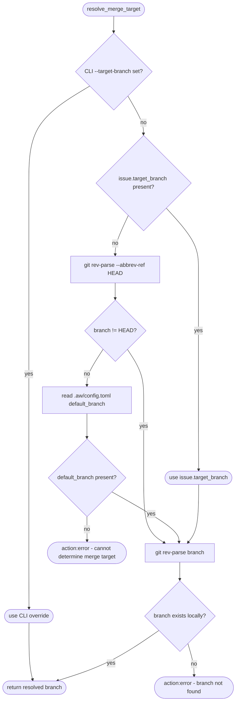

# Issue Merge Target

## Schema
<!-- type: schema lang: yaml -->

```yaml
"$schema": "https://json-schema.org/draft/2020-12/schema"
"$id": "issue-merge-target"
title: IssueMergeTargetFields
description: |
  Extension fields added to the Issue frontmatter schema to support
  per-issue merge target branch resolution. These fields are optional;
  absence preserves backward compatibility with all existing issues.
type: object
properties:
  target_branch:
    type: string
    minLength: 1
    description: |
      Target branch for git merge within the current checkout root. This is a
      branch-selection field only; it does not change the filesystem root chosen
      by find_project_root() and must not redirect linked worktrees to another
      checkout. When present, this value overrides any
      config-level default. When absent, resolution falls through to the
      current branch detection and then to [agentic_workflow.repo_platform].default_branch
      in .aw/config.toml (which itself defaults to "main").
    examples:
      - main
      - develop
      - release/2.0
```
## Logic
<!-- type: logic lang: mermaid -->


## CLI
<!-- type: cli lang: yaml -->

```yaml
commands:
  - name: aw wi create
    description: Create a new issue on a dedicated worktree.
    options:
      - name: --target-branch
        type: Option<String>
        description: |
          Target branch to merge this issue's worktree into when
          `aw wi merge` is invoked. When supplied, the value is
          written to the issue frontmatter as `target_branch`. When
          omitted, no field is written (absence preserves the default
          resolution path — current branch → config default_branch →
          error). Must refer to a branch that exists in the local
          repository at creation time; absent branches produce a
          structured error envelope.
        required: false
        examples:
          - --target-branch develop
          - --target-branch release/2.0

  - name: aw wi merge
    description: Merge the issue worktree branch into the target branch.
    options:
      - name: --target-branch
        type: Option<String>
        description: |
          Explicit target branch override. When supplied, takes
          precedence over all other resolution steps (issue frontmatter,
          current branch, config default). Intended for ad-hoc overrides
          at merge time; prefer setting `target_branch` in frontmatter
          for repeatable issue-level configuration.
        required: false
        examples:
          - --target-branch main
          - --target-branch release/1.9
```
## Test Plan

```mermaid
---
id: issue-merge-target-test-plan
requirements:
  r1_no_hardcoded_main:
    id: R1
    text: "resolve_merge_target reads issue.target_branch and uses it as the merge target when present, never hardcoding main"
    kind: functional
    risk: high
    verify: test
  r2_frontmatter_field:
    id: R2
    text: "Issue deserialization round-trips target_branch field: present value preserved, absent field absent in output"
    kind: functional
    risk: high
    verify: test
  r3_default_backward_compat:
    id: R3
    text: "Issues without target_branch in frontmatter produce the same merge target as before (current branch or config default_branch)"
    kind: functional
    risk: high
    verify: test
  r4_create_cli_flag:
    id: R4
    text: "aw wi create --target-branch <branch> writes target_branch to frontmatter; omitting the flag writes no field"
    kind: functional
    risk: medium
    verify: test
  r5_branch_exists_validation:
    id: R5
    text: "resolve_merge_target emits action:error when the resolved branch does not exist locally, not a silent git failure"
    kind: functional
    risk: high
    verify: test
  r6_frontmatter_precedence:
    id: R6
    text: "When both issue.target_branch and config.default_branch are set, issue.target_branch wins"
    kind: functional
    risk: medium
    verify: test
elements:
  t1_frontmatter_parse_present:
    kind: test
    type: "rs/#[test]"
  t2_frontmatter_parse_absent:
    kind: test
    type: "rs/#[test]"
  t3_resolve_uses_frontmatter:
    kind: test
    type: "rs/#[test]"
  t4_resolve_falls_back_no_frontmatter:
    kind: test
    type: "rs/#[test]"
  t5_branch_missing_error:
    kind: test
    type: "rs/#[test]"
  t6_create_flag_writes_field:
    kind: test
    type: "rs/#[test]"
  t7_create_no_flag_no_field:
    kind: test
    type: "rs/#[test]"
  t8_frontmatter_beats_config:
    kind: test
    type: "rs/#[test]"
relations:
  - from: t1_frontmatter_parse_present
    verifies: r2_frontmatter_field
  - from: t2_frontmatter_parse_absent
    verifies: r2_frontmatter_field
  - from: t3_resolve_uses_frontmatter
    verifies: r1_no_hardcoded_main
  - from: t3_resolve_uses_frontmatter
    verifies: r2_frontmatter_field
  - from: t4_resolve_falls_back_no_frontmatter
    verifies: r3_default_backward_compat
  - from: t5_branch_missing_error
    verifies: r5_branch_exists_validation
  - from: t6_create_flag_writes_field
    verifies: r4_create_cli_flag
  - from: t7_create_no_flag_no_field
    verifies: r4_create_cli_flag
  - from: t8_frontmatter_beats_config
    verifies: r6_frontmatter_precedence
---
requirementDiagram
    requirement R1 {
      id: R1
      text: "resolve_merge_target uses issue.target_branch when present"
      risk: high
      verifymethod: test
    }
    requirement R2 {
      id: R2
      text: "Issue round-trips target_branch field correctly"
      risk: high
      verifymethod: test
    }
    requirement R3 {
      id: R3
      text: "Absent target_branch preserves backward-compat default"
      risk: high
      verifymethod: test
    }
    requirement R4 {
      id: R4
      text: "aw wi create --target-branch writes field to frontmatter"
      risk: medium
      verifymethod: test
    }
    requirement R5 {
      id: R5
      text: "Missing branch emits action:error envelope"
      risk: high
      verifymethod: test
    }
    requirement R6 {
      id: R6
      text: "issue.target_branch takes precedence over config.default_branch"
      risk: medium
      verifymethod: test
    }
    element t1_frontmatter_parse_present {
      type: "rs/#[test]"
    }
    element t2_frontmatter_parse_absent {
      type: "rs/#[test]"
    }
    element t3_resolve_uses_frontmatter {
      type: "rs/#[test]"
    }
    element t4_resolve_falls_back_no_frontmatter {
      type: "rs/#[test]"
    }
    element t5_branch_missing_error {
      type: "rs/#[test]"
    }
    element t6_create_flag_writes_field {
      type: "rs/#[test]"
    }
    element t7_create_no_flag_no_field {
      type: "rs/#[test]"
    }
    element t8_frontmatter_beats_config {
      type: "rs/#[test]"
    }
    t1_frontmatter_parse_present - verifies -> R2
    t2_frontmatter_parse_absent - verifies -> R2
    t3_resolve_uses_frontmatter - verifies -> R1
    t3_resolve_uses_frontmatter - verifies -> R2
    t4_resolve_falls_back_no_frontmatter - verifies -> R3
    t5_branch_missing_error - verifies -> R5
    t6_create_flag_writes_field - verifies -> R4
    t7_create_no_flag_no_field - verifies -> R4
    t8_frontmatter_beats_config - verifies -> R6
```

<!-- type: test-plan lang: mermaid -->


## Changes
<!-- type: changes lang: yaml -->

```yaml
changes:
  - path: projects/agentic-workflow/src/issues/types.rs
    section: source
    action: modify
    impl_mode: codegen
    description: |
      Add optional `target_branch: Option<String>` field to the `Issue`
      struct with `#[serde(default, skip_serializing_if = "Option::is_none")]`.
      Add corresponding `target_branch: Option<String>` field to `IssuePatch`.
      No migration needed — existing issues without the field deserialize
      with `target_branch: None` (backward compatible via `serde(default)`).
      The field is folded into `projects/agentic-workflow/tech-design/core/interfaces/issues/types.md#schema`
      so the primary issue type CODEGEN block remains replayable.

  - path: projects/agentic-workflow/src/cli/issues.rs
    action: modify
    section: cli
    impl_mode: hand-written
    description: |
      Add `--target-branch <branch>` flag to `CreateArgs`. In `run_create`,
      when `args.target_branch` is `Some(branch)`, validate the branch exists
      locally via `git rev-parse <branch>` before writing frontmatter; emit
      `action:error` if it does not exist. Write `target_branch` to the `Issue`
      struct only when the flag is supplied; omit the field when the flag is
      absent (R4). Update `resolve_merge_target` call in `run_merge` to pass
      `issue.target_branch.clone()` as the frontmatter override before the
      existing `args.target_branch` CLI override (R6 precedence: CLI flag
      beats frontmatter beats current branch beats config).

  - path: projects/agentic-workflow/src/cli/merge_target.rs
    action: modify
    section: cli
    impl_mode: hand-written
    description: |
      Extend `resolve_merge_target` signature to accept an additional
      `frontmatter_branch: Option<String>` parameter positioned between the
      existing CLI override and the git-detect step. Resolution order becomes:
      1. `cli_override` if Some → return verbatim (no branch-exists check —
         user is explicit).
      2. `frontmatter_branch` if Some → validate branch exists locally via
         `git rev-parse`; emit structured error if missing (R5).
      3. `git rev-parse --abbrev-ref HEAD` → if not "HEAD" → validate exists
         (R5).
      4. `.aw/config.toml` `default_branch` → validate exists (R5).
      5. Return Err (no merge target determinable).

  - path: projects/agentic-workflow/tests/merge_target_branch.rs
    action: modify
    section: test-plan
    impl_mode: hand-written
    description: |
      Add unit tests for the new resolution steps:
      - t3_resolve_uses_frontmatter: frontmatter_branch present → used
        (beats config/current branch).
      - t4_resolve_falls_back_no_frontmatter: absent frontmatter_branch →
        falls through to current branch (backward compat).
      - t5_branch_missing_error: frontmatter_branch pointing at a
        non-existent local branch → structured error, not silent git failure.
      - t8_frontmatter_beats_config: both frontmatter and config set →
        frontmatter wins.

  - path: projects/agentic-workflow/src/issues/types.rs
    section: source
    action: modify
    impl_mode: hand-written
    description: |
      Add unit tests t1_frontmatter_parse_present and t2_frontmatter_parse_absent
      directly in the types module (existing test block) validating that Issue
      serde round-trips `target_branch` correctly when present and produces no
      YAML key when absent.

  - path: projects/agentic-workflow/tests/issue_create_worktree_test.rs
    action: modify
    section: test-plan
    impl_mode: hand-written
    description: |
      Add tests t6_create_flag_writes_field and t7_create_no_flag_no_field:
      spin up a temp git repo with a `develop` branch, invoke
      `aw wi create --target-branch develop` and verify the written
      frontmatter contains `target_branch: develop`; invoke without the flag
      and verify the field is absent.
  - action: annotate
    section: logic
    impl_mode: hand-written
    description: "Traceability metadata edge for the logic section."

  - action: annotate
    section: schema
    impl_mode: hand-written
    description: "Traceability metadata edge for the schema section."

```

# Reviews

## Review 1
<!-- type: doc lang: markdown -->

**Verdict:** needs-revision

- [logic] (item 3) The Logic flowchart has `return_override → validate_exists`, meaning the CLI `--target-branch` override is subjected to the branch-exists check. However, the `## Changes` description for `merge_target.rs` step 1 explicitly states CLI override returns "verbatim (no branch-exists check — user is explicit)". These two authoritative sections directly contradict each other. An implementer cannot determine whether the CLI override path skips or runs branch validation. Fix by making them consistent: either (a) remove the `return_override → validate_exists` edge from the Logic flowchart and route `return_override` directly to a `return_ok` terminal node (matching the Changes text), or (b) update the Changes description to state the CLI override is validated like all other resolved branches and drop the parenthetical exemption.

## Review 2
<!-- type: doc lang: markdown -->

**Verdict:** approved

- [logic] Round-1 finding resolved: `return_override → validate_exists` edge removed; the flowchart now routes `return_override → return_ok` directly, consistent with the `## Changes` step-1 description ("return verbatim, no branch-exists check"). Both Mermaid Plus frontmatter and the rendered flowchart agree.
- [logic] All six R-ids (R1-R6) are reachable from the entry node. The CLI-override bypass, frontmatter path, current-branch fallback, config fallback, and error terminals each implement a distinct requirement.
- [schema] `target_branch` definition coheres with its usage in Logic (`check_frontmatter`/`return_frontmatter`) and in Test Plan serde round-trip tests. No unused definitions; no referenced-but-undefined types.
- [changes] The decomposition covers all required touch points (types, CLI, resolver, three test files). The duplicate entry for `projects/agentic-workflow/src/issues/types.rs` is intentional (struct fields vs. test block) and unambiguous.
