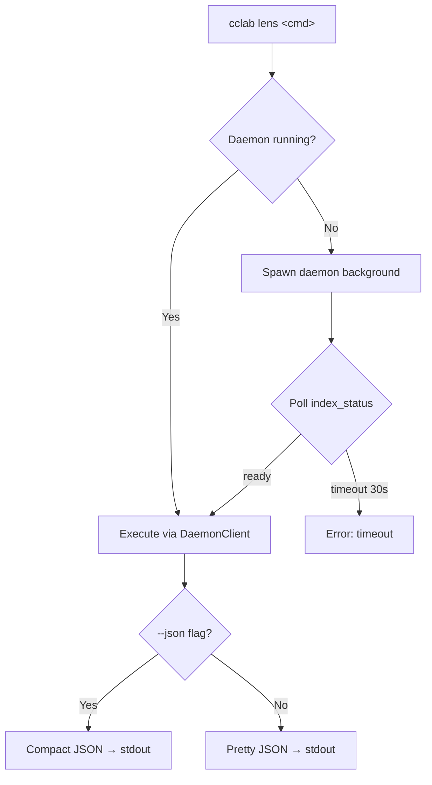
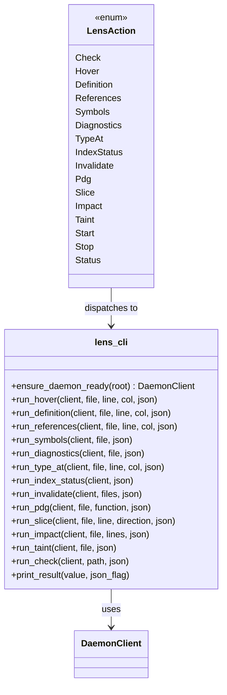

# Lens Cli Subcommands Spec

## Overview
<!-- type: doc lang: markdown -->


main_spec_ref: cclab-lens/lens-cli-subcommands.md
fill_sections: [overview, requirements, scenarios, diagrams, test_plan, changes]

Expose all daemon-backed Lens analysis capabilities as `cclab lens` CLI subcommands. Every CLI command shares a common `ensure_daemon_ready()` flow: check if daemon is running → auto-start if not → wait for index ready (30s timeout) → execute via `DaemonClient` → output result.

### Goals
- 12 new CLI subcommands (8 code analysis + 4 PDG)
- Migrate existing `cclab lens check` to also use daemon path for consistency
- Extract CLI handlers to `lens_cli.rs` to keep `main.rs` manageable
- Pretty-print JSON by default, `--json` flag for compact output

### Non-Goals
- No new daemon RPC methods (all methods already exist on DaemonClient)
- No changes to daemon internals or MCP server
- No new analysis capabilities (CLI is thin wrapper only)
## Requirements
<!-- type: doc lang: markdown -->


### R1 - ensure_daemon_ready Helper

```yaml
id: R1
priority: high
status: draft
```

A shared async function `ensure_daemon_ready(root: &Path) -> Result<DaemonClient, String>` that:
1. Creates `DaemonClient::for_workspace(root)`
2. Checks `client.is_daemon_running()`
3. If not running: spawns daemon as background process (`cclab lens server --root {root}`)
4. Polls `client.index_status()` until `is_ready == true` or 30s timeout
5. Returns ready client or error

### R2 - Code Analysis CLI Subcommands

```yaml
id: R2
priority: high
status: draft
```

Add 8 `LensAction` variants to the CLI:

| Subcommand | Args | DaemonClient method |
|------------|------|-------------------|
| `hover` | `<file> <line> <col>` | `client.hover()` |
| `definition` | `<file> <line> <col>` | `client.definition()` |
| `references` | `<file> <line> <col> [--include-declaration]` | `client.references()` |
| `symbols` | `<file>` | `client.symbols()` |
| `diagnostics` | `[file]` | `client.diagnostics()` |
| `type-at` | `<file> <line> <col>` | `client.type_at()` |
| `index-status` | (none) | `client.index_status()` |
| `invalidate` | `<files...>` | `client.invalidate()` |

### R3 - PDG CLI Subcommands

```yaml
id: R3
priority: high
status: draft
```

Add 4 `LensAction` variants for program analysis:

| Subcommand | Args | DaemonClient method |
|------------|------|-------------------|
| `pdg` | `<file> [--function <name>]` | `client.request("pdg", ...)` |
| `slice` | `<file> <line> [--forward\|--backward]` | `client.request("slice", ...)` |
| `impact` | `<file> <lines...>` | `client.request("impact", ...)` |
| `taint` | `<file>` | `client.request("taint", ...)` |

### R4 - Migrate Existing Check Command

```yaml
id: R4
priority: medium
status: draft
```

Migrate existing `cclab lens check` to use `ensure_daemon_ready` + `DaemonClient::check()` instead of direct file analysis. Ensures all lens commands have consistent daemon-backed behavior.

### R5 - Output Formatting

```yaml
id: R5
priority: medium
status: draft
```

- Default: pretty-printed JSON to stdout
- `--json` flag: compact single-line JSON (for piping to `jq`, scripts, etc.)
- Errors printed to stderr

### R6 - File Extraction

```yaml
id: R6
priority: medium
status: draft
```

Extract all new CLI handler functions and `ensure_daemon_ready` into `crates/cclab-cli/src/lens_cli.rs`. `main.rs` retains `LensAction` enum definition and dispatches to `lens_cli::run_*` functions.
## Scenarios
<!-- type: doc lang: markdown -->


### S1 - Daemon Not Running, Auto-Start

**Given** daemon is not running for the project
**When** user runs `cclab lens hover src/main.py 10 5`
**Then** CLI auto-starts daemon in background, waits for index ready, executes hover, prints result

### S2 - Daemon Already Running

**Given** daemon is already running and indexed
**When** user runs `cclab lens symbols src/main.py`
**Then** CLI connects to existing daemon, executes symbols, prints pretty JSON immediately

### S3 - Daemon Start Timeout

**Given** daemon is not running
**When** user runs `cclab lens definition src/main.py 5 3` and daemon fails to become ready within 30s
**Then** CLI prints error to stderr: "Lens daemon failed to become ready within 30s" and exits with non-zero code

### S4 - JSON Output Flag

**Given** daemon is running
**When** user runs `cclab lens diagnostics --json`
**Then** CLI prints compact single-line JSON to stdout (suitable for piping)

### S5 - Check Migration

**Given** daemon is not running
**When** user runs `cclab lens check src/`
**Then** CLI auto-starts daemon (same as S1), runs check via DaemonClient, prints results

### S6 - PDG Slice Forward

**Given** daemon is running
**When** user runs `cclab lens slice src/main.py 15 --forward`
**Then** CLI calls `client.request("slice", ...)` with forward direction, prints affected lines

### S7 - Invalidate Multiple Files

**Given** daemon is running
**When** user runs `cclab lens invalidate src/a.py src/b.py`
**Then** CLI calls `client.invalidate(["src/a.py", "src/b.py"])`, prints invalidation count
## Diagrams
<!-- type: doc lang: markdown -->


### Flowchart



### Class Diagram


## API Spec
<!-- type: doc lang: markdown -->

### OpenAPI 3.1
<!-- TODO -->

### OpenRPC 1.3
<!-- TODO -->

### AsyncAPI 2.6
<!-- TODO -->

### Serverless Workflow 0.8
<!-- TODO -->

## Test Plan
<!-- type: doc lang: markdown -->


### T1 - ensure_daemon_ready connects to running daemon

**Given** a daemon is already running on the project socket
**When** `ensure_daemon_ready` is called
**Then** returns `DaemonClient` without spawning new process

### T2 - ensure_daemon_ready times out

**Given** no daemon is running and spawn fails
**When** `ensure_daemon_ready` is called with 30s timeout
**Then** returns error after timeout

### T3 - print_result pretty vs compact

**Given** a `serde_json::Value`
**When** `print_result(value, false)` → pretty-printed
**When** `print_result(value, true)` → compact single-line

### T4 - LensAction enum coverage

**Verify** all 12 new subcommands parse correctly via clap:
- `cclab lens hover file.py 10 5`
- `cclab lens definition file.py 10 5`
- `cclab lens references file.py 10 5`
- `cclab lens symbols file.py`
- `cclab lens diagnostics`
- `cclab lens diagnostics file.py`
- `cclab lens type-at file.py 10 5`
- `cclab lens index-status`
- `cclab lens invalidate a.py b.py`
- `cclab lens pdg file.py --function main`
- `cclab lens slice file.py 15 --forward`
- `cclab lens impact file.py 10 15 20`
- `cclab lens taint file.py`
## Changes
<!-- type: doc lang: markdown -->


| File | Action | Description |
|------|--------|-------------|
| `crates/cclab-cli/src/main.rs` | MODIFY | Add 12 new `LensAction` variants, add `--json` global flag, migrate `check` dispatch to `lens_cli` module |
| `crates/cclab-cli/src/lens_cli.rs` | CREATE | New module: `ensure_daemon_ready()`, `print_result()`, `run_hover()`, `run_definition()`, `run_references()`, `run_symbols()`, `run_diagnostics()`, `run_type_at()`, `run_index_status()`, `run_invalidate()`, `run_pdg()`, `run_slice()`, `run_impact()`, `run_taint()`, `run_check()` |
| `crates/cclab-cli/Cargo.toml` | MODIFY | Add `cclab-lens` dependency (for `DaemonClient`, `DaemonConfig`) if not already present |
