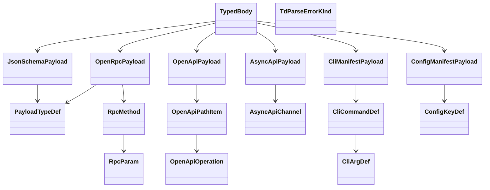

# TD AST Typed Payloads (Stage 1B)

Typed payload structs that replace the six `serde_yaml::Value` opaque
carriers in `TypedBody` after Stage 1B. Each struct mirrors a canonical
schema family — JSON Schema 2020-12, OpenRPC 1.3, OpenAPI 3.1, AsyncAPI
2.6, CLI manifest, config manifest — and exposes the fields downstream
consumers (entity walkers, validators, query API) need to walk without
falling back to `Value::as_mapping()`.

The payload structs intentionally model the SHAPE that TD specs use in
practice rather than the full JSON Schema / OpenRPC / OpenAPI surface.
Unrecognised top-level keys round-trip through a `extra: serde_yaml::Value`
catch-all field so re-serialisation preserves author input.

Six payload structs land in `projects/agentic-workflow/src/td_ast/payloads.rs`:

- `JsonSchemaPayload { schema, id, title, definitions, defs, extra }`
- `OpenRpcPayload { openrpc, info, methods, components_schemas, extra }`
- `OpenApiPayload { openapi, info, paths, components_schemas, extra }`
- `AsyncApiPayload { asyncapi, info, channels, components_schemas, extra }`
- `CliManifestPayload { commands, extra }`
- `ConfigManifestPayload { keys, extra }`

Plus shared helpers:

- `PayloadTypeDef { name?, ty?, description?, properties?, required, extra }`
- `RpcMethod { name, summary?, params, result?, extra }`
- `RpcParam { name, schema?, required?, description?, extra }`
- `OpenApiPathItem { get?, post?, put?, delete?, patch?, extra }`
- `OpenApiOperation { operation_id?, summary?, parameters?, request_body?, responses?, extra }`
- `AsyncApiChannel { subscribe?, publish?, parameters?, extra }`
- `CliCommandDef { name, description?, args, flags, subcommands, extra }`
- `CliArgDef { name, description?, required?, ty?, extra }`
- `ConfigKeyDef { name, ty?, default?, description?, env?, extra }`

`TdParseError` gains a `kind: TdParseErrorKind` discriminant so callers
can distinguish frontmatter parse failures from typed-payload parse
failures and read `expected_type: SectionType` for the failing variant.

The `JsonSchemaPayload::definitions` map is the precise replacement for
the heuristic Schema-section walk in `entities.rs`. The
`OpenRpcPayload::methods[].name` field is the precise replacement for
the heuristic OpenRPC walk. Same for OpenAPI paths, AsyncAPI channels,
CLI commands, and config keys. R3 and R4 follow mechanically.

## Overview
<!-- type: overview lang: markdown -->

Public API manifest for `projects/agentic-workflow/src/td_ast/payloads.rs` generated from AST during Score force-regeneration standardization.

### Symbols

| Name | Target | Kind | Visibility | Line | Signature |
|------|--------|------|------------|------|-----------|
| `AsyncApiChannel` | projects/agentic-workflow/src/td_ast/payloads.rs | struct | pub | 220 |  |
| `AsyncApiPayload` | projects/agentic-workflow/src/td_ast/payloads.rs | struct | pub | 88 |  |
| `CliArgDef` | projects/agentic-workflow/src/td_ast/payloads.rs | struct | pub | 250 |  |
| `CliCommandDef` | projects/agentic-workflow/src/td_ast/payloads.rs | struct | pub | 232 |  |
| `CliManifestPayload` | projects/agentic-workflow/src/td_ast/payloads.rs | struct | pub | 107 |  |
| `ConfigKeyDef` | projects/agentic-workflow/src/td_ast/payloads.rs | struct | pub | 266 |  |
| `ConfigManifestPayload` | projects/agentic-workflow/src/td_ast/payloads.rs | struct | pub | 118 |  |
| `JsonSchemaPayload` | projects/agentic-workflow/src/td_ast/payloads.rs | struct | pub | 27 |  |
| `OpenApiOperation` | projects/agentic-workflow/src/td_ast/payloads.rs | struct | pub | 203 |  |
| `OpenApiPathItem` | projects/agentic-workflow/src/td_ast/payloads.rs | struct | pub | 184 |  |
| `OpenApiPayload` | projects/agentic-workflow/src/td_ast/payloads.rs | struct | pub | 69 |  |
| `OpenRpcPayload` | projects/agentic-workflow/src/td_ast/payloads.rs | struct | pub | 47 |  |
| `PayloadTypeDef` | projects/agentic-workflow/src/td_ast/payloads.rs | struct | pub | 135 |  |
| `RpcMethod` | projects/agentic-workflow/src/td_ast/payloads.rs | struct | pub | 152 |  |
| `RpcParam` | projects/agentic-workflow/src/td_ast/payloads.rs | struct | pub | 168 |  |
| `TdParseErrorKind` | projects/agentic-workflow/src/td_ast/payloads.rs | enum | pub | 287 |  |
| `from_yaml_str` | projects/agentic-workflow/src/td_ast/payloads.rs | function | pub | 317 | from_yaml_str(s: &str) -> Result<Self, serde_yaml::Error> |
| `from_yaml_str` | projects/agentic-workflow/src/td_ast/payloads.rs | function | pub | 327 | from_yaml_str(s: &str) -> Result<Self, serde_yaml::Error> |
| `from_yaml_str` | projects/agentic-workflow/src/td_ast/payloads.rs | function | pub | 337 | from_yaml_str(s: &str) -> Result<Self, serde_yaml::Error> |
## Schema
<!-- type: schema lang: yaml -->

```yaml
$schema: "https://json-schema.org/draft/2020-12/schema"
$id: sdd-td-ast-payloads#schema
title: TD AST Typed Payload Definitions
description: >
  Six typed payload structs replacing serde_yaml::Value carriers in
  TypedBody plus shared helper types. Satisfies R1, R3, R4, R5, R6.

definitions:
  JsonSchemaPayload:
    type: object
    $id: JsonSchemaPayload
    description: >
      JSON Schema 2020-12 document body, modelled to expose definitions
      for typed entity walks. Unknown keys round-trip via the `extra`
      catch-all.
    properties:
      schema:
        type: string
        x-rust-type: "Option<String>"
        x-serde-rename: "$schema"
        x-serde-default: true
        x-serde-skip-if: "Option::is_none"
      id:
        type: string
        x-rust-type: "Option<String>"
        x-serde-rename: "$id"
        x-serde-default: true
        x-serde-skip-if: "Option::is_none"
      title:
        type: string
        x-rust-type: "Option<String>"
        x-serde-default: true
        x-serde-skip-if: "Option::is_none"
      definitions:
        type: object
        x-rust-type: "BTreeMap<String, PayloadTypeDef>"
        x-serde-default: true
        description: "Top-level definitions map (the precise entity source)."
      defs:
        type: object
        x-rust-type: "BTreeMap<String, PayloadTypeDef>"
        x-serde-rename: "$defs"
        x-serde-default: true
        description: "JSON Schema 2020-12 alternate definitions location."
      extra:
        type: object
        x-rust-type: "serde_yaml::Value"
        x-serde-flatten: true
        x-serde-default: true
        description: "Round-trip preservation of unrecognised keys."
    x-rust-struct:
      derive: [Debug, Clone, Serialize, Deserialize, Default]

  OpenRpcPayload:
    type: object
    $id: OpenRpcPayload
    description: "OpenRPC 1.3 document body."
    properties:
      openrpc:
        type: string
        x-rust-type: "Option<String>"
        x-serde-default: true
        x-serde-skip-if: "Option::is_none"
      info:
        type: object
        x-rust-type: "Option<serde_yaml::Value>"
        x-serde-default: true
        x-serde-skip-if: "Option::is_none"
      methods:
        type: array
        x-rust-type: "Vec<RpcMethod>"
        x-serde-default: true
      components_schemas:
        type: object
        x-rust-type: "BTreeMap<String, PayloadTypeDef>"
        x-serde-rename: "components.schemas"
        x-serde-default: true
        description: >
          Flattened components.schemas map. Populated by a custom deserializer
          that picks `components.schemas` from the root mapping.
      extra:
        type: object
        x-rust-type: "serde_yaml::Value"
        x-serde-flatten: true
        x-serde-default: true
    x-rust-struct:
      derive: [Debug, Clone, Serialize, Deserialize, Default]

  OpenApiPayload:
    type: object
    $id: OpenApiPayload
    description: "OpenAPI 3.1 document body."
    properties:
      openapi:
        type: string
        x-rust-type: "Option<String>"
        x-serde-default: true
        x-serde-skip-if: "Option::is_none"
      info:
        type: object
        x-rust-type: "Option<serde_yaml::Value>"
        x-serde-default: true
        x-serde-skip-if: "Option::is_none"
      paths:
        type: object
        x-rust-type: "BTreeMap<String, OpenApiPathItem>"
        x-serde-default: true
      components_schemas:
        type: object
        x-rust-type: "BTreeMap<String, PayloadTypeDef>"
        x-serde-default: true
      extra:
        type: object
        x-rust-type: "serde_yaml::Value"
        x-serde-flatten: true
        x-serde-default: true
    x-rust-struct:
      derive: [Debug, Clone, Serialize, Deserialize, Default]

  AsyncApiPayload:
    type: object
    $id: AsyncApiPayload
    description: "AsyncAPI 2.6 document body."
    properties:
      asyncapi:
        type: string
        x-rust-type: "Option<String>"
        x-serde-default: true
        x-serde-skip-if: "Option::is_none"
      info:
        type: object
        x-rust-type: "Option<serde_yaml::Value>"
        x-serde-default: true
        x-serde-skip-if: "Option::is_none"
      channels:
        type: object
        x-rust-type: "BTreeMap<String, AsyncApiChannel>"
        x-serde-default: true
      components_schemas:
        type: object
        x-rust-type: "BTreeMap<String, PayloadTypeDef>"
        x-serde-default: true
      extra:
        type: object
        x-rust-type: "serde_yaml::Value"
        x-serde-flatten: true
        x-serde-default: true
    x-rust-struct:
      derive: [Debug, Clone, Serialize, Deserialize, Default]

  CliManifestPayload:
    type: object
    $id: CliManifestPayload
    description: "CLI manifest document body."
    properties:
      commands:
        type: array
        x-rust-type: "Vec<CliCommandDef>"
        x-serde-default: true
      extra:
        type: object
        x-rust-type: "serde_yaml::Value"
        x-serde-flatten: true
        x-serde-default: true
    x-rust-struct:
      derive: [Debug, Clone, Serialize, Deserialize, Default]

  ConfigManifestPayload:
    type: object
    $id: ConfigManifestPayload
    description: "Config manifest document body."
    properties:
      keys:
        type: array
        x-rust-type: "Vec<ConfigKeyDef>"
        x-serde-default: true
      extra:
        type: object
        x-rust-type: "serde_yaml::Value"
        x-serde-flatten: true
        x-serde-default: true
    x-rust-struct:
      derive: [Debug, Clone, Serialize, Deserialize, Default]

  PayloadTypeDef:
    type: object
    $id: PayloadTypeDef
    description: >
      Shared helper for a named type definition (used by Schema/OpenRPC/
      OpenAPI/AsyncAPI components). All fields optional — only `extra` is
      consulted by entity walks. Authors can attach arbitrary keys.
    properties:
      ty:
        type: string
        x-rust-type: "Option<String>"
        x-serde-rename: "type"
        x-serde-default: true
        x-serde-skip-if: "Option::is_none"
      description:
        type: string
        x-rust-type: "Option<String>"
        x-serde-default: true
        x-serde-skip-if: "Option::is_none"
      properties:
        type: object
        x-rust-type: "Option<serde_yaml::Value>"
        x-serde-default: true
        x-serde-skip-if: "Option::is_none"
      required:
        type: array
        x-rust-type: "Vec<String>"
        x-serde-default: true
      extra:
        type: object
        x-rust-type: "serde_yaml::Value"
        x-serde-flatten: true
        x-serde-default: true
    x-rust-struct:
      derive: [Debug, Clone, Serialize, Deserialize, Default]

  RpcMethod:
    type: object
    $id: RpcMethod
    required: [name]
    properties:
      name:
        type: string
      summary:
        type: string
        x-rust-type: "Option<String>"
        x-serde-default: true
        x-serde-skip-if: "Option::is_none"
      params:
        type: array
        x-rust-type: "Vec<RpcParam>"
        x-serde-default: true
      result:
        type: object
        x-rust-type: "Option<serde_yaml::Value>"
        x-serde-default: true
        x-serde-skip-if: "Option::is_none"
      extra:
        type: object
        x-rust-type: "serde_yaml::Value"
        x-serde-flatten: true
        x-serde-default: true
    x-rust-struct:
      derive: [Debug, Clone, Serialize, Deserialize]

  RpcParam:
    type: object
    $id: RpcParam
    required: [name]
    properties:
      name:
        type: string
      schema:
        type: object
        x-rust-type: "Option<serde_yaml::Value>"
        x-serde-default: true
        x-serde-skip-if: "Option::is_none"
      required:
        type: boolean
        x-rust-type: "Option<bool>"
        x-serde-default: true
        x-serde-skip-if: "Option::is_none"
      description:
        type: string
        x-rust-type: "Option<String>"
        x-serde-default: true
        x-serde-skip-if: "Option::is_none"
      extra:
        type: object
        x-rust-type: "serde_yaml::Value"
        x-serde-flatten: true
        x-serde-default: true
    x-rust-struct:
      derive: [Debug, Clone, Serialize, Deserialize]

  OpenApiPathItem:
    type: object
    $id: OpenApiPathItem
    description: "Shapes an entry in OpenAPI `paths`. All HTTP verbs optional."
    properties:
      get:
        x-rust-type: "Option<OpenApiOperation>"
        x-serde-default: true
        x-serde-skip-if: "Option::is_none"
      post:
        x-rust-type: "Option<OpenApiOperation>"
        x-serde-default: true
        x-serde-skip-if: "Option::is_none"
      put:
        x-rust-type: "Option<OpenApiOperation>"
        x-serde-default: true
        x-serde-skip-if: "Option::is_none"
      delete:
        x-rust-type: "Option<OpenApiOperation>"
        x-serde-default: true
        x-serde-skip-if: "Option::is_none"
      patch:
        x-rust-type: "Option<OpenApiOperation>"
        x-serde-default: true
        x-serde-skip-if: "Option::is_none"
      extra:
        type: object
        x-rust-type: "serde_yaml::Value"
        x-serde-flatten: true
        x-serde-default: true
    x-rust-struct:
      derive: [Debug, Clone, Serialize, Deserialize, Default]

  OpenApiOperation:
    type: object
    $id: OpenApiOperation
    properties:
      operation_id:
        type: string
        x-rust-type: "Option<String>"
        x-serde-rename: "operationId"
        x-serde-default: true
        x-serde-skip-if: "Option::is_none"
      summary:
        type: string
        x-rust-type: "Option<String>"
        x-serde-default: true
        x-serde-skip-if: "Option::is_none"
      extra:
        type: object
        x-rust-type: "serde_yaml::Value"
        x-serde-flatten: true
        x-serde-default: true
    x-rust-struct:
      derive: [Debug, Clone, Serialize, Deserialize, Default]

  AsyncApiChannel:
    type: object
    $id: AsyncApiChannel
    properties:
      description:
        type: string
        x-rust-type: "Option<String>"
        x-serde-default: true
        x-serde-skip-if: "Option::is_none"
      extra:
        type: object
        x-rust-type: "serde_yaml::Value"
        x-serde-flatten: true
        x-serde-default: true
    x-rust-struct:
      derive: [Debug, Clone, Serialize, Deserialize, Default]

  CliCommandDef:
    type: object
    $id: CliCommandDef
    required: [name]
    properties:
      name:
        type: string
      description:
        type: string
        x-rust-type: "Option<String>"
        x-serde-default: true
        x-serde-skip-if: "Option::is_none"
      args:
        type: array
        x-rust-type: "Vec<CliArgDef>"
        x-serde-default: true
      flags:
        type: array
        x-rust-type: "Vec<CliArgDef>"
        x-serde-default: true
      subcommands:
        type: array
        x-rust-type: "Vec<CliCommandDef>"
        x-serde-default: true
      extra:
        type: object
        x-rust-type: "serde_yaml::Value"
        x-serde-flatten: true
        x-serde-default: true
    x-rust-struct:
      derive: [Debug, Clone, Serialize, Deserialize]

  CliArgDef:
    type: object
    $id: CliArgDef
    required: [name]
    properties:
      name:
        type: string
      description:
        type: string
        x-rust-type: "Option<String>"
        x-serde-default: true
        x-serde-skip-if: "Option::is_none"
      required:
        type: boolean
        x-rust-type: "Option<bool>"
        x-serde-default: true
        x-serde-skip-if: "Option::is_none"
      ty:
        type: string
        x-rust-type: "Option<String>"
        x-serde-rename: "type"
        x-serde-default: true
        x-serde-skip-if: "Option::is_none"
      extra:
        type: object
        x-rust-type: "serde_yaml::Value"
        x-serde-flatten: true
        x-serde-default: true
    x-rust-struct:
      derive: [Debug, Clone, Serialize, Deserialize]

  ConfigKeyDef:
    type: object
    $id: ConfigKeyDef
    required: [name]
    properties:
      name:
        type: string
      ty:
        type: string
        x-rust-type: "Option<String>"
        x-serde-rename: "type"
        x-serde-default: true
        x-serde-skip-if: "Option::is_none"
      default:
        x-rust-type: "Option<serde_yaml::Value>"
        x-serde-default: true
        x-serde-skip-if: "Option::is_none"
      description:
        type: string
        x-rust-type: "Option<String>"
        x-serde-default: true
        x-serde-skip-if: "Option::is_none"
      env:
        type: string
        x-rust-type: "Option<String>"
        x-serde-default: true
        x-serde-skip-if: "Option::is_none"
      extra:
        type: object
        x-rust-type: "serde_yaml::Value"
        x-serde-flatten: true
        x-serde-default: true
    x-rust-struct:
      derive: [Debug, Clone, Serialize, Deserialize]

  TdParseErrorKind:
    type: string
    $id: TdParseErrorKind
    description: "Discriminant of TdParseError; replaces freeform string error reasons."
    x-rust-enum:
      derive: [Debug, Clone, Copy, PartialEq, Eq, Serialize, Deserialize]
      variants:
        Frontmatter:
          description: "Frontmatter YAML failed to parse or had no closing marker."
        TypedPayloadParse:
          description: >
            A SectionKind dispatch attempted to parse the section's fenced
            block as its expected typed payload (e.g. JsonSchemaPayload)
            and the deserialiser returned an error.
        Generic:
          description: "Catch-all for non-payload parse failures (file IO, etc.)."
```

## Dependency
<!-- type: dependency lang: mermaid -->



## Source
<!-- type: source lang: rust -->
<!-- source-from-target: strip-handwrite -->

<!-- source-snapshot: path=projects/agentic-workflow/src/td_ast/payloads.rs -->
```rust
//! Typed payload structs for `TypedBody` variants — Stage 1B of the
//! TD AST migration.
//!
//! Replaces the six opaque `serde_yaml::Value` carriers in [`super::types::TypedBody`]
//! (`JsonSchema`, `OpenRpc`, `OpenApi`, `AsyncApi`, `CliManifest`,
//! `ConfigManifest`) with strongly-typed Rust structs that mirror the
//! canonical schema family each section type uses.
//!
//! Each payload exposes the fields that downstream consumers
//! (entity walkers, validators, query API) need so they can stop
//! falling back to `Value::as_mapping()` lookups.
//!
//! @spec projects/agentic-workflow/tech-design/core/interfaces/td_ast/payloads.md#schema

use std::collections::BTreeMap;

use serde::{Deserialize, Serialize};
use serde_yaml::Value;

/// JSON Schema 2020-12 document body. Preserves `definitions` / `$defs`
/// as typed maps so entity walkers can iterate keys directly.
///
/// @spec projects/agentic-workflow/tech-design/core/interfaces/td_ast/payloads.md#schema
#[derive(Debug, Clone, Default, Serialize, Deserialize)]
pub struct JsonSchemaPayload {
    #[serde(rename = "$schema", default, skip_serializing_if = "Option::is_none")]
    pub schema: Option<String>,
    #[serde(rename = "$id", default, skip_serializing_if = "Option::is_none")]
    pub id: Option<String>,
    #[serde(default, skip_serializing_if = "Option::is_none")]
    pub title: Option<String>,
    #[serde(default, skip_serializing_if = "BTreeMap::is_empty")]
    pub definitions: BTreeMap<String, PayloadTypeDef>,
    #[serde(rename = "$defs", default, skip_serializing_if = "BTreeMap::is_empty")]
    pub defs: BTreeMap<String, PayloadTypeDef>,
    #[serde(flatten, default, skip_serializing_if = "value_is_empty_mapping")]
    pub extra: Value,
}

/// OpenRPC 1.3 document body. `methods[].name` is the precise replacement
/// for the heuristic OpenRPC walk in `entities.rs`.
///
/// @spec projects/agentic-workflow/tech-design/core/interfaces/td_ast/payloads.md#schema
#[derive(Debug, Clone, Default, Serialize, Deserialize)]
pub struct OpenRpcPayload {
    #[serde(default, skip_serializing_if = "Option::is_none")]
    pub openrpc: Option<String>,
    #[serde(default, skip_serializing_if = "Option::is_none")]
    pub info: Option<Value>,
    #[serde(default, skip_serializing_if = "Vec::is_empty")]
    pub methods: Vec<RpcMethod>,
    /// `components.schemas` flattened into a top-level map. Populated by
    /// `OpenRpcPayload::from_value` (custom deserialiser path) since serde
    /// itself cannot project nested keys inline.
    #[serde(skip)]
    pub components_schemas: BTreeMap<String, PayloadTypeDef>,
    #[serde(default, skip_serializing_if = "Option::is_none")]
    pub components: Option<Value>,
    #[serde(flatten, default, skip_serializing_if = "value_is_empty_mapping")]
    pub extra: Value,
}

/// OpenAPI 3.1 document body.
///
/// @spec projects/agentic-workflow/tech-design/core/interfaces/td_ast/payloads.md#schema
#[derive(Debug, Clone, Default, Serialize, Deserialize)]
pub struct OpenApiPayload {
    #[serde(default, skip_serializing_if = "Option::is_none")]
    pub openapi: Option<String>,
    #[serde(default, skip_serializing_if = "Option::is_none")]
    pub info: Option<Value>,
    #[serde(default, skip_serializing_if = "BTreeMap::is_empty")]
    pub paths: BTreeMap<String, OpenApiPathItem>,
    #[serde(skip)]
    pub components_schemas: BTreeMap<String, PayloadTypeDef>,
    #[serde(default, skip_serializing_if = "Option::is_none")]
    pub components: Option<Value>,
    #[serde(flatten, default, skip_serializing_if = "value_is_empty_mapping")]
    pub extra: Value,
}

/// AsyncAPI 2.6 document body.
///
/// @spec projects/agentic-workflow/tech-design/core/interfaces/td_ast/payloads.md#schema
#[derive(Debug, Clone, Default, Serialize, Deserialize)]
pub struct AsyncApiPayload {
    #[serde(default, skip_serializing_if = "Option::is_none")]
    pub asyncapi: Option<String>,
    #[serde(default, skip_serializing_if = "Option::is_none")]
    pub info: Option<Value>,
    #[serde(default, skip_serializing_if = "BTreeMap::is_empty")]
    pub channels: BTreeMap<String, AsyncApiChannel>,
    #[serde(skip)]
    pub components_schemas: BTreeMap<String, PayloadTypeDef>,
    #[serde(default, skip_serializing_if = "Option::is_none")]
    pub components: Option<Value>,
    #[serde(flatten, default, skip_serializing_if = "value_is_empty_mapping")]
    pub extra: Value,
}

/// CLI manifest document body. `commands[].name` powers the typed CLI walk.
///
/// @spec projects/agentic-workflow/tech-design/core/interfaces/td_ast/payloads.md#schema
#[derive(Debug, Clone, Default, Serialize, Deserialize)]
pub struct CliManifestPayload {
    #[serde(default, skip_serializing_if = "Vec::is_empty")]
    pub commands: Vec<CliCommandDef>,
    #[serde(flatten, default, skip_serializing_if = "value_is_empty_mapping")]
    pub extra: Value,
}

/// Config manifest document body. `keys[].name` powers the typed config walk.
///
/// @spec projects/agentic-workflow/tech-design/core/interfaces/td_ast/payloads.md#schema
#[derive(Debug, Clone, Default, Serialize, Deserialize)]
pub struct ConfigManifestPayload {
    #[serde(default, skip_serializing_if = "Vec::is_empty")]
    pub keys: Vec<ConfigKeyDef>,
    /// Some specs use `config:` mapping form instead of `keys:` sequence —
    /// captured as raw value so `config_entities` can walk either shape.
    #[serde(default, skip_serializing_if = "Option::is_none")]
    pub config: Option<Value>,
    #[serde(flatten, default, skip_serializing_if = "value_is_empty_mapping")]
    pub extra: Value,
}

/// Shared helper for a named type definition (Schema/OpenRPC/OpenAPI/AsyncAPI
/// components). Only `extra` plus the structured fields below are consulted
/// by entity walks — author-supplied keys round-trip via `extra`.
///
/// @spec projects/agentic-workflow/tech-design/core/interfaces/td_ast/payloads.md#schema
#[derive(Debug, Clone, Default, Serialize, Deserialize)]
pub struct PayloadTypeDef {
    #[serde(rename = "type", default, skip_serializing_if = "Option::is_none")]
    pub ty: Option<String>,
    #[serde(default, skip_serializing_if = "Option::is_none")]
    pub description: Option<String>,
    #[serde(default, skip_serializing_if = "Option::is_none")]
    pub properties: Option<Value>,
    #[serde(default, skip_serializing_if = "Vec::is_empty")]
    pub required: Vec<String>,
    #[serde(flatten, default, skip_serializing_if = "value_is_empty_mapping")]
    pub extra: Value,
}

/// One method declaration inside an OpenRPC document.
///
/// @spec projects/agentic-workflow/tech-design/core/interfaces/td_ast/payloads.md#schema
#[derive(Debug, Clone, Serialize, Deserialize)]
pub struct RpcMethod {
    pub name: String,
    #[serde(default, skip_serializing_if = "Option::is_none")]
    pub summary: Option<String>,
    #[serde(default, skip_serializing_if = "Vec::is_empty")]
    pub params: Vec<RpcParam>,
    #[serde(default, skip_serializing_if = "Option::is_none")]
    pub result: Option<Value>,
    #[serde(flatten, default, skip_serializing_if = "value_is_empty_mapping")]
    pub extra: Value,
}

/// One param declaration on an `RpcMethod`.
///
/// @spec projects/agentic-workflow/tech-design/core/interfaces/td_ast/payloads.md#schema
#[derive(Debug, Clone, Serialize, Deserialize)]
pub struct RpcParam {
    pub name: String,
    #[serde(default, skip_serializing_if = "Option::is_none")]
    pub schema: Option<Value>,
    #[serde(default, skip_serializing_if = "Option::is_none")]
    pub required: Option<bool>,
    #[serde(default, skip_serializing_if = "Option::is_none")]
    pub description: Option<String>,
    #[serde(flatten, default, skip_serializing_if = "value_is_empty_mapping")]
    pub extra: Value,
}

/// One entry in OpenAPI `paths`.
///
/// @spec projects/agentic-workflow/tech-design/core/interfaces/td_ast/payloads.md#schema
#[derive(Debug, Clone, Default, Serialize, Deserialize)]
pub struct OpenApiPathItem {
    #[serde(default, skip_serializing_if = "Option::is_none")]
    pub get: Option<OpenApiOperation>,
    #[serde(default, skip_serializing_if = "Option::is_none")]
    pub post: Option<OpenApiOperation>,
    #[serde(default, skip_serializing_if = "Option::is_none")]
    pub put: Option<OpenApiOperation>,
    #[serde(default, skip_serializing_if = "Option::is_none")]
    pub delete: Option<OpenApiOperation>,
    #[serde(default, skip_serializing_if = "Option::is_none")]
    pub patch: Option<OpenApiOperation>,
    #[serde(flatten, default, skip_serializing_if = "value_is_empty_mapping")]
    pub extra: Value,
}

/// One HTTP-verb operation on an `OpenApiPathItem`.
///
/// @spec projects/agentic-workflow/tech-design/core/interfaces/td_ast/payloads.md#schema
#[derive(Debug, Clone, Default, Serialize, Deserialize)]
pub struct OpenApiOperation {
    #[serde(
        rename = "operationId",
        default,
        skip_serializing_if = "Option::is_none"
    )]
    pub operation_id: Option<String>,
    #[serde(default, skip_serializing_if = "Option::is_none")]
    pub summary: Option<String>,
    #[serde(flatten, default, skip_serializing_if = "value_is_empty_mapping")]
    pub extra: Value,
}

/// One channel entry in an AsyncAPI document.
///
/// @spec projects/agentic-workflow/tech-design/core/interfaces/td_ast/payloads.md#schema
#[derive(Debug, Clone, Default, Serialize, Deserialize)]
pub struct AsyncApiChannel {
    #[serde(default, skip_serializing_if = "Option::is_none")]
    pub description: Option<String>,
    #[serde(flatten, default, skip_serializing_if = "value_is_empty_mapping")]
    pub extra: Value,
}

/// One command declaration inside a CLI manifest. Distinct from the
/// `CliCommand` type in `cli_subcommand.rs` — Stage 2 unifies them.
///
/// @spec projects/agentic-workflow/tech-design/core/interfaces/td_ast/payloads.md#schema
#[derive(Debug, Clone, Serialize, Deserialize)]
pub struct CliCommandDef {
    pub name: String,
    #[serde(default, skip_serializing_if = "Option::is_none")]
    pub description: Option<String>,
    #[serde(default, skip_serializing_if = "Vec::is_empty")]
    pub args: Vec<CliArgDef>,
    #[serde(default, skip_serializing_if = "Vec::is_empty")]
    pub flags: Vec<CliArgDef>,
    #[serde(default, skip_serializing_if = "Vec::is_empty")]
    pub subcommands: Vec<CliCommandDef>,
    #[serde(flatten, default, skip_serializing_if = "value_is_empty_mapping")]
    pub extra: Value,
}

/// One arg or flag declaration on a `CliCommandDef`.
///
/// @spec projects/agentic-workflow/tech-design/core/interfaces/td_ast/payloads.md#schema
#[derive(Debug, Clone, Serialize, Deserialize)]
pub struct CliArgDef {
    pub name: String,
    #[serde(default, skip_serializing_if = "Option::is_none")]
    pub description: Option<String>,
    #[serde(default, skip_serializing_if = "Option::is_none")]
    pub required: Option<bool>,
    #[serde(rename = "type", default, skip_serializing_if = "Option::is_none")]
    pub ty: Option<String>,
    #[serde(flatten, default, skip_serializing_if = "value_is_empty_mapping")]
    pub extra: Value,
}

/// One key declaration inside a config manifest.
///
/// @spec projects/agentic-workflow/tech-design/core/interfaces/td_ast/payloads.md#schema
#[derive(Debug, Clone, Serialize, Deserialize)]
pub struct ConfigKeyDef {
    pub name: String,
    #[serde(rename = "type", default, skip_serializing_if = "Option::is_none")]
    pub ty: Option<String>,
    #[serde(default, skip_serializing_if = "Option::is_none")]
    pub default: Option<Value>,
    #[serde(default, skip_serializing_if = "Option::is_none")]
    pub description: Option<String>,
    #[serde(default, skip_serializing_if = "Option::is_none")]
    pub env: Option<String>,
    #[serde(flatten, default, skip_serializing_if = "value_is_empty_mapping")]
    pub extra: Value,
}

/// Discriminant of `TdParseError`. Stage 1B introduces `TypedPayloadParse`
/// so callers can distinguish typed-payload deserialisation failures from
/// frontmatter / IO failures.
///
/// @spec projects/agentic-workflow/tech-design/core/interfaces/td_ast/payloads.md#schema
#[derive(Debug, Clone, Copy, PartialEq, Eq, Serialize, Deserialize)]
#[serde(rename_all = "snake_case")]
pub enum TdParseErrorKind {
    /// Frontmatter YAML failed to parse or had no closing marker.
    Frontmatter,
    /// A SectionKind dispatch attempted to parse the section's fenced block
    /// as its expected typed payload and the deserialiser returned an error.
    /// `TdParseError::section_type` carries the `expected_type` from R2.
    TypedPayloadParse,
    /// Catch-all for non-payload parse failures (file IO, etc.).
    Generic,
}

/// True for empty / null `serde_yaml::Value`s — used by the `flatten`
/// catch-all field's `skip_serializing_if`.
///
/// @spec projects/agentic-workflow/tech-design/core/interfaces/td_ast/payloads.md#schema
fn value_is_empty_mapping(v: &Value) -> bool {
    match v {
        Value::Null => true,
        Value::Mapping(m) => m.is_empty(),
        _ => false,
    }
}

/// @spec projects/agentic-workflow/tech-design/core/interfaces/td_ast/payloads.md#source
impl OpenRpcPayload {
    /// Parse from raw YAML, lifting `components.schemas` into the typed
    /// `components_schemas` field. Used by `parse.rs` instead of plain
    /// `serde_yaml::from_str`.
    ///
    /// @spec projects/agentic-workflow/tech-design/core/interfaces/td_ast/payloads.md#schema
    pub fn from_yaml_str(s: &str) -> Result<Self, serde_yaml::Error> {
        let mut p: Self = serde_yaml::from_str(s)?;
        p.components_schemas = extract_components_schemas(p.components.as_ref());
        Ok(p)
    }
}

/// @spec projects/agentic-workflow/tech-design/core/interfaces/td_ast/payloads.md#source
impl OpenApiPayload {
    /// @spec projects/agentic-workflow/tech-design/core/interfaces/td_ast/payloads.md#schema
    pub fn from_yaml_str(s: &str) -> Result<Self, serde_yaml::Error> {
        let mut p: Self = serde_yaml::from_str(s)?;
        p.components_schemas = extract_components_schemas(p.components.as_ref());
        Ok(p)
    }
}

/// @spec projects/agentic-workflow/tech-design/core/interfaces/td_ast/payloads.md#source
impl AsyncApiPayload {
    /// @spec projects/agentic-workflow/tech-design/core/interfaces/td_ast/payloads.md#schema
    pub fn from_yaml_str(s: &str) -> Result<Self, serde_yaml::Error> {
        let mut p: Self = serde_yaml::from_str(s)?;
        p.components_schemas = extract_components_schemas(p.components.as_ref());
        Ok(p)
    }
}

/// Project `components.schemas` from a raw `Value` into a typed map.
///
/// @spec projects/agentic-workflow/tech-design/core/interfaces/td_ast/payloads.md#schema
fn extract_components_schemas(components: Option<&Value>) -> BTreeMap<String, PayloadTypeDef> {
    let mut out = BTreeMap::new();
    let Some(c) = components else { return out };
    let Some(schemas) = c.get("schemas").and_then(Value::as_mapping) else {
        return out;
    };
    for (k, v) in schemas {
        let Some(name) = k.as_str() else { continue };
        if let Ok(def) = serde_yaml::from_value::<PayloadTypeDef>(v.clone()) {
            out.insert(name.to_string(), def);
        }
    }
    out
}

#[cfg(test)]
mod tests {
    use super::*;

    #[test]
    fn json_schema_payload_roundtrip() {
        let raw = "$schema: \"https://json-schema.org/draft/2020-12/schema\"\n$id: example#schema\ndefinitions:\n  Foo:\n    type: object\n    description: foo\n  Bar:\n    type: string\n";
        let p: JsonSchemaPayload = serde_yaml::from_str(raw).unwrap();
        assert_eq!(p.id.as_deref(), Some("example#schema"));
        assert_eq!(p.definitions.len(), 2);
        assert!(p.definitions.contains_key("Foo"));
        let back = serde_yaml::to_string(&p).unwrap();
        let p2: JsonSchemaPayload = serde_yaml::from_str(&back).unwrap();
        assert_eq!(p2.definitions.len(), 2);
        assert_eq!(p2.definitions["Foo"].ty.as_deref(), Some("object"));
    }

    #[test]
    fn openrpc_payload_roundtrip() {
        let raw = "openrpc: \"1.3.0\"\ninfo:\n  title: example\n  version: 1.0\nmethods:\n  - name: tools/list\n    summary: list\n  - name: tools/call\n    params:\n      - name: tool\n        required: true\ncomponents:\n  schemas:\n    Tool:\n      type: object\n";
        let p = OpenRpcPayload::from_yaml_str(raw).unwrap();
        assert_eq!(p.openrpc.as_deref(), Some("1.3.0"));
        assert_eq!(p.methods.len(), 2);
        assert_eq!(p.methods[0].name, "tools/list");
        assert_eq!(p.methods[1].params[0].name, "tool");
        assert_eq!(p.components_schemas.len(), 1);
        assert!(p.components_schemas.contains_key("Tool"));
    }

    #[test]
    fn openapi_payload_roundtrip() {
        let raw = "openapi: \"3.1.0\"\npaths:\n  /users:\n    get:\n      operationId: listUsers\n      summary: list users\n    post:\n      operationId: createUser\ncomponents:\n  schemas:\n    User:\n      type: object\n";
        let p = OpenApiPayload::from_yaml_str(raw).unwrap();
        assert_eq!(p.openapi.as_deref(), Some("3.1.0"));
        let users = &p.paths["/users"];
        assert_eq!(
            users.get.as_ref().unwrap().operation_id.as_deref(),
            Some("listUsers")
        );
        assert_eq!(
            users.post.as_ref().unwrap().operation_id.as_deref(),
            Some("createUser")
        );
        assert!(p.components_schemas.contains_key("User"));
    }

    #[test]
    fn asyncapi_payload_roundtrip() {
        let raw = "asyncapi: \"2.6.0\"\nchannels:\n  user/created:\n    description: emitted on user creation\n  user/deleted:\n    description: emitted on user deletion\ncomponents:\n  schemas:\n    UserEvent:\n      type: object\n";
        let p = AsyncApiPayload::from_yaml_str(raw).unwrap();
        assert_eq!(p.asyncapi.as_deref(), Some("2.6.0"));
        assert_eq!(p.channels.len(), 2);
        assert!(p.channels.contains_key("user/created"));
        assert!(p.components_schemas.contains_key("UserEvent"));
    }

    #[test]
    fn cli_manifest_payload_roundtrip() {
        let raw = "commands:\n  - name: build\n    description: build the project\n    flags:\n      - name: release\n        type: bool\n  - name: test\n    args:\n      - name: filter\n        required: false\n";
        let p: CliManifestPayload = serde_yaml::from_str(raw).unwrap();
        assert_eq!(p.commands.len(), 2);
        assert_eq!(p.commands[0].name, "build");
        assert_eq!(p.commands[0].flags[0].name, "release");
        assert_eq!(p.commands[1].args[0].name, "filter");
    }

    #[test]
    fn config_manifest_payload_roundtrip() {
        let raw = "keys:\n  - name: log_level\n    type: string\n    default: info\n    env: LOG_LEVEL\n  - name: max_workers\n    type: integer\n    default: 4\n";
        let p: ConfigManifestPayload = serde_yaml::from_str(raw).unwrap();
        assert_eq!(p.keys.len(), 2);
        assert_eq!(p.keys[0].name, "log_level");
        assert_eq!(p.keys[0].env.as_deref(), Some("LOG_LEVEL"));
    }

    #[test]
    fn json_schema_payload_preserves_extra_keys() {
        let raw = "definitions:\n  Foo:\n    type: object\nrequirementsTraceMatrix:\n  R1: Foo\n";
        let p: JsonSchemaPayload = serde_yaml::from_str(raw).unwrap();
        assert!(matches!(p.extra, Value::Mapping(_)));
        let back = serde_yaml::to_string(&p).unwrap();
        // Extra key survives the round trip.
        assert!(back.contains("requirementsTraceMatrix"));
    }
}
```

## Changes
<!-- type: changes lang: yaml -->

```yaml
changes:
  - path: projects/agentic-workflow/src/td_ast/payloads.rs
    action: modify
    section: source
    impl_mode: codegen
    description: >
      Six typed payload structs (JsonSchemaPayload, OpenRpcPayload,
      OpenApiPayload, AsyncApiPayload, CliManifestPayload,
      ConfigManifestPayload) plus shared helpers (PayloadTypeDef,
      RpcMethod, RpcParam, OpenApiPathItem, OpenApiOperation,
      AsyncApiChannel, CliCommandDef, CliArgDef, ConfigKeyDef) and the
      TdParseErrorKind discriminant, emitted from a source template so
      serde flatten + rename + skip_serializing_if combinations remain
      byte-stable. Roundtrip parse tests live in cfg(test) at the bottom
      of the file (R5, R8).
  - path: projects/agentic-workflow/src/td_ast/types.rs
    action: modify
    section: schema
    impl_mode: hand-written
    description: >
      Replace the six `serde_yaml::Value` payloads in the TypedBody enum
      with the new typed payload structs. Replace TdParseError's freeform
      `message: String` with `kind: TdParseErrorKind` plus optional
      `source: Option<String>` (preserves human-readable detail from the
      underlying serde error). Preserve the CODEGEN block boundaries.
  - path: projects/agentic-workflow/src/td_ast/parse.rs
    action: modify
    section: logic
    impl_mode: hand-written
    description: >
      Replace `serde_yaml::from_str::<Value>` no-ops with typed
      `from_str::<JsonSchemaPayload>` etc. (R2). On parse failure emit
      TdParseError with kind=TypedPayloadParse, expected_type set to the
      offending SectionType, and source carrying the serde error text.
      Update compute_hash to canonical-serialise the typed payload via
      serde_yaml::to_string; behaviour is unchanged for hashable variants.
  - path: projects/agentic-workflow/src/td_ast/entities.rs
    action: modify
    section: schema
    impl_mode: hand-written
    description: >
      Rewrite json_schema_entities, openrpc_entities, openapi_entities,
      asyncapi_entities, cli_entities, and config_entities to walk typed
      payload fields (e.g. payload.definitions.keys()) instead of
      Value::as_mapping() lookups. Mermaid and Markdown walkers unchanged.
      Satisfies R3.
  - path: projects/agentic-workflow/src/td_ast/validate.rs
    action: modify
    section: logic
    impl_mode: hand-written
    description: >
      Tighten check_orphan_changes_targets to walk typed payloads when
      resolving "is this Changes target driven by a Schema/Logic
      section?": a JsonSchemaPayload-driving Schema section now
      contributes its definitions keys to the driven set, not just the
      heuristic substring match. Tighten check_undefined_type_refs to
      cross-reference typed JsonSchemaPayload::definitions and
      OpenRpcPayload::components_schemas against Logic/Interaction
      Mermaid node ids. Satisfies R4.
  - path: projects/agentic-workflow/src/td_ast/query.rs
    action: modify
    section: logic
    impl_mode: hand-written
    description: >
      Extend resolve_type to consult typed payloads: when a Schema
      section is found, return TypeDef constructed from the matched
      JsonSchemaPayload::definitions[name] entry rather than the generic
      EntityRef scan. Extend all_references_to to consult typed
      OpenRpcPayload::methods (for RpcApi sections). Stage 1A behaviour
      preserved when payloads are empty or absent. Satisfies R6.
  - path: projects/agentic-workflow/src/td_ast/mod.rs
    action: modify
    section: schema
    impl_mode: hand-written
    description: >
      Register pub mod payloads and re-export the six payload structs.
      Update HANDWRITE markers' tracker from
      enhancement-stage-1-complete-unified-tdast-full-sectiontype-co to
      this issue's slug per R9.
  - action: annotate
    section: dependency
    impl_mode: hand-written
    description: "Traceability metadata edge for the dependency section."

```

# Reviews

## Review 1
<!-- type: review lang: markdown -->

**Verdict:** approved

- [schema] All six payload structs (JsonSchemaPayload, OpenRpcPayload, OpenApiPayload, AsyncApiPayload, CliManifestPayload, ConfigManifestPayload) are defined with explicit `extra: serde_yaml::Value` flatten fields for round-trip preservation. PayloadTypeDef and the helper structs cover the entity-walk surface; TdParseErrorKind discriminant gives the structured error R2 needs.
- [dependency] classDiagram + types map mirror the schema layout exactly — every owns-edge maps to a struct field declared in the schema.
- [changes] Seven change entries cover every file in scope (payloads.rs create, types.rs / parse.rs / entities.rs / validate.rs / query.rs / mod.rs modify). Each entry names the impl_mode (hand-written) and explains the gap that prevents codegen — consistent with R9's HANDWRITE retargeting.
