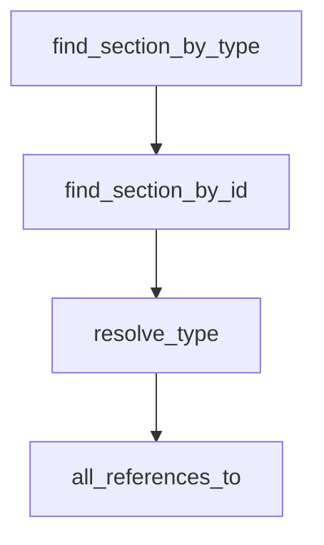

# TD AST Query API

## Overview
<!-- type: overview lang: markdown -->

Public API manifest for `projects/agentic-workflow/src/td_ast/query.rs` generated from AST during Score force-regeneration standardization.

### Symbols

| Name | Target | Kind | Visibility | Line | Signature |
|------|--------|------|------------|------|-----------|
| `Ref` | projects/agentic-workflow/src/td_ast/query.rs | struct | pub | 46 |  |
| `RefKind` | projects/agentic-workflow/src/td_ast/query.rs | enum | pub | 32 |  |
| `TypeDef` | projects/agentic-workflow/src/td_ast/query.rs | struct | pub | 63 |  |
| `all_references_to` | projects/agentic-workflow/src/td_ast/query.rs | function | pub | 178 | all_references_to(&self, name: &str) -> Vec<Ref> |
| `find_section_by_id` | projects/agentic-workflow/src/td_ast/query.rs | function | pub | 124 | find_section_by_id(&self, id: &str) -> Option<&TDSection> |
| `find_section_by_type` | projects/agentic-workflow/src/td_ast/query.rs | function | pub | 111 | find_section_by_type(&self, section_type: SectionType) -> Option<&TDSection> |
| `resolve_type` | projects/agentic-workflow/src/td_ast/query.rs | function | pub | 142 | resolve_type(&self, name: &str) -> Option<TypeDef> |
## Schema
<!-- type: schema lang: yaml -->

```yaml
$schema: "https://json-schema.org/draft/2020-12/schema"
$id: sdd-td-ast-query#schema
title: TD AST Query API
description: >
  Read-only navigation API over a parsed TDAst. Satisfies R3.

definitions:
  Ref:
    type: object
    $id: Ref
    required: [from_section_type, from_line, target_id, kind]
    description: >
      One reference from one section to a named entity. Produced by
      all_references_to(name) when scanning Logic / Interaction / Changes.
    properties:
      from_section_type:
        type: string
        x-rust-type: "crate::models::spec_rules::SectionType"
        description: "Section that contains the reference."
      from_line:
        type: integer
        minimum: 1
        description: "1-based line number of the reference."
      target_id:
        type: string
        description: "Name being referenced."
      kind:
        type: string
        enum: [type, entity, change_target]
        description: "Family of reference; matches the producing scan."

  TypeDef:
    type: object
    $id: TypeDef
    required: [name, section_type, line]
    description: >
      Type-like entity declared by Schema, Dependency, or DbModel sections.
      Resolved by TDAst::resolve_type(name).
    properties:
      name:
        type: string
        description: "Declared name."
      section_type:
        type: string
        x-rust-type: "crate::models::spec_rules::SectionType"
        description: "Section that declares the type."
      line:
        type: integer
        minimum: 1
        description: "1-based line of the declaration."
```

## Logic
<!-- type: logic lang: mermaid -->



## Source
<!-- type: source lang: rust -->
<!-- source-from-target: strip-handwrite -->

<!-- source-snapshot: path=projects/agentic-workflow/src/td_ast/query.rs -->
````rust
//! Read-only navigation API over a parsed [`TDAst`].
//!
//! Implements the query surface specified in
//! `projects/agentic-workflow/tech-design/core/interfaces/td_ast/query.md`:
//!
//! - [`TDAst::find_section_by_type`]
//! - [`TDAst::find_section_by_id`]
//! - [`TDAst::resolve_type`]
//! - [`TDAst::all_references_to`]
//!
//! These four entry points satisfy R3 of the Stage 1 unified-TDAst issue.
//! All four are panic-free for any well-formed `TDAst` and never mutate the
//! AST.
//!
//! @spec projects/agentic-workflow/tech-design/core/interfaces/td_ast/query.md#schema
//! @spec projects/agentic-workflow/tech-design/core/interfaces/td_ast/query.md#logic

use serde::{Deserialize, Serialize};

use crate::models::spec_rules::SectionType;

use super::entities::SectionEntities;
use super::types::{TDAst, TDSection, TypedBody};

/// Family of a [`Ref`] target — matches the producing scan.
///
/// @spec projects/agentic-workflow/tech-design/core/interfaces/td_ast/query.md#schema
#[derive(Debug, Clone, Copy, PartialEq, Eq, Hash, Serialize, Deserialize)]
#[serde(rename_all = "snake_case")]
pub enum RefKind {
    /// Reference to a type declared by Schema / Dependency / DbModel.
    Type,
    /// Reference to a generic named entity (Mermaid node, OpenRPC method, ...).
    Entity,
    /// Reference to a path/symbol mentioned in a Changes section.
    ChangeTarget,
}

/// One reference from one section to a named entity. Produced by
/// [`TDAst::all_references_to`].
///
/// @spec projects/agentic-workflow/tech-design/core/interfaces/td_ast/query.md#schema
#[derive(Debug, Clone, PartialEq, Eq, Serialize, Deserialize)]
pub struct Ref {
    /// Section that contains the reference.
    pub from_section_type: SectionType,
    /// 1-based line number of the section heading that contains the reference
    /// (we resolve to the section start since per-line attribution requires
    /// the deferred typed-payload refactor).
    pub from_line: usize,
    /// Name being referenced.
    pub target_id: String,
    /// Family of reference.
    pub kind: RefKind,
}

/// Type-like entity declared by Schema, Dependency, or DbModel sections.
///
/// @spec projects/agentic-workflow/tech-design/core/interfaces/td_ast/query.md#schema
#[derive(Debug, Clone, PartialEq, Eq, Serialize, Deserialize)]
pub struct TypeDef {
    /// Declared name.
    pub name: String,
    /// Section that declares the type.
    pub section_type: SectionType,
    /// 1-based line of the declaration. Until per-line attribution lands we
    /// resolve to the section's heading line.
    pub line: usize,
}

/// True for section types whose entities are considered type declarations.
fn is_type_declaring(st: SectionType) -> bool {
    matches!(
        st,
        SectionType::Schema | SectionType::Dependency | SectionType::DbModel
    )
}

/// True for section types we scan for cross-section references.
fn is_ref_bearing(st: SectionType) -> bool {
    matches!(
        st,
        SectionType::Logic
            | SectionType::Interaction
            | SectionType::StateMachine
            | SectionType::Changes
    )
}

/// Pick the [`RefKind`] for a section that bears references.
fn ref_kind_for(st: SectionType) -> RefKind {
    match st {
        SectionType::Changes => RefKind::ChangeTarget,
        SectionType::Logic | SectionType::Interaction | SectionType::StateMachine => {
            RefKind::Entity
        }
        _ => RefKind::Entity,
    }
}

/// @spec projects/agentic-workflow/tech-design/core/interfaces/td_ast/query.md#source
impl TDAst {
    /// Find the first section whose [`SectionType`] equals `section_type`.
    ///
    /// Returns `None` if the AST has no section of that type.
    /// O(N) over the section list; sections are typically <=25.
    ///
    /// @spec projects/agentic-workflow/tech-design/core/interfaces/td_ast/query.md#logic
    pub fn find_section_by_type(&self, section_type: SectionType) -> Option<&TDSection> {
        self.sections
            .iter()
            .find(|s| s.section_type == section_type)
    }

    /// Find the first section that declares an entity with id `id`.
    ///
    /// Walks each section's [`SectionEntities`] surface and returns the
    /// section whose entity list contains a matching `EntityRef::id`.
    /// `None` if no section declares `id`.
    ///
    /// @spec projects/agentic-workflow/tech-design/core/interfaces/td_ast/query.md#logic
    pub fn find_section_by_id(&self, id: &str) -> Option<&TDSection> {
        self.sections
            .iter()
            .find(|s| s.body.entities().iter().any(|e| e.id == id))
    }

    /// Resolve a name to a [`TypeDef`] if it is declared by a Schema,
    /// Dependency, or DbModel section.
    ///
    /// Stage 1B (R6): when the section's `TypedBody` is `JsonSchema`, the
    /// lookup hits `JsonSchemaPayload::definitions` and `$defs` directly
    /// (precise — no entity-list re-scan). For other type-declaring
    /// section types we fall back to the generic `SectionEntities` walk.
    ///
    /// Returns `None` if no type-declaring section names `name`.
    ///
    /// @spec projects/agentic-workflow/tech-design/core/interfaces/td_ast/query.md#logic
    /// @spec projects/agentic-workflow/tech-design/core/td_ast/payloads.md#schema
    pub fn resolve_type(&self, name: &str) -> Option<TypeDef> {
        for s in &self.sections {
            if !is_type_declaring(s.section_type) {
                continue;
            }
            // Stage 1B: typed-payload precision path.
            if let TypedBody::JsonSchema(p) = &s.body {
                if p.definitions.contains_key(name) || p.defs.contains_key(name) {
                    return Some(TypeDef {
                        name: name.to_string(),
                        section_type: s.section_type,
                        line: s.line_start,
                    });
                }
            }
            // Generic fallback: Mermaid-backed Dependency / DbModel sections
            // do not yet have a typed payload, so the entity walker still
            // reigns there.
            if s.body.entities().iter().any(|e| e.id == name) {
                return Some(TypeDef {
                    name: name.to_string(),
                    section_type: s.section_type,
                    line: s.line_start,
                });
            }
        }
        None
    }

    /// Return every reference to `name` from a ref-bearing section
    /// (Logic / Interaction / StateMachine / Changes).
    ///
    /// Order is structural (matches `self.sections`). Empty vec if no
    /// references exist.
    ///
    /// @spec projects/agentic-workflow/tech-design/core/interfaces/td_ast/query.md#logic
    pub fn all_references_to(&self, name: &str) -> Vec<Ref> {
        let mut out = Vec::new();
        for s in &self.sections {
            if !is_ref_bearing(s.section_type) {
                continue;
            }
            for e in s.body.entities() {
                if e.id == name {
                    out.push(Ref {
                        from_section_type: s.section_type,
                        from_line: s.line_start,
                        target_id: name.to_string(),
                        kind: ref_kind_for(s.section_type),
                    });
                }
            }
        }
        out
    }
}

#[cfg(test)]
mod tests {
    use super::*;
    use crate::td_ast::parse::parse_td_str;

    fn fixture() -> TDAst {
        let raw = "---\nid: q-test\nfill_sections: [schema, logic]\n---\n\n## Schema\n<!-- type: schema lang: yaml -->\n\n```yaml\n$schema: \"https://json-schema.org/draft/2020-12/schema\"\n$id: q-test#schema\ndefinitions:\n  Foo: { type: object }\n  Bar: { type: object }\n```\n\n## Logic\n<!-- type: logic lang: mermaid -->\n\n```mermaid\n---\nid: q-test-logic\nentry: a\nnodes:\n  a: { kind: process, label: \"uses Foo\" }\n  Foo: { kind: process, label: \"refers Foo by id\" }\nedges:\n  - { from: a, to: Foo }\n---\nflowchart TD\n  a --> Foo\n```\n";
        parse_td_str(raw).expect("parse fixture")
    }

    #[test]
    fn find_section_by_type_works() {
        let ast = fixture();
        let s = ast.find_section_by_type(SectionType::Schema).unwrap();
        assert_eq!(s.section_type, SectionType::Schema);
        assert!(ast.find_section_by_type(SectionType::Cli).is_none());
    }

    #[test]
    fn find_section_by_id_walks_entities() {
        let ast = fixture();
        let s = ast.find_section_by_id("Foo").unwrap();
        // Both Schema and Logic declare an entity with id "Foo"; we get the first.
        assert_eq!(s.section_type, SectionType::Schema);
    }

    #[test]
    fn resolve_type_only_in_type_declaring_sections() {
        let ast = fixture();
        let td = ast.resolve_type("Foo").unwrap();
        assert_eq!(td.section_type, SectionType::Schema);
        assert_eq!(td.name, "Foo");
        assert!(ast.resolve_type("does_not_exist").is_none());
    }

    #[test]
    fn all_references_to_finds_logic_refs() {
        let ast = fixture();
        let refs = ast.all_references_to("Foo");
        // Logic section's entity walker yields the Foo node id.
        assert!(!refs.is_empty());
        assert_eq!(refs[0].from_section_type, SectionType::Logic);
        assert_eq!(refs[0].kind, RefKind::Entity);
        assert_eq!(refs[0].target_id, "Foo");
    }

    #[test]
    fn all_references_to_returns_empty_for_unknown() {
        let ast = fixture();
        assert!(ast.all_references_to("not-here").is_empty());
    }

    #[test]
    fn query_api_panic_free_on_empty_ast() {
        let ast = TDAst {
            frontmatter: serde_yaml::Value::Null,
            sections: Vec::new(),
        };
        assert!(ast.find_section_by_type(SectionType::Schema).is_none());
        assert!(ast.find_section_by_id("x").is_none());
        assert!(ast.resolve_type("x").is_none());
        assert!(ast.all_references_to("x").is_empty());
    }
}
````

## Changes
<!-- type: changes lang: yaml -->

```yaml
changes:
  - path: projects/agentic-workflow/src/td_ast/query.rs
    action: modify
    section: source
    impl_mode: codegen
    summary: "New module: Ref, TypeDef, plus inherent impl on TDAst with find_section_by_type, find_section_by_id, resolve_type, all_references_to."
  - path: projects/agentic-workflow/src/td_ast/mod.rs
    action: modify
    section: schema
    impl_mode: hand-written
    gap: missing-generator:td-ast-stage-1a-exports
    tracker: enhancement-stage-1b-typed-payloads-per-sectiontype-in-tdast-r
    reason: "query.rs and validate.rs exports stay hand-written until TD AST module export codegen covers Stage 1A additions."
    summary: "Add `pub mod query;` and re-export `Ref`, `TypeDef`."
  - action: annotate
    section: logic
    impl_mode: hand-written
    description: "Traceability metadata edge for the logic section."

```

# Reviews

## Review 1
<!-- type: review lang: markdown -->

**Verdict:** approved

- [schema] Ref + TypeDef types are tight; RefKind enum names match the producing scan family.
- [logic] Four query entry points line up directly with R3 of the parent issue and with the query.rs implementation; ordering in the flowchart reflects natural usage rather than runtime sequence (intentional documentation of API surface).
- [changes] Changes list matches actual implementation: query.rs created + mod.rs modified.

## Review 2
<!-- type: review lang: markdown -->

**Verdict:** approved

- [schema] Round 2 confirms: schema definitions still tight, no drift since round 1.
- [logic] Round 2 confirms: control flow accurate.
