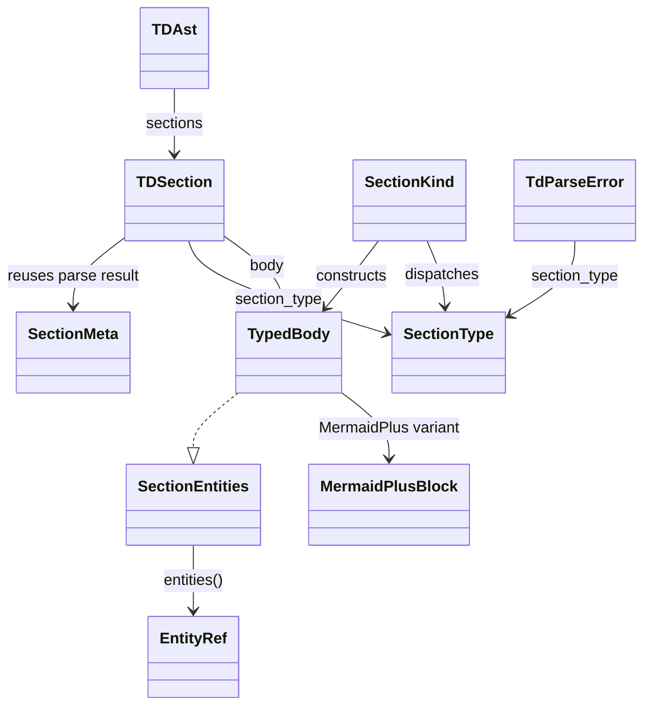
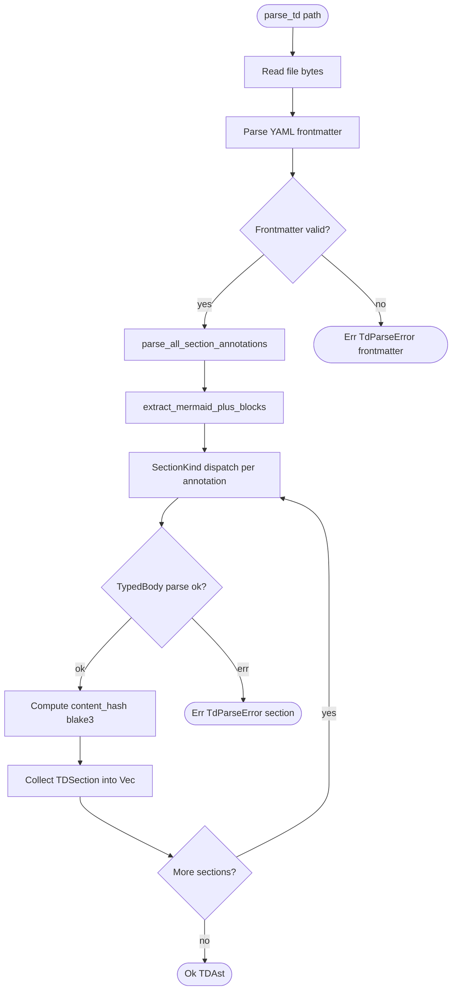

# TD AST Types

## Overview
<!-- type: overview lang: markdown -->

Public API manifest for `projects/agentic-workflow/src/td_ast/types.rs` generated from AST during Score force-regeneration standardization.

### Symbols

| Name | Target | Kind | Visibility | Line | Signature |
|------|--------|------|------------|------|-----------|
| `DbEntity` | projects/agentic-workflow/src/td_ast/types.rs | struct | pub | 200 |  |
| `DbField` | projects/agentic-workflow/src/td_ast/types.rs | struct | pub | 206 |  |
| `DbModelFrontmatter` | projects/agentic-workflow/src/td_ast/types.rs | struct | pub | 218 |  |
| `DbModelIR` | projects/agentic-workflow/src/td_ast/types.rs | struct | pub | 226 |  |
| `DbRelationship` | projects/agentic-workflow/src/td_ast/types.rs | struct | pub | 236 |  |
| `DependencyFrontmatter` | projects/agentic-workflow/src/td_ast/types.rs | struct | pub | 247 |  |
| `IREdge` | projects/agentic-workflow/src/td_ast/types.rs | struct | pub | 255 |  |
| `IRFamily` | projects/agentic-workflow/src/td_ast/types.rs | struct | pub | 267 |  |
| `IRNode` | projects/agentic-workflow/src/td_ast/types.rs | struct | pub | 289 |  |
| `InteractionActor` | projects/agentic-workflow/src/td_ast/types.rs | struct | pub | 298 |  |
| `InteractionFrontmatter` | projects/agentic-workflow/src/td_ast/types.rs | struct | pub | 306 |  |
| `InteractionIR` | projects/agentic-workflow/src/td_ast/types.rs | struct | pub | 314 |  |
| `InteractionMessage` | projects/agentic-workflow/src/td_ast/types.rs | struct | pub | 322 |  |
| `LogicEdge` | projects/agentic-workflow/src/td_ast/types.rs | struct | pub | 332 |  |
| `LogicFrontmatter` | projects/agentic-workflow/src/td_ast/types.rs | struct | pub | 341 |  |
| `LogicGraphIR` | projects/agentic-workflow/src/td_ast/types.rs | struct | pub | 352 |  |
| `LogicNode` | projects/agentic-workflow/src/td_ast/types.rs | struct | pub | 367 |  |
| `LowerDiagnostic` | projects/agentic-workflow/src/td_ast/types.rs | struct | pub | 376 |  |
| `MermaidPlusBlockTyped` | projects/agentic-workflow/src/td_ast/types.rs | struct | pub | 394 |  |
| `MermaidPlusFrontmatter` | projects/agentic-workflow/src/td_ast/types.rs | struct | pub | 410 |  |
| `MermaidPlusPayload` | projects/agentic-workflow/src/td_ast/types.rs | struct | pub | 106 |  |
| `MindmapFrontmatter` | projects/agentic-workflow/src/td_ast/types.rs | struct | pub | 434 |  |
| `MindmapNode` | projects/agentic-workflow/src/td_ast/types.rs | struct | pub | 441 |  |
| `ParseDiagnostic` | projects/agentic-workflow/src/td_ast/types.rs | struct | pub | 448 |  |
| `RequirementItem` | projects/agentic-workflow/src/td_ast/types.rs | struct | pub | 461 |  |
| `RequirementSetIR` | projects/agentic-workflow/src/td_ast/types.rs | struct | pub | 471 |  |
| `RequirementsFrontmatter` | projects/agentic-workflow/src/td_ast/types.rs | struct | pub | 480 |  |
| `ScenarioItem` | projects/agentic-workflow/src/td_ast/types.rs | struct | pub | 487 |  |
| `ScenarioSetIR` | projects/agentic-workflow/src/td_ast/types.rs | struct | pub | 495 |  |
| `ScenariosFrontmatter` | projects/agentic-workflow/src/td_ast/types.rs | struct | pub | 502 |  |
| `SectionKind` | projects/agentic-workflow/src/td_ast/types.rs | enum | pub | 132 |  |
| `SourceSpan` | projects/agentic-workflow/src/td_ast/types.rs | struct | pub | 509 |  |
| `StateEdge` | projects/agentic-workflow/src/td_ast/types.rs | struct | pub | 518 |  |
| `StateMachineFrontmatter` | projects/agentic-workflow/src/td_ast/types.rs | struct | pub | 527 |  |
| `StateMachineIR` | projects/agentic-workflow/src/td_ast/types.rs | struct | pub | 538 |  |
| `StateNode` | projects/agentic-workflow/src/td_ast/types.rs | struct | pub | 550 |  |
| `TDAst` | projects/agentic-workflow/src/td_ast/types.rs | struct | pub | 15 |  |
| `TDSection` | projects/agentic-workflow/src/td_ast/types.rs | struct | pub | 26 |  |
| `TdParseError` | projects/agentic-workflow/src/td_ast/types.rs | struct | pub | 45 |  |
| `TestItem` | projects/agentic-workflow/src/td_ast/types.rs | struct | pub | 558 |  |
| `TestPlanFrontmatter` | projects/agentic-workflow/src/td_ast/types.rs | struct | pub | 569 |  |
| `TestPlanIR` | projects/agentic-workflow/src/td_ast/types.rs | struct | pub | 578 |  |
| `TypedBody` | projects/agentic-workflow/src/td_ast/types.rs | enum | pub | 66 |  |
| `for_section_type` | projects/agentic-workflow/src/td_ast/types.rs | function | pub | 163 | for_section_type(st: SectionType) -> Self |
## Schema
<!-- type: schema lang: yaml -->

```yaml
$schema: "https://json-schema.org/draft/2020-12/schema"
$id: sdd-td-ast#schema
title: TD AST Type Definitions
description: >
  Core type declarations for agentic_workflow::td_ast module.
  Satisfies R1, R2, R3, R4, R7, R8, R9, R12.

definitions:
  TDAst:
    type: object
    $id: TDAst
    required: [frontmatter, sections]
    description: >
      Unified AST for a single tech-design spec file.
      Produced by parse_td(path) and consumed by entity-enumeration,
      hashing, and downstream tooling (R1, R2).
    properties:
      frontmatter:
        type: object
        x-rust-type: "serde_yaml::Value"
        description: "Parsed YAML frontmatter (id, fill_sections, summary, ...)."
      sections:
        type: array
        items:
          type: object
          x-rust-type: "TDSection"
        x-serde-default: true
        description: "Ordered list of parsed sections."
    x-rust-struct:
      derive: [Debug, Clone, Serialize, Deserialize]

  TDSection:
    type: object
    $id: TDSection
    required: [section_type, lang, body, line_start, line_end]
    description: >
      One parsed section inside a TD spec. Joins annotation metadata
      (from parse_all_section_annotations) with the typed body
      (from section-type-driven dispatch). Satisfies R2, R7.
    properties:
      section_type:
        type: string
        x-rust-type: "SectionType"
        description: "Section type identifier (canonical variant from SectionType enum)."
      lang:
        type: string
        description: "Declared content language (e.g. yaml, mermaid)."
      body:
        type: object
        x-rust-type: "TypedBody"
        description: "Typed representation of the fenced code block."
      line_start:
        type: integer
        x-rust-type: "usize"
        description: "1-based line number of the section heading."
      line_end:
        type: integer
        x-rust-type: "usize"
        description: "1-based line number of the last line in this section."
      content_hash:
        type: integer
        x-rust-type: "Option<u64>"
        x-serde-default: true
        x-serde-skip-if: "Option::is_none"
        description: >
          Deterministic hash over canonical body content (blake3 or xxh3, R8).
          None for Placeholder and Unsupported variants.
    x-rust-struct:
      derive: [Debug, Clone, Serialize, Deserialize]

  SectionKind:
    type: string
    $id: SectionKind
    description: >
      Registry enum mapping each known SectionType variant to its TypedBody
      constructor family. Replaces the keyword-match heuristic in
      try_parse_block. Satisfies R7. Unknown variants fall through to
      Unsupported family (R9).
    x-rust-enum:
      derive: [Debug, Clone, Copy, PartialEq, Eq, Hash]
      variants:
        MermaidFamily:
          description: >
            Section types whose body is a Mermaid Plus block
            (state-machine, logic, interaction, dependency, db-model,
            scenarios, unit-test, mindmap, requirements).
        JsonSchemaFamily:
          description: >
            Section types whose body is a JSON Schema document
            (schema, config, wireframe, component, design-token,
            manifest, tests).
        OpenRpcFamily:
          description: "Section types whose body is an OpenRPC 1.3 document (rpc-api)."
        OpenApiFamily:
          description: "Section types whose body is an OpenAPI 3.1 document (rest-api)."
        AsyncApiFamily:
          description: "Section types whose body is an AsyncAPI 2.6 document (async-api)."
        MarkdownFamily:
          description: "Section types whose body is plain markdown (doc, overview)."
        CliFamily:
          description: "Section types whose body is a CLI manifest YAML document (cli)."
        ConfigFamily:
          description: "Section types whose body is a config manifest YAML document (config)."
        ChangesFamily:
          description: "The changes section type (changes YAML schema)."
        Unsupported:
          description: "Section types without a typed parser at this implementation time (R9)."

  TypedBody:
    type: object
    $id: TypedBody
    description: >
      Discriminated body of a parsed TD section. Nine typed variants cover
      known section families (R3); the opaque `Unsupported` variant carries
      sections whose parser is not yet implemented (R9).
    x-rust-enum:
      derive: [Debug, Clone, Serialize, Deserialize]
      serde_tag: kind
      serde_content: data
      serde_rename_all: snake_case
      variants:
        - name: MermaidPlus
          kind: tuple
          fields: [{ rust_type: MermaidPlusPayload }]
          doc: |
            Mermaid Plus block (state-machine, logic, interaction, dependency,
            db-model, scenarios, unit-test). Hash covers frontmatter only (R4, R8).
        - name: JsonSchema
          kind: tuple
          fields: [{ rust_type: "super::payloads::JsonSchemaPayload" }]
          doc: |
            JSON Schema document (schema, config, wireframe, component,
            design-token, manifest, e2e-test). Typed in Stage 1B (sdd-td-ast-payloads).
        - name: OpenRpc
          kind: tuple
          fields: [{ rust_type: "super::payloads::OpenRpcPayload" }]
          doc: "OpenRPC 1.3 document (rpc-api). Typed in Stage 1B."
        - name: OpenApi
          kind: tuple
          fields: [{ rust_type: "super::payloads::OpenApiPayload" }]
          doc: "OpenAPI 3.1 document (rest-api). Typed in Stage 1B."
        - name: AsyncApi
          kind: tuple
          fields: [{ rust_type: "super::payloads::AsyncApiPayload" }]
          doc: "AsyncAPI 2.6 document (async-api). Typed in Stage 1B."
        - name: CliManifest
          kind: tuple
          fields: [{ rust_type: "super::payloads::CliManifestPayload" }]
          doc: "CLI manifest YAML (cli). Typed in Stage 1B."
        - name: ConfigManifest
          kind: tuple
          fields: [{ rust_type: "super::payloads::ConfigManifestPayload" }]
          doc: "Config manifest YAML (config). Typed in Stage 1B."
        - name: Markdown
          kind: tuple
          fields: [{ rust_type: String }]
          doc: "Plain markdown body (doc, overview, changes-as-prose)."
        - name: Placeholder
          doc: "Section listed in `fill_sections` but not yet authored."
        - name: Unsupported
          kind: tuple
          fields: [{ rust_type: String }]
          doc: |
            Opaque carrier for section types without a typed parser. Carries
            the raw block string for round-trip fidelity (R9).

  TdParseError:
    type: object
    $id: TdParseError
    required: [kind, section_type, line_start, line_end, message]
    description: >
      Structured parse error returned when a section body cannot be parsed
      by its expected TypedBody parser. Satisfies R12 + Stage 1B R2.
    properties:
      kind:
        type: string
        x-rust-type: "super::payloads::TdParseErrorKind"
        x-serde-default: "default_parse_kind"
        description: >
          Discriminant: Frontmatter | TypedPayloadParse | Generic. Stage 1B
          adds TypedPayloadParse so callers can distinguish typed-payload
          deserialisation failures from frontmatter / IO failures.
      section_type:
        type: string
        x-rust-type: "SectionType"
        description: >
          Section type whose dispatch attempted to parse the body. For
          TypedPayloadParse this is the `expected_type` from R2.
      line_start:
        type: integer
        x-rust-type: "usize"
        description: "1-based first line of the offending section."
      line_end:
        type: integer
        x-rust-type: "usize"
        description: "1-based last line of the offending section."
      message:
        type: string
        description: "Human-readable parse failure description naming the section and line range."
      source:
        type: string
        x-rust-type: "Option<String>"
        x-serde-default: true
        x-serde-skip-if: "Option::is_none"
        description: >
          Optional verbatim error text from the underlying serde
          deserialiser. Carried for typed-payload-parse errors; None
          otherwise.
    x-rust-struct:
      derive: [Debug, Clone, Serialize, Deserialize]
```
## Dependency
<!-- type: dependency lang: mermaid -->


## Logic: parse_td
<!-- type: logic lang: mermaid -->


## Source
<!-- type: source lang: rust -->
<!-- source-from-target: handwrite-gap missing-generator:trait-impls -->

## Changes
<!-- type: changes lang: yaml -->

```yaml
changes:
  - path: projects/agentic-workflow/src/td_ast/mod.rs
    action: modify
    section: exports
    impl_mode: codegen
    replaces:
      - "<handwrite-gap:missing-generator:td-ast-stage-1a-exports>"
      - "<handwrite-gap:missing-generator:typed-payload-serde-attributes>"
      - "<handwrite-gap:missing-generator:logic>"
    exports:
      - module: entities
        symbols: [EntityRef, SectionEntities]
      - module: parse
        symbols: [parse_td, parse_td_str]
      - module: types
        symbols:
          - MermaidPlusPayload
          - SectionKind
          - TDAst
          - TDSection
          - TdParseError
          - TypedBody
      - module: query
        symbols:
          - Ref
          - RefKind
          - TypeDef
      - module: validate
        symbols:
          - validate_td
          - validate_td_full
          - TdError
          - TdErrorCode
      - module: payloads
        symbols:
          - AsyncApiChannel
          - AsyncApiPayload
          - CliArgDef
          - CliCommandDef
          - CliManifestPayload
          - ConfigKeyDef
          - ConfigManifestPayload
          - JsonSchemaPayload
          - OpenApiOperation
          - OpenApiPathItem
          - OpenApiPayload
          - OpenRpcPayload
          - PayloadTypeDef
          - RpcMethod
          - RpcParam
          - TdParseErrorKind
      - module: anti_patterns
        symbols:
          - check_content_anti_patterns
          - check_filesystem_anti_patterns
    description: >
      Public module facade generated from exports metadata: declares entities,
      parse, types, query, validate, payloads, and anti_patterns modules,
      then re-exports their public TD AST API symbols for external crate
      consumers (R1).
  - path: projects/agentic-workflow/src/td_ast/types.rs
    action: create
    section: schema
    impl_mode: codegen
    description: >
      Codegen target: declarations for TDAst, TDSection, TypedBody, and
      TdParseError wrapped in one CODEGEN-BEGIN/CODEGEN-END block with @spec
      markers. Hand-written outside CODEGEN: module docstring, imports
      (MermaidPlusBlock, SectionType) and default_parse_kind helper.
  - path: projects/agentic-workflow/src/td_ast/types.rs
    action: modify
    section: source
    impl_mode: codegen
    replaces:
      - "<handwrite-gap:missing-generator:trait-impls>"
    description: >
      Codegen target: MermaidPlusPayload, From<MermaidPlusBlock>, and
      SectionKind dispatch registry lifted from the existing tracked
      HANDWRITE gap via source-from-target handwrite-gap template support.
  - path: projects/agentic-workflow/src/td_ast/entities.rs
    action: create
    section: schema
    impl_mode: hand-written
    description: >
      Hand-written: SectionEntities trait definition, EntityRef struct,
      typed-payload walker helper functions, and tests. These items carry
      @spec markers referencing sdd-td-ast-entities#schema (R5, R6, R11).
  - path: projects/agentic-workflow/src/td_ast/entities.rs
    action: modify
    section: source
    impl_mode: hand-written
    trait_impl:
      trait_name: SectionEntities
      type_name: TypedBody
      methods:
        - name: entities
          signature: "fn entities(&self) -> Vec<EntityRef> {"
          body_lookup:
            - pattern: "TypedBody::MermaidPlus(p)"
              expression: "mermaid_entities(p)"
            - pattern: "TypedBody::JsonSchema(p)"
              expression: "json_schema_entities(p)"
            - pattern: "TypedBody::OpenRpc(p)"
              expression: "openrpc_entities(p)"
            - pattern: "TypedBody::OpenApi(p)"
              expression: "openapi_entities(p)"
            - pattern: "TypedBody::AsyncApi(p)"
              expression: "asyncapi_entities(p)"
            - pattern: "TypedBody::CliManifest(p)"
              expression: "cli_entities(p)"
            - pattern: "TypedBody::ConfigManifest(p)"
              expression: "config_entities(p)"
            - pattern: "TypedBody::Markdown(_)"
              expression: "Vec::new()"
            - pattern: "TypedBody::Placeholder"
              expression: "Vec::new()"
            - pattern: "TypedBody::Unsupported(_)"
              expression: "Vec::new()"
    description: >
      Historical trait-impl target now superseded by
      projects/agentic-workflow/tech-design/core/interfaces/td_ast/entities.md#source,
      which regenerates the whole entities module including this dispatch impl.
  - path: projects/agentic-workflow/src/td_ast/parse.rs
    action: create
    section: logic
    impl_mode: hand-written
    description: >
      Hand-written: parse_td implementation that reads the file, calls
      parse_all_section_annotations and extract_mermaid_plus_blocks, dispatches
      by SectionKind, computes blake3/xxh3 content_hash, and returns
      Result<TDAst, TdParseError>. Reuses existing primitives (R11, R7, R8, R12).
  - path: projects/agentic-workflow/src/cli/td.rs
    action: modify
    section: cli
    impl_mode: hand-written
    description: >
      Adds aw td ast <path> subcommand handler that calls parse_td and
      emits TDAst as pretty-printed JSON to stdout. Because this is a
      debug/inspection verb with no slug context, the argument is a
      relative or absolute file path passed directly to parse_td — no
      slug-to-worktree resolution is performed. Satisfies R10.
  - action: annotate
    section: dependency
    impl_mode: hand-written
    description: "Traceability metadata edge for the dependency section."

```

# Reviews

## Review 2
<!-- type: review lang: markdown -->

**Verdict:** approved

- [schema] All three Review 1 findings resolved: `TypedBody` definition added with all 10 variants and `x-handwritten: false`; `AsyncApi` variant added to `TypedBody` with explicit cross-reference to `SectionKind::AsyncApiFamily`; `changes` entry for `td.rs` updated to `<path>` matching R10.
- [overview] Minor nit (not blocking): Overview still says "eight typed variants" but the schema now has nine typed variants plus `Unsupported`. The schema definition is authoritative and unambiguous for implementation purposes.

## Review 1
<!-- type: review lang: markdown -->

**Verdict:** needs-revision

- [schema] `TypedBody` enum is missing from the Schema section entirely. The Overview describes its 8 variants (`MermaidPlus`, `JsonSchema`, `OpenRpc`, `OpenApi`, `CliManifest`, `ConfigManifest`, `Markdown`, `Placeholder`) plus `Unsupported`, but no `definitions.TypedBody` entry exists in the YAML schema block. Since `types.rs` is marked `impl_mode: codegen`, the schema must include a machine-readable `TypedBody` definition with all variant discriminants and their payload fields (or an explicit `x-handwritten: true` annotation with a gap justification) so the codegen pipeline can emit it correctly.
- [schema] `SectionKind.AsyncApiFamily` variant is defined in the schema registry but `TypedBody` has no corresponding `AsyncApi` variant — the Overview and R3 list only 8 variants with no `AsyncApi`. Either add `AsyncApi(Value)` to `TypedBody` (and update R3 and the Overview accordingly), or remove `AsyncApiFamily` from `SectionKind` if `async-api` section type coverage is out of scope for this issue.
- [changes] R10 specifies `aw td ast <path>` (a file-path argument) but the `changes` entry for `projects/agentic-workflow/src/cli/td.rs` reads "Adds aw td ast <slug> subcommand". Align the two: either update the changes description to say `<path>` to match R10, or update R10 to say `<slug>` and add a note that the handler resolves the slug to the worktree spec path before calling `parse_td`.
