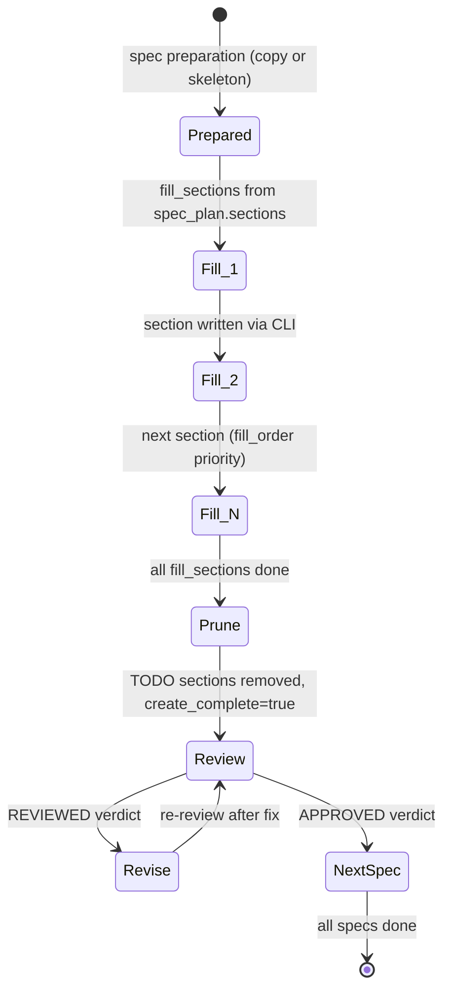
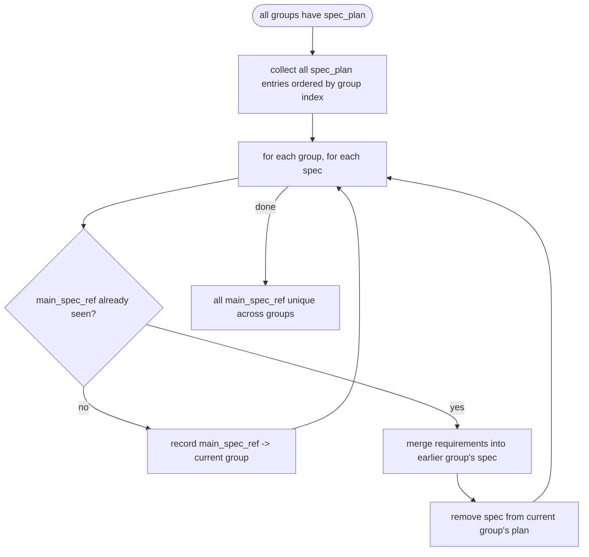
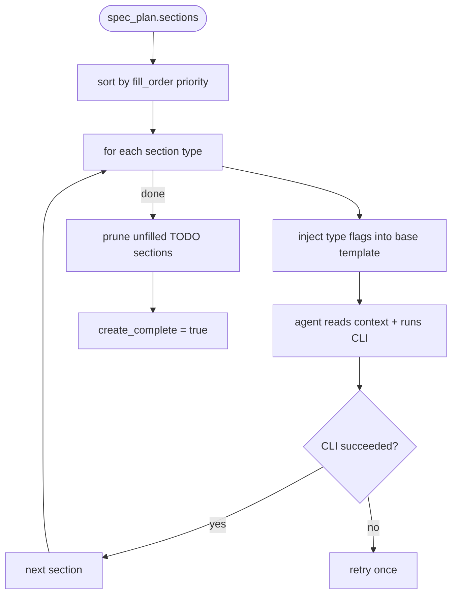
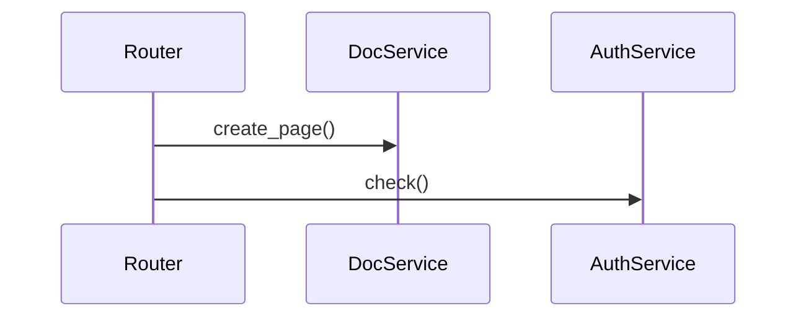
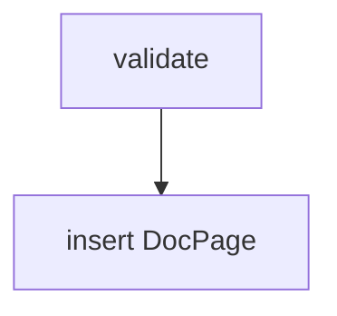

# Change Spec

## Phase Transition
<!-- type: overview lang: markdown -->

```yaml
from: ChangeInited | ChangeSpecReviewed | ChangeSpecRevised
to: ChangeSpecCreated | ChangeSpecReviewed | ChangeSpecRevised
terminal: ChangeSpecReviewed (APPROVED) → ChangeImplementationCreated
executor: [gemini:pro, mainthread]
crr: true  # per-spec CRR cycle
max_revisions: 2
note: |
  init_change sets ChangeInited, then route() sends directly to
  sdd_workflow_create_change_spec. No intermediate phases. The spec
  prompt reads the issue file directly for the Requirements and
  Reference Context sections.
```

## Per-Spec Lifecycle
<!-- type: state-machine lang: mermaid -->



### SpecSubState enum

```yaml
SpecSubState:
  Create: "Spec needs work — skeleton, analyze, or fill in progress"
  Review: "Spec has create_complete=true, no APPROVED verdict yet"
  Revise: "Reviewed with REVIEWED verdict — re-fill flagged sections"
  MainthreadMustFix: "REJECTED after max revisions — mainthread intervenes"
  AdvanceToImplementation: "All specs approved"
```

### Mandatory Review (CRR)

Review is not optional. Every spec that reaches `create_complete: true` MUST transition through `Review` with a recorded verdict before `AdvanceToImplementation` is allowed. The resolver MUST enforce this invariant even when:

- No `proposal.md` exists (legacy changes without a proposal manifest).
- Only one spec file exists in `specs/` (single-spec changes still need review).
- The proposal's `affected_specs` list is empty.

| ID | Text | Verify |
|----|------|--------|
| CRR1 | If any spec in `specs/` has `create_complete: true` without a `review_verdict: APPROVED` in its frontmatter (or a separate `review_spec_<id>.md` with APPROVED), `resolve_next_spec` returns `Review { spec_id }`, never `AdvanceToImplementation` | unit |
| CRR2 | `AdvanceToImplementation` is reachable only when every complete spec has an APPROVED verdict on record | unit |
| CRR3 | `review_change_spec::execute_workflow` never emits `"Advancing to implementation"` without first producing at least one review payload across the change lifecycle | integration |

## Artifact Payload — Auto-Resolution
<!-- type: overview lang: markdown -->

The `sdd_artifact_create_change_spec` tool auto-resolves IDs from state machine context. Minimal payload:

```json
{"section": "overview", "content": "..."}
```

| Field | Resolution | Fallback |
|-------|-----------|----------|
| `change_id` | Scan `.aw/changes/*/STATE.yaml` for single active (non-terminal) change | Error if 0 or >1 active changes |
| `spec_id` | Read `current_task_id` from STATE.yaml | Error if not set |
| `group_id` | Scan `groups/*/specs/{spec_id}.md` directory structure | Also checks top-level `specs/` |

All three can still be passed explicitly (backward compat), but the state machine is the source of truth. LLM agents should not need to track these.

## Artifact Writing Enforcement
<!-- type: overview lang: markdown -->

Same pattern as reference-context (see `logic/reference-context.md` § Artifact Writing Enforcement):

1. **Prompt constraint** — "DO NOT use Write/Edit tools directly. Use artifact CLI only."
2. **Post-agent verification** — Check `filled_sections` frontmatter updated by artifact CLI
3. **Mainthread fallback** — If agent wrote spec file directly, program reads content, extracts section text, calls `execute_artifact()` to rewrite with proper frontmatter tracking

## Spec Preparation (pre-step)
<!-- type: logic lang: mermaid -->



Before change_spec phase begins, the system prepares spec files using the `spec_plan` from the issue's `## Reference Context` section (read directly from the issue file, not from intermediate artifacts):

| action | what happens |
|--------|-------------|
| `modify` | Copy `.aw/tech-design/{source}` → `groups/{group}/specs/{spec_id}.md`, set `main_spec_ref` in frontmatter |
| `create` | Write skeleton → `groups/{group}/specs/{spec_id}.md`, set `main_spec_ref` in frontmatter |

After preparation, every spec file already has `main_spec_ref` set. Agent never needs to determine it.

### Cross-group main_spec_ref deduplication

**Constraint**: No two groups may target the same `main_spec_ref`. Enforced automatically after all groups complete reference_context, before prepare_specs begins.

**Resolution**: conflicting specs are moved to the earliest group that claims them.

The earlier group's spec absorbs the later group's requirements for that `main_spec_ref`. The later group no longer owns that spec — it can still read it as reference but does not produce a change spec for it.

## Section Selection
<!-- type: overview lang: markdown -->

Sections for each spec are determined by `spec_plan.sections` from reference_context. Two sources:

### Rule engine (CLI-side, no agent)

Requirements text is matched against keyword rules to suggest section types:

```yaml
section_rules:
  - match: "endpoint|route|api|REST|HTTP"
    sections: [rest-api, schema]
  - match: "rpc|json-rpc|MCP tool"
    sections: [rpc-api, schema]
  - match: "queue|pubsub|webhook|background|async"
    sections: [async-api]
  - match: "database|model|table|migration|collection"
    sections: [db-model]
  - match: "state|phase|lifecycle|transition"
    sections: [state-machine]
  - match: "UI|page|component|layout|frontend"
    sections: [wireframe, component]
  - match: "CLI|command|subcommand|flag"
    sections: [cli]
  - match: "config|env|settings|.toml|.env"
    sections: [config]
  - match: "token|color|spacing|typography|theme"
    sections: [design-token]
  - always: [overview]
  - if_section_count_gt_2: [test-plan]
  - if_section_count_gt_3: [interaction, logic, dependency]
```

### Review fallback (two-layer CRR)

Section selection is **best effort** — review catches gaps:

1. **reference_context CRR** (max 1 revision) — reviews spec_plan.sections completeness
2. **change_spec CRR** (max 2 revisions) — reviews content, can request missing sections

## Section Fill Order
<!-- type: overview lang: markdown -->

Sections within a spec are filled in dependency order (hardcoded priority):

```yaml
fill_order:
  - overview          # 0: understand scope first
  - db-model          # 1: data layer
  - schema            # 2: referenced by API types
  - state-machine     # 3: state transitions
  - logic             # 4: business logic
  - dependency        # 5: architecture
  - interaction       # 6: call chains
  - rest-api          # 7: API surface (refs schema)
  - rpc-api           # 7
  - async-api         # 7
  - cli               # 7
  - wireframe         # 8: UI layout
  - component         # 8: UI components
  - design-token      # 8: design system
  - config            # 9
  - test-plan         # 10: needs all others
  - changes           # 11: last
```

## Create Mode: CLI-Driven Section Fill
<!-- type: overview lang: markdown -->

Each section is filled via structured CLI call. Agent provides flag values, CLI generates formatted content.

### CLI Command

```
cclab sdd artifact create-change-spec {change_id} {spec_id} \
  --type {section-type} [per-type flags...] \
  --sdd-id {id} --sdd-refs "#ref1,#ref2"
```

### Prompt Architecture

**1 base template + 17 type-specific inserts** (stored as data, not separate prompts):

```markdown
# Task: Fill {{section_type}} section for spec '{{spec_id}}'

--- Context ---
- Requirements: groups/{{group_id}}/requirements.md
- Reference: groups/{{group_id}}/reference_context.md
- Filled so far: {{filled_sections}}

--- Command ---
cclab sdd artifact create-change-spec {{change_id}} {{spec_id}} --type {{section_type}}

--- Flags ---
{{type_specific_flags}}

Read context, determine flag values, run the command.
```

Type-specific flag descriptions are stored as data:

```yaml
section_prompts:
  rest-api:
    flags:
      --endpoint: "HTTP method + path (e.g. POST /docs/{id}/pages)"
      --request-schema: "Request body schema name"
      --response-schema: "Response schema name"
      --status-codes: "Comma-separated (e.g. 201,400,404)"
    guidance: "One endpoint per section. Include error responses."

  logic:
    flags:
      --nodes: "Node id:label pairs (e.g. A:validate,B:check_quota)"
      --edges: "Edges (e.g. A-->B,B-->|valid|C)"
      --conditions: "Condition labels on decision edges"
    guidance: "One function/handler per section. Max 10 nodes."

  db-model:
    flags:
      --entities: "Entity names (e.g. DocPageVersion)"
      --fields: "Per-entity fields (e.g. DocPageVersion:id,page_id,content)"
      --relations: "Relations (e.g. DocPage||--o{DocPageVersion:has)"
    guidance: "Use DB column types, not language types."

  # ... 14 more types, same pattern
```

### Fill Loop



### Mode 1: New spec (skeleton from preparation)

Skeleton has `<!-- TODO -->` for each section in `spec_plan.sections`. Fill loop fills them in order.

### Mode 2: Existing spec (copied from preparation)

Copied spec has existing content. Agent modifies only sections listed in `fill_sections`.

### Placeholder Sentinels (N/A + TODO)

Skeletons always render every section from the universal template so the author (or agent) can see what is available. Two sentinels are recognised during fill + prune; every non-sentinel body is treated as real content:

| Sentinel | Meaning | Emitted by |
|----------|---------|-----------|
| `<!-- TODO -->` (optionally with inline hints) | "not yet filled — still working on it" | skeleton generator |
| `N/A` | "explicitly not applicable to this spec — skip cleanly" | author / agent |

| ID | Text | Verify |
|----|------|--------|
| NAP1 | Skeleton generator MUST seed every fill-loop section body with `<!-- TODO -->`; the bare `N/A` token is reserved for authors that have decided a section does not apply | unit |
| NAP2 | `format_priority_violation` (and any future `section_*` rule) MUST treat a section whose direct body trims to `N/A` as exempt — no code-block requirement, no annotation nag | unit |
| NAP3 | `prune_todo_sections` MUST also remove any section whose direct body trims to `N/A`, deleting the heading + body together; downstream merges never see `N/A` sentinels | unit |
| NAP4 | After `create_complete: true` is set, the spec file on disk MUST NOT contain `<!-- TODO -->` or `N/A` placeholder bodies in any H2/H3 section | integration |

Rationale: the earlier design deleted entire headings for sections the agent chose to skip, which hid the decision from reviewers and fought with format validators. `N/A` surfaces the skip during fill + review, then prunes away at commit-time so main-spec merges stay clean.

### Frontmatter tracking

```yaml
---
id: {spec_id}
main_spec_ref: cclab-sdd/logic/my-spec.md   # target path in .aw/tech-design/ (set by spec preparation)
merge_strategy: new | append | replace
refs: [dep-spec-1, dep-spec-2]     # topological dependencies
fill_sections: [overview, rest-api, schema, interaction]  # from spec_plan.sections
capability_refs:
  - id: td-cb-lifecycle-automation
    role: primary
    gap: td-lifecycle-dispatch
    claim: td-lifecycle-dispatch
    coverage: full
    rationale: "Change/context/git/spec-store logic supports TD/CB artifact lifecycle dispatch and review state."
filled_sections: [overview]         # incremented per artifact call
create_complete: true               # set after prune
---
```

### main_spec_ref requirement

`main_spec_ref` is the target path under `.aw/tech-design/` where the spec will be merged. Set by **spec preparation** from `spec_plan` — never by the agent.

| Mode | Source | main_spec_ref |
|------|--------|---------------|
| `modify` | `.aw/tech-design/{source}` copied into change | Same path — merge overwrites the original |
| `create` | No existing spec | Target path from `spec_plan.main_spec_ref` — merge creates new file |

**Validation gate**: Prune step rejects specs with `main_spec_ref: ~` (should never happen if spec preparation ran correctly).

### Artifact call per section

Each `cclab sdd artifact create-change-spec` call writes exactly **one** section via structured CLI flags:

```
cclab sdd artifact create-change-spec {change_id} {spec_id} \
  --type {section-type} [per-type flags...] \
  --sdd-id {id} --sdd-refs "#ref1,#ref2"
```

The CLI generates formatted content (OpenAPI YAML, Mermaid, JSON Schema, etc.) and updates `filled_sections` in frontmatter. `fill_sections`, `main_spec_ref`, and `merge_strategy` are set by spec preparation and not modified by the agent.

## Directory Structure
<!-- type: overview lang: markdown -->

Specs live **under group**, not at change root. Each group is a self-contained unit:

```
changes/{change-id}/
├── STATE.yaml
├── user_input.md
├── issues/              # symlink or reference to .aw/issues/open/{slug}.md
└── specs/
    ├── {spec-id-1}.md
    ├── {spec-id-2}.md
    └── ...
```

The issue file (`.aw/issues/open/{slug}.md`) is the source of truth for requirements, reference context, and scope. No intermediate artifacts (requirements.md, pre_clarifications.md, post_clarifications.md, reference_context.md) are generated at init_change time. The spec prompt reads the issue file directly.

## Spec Execution Order
<!-- type: overview lang: markdown -->

Topological sort on `refs:` frontmatter field within the same group. Specs with dependencies are created after their deps.

## Section Type System
<!-- type: overview lang: markdown -->

Each section in a spec is **one section = one type**. Sections are self-describing via an HTML comment annotation after the heading:

```markdown
## {section title}
<!-- type: {spec-type} lang: {spec-lang} -->

{section desc}

```{spec-lang}
{content}
```
```

### Section Type → Spec Lang Mapping

| spec-type | lang | code fence | use for |
|-----------|------|------------|---------|
| `rest-api` | `yaml` | ` ```yaml ` | REST API interface (OpenAPI 3.1) |
| `rpc-api` | `json` | ` ```json ` | JSON-RPC interface (OpenRPC 1.3) |
| `async-api` | `yaml` | ` ```yaml ` | Background/WebSocket (AsyncAPI 2.6) |
| `cli` | `yaml` | ` ```yaml ` | CLI command tree + args |
| `schema` | `json` | ` ```json ` | Interface/data schema (JSON Schema) |
| `logic` | `mermaid` | ` ```mermaid ` | Business logic (flowchart) |
| `interaction` | `mermaid` | ` ```mermaid ` | Actor interaction (sequence diagram) |
| `state-machine` | `mermaid` | ` ```mermaid ` | State transitions (stateDiagram-v2) |
| `db-model` | `mermaid` | ` ```mermaid ` | Database model (erDiagram) |
| `test-plan` | `mermaid` | ` ```mermaid ` | Test coverage (requirementDiagram) |
| `dependency` | `mermaid` | ` ```mermaid ` | Dependency/type hierarchy (classDiagram) |
| `wireframe` | `yaml` | ` ```yaml ` | UI wireframe (framework-agnostic YAML DSL) |
| `component` | `json` | ` ```json ` | UI component contract — Custom Elements Manifest (CEM) |
| `design-token` | `json` | ` ```json ` | Design tokens — W3C DTCG 2025.10 |
| `config` | `json` | ` ```json ` | Config file schema (JSON Schema) |
| `overview` | `markdown` | (no fence) | Description, prose only |
| `changes` | `yaml` | ` ```yaml ` | File change list (path + action) |

### Cross-Reference System

Sections link to each other via **content-level** `id` and `$ref` — not in the HTML annotation. Each spec lang has its own standard mechanism:

| spec lang family | id mechanism | ref mechanism |
|-----------------|-------------|---------------|
| OpenAPI 3.1 | `x-sdd.id` | `x-sdd.refs[*].$ref` |
| OpenRPC 1.3 | `x-sdd.id` | `x-sdd.refs[*].$ref` |
| AsyncAPI 2.6 | `x-sdd.id` | `x-sdd.refs[*].$ref` |
| JSON Schema | `$id` | `$ref` |
| CEM (component) | `x-sdd.id` | `x-sdd.refs[*].$ref` |
| DTCG (design-token) | `$extensions.sdd.id` | `$extensions.sdd.refs[*].$ref` |
| Mermaid Plus | frontmatter `id` | frontmatter `refs[*].$ref` |
| YAML DSL (wireframe, cli, config, changes) | `_sdd.id` | `_sdd.refs[*].$ref` |

**$ref syntax** (unified across all langs):
- `#local-id` — same file
- `other-spec#remote-id` — cross file

**Example — OpenAPI linking to Mermaid Plus**:

```yaml
# rest-api section
paths:
  /docs/{id}/pages:
    post:
      summary: Create page
      x-sdd:
        id: create-page-api
        refs:
          - $ref: "#create-page-flow"
```





**Traversal**: API endpoint → interaction flow → business logic → data model. Each layer's content carries its own `id` and `refs`, forming a DAG.

**Rule**: If a section may be referenced by other sections, its content MUST declare an `id`. Leaf sections (overview, changes) typically don't need one.

### Parsing

Section annotations are extracted by regex:

```
^## (.+)\n<!-- type: ([\w-]+) lang: (\w+) -->
```

Cross-references are extracted from content:
- Mermaid: YAML frontmatter `id` and `refs`
- OpenAPI/OpenRPC/AsyncAPI/CEM: `x-sdd.id` and `x-sdd.refs`
- JSON Schema: `$id` and `$ref`
- YAML DSL: `_sdd.id` and `_sdd.refs`

This enables:
- **Extract** — pull a specific section by type
- **Insert** — generate section with correct lang + code fence from type
- **Validate** — verify code fence content matches spec-lang format
- **Trace** — follow `$ref` links to build dependency DAG across sections and files

### Migration from spec_type

The old file-level `spec_type` frontmatter field is **deprecated**. Section types replace it:
- Old: one `spec_type` per file → determines required diagrams + api_spec
- New: each section declares its own type → agent senses what sections are needed

## Review
<!-- type: overview lang: markdown -->

### Checklist

1. Each section has `<!-- type: ... lang: ... -->` annotation
2. Section type matches actual content (e.g. `state-machine` section contains `stateDiagram-v2`)
3. Code fence lang matches declared lang
4. Cross-references: all `$ref` targets exist (no dangling refs)
5. Referenceable sections have `id` declared in content
6. Requirements: complete, no gaps vs reference context
7. Scenarios: cover happy path + error cases
8. Mermaid sections: syntactically valid, correct diagram type for declared section type
9. API spec sections: semantically valid, matches requirements
10. Test plan: covers all requirements
11. Dependencies (`refs:`) consistent with other specs

### Verdict

- **APPROVED** — all checks pass
- **REVIEWED** — issues found (HIGH/MEDIUM/LOW severity)
- **REJECTED** — fundamentally wrong approach (rare, escalates to mainthread)

## Revise
<!-- type: overview lang: markdown -->

1. Read inline `## Reviews` section in spec file
2. Address each flagged issue
3. Re-fill affected sections via `sdd_artifact_create_change_spec` (same iterative pattern)
4. Do NOT touch sections that were not flagged

## Side Effects
<!-- type: overview lang: markdown -->

| Action | STATE.yaml change |
|--------|-------------------|
| Create (skeleton written) | `phase → ChangeSpecCreated` |
| Create (all sections filled + pruned) | `create_complete` in spec frontmatter |
| Review (APPROVED) | Mark spec done, advance if all specs approved |
| Review (REVIEWED) | `phase → ChangeSpecReviewed` |
| Revise | `phase → ChangeSpecRevised`, `revision_counts.{spec_id} += 1` |
| All specs approved | `phase → ChangeImplementationCreated` (via advance) |


## Changes
<!-- type: overview lang: markdown -->

Remove all `merge_strategy` references from the spec — the field is dead code. Actual merge behavior is always: write to `.aw/tech-design/{main_spec_ref}` (create if absent, overwrite if exists). No variant is needed.

### Frontmatter tracking

Remove `merge_strategy` line from the frontmatter example YAML block:

| Location | Change |
|----------|--------|
| `## Frontmatter tracking` code block | Remove line: `merge_strategy: new \| append \| replace` |

### Artifact call per section

Update trailing prose to drop `merge_strategy` mention:

| Location | Before | After |
|----------|--------|-------|
| `## Artifact call per section`, closing sentence | "`fill_sections`, `main_spec_ref`, and `merge_strategy` are set by spec preparation and not modified by the agent." | "`fill_sections` and `main_spec_ref` are set by spec preparation and not modified by the agent." |

## Traceability Changes
<!-- type: changes lang: yaml -->

```yaml
changes:
  - action: annotate
    section: logic
    impl_mode: hand-written
    description: "Traceability metadata edge for the logic section."

  - action: annotate
    section: state-machine
    impl_mode: hand-written
    description: "Traceability metadata edge for the state-machine section."

```