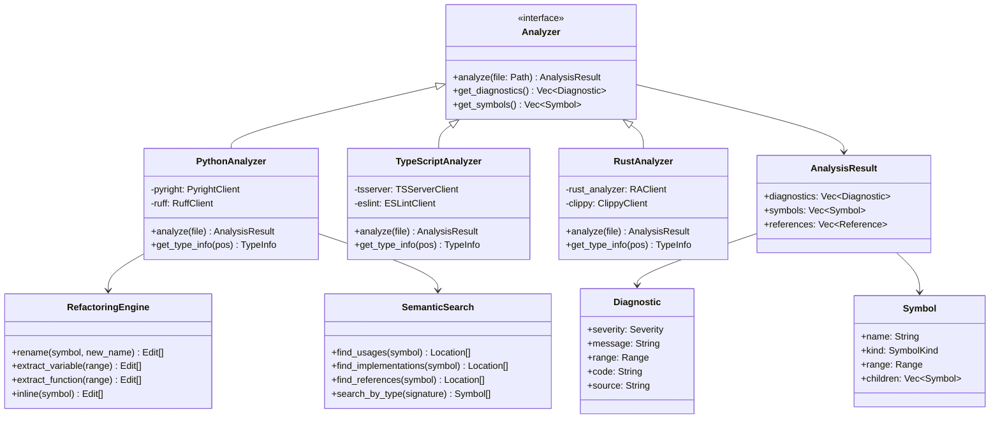
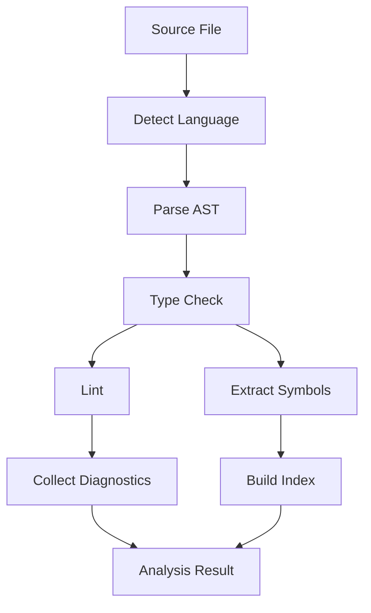
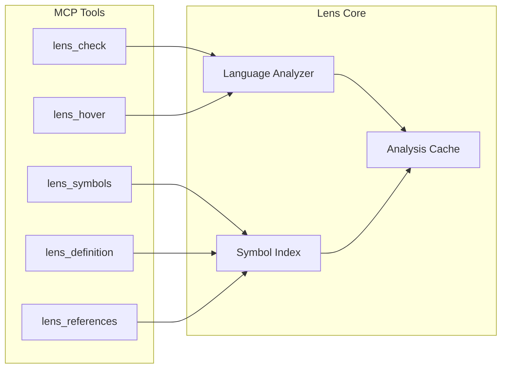

<spec>

# Lens Code Analyzer Architecture

## Overview
<!-- type: doc lang: markdown -->

Lens (Argus) provides unified multi-language code analysis with LSP + Linting.

## Class Diagram
<!-- type: doc lang: markdown -->

## Analysis Pipeline
<!-- type: doc lang: markdown -->

## MCP Tool Flow
<!-- type: doc lang: markdown -->

</spec>
