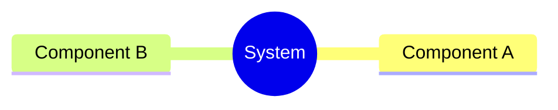
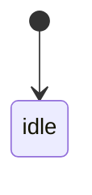
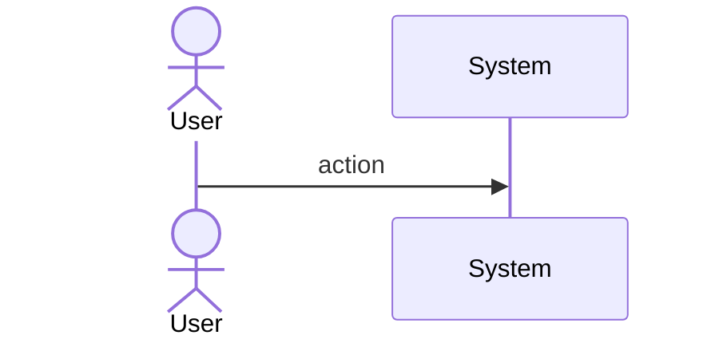
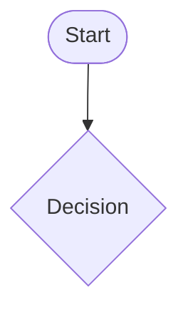
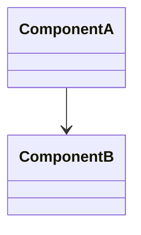
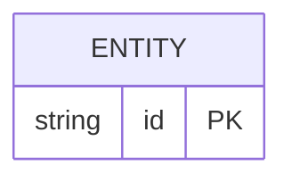

# Sdd Codegen Documentation Generators

## Overview
<!-- type: doc lang: markdown -->

Documentation generators (Category C) do not produce executable code but inject metadata annotations and scaffolds into code files. They bridge TD specs and code documentation: requirements become `@spec` annotations, test plans become test function stubs, scenarios become GWT-commented integration tests.

| Section Type | Codegen Target | Output |
|---|---|---|
| `requirements` | Rust code files with `impl_at` field | `// REQ: R1` comments + `@spec R1` doc annotations at specified locations |
| `test-plan` | Test file scaffolds | `#[test] fn test_t1()` stubs with `assert_verifies_req!(R1)` macro |
| `scenarios` | Integration test file scaffolds | `#[tokio::test] fn scenario_s1()` with GWT as structured comments |
| `mindmap` | Module docs | `//! Module hierarchy ...` crate-level doc comment from mindmap nodes |
| `overview` | Crate-level doc | `//!` doc comment from overview prose |

All documentation generators use `impl_at: [{file, symbol}]` in requirement frontmatter to know where to inject annotations. Missing `impl_at` emits a warning (not a failure) and skips injection.
## Requirements
<!-- type: requirements lang: mermaid -->

```mermaid
---
id: sdd-codegen-documentation-requirements
title: Documentation Generators Requirements
requirements:
  R1:
    text: Requirements generator injects @spec annotations at impl_at locations
    type: functional
    priority: high
    risk: low
    verification: test
    notes: |
      For each requirement in requirements frontmatter with impl_at field,
      inject `// REQ: R1` comment at specified file+symbol location.
      Missing impl_at: emit warning, skip injection.
  R2:
    text: Test-plan generator produces test function stubs linked to requirement IDs
    type: functional
    priority: high
    risk: low
    verification: test
    notes: |
      For each test element in test-plan frontmatter with verifies relationship,
      generate #[test] fn stub with assert_verifies_req!(R1) macro invocation.
  R3:
    text: Scenarios generator produces GWT-commented integration test stubs
    type: functional
    priority: medium
    risk: low
    verification: test
    notes: |
      For each scenario in scenarios frontmatter (given/when/then),
      generate #[tokio::test] fn with structured GWT comments.
      Body is todo!() but LLM has full GWT context for completion.
  R4:
    text: Test stubs inline linked scenario GWT when verifies references overlap
    type: functional
    priority: medium
    risk: low
    verification: test
    notes: |
      If test T1 verifies R3 and scenario S1 also verifies R3,
      codegen inlines S1 given/when/then as comments in T1 body.
      Smaller LLM gap: body stays todo!() but context is complete.
---
requirementDiagram
    requirement R1 {
      id: R1
      text: Requirements annotation injection
      risk: low
      verifymethod: test
    }
    requirement R2 {
      id: R2
      text: Test-plan stubs
      risk: low
      verifymethod: test
    }
    requirement R3 {
      id: R3
      text: Scenarios GWT stubs
      risk: low
      verifymethod: test
    }
    requirement R4 {
      id: R4
      text: Cross-linked GWT inline
      risk: low
      verifymethod: test
    }
```
## Scenarios
<!-- type: scenarios lang: yaml -->

```yaml
scenarios: []
```

## Diagrams
<!-- type: doc lang: markdown -->

### Mindmap
<!-- type: mindmap lang: mermaid -->
<!-- TODO: Use Mermaid Plus mindmap (YAML frontmatter inside mermaid block).

-->

### State Machine
<!-- type: state-machine lang: mermaid -->
<!-- TODO: Use Mermaid Plus stateDiagram-v2 (YAML frontmatter inside mermaid block).

-->

### Interaction
<!-- type: interaction lang: mermaid -->
<!-- TODO: Use Mermaid Plus sequenceDiagram (YAML frontmatter inside mermaid block).

-->

### Logic
<!-- type: logic lang: mermaid -->
<!-- TODO: Use Mermaid Plus flowchart (YAML frontmatter inside mermaid block).

-->

### Dependencies
<!-- type: dependency lang: mermaid -->
<!-- TODO: Use Mermaid Plus classDiagram (YAML frontmatter inside mermaid block).

-->

### Data Model
<!-- type: db-model lang: mermaid -->
<!-- TODO: Use Mermaid Plus erDiagram (YAML frontmatter inside mermaid block).

-->

## API Spec
<!-- type: doc lang: markdown -->

### REST API
<!-- type: rest-api lang: yaml -->
<!-- score-td-placeholder -->
<!-- TODO -->

### RPC API
<!-- type: rpc-api lang: yaml -->
<!-- TODO: OpenRPC 1.3 as YAML. Example:
```yaml
openrpc: "1.3.2"
info:
  title: Service Name
  version: "1.0.0"
methods: []
```
-->

### Async API
<!-- type: async-api lang: yaml -->
<!-- score-td-placeholder -->
<!-- TODO -->

### CLI
<!-- type: cli lang: yaml -->
<!-- score-td-placeholder -->
<!-- TODO -->

### Schema
<!-- type: schema lang: yaml -->
<!-- TODO: JSON Schema as YAML. Example:
```yaml
"$schema": "https://json-schema.org/draft/2020-12/schema"
type: object
properties:
  id:
    type: string
required: [id]
```
-->

### Config
<!-- type: config lang: yaml -->
<!-- score-td-placeholder -->
<!-- TODO -->

## Test Plan
<!-- type: test-plan lang: mermaid -->

<!-- TODO: Use Mermaid Plus requirementDiagram with element nodes and verifies relationships.
```mermaid
---
id: test-plan
---
requirementDiagram

element T1 {
  type: "Test"
}

element T2 {
  type: "Test"
}

T1 - verifies -> R1
T2 - verifies -> R2
```
-->

## Changes
<!-- type: changes lang: yaml -->

```yaml
changes:
  - path: projects/agentic-workflow/src/generate/gen/rust/requirement.rs
    section: source
    action: create
    impl_mode: hand-written
    description: |
      Requirements annotation generator. Reads requirements frontmatter YAML,
      finds impl_at locations, injects REQ: comment annotations at those locations.
  - path: projects/agentic-workflow/src/generate/gen/rust/test_plan.rs
    section: source
    action: create
    impl_mode: hand-written
    description: |
      Test plan generator. Reads test-plan frontmatter (requirementDiagram elements + verifies),
      generates #[test] fn stubs with assert_verifies_req! macro.
      Cross-links with scenarios to inline GWT comments.
  - path: projects/agentic-workflow/src/generate/gen/rust/scenario.rs
    section: source
    action: create
    impl_mode: hand-written
    description: |
      Scenarios generator. Reads scenarios frontmatter YAML (given/when/then),
      generates #[tokio::test] fn stubs with structured GWT comments.
  - path: projects/agentic-workflow/src/generate/gen/rust/mod.rs
    section: source
    action: modify
    impl_mode: hand-written
    description: Add pub mod requirement; pub mod test_plan; pub mod scenario;
  - action: annotate
    section: async-api
    impl_mode: hand-written
    description: "Traceability metadata edge for the async-api section."

  - action: annotate
    section: cli
    impl_mode: hand-written
    description: "Traceability metadata edge for the cli section."

  - action: annotate
    section: component
    impl_mode: hand-written
    description: "Traceability metadata edge for the component section."

  - action: annotate
    section: config
    impl_mode: hand-written
    description: "Traceability metadata edge for the config section."

  - action: annotate
    section: db-model
    impl_mode: hand-written
    description: "Traceability metadata edge for the db-model section."

  - action: annotate
    section: dependency
    impl_mode: hand-written
    description: "Traceability metadata edge for the dependency section."

  - action: annotate
    section: design-token
    impl_mode: hand-written
    description: "Traceability metadata edge for the design-token section."

  - action: annotate
    section: interaction
    impl_mode: hand-written
    description: "Traceability metadata edge for the interaction section."

  - action: annotate
    section: logic
    impl_mode: hand-written
    description: "Traceability metadata edge for the logic section."

  - action: annotate
    section: mindmap
    impl_mode: hand-written
    description: "Traceability metadata edge for the mindmap section."

  - action: annotate
    section: requirements
    impl_mode: hand-written
    description: "Traceability metadata edge for the requirements section."

  - action: annotate
    section: rest-api
    impl_mode: hand-written
    description: "Traceability metadata edge for the rest-api section."

  - action: annotate
    section: rpc-api
    impl_mode: hand-written
    description: "Traceability metadata edge for the rpc-api section."

  - action: annotate
    section: scenarios
    impl_mode: hand-written
    description: "Traceability metadata edge for the scenarios section."

  - action: annotate
    section: schema
    impl_mode: hand-written
    description: "Traceability metadata edge for the schema section."

  - action: annotate
    section: state-machine
    impl_mode: hand-written
    description: "Traceability metadata edge for the state-machine section."

  - action: annotate
    section: unit-test
    impl_mode: hand-written
    description: "Traceability metadata edge for the unit-test section."

  - action: annotate
    section: wireframe
    impl_mode: hand-written
    description: "Traceability metadata edge for the wireframe section."

```
## Wireframe
<!-- type: wireframe lang: yaml -->

```yaml
wireframes: []
```

## Component
<!-- type: component lang: yaml -->

```yaml
components: []
```

## Design Token
<!-- type: design-token lang: yaml -->

```yaml
tokens: []
```

## Doc
<!-- type: doc lang: markdown -->

<!-- TODO -->
