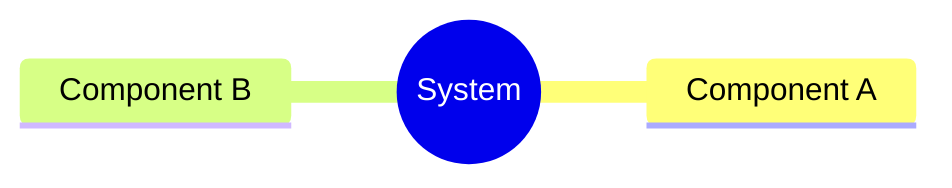
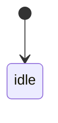
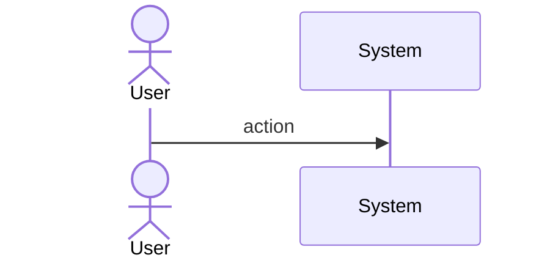
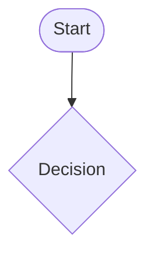
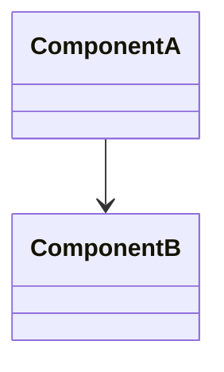
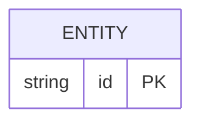

# Sdd Codegen Marker System

## Overview
<!-- type: overview lang: markdown -->

The CODEGEN marker system enables selective regeneration of generated code blocks within otherwise hand-crafted files. Target files contain `// CODEGEN-BEGIN` / `// CODEGEN-END` block markers; `score gen apply` updates only the content between them, preserving surrounding code.

**Marker format** (Rust example):
```rust
// SPEC-MANAGED: <spec-path>#<section-id>
// CODEGEN-BEGIN
<generated content>
// CODEGEN-END
```

**SPEC-REF markers** (inside CODEGEN blocks):
```rust
// SPEC-REF: <spec-path>#<section-id>
// TODO: <task description>
```

**Three operations**:
1. **Parse**: extract all CODEGEN-BEGIN/END blocks from a file, return (prefix, block_map, suffix)
2. **Replace**: given new generated content, replace block content while preserving prefix/suffix
3. **Init**: scaffold new CODEGEN-BEGIN/END markers in an existing file at a given location

Multiple CODEGEN blocks per file are supported (one per spec section). Each block is identified by its SPEC-MANAGED comment. SPEC-REF markers within blocks are allowed — they are part of generated content. Markers outside blocks are hand-written and always preserved.

All emitted markers are tracked in `.aw/codegen_markers.yaml` for CI visibility. Reducing marker count over time indicates improving TD quality.
## Requirements
<!-- type: requirements lang: mermaid -->

```mermaid
---
id: sdd-codegen-marker-requirements
title: CODEGEN Marker System Requirements
requirements:
  R1:
    text: Parser extracts CODEGEN-BEGIN/END blocks from target files
    type: functional
    priority: high
    risk: medium
    verification: test
    notes: |
      Parse all CODEGEN-BEGIN...CODEGEN-END regions from a file.
      Extract SPEC-MANAGED comment above each block (spec-path + section-id).
      Return: Vec<CodegenBlock { spec_ref, start_line, end_line, content }>
  R2:
    text: Replacer updates CODEGEN block content preserving wrapper code
    type: functional
    priority: high
    risk: medium
    verification: test
    notes: |
      Given new generated content string and file content,
      replace the interior of CODEGEN-BEGIN/END block identified by SPEC-MANAGED ref.
      Preserve all code outside CODEGEN blocks unchanged.
  R3:
    text: Multiple CODEGEN blocks per file supported
    type: functional
    priority: medium
    risk: low
    verification: test
    notes: |
      A single file may have 1..N CODEGEN blocks, one per spec section.
      Each block is identified by its SPEC-MANAGED comment (spec-path#section-id).
      Blocks do not overlap; order preserved.
  R4:
    text: SPEC-REF markers inside CODEGEN blocks are valid generated content
    type: functional
    priority: high
    risk: low
    verification: test
    notes: |
      SPEC-REF markers inside CODEGEN blocks are written by generators for non-deterministic parts.
      They are regenerated on each apply (not hand-written, not preserved separately).
      Markers outside CODEGEN blocks are hand-written and always preserved.
  R5:
    text: All SPEC-REF markers tracked in .aw/codegen_markers.yaml
    type: functional
    priority: medium
    risk: low
    verification: test
    notes: |
      After each gen apply, update .aw/codegen_markers.yaml with all emitted markers.
      Format: spec-path -> [{ section, file, line, task }]
      Enables CI visibility of remaining TODOs.
  R6:
    text: score gen init-markers scaffolds new CODEGEN blocks in existing files
    type: functional
    priority: medium
    risk: low
    verification: test
    notes: |
      Given a file path and spec reference, insert empty CODEGEN-BEGIN/END block.
      Does not overwrite existing content. Finds insertion point near specified symbol.
---
requirementDiagram
    requirement R1 {
      id: R1
      text: Block parser
      risk: medium
      verifymethod: test
    }
    requirement R2 {
      id: R2
      text: Block replacer
      risk: medium
      verifymethod: test
    }
    requirement R3 {
      id: R3
      text: Multiple blocks per file
      risk: low
      verifymethod: test
    }
    requirement R4 {
      id: R4
      text: SPEC-REF inside blocks
      risk: low
      verifymethod: test
    }
    requirement R5 {
      id: R5
      text: Marker tracking file
      risk: low
      verifymethod: test
    }
    requirement R6 {
      id: R6
      text: Init markers helper
      risk: low
      verifymethod: test
    }
```
## Scenarios
<!-- type: scenarios lang: yaml -->

```yaml
scenarios: []
```

## Diagrams
<!-- type: doc lang: markdown -->

### Mindmap
<!-- type: mindmap lang: mermaid -->
<!-- TODO: Use Mermaid Plus mindmap (YAML frontmatter inside mermaid block).

-->

### State Machine
<!-- type: state-machine lang: mermaid -->
<!-- TODO: Use Mermaid Plus stateDiagram-v2 (YAML frontmatter inside mermaid block).

-->

### Interaction
<!-- type: interaction lang: mermaid -->
<!-- TODO: Use Mermaid Plus sequenceDiagram (YAML frontmatter inside mermaid block).

-->

### Logic
<!-- type: logic lang: mermaid -->
<!-- TODO: Use Mermaid Plus flowchart (YAML frontmatter inside mermaid block).

-->

### Dependencies
<!-- type: dependency lang: mermaid -->
<!-- TODO: Use Mermaid Plus classDiagram (YAML frontmatter inside mermaid block).

-->

### Data Model
<!-- type: db-model lang: mermaid -->
<!-- TODO: Use Mermaid Plus erDiagram (YAML frontmatter inside mermaid block).

-->

## API Spec
<!-- type: doc lang: markdown -->

### REST API
<!-- type: rest-api lang: yaml -->
<!-- score-td-placeholder -->
<!-- TODO -->

### RPC API
<!-- type: rpc-api lang: yaml -->
<!-- score-td-placeholder -->
<!-- TODO: OpenRPC 1.3 as YAML. Example:
```yaml
openrpc: "1.3.2"
info:
  title: Service Name
  version: "1.0.0"
methods: []
```
-->

### Async API
<!-- type: async-api lang: yaml -->
<!-- score-td-placeholder -->
<!-- TODO -->

### CLI
<!-- type: cli lang: yaml -->
<!-- score-td-placeholder -->
<!-- TODO -->

### Schema
<!-- type: schema lang: yaml -->
<!-- score-td-placeholder -->
<!-- TODO: JSON Schema as YAML. Example:
```yaml
"$schema": "https://json-schema.org/draft/2020-12/schema"
type: object
properties:
  id:
    type: string
required: [id]
```
-->

### Config
<!-- type: config lang: yaml -->
<!-- score-td-placeholder -->
<!-- TODO -->

## Test Plan
<!-- type: test-plan lang: mermaid -->

<!-- TODO: Use Mermaid Plus requirementDiagram with element nodes and verifies relationships.
```mermaid
---
id: test-plan
---
requirementDiagram

element T1 {
  type: "Test"
}

element T2 {
  type: "Test"
}

T1 - verifies -> R1
T2 - verifies -> R2
```
-->

## Changes
<!-- type: changes lang: yaml -->

```yaml
changes:
  - path: projects/agentic-workflow/src/generate/marker.rs
    section: source
    action: create
    impl_mode: hand-written
    description: |
      CODEGEN marker parser, replacer, and SPEC-REF emitter.
      pub struct CodegenBlock { pub spec_ref: String, pub content: String }
      pub fn parse_codegen_blocks(file: &str) -> Vec<CodegenBlock>
      pub fn replace_codegen_block(file: &str, spec_ref: &str, new_content: &str) -> String
      pub fn emit_spec_ref(spec_path: &str, section: &str, task: &str, lang: Lang) -> String
  - path: projects/agentic-workflow/src/generate/apply.rs
    section: source
    action: modify
    impl_mode: hand-written
    description: |
      Writes .aw/codegen_markers.yaml from collected SPEC-REF markers after apply.
  - path: projects/agentic-workflow/src/generate/mod.rs
    section: source
    action: modify
    impl_mode: hand-written
    description: Add pub mod marker.
  - action: annotate
    section: async-api
    impl_mode: hand-written
    description: "Traceability metadata edge for the async-api section."

  - action: annotate
    section: cli
    impl_mode: hand-written
    description: "Traceability metadata edge for the cli section."

  - action: annotate
    section: component
    impl_mode: hand-written
    description: "Traceability metadata edge for the component section."

  - action: annotate
    section: config
    impl_mode: hand-written
    description: "Traceability metadata edge for the config section."

  - action: annotate
    section: db-model
    impl_mode: hand-written
    description: "Traceability metadata edge for the db-model section."

  - action: annotate
    section: dependency
    impl_mode: hand-written
    description: "Traceability metadata edge for the dependency section."

  - action: annotate
    section: design-token
    impl_mode: hand-written
    description: "Traceability metadata edge for the design-token section."

  - action: annotate
    section: interaction
    impl_mode: hand-written
    description: "Traceability metadata edge for the interaction section."

  - action: annotate
    section: logic
    impl_mode: hand-written
    description: "Traceability metadata edge for the logic section."

  - action: annotate
    section: mindmap
    impl_mode: hand-written
    description: "Traceability metadata edge for the mindmap section."

  - action: annotate
    section: requirements
    impl_mode: hand-written
    description: "Traceability metadata edge for the requirements section."

  - action: annotate
    section: rest-api
    impl_mode: hand-written
    description: "Traceability metadata edge for the rest-api section."

  - action: annotate
    section: rpc-api
    impl_mode: hand-written
    description: "Traceability metadata edge for the rpc-api section."

  - action: annotate
    section: scenarios
    impl_mode: hand-written
    description: "Traceability metadata edge for the scenarios section."

  - action: annotate
    section: schema
    impl_mode: hand-written
    description: "Traceability metadata edge for the schema section."

  - action: annotate
    section: state-machine
    impl_mode: hand-written
    description: "Traceability metadata edge for the state-machine section."

  - action: annotate
    section: unit-test
    impl_mode: hand-written
    description: "Traceability metadata edge for the unit-test section."

  - action: annotate
    section: wireframe
    impl_mode: hand-written
    description: "Traceability metadata edge for the wireframe section."

```
## Wireframe
<!-- type: wireframe lang: yaml -->

```yaml
wireframes: []
```

## Component
<!-- type: component lang: yaml -->

```yaml
components: []
```

## Design Token
<!-- type: design-token lang: yaml -->

```yaml
tokens: []
```

## Doc
<!-- type: doc lang: markdown -->

<!-- TODO -->
