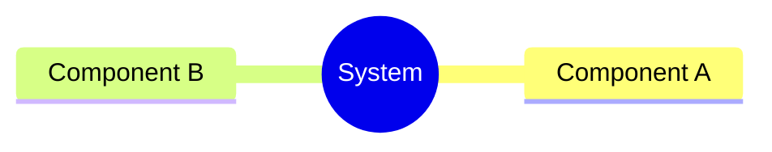
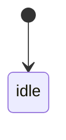
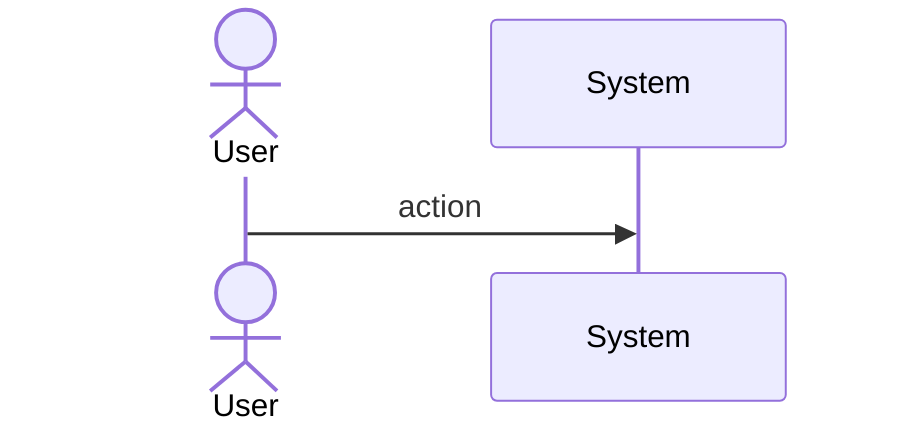
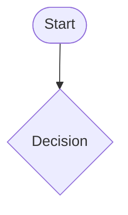
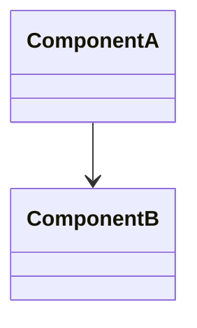
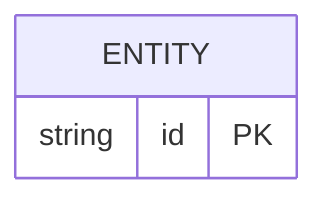

# Sdd Codegen Structural Generators

## Overview
<!-- type: overview lang: markdown -->

Structural generators (Category A) produce 100% deterministic Rust code from Mermaid Plus structural diagram frontmatter. These section types define code structure directly — the mapping from spec to code is mechanical and requires no LLM fill.

| Section Type | Frontmatter Content | Rust Output | Coverage |
|---|---|---|---|
| `schema` | JSON Schema as YAML (properties, types, constraints) | `pub struct T { ... }` with serde derives | 100% |
| `cli` | Command tree (name, args, subcommands) | `#[derive(Subcommand)] pub enum Commands { ... }` | 100% |
| `rpc-api` | OpenRPC 1.3 methods (params, result) | `async fn method(params) -> Result<T>` signatures | 90% |
| `db-model` | ERD entities with fields, types, relationships | `pub struct T { ... }` + sqlx model attributes | 100% |
| `class` | Classes with fields, methods, inheritance | `pub struct T { ... }` + trait impls | 100% |
| `config` | Config schema (JSON Schema as YAML) | serde struct + `Default` impl + loader fn | 100% |
| `rest-api` | OpenAPI 3.1 paths + operations | Axum route handler signatures + type definitions | 90% |

All structural generators:
- Read abstract type system (from `sdd-codegen-type-system`) to translate YAML types to Rust types
- Write output inside CODEGEN-BEGIN/END blocks (via `sdd-codegen-marker-system`)
- Apply config layering: global `config.toml` defaults → per-spec `x-rust:` overrides
- Support `score gen apply --dry-run` for preview without writing
## Requirements
<!-- type: requirements lang: mermaid -->

```mermaid
---
id: sdd-codegen-structural-requirements
title: Structural Generators Requirements
requirements:
  R1:
    text: Schema generator produces Rust struct with serde derives from JSON Schema YAML
    type: functional
    priority: high
    risk: low
    verification: test
    notes: |
      Parse properties + types from schema frontmatter.
      Translate abstract types via type system.
      Apply derives from global config (Debug, Clone, PartialEq, Serialize, Deserialize).
      Per-spec overrides via x-rust: derives field.
  R2:
    text: CLI generator produces clap Subcommand enum from CLI tree YAML
    type: functional
    priority: high
    risk: low
    verification: test
    notes: |
      Parse command tree with name, args, subcommands from cli frontmatter.
      Generate #[derive(Subcommand)] enum with per-variant doc comments.
      Args become clap #[arg] struct fields.
  R3:
    text: RPC-API generator produces async fn signatures from OpenRPC YAML
    type: functional
    priority: high
    risk: low
    verification: test
    notes: |
      Parse OpenRPC methods (params + result schema) from rpc-api frontmatter.
      Generate async fn signature with typed parameters and Result<T> return.
      Method body = SPEC-REF marker (90% coverage, body not deterministic).
  R4:
    text: DB-model generator produces Rust struct with sqlx attributes from ERD YAML
    type: functional
    priority: medium
    risk: low
    verification: test
    notes: |
      Parse ERD entities with fields, types, FK relationships from db-model frontmatter.
      Generate pub struct with sqlx::FromRow derive.
      Field types translated via abstract type system.
  R5:
    text: Config generator produces serde config struct with Default from config YAML
    type: functional
    priority: medium
    risk: low
    verification: test
    notes: |
      Parse config schema (JSON Schema as YAML) from config frontmatter.
      Generate pub struct + Default impl using schema defaults.
      Include load() fn with config file path.
  R6:
    text: All structural generators apply config layering
    type: functional
    priority: high
    risk: low
    verification: test
    notes: |
      Priority: global config.toml defaults < per-spec x-rust: overrides < per-file CODEGEN markers.
      Global defaults: derives, serde_rename_strategy, visibility.
      Per-spec x-rust: overrides any global default.
---
requirementDiagram
    requirement R1 {
      id: R1
      text: Schema -> Rust struct
      risk: low
      verifymethod: test
    }
    requirement R2 {
      id: R2
      text: CLI -> clap enum
      risk: low
      verifymethod: test
    }
    requirement R3 {
      id: R3
      text: RPC-API -> fn signatures
      risk: low
      verifymethod: test
    }
    requirement R4 {
      id: R4
      text: DB-model -> sqlx struct
      risk: low
      verifymethod: test
    }
    requirement R5 {
      id: R5
      text: Config -> serde struct
      risk: low
      verifymethod: test
    }
    requirement R6 {
      id: R6
      text: Config layering
      risk: low
      verifymethod: test
    }
```
## Scenarios
<!-- type: scenarios lang: yaml -->

```yaml
scenarios: []
```

## Diagrams
<!-- type: doc lang: markdown -->

### Mindmap
<!-- type: mindmap lang: mermaid -->
<!-- TODO: Use Mermaid Plus mindmap (YAML frontmatter inside mermaid block).

-->

### State Machine
<!-- type: state-machine lang: mermaid -->
<!-- TODO: Use Mermaid Plus stateDiagram-v2 (YAML frontmatter inside mermaid block).

-->

### Interaction
<!-- type: interaction lang: mermaid -->
<!-- TODO: Use Mermaid Plus sequenceDiagram (YAML frontmatter inside mermaid block).

-->

### Logic
<!-- type: logic lang: mermaid -->
<!-- TODO: Use Mermaid Plus flowchart (YAML frontmatter inside mermaid block).

-->

### Dependencies
<!-- type: dependency lang: mermaid -->
<!-- TODO: Use Mermaid Plus classDiagram (YAML frontmatter inside mermaid block).

-->

### Data Model
<!-- type: db-model lang: mermaid -->
<!-- TODO: Use Mermaid Plus erDiagram (YAML frontmatter inside mermaid block).

-->

## API Spec
<!-- type: doc lang: markdown -->

### REST API
<!-- type: rest-api lang: yaml -->
<!-- score-td-placeholder -->

### RPC API
<!-- type: rpc-api lang: yaml -->
<!-- TODO: OpenRPC 1.3 as YAML. Example:
```yaml
openrpc: "1.3.2"
info:
  title: Service Name
  version: "1.0.0"
methods: []
```
-->

### Async API
<!-- type: async-api lang: yaml -->
<!-- score-td-placeholder -->

### CLI
<!-- type: cli lang: yaml -->
<!-- score-td-placeholder -->

### Schema
<!-- type: schema lang: yaml -->
<!-- TODO: JSON Schema as YAML. Example:
```yaml
"$schema": "https://json-schema.org/draft/2020-12/schema"
type: object
properties:
  id:
    type: string
required: [id]
```
-->

### Config
<!-- type: config lang: yaml -->
<!-- score-td-placeholder -->

## Test Plan
<!-- type: test-plan lang: mermaid -->

<!-- TODO: Use Mermaid Plus requirementDiagram with element nodes and verifies relationships.
```mermaid
---
id: test-plan
---
requirementDiagram

element T1 {
  type: "Test"
}

element T2 {
  type: "Test"
}

T1 - verifies -> R1
T2 - verifies -> R2
```
-->

## Changes
<!-- type: changes lang: yaml -->

```yaml
changes:
  - path: projects/agentic-workflow/src/generate/gen/rust/schema.rs
    section: source
    action: create
    impl_mode: hand-written
    description: |
      Schema generator: JSON Schema YAML -> Rust struct with serde derives.
      pub fn gen_schema(content: &SchemaContent, config: &RustConfig) -> String
  - path: projects/agentic-workflow/src/generate/gen/rust/cli.rs
    section: source
    action: create
    impl_mode: hand-written
    description: |
      CLI generator: CLI tree YAML -> clap Subcommand enum.
      pub fn gen_cli(content: &CliContent, config: &RustConfig) -> String
  - path: projects/agentic-workflow/src/generate/gen/rust/rpc_api.rs
    section: source
    action: create
    impl_mode: hand-written
    description: |
      RPC-API generator: OpenRPC YAML -> async fn signatures + dispatch skeleton.
      pub fn gen_rpc_api(content: &RpcApiContent, config: &RustConfig) -> String
  - path: projects/agentic-workflow/src/generate/gen/rust/db_model.rs
    section: source
    action: create
    impl_mode: hand-written
    description: |
      DB-model generator: ERD YAML -> Rust struct with sqlx::FromRow derive.
      pub fn gen_db_model(content: &DbModelContent, config: &RustConfig) -> String
  - path: projects/agentic-workflow/src/generate/gen/rust/config.rs
    section: source
    action: create
    impl_mode: hand-written
    description: |
      Config generator: config schema YAML -> serde struct + Default + loader fn.
      pub fn gen_config(content: &ConfigContent, config: &RustConfig) -> String
  - path: projects/agentic-workflow/src/generate/gen/rust/mod.rs
    section: source
    action: create
    impl_mode: hand-written
    description: |
      Root module for Rust generators. Exports all generator fns.
      pub mod schema; pub mod cli; pub mod rpc_api; pub mod db_model; pub mod config;
      pub mod state_machine; pub mod interaction; pub mod logic;
      pub mod requirement; pub mod test_plan; pub mod scenario;
  - path: projects/agentic-workflow/src/generate/gen/mod.rs
    section: source
    action: create
    impl_mode: hand-written
    description: |
      Root module for language generators. pub mod rust;
  - path: projects/agentic-workflow/src/generate/types.rs
    section: source
    action: modify
    impl_mode: hand-written
    description: |
      Defines RustConfig defaults and per-spec x-rust overrides used by structural generators.
  - path: projects/agentic-workflow/src/generate/mod.rs
    section: source
    action: modify
    impl_mode: hand-written
    description: Add pub mod gen to existing module.
  - action: annotate
    section: async-api
    impl_mode: hand-written
    description: "Traceability metadata edge for the async-api section."

  - action: annotate
    section: cli
    impl_mode: hand-written
    description: "Traceability metadata edge for the cli section."

  - action: annotate
    section: component
    impl_mode: hand-written
    description: "Traceability metadata edge for the component section."

  - action: annotate
    section: config
    impl_mode: hand-written
    description: "Traceability metadata edge for the config section."

  - action: annotate
    section: db-model
    impl_mode: hand-written
    description: "Traceability metadata edge for the db-model section."

  - action: annotate
    section: dependency
    impl_mode: hand-written
    description: "Traceability metadata edge for the dependency section."

  - action: annotate
    section: design-token
    impl_mode: hand-written
    description: "Traceability metadata edge for the design-token section."

  - action: annotate
    section: interaction
    impl_mode: hand-written
    description: "Traceability metadata edge for the interaction section."

  - action: annotate
    section: logic
    impl_mode: hand-written
    description: "Traceability metadata edge for the logic section."

  - action: annotate
    section: mindmap
    impl_mode: hand-written
    description: "Traceability metadata edge for the mindmap section."

  - action: annotate
    section: requirements
    impl_mode: hand-written
    description: "Traceability metadata edge for the requirements section."

  - action: annotate
    section: rest-api
    impl_mode: hand-written
    description: "Traceability metadata edge for the rest-api section."

  - action: annotate
    section: rpc-api
    impl_mode: hand-written
    description: "Traceability metadata edge for the rpc-api section."

  - action: annotate
    section: scenarios
    impl_mode: hand-written
    description: "Traceability metadata edge for the scenarios section."

  - action: annotate
    section: schema
    impl_mode: hand-written
    description: "Traceability metadata edge for the schema section."

  - action: annotate
    section: state-machine
    impl_mode: hand-written
    description: "Traceability metadata edge for the state-machine section."

  - action: annotate
    section: unit-test
    impl_mode: hand-written
    description: "Traceability metadata edge for the unit-test section."

  - action: annotate
    section: wireframe
    impl_mode: hand-written
    description: "Traceability metadata edge for the wireframe section."

```
## Wireframe
<!-- type: wireframe lang: yaml -->

```yaml
wireframes: []
```

## Component
<!-- type: component lang: yaml -->

```yaml
components: []
```

## Design Token
<!-- type: design-token lang: yaml -->

```yaml
tokens: []
```

## Doc
<!-- type: doc lang: markdown -->

<!-- TODO -->
