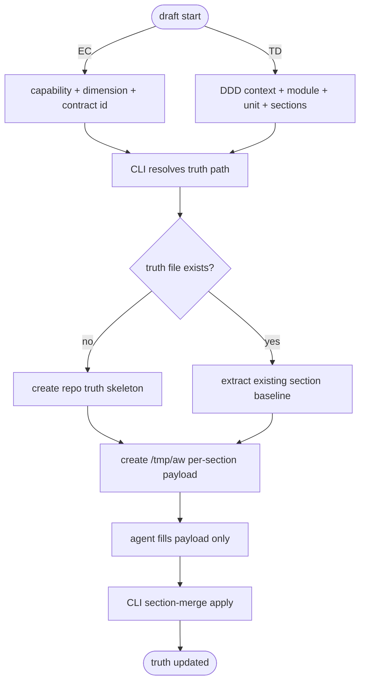

# EC and TD Draft Skeletons

## Logic
<!-- type: logic lang: mermaid -->



The durable source of truth and the agent work payload are separate artifacts.
The source-of-truth skeleton is a repo file and must use Agentic Workflow
section types in `fill_sections`; it is not free-form prose. The payload
skeleton is temporary, per-section, and belongs under `/tmp/aw`.

EC truth paths are capability-first because EC is product truth:

```text
<project-root>/external-contracts/<capability>/<dimension>/<contract-id>.md
```

TD truth paths are DDD implementation-unit-first because TD is codegen truth:

```text
<td_path>/<context>/<module>/<unit>.md
```

Agents choose the semantic parameters. The CLI validates those parameters and
calculates the actual path. Agent-facing start commands should prefer semantic
params over raw path params; raw path overrides are debug/compatibility tools.

Existing truth files are never overwritten by default. If the requested EC or TD
truth file already exists, draft-start extracts the requested section into the
temporary payload as the editable baseline. Apply replaces only that section and
preserves the rest of the truth file.

Current section-type state:

- `SectionType` is the canonical section registry.
- Every section type has `as_str`, `fill_order`, and `default_lang`.
- Current generic TD payload initialization can scaffold a typed heading,
  annotation, and fenced `(fill)` body for supported section types.
- Not every section type has a domain-aware parameterized skeleton yet.
- Every section type should be parameterizable in principle. A section without a
  typed parameter schema is an implementation gap, not a special case.
- Parameterized skeleton work should move into a registry keyed by
  `SectionType`, so truth skeleton and payload skeleton rendering share the same
  source.
- Agent payload wire format is always JSON. The CLI converts JSON payloads into
  YAML when writing repo truth sections.
- Mermaid Plus sections accept JSON payload IR from agents. The CLI converts
  that JSON to YAML frontmatter and then renders the Mermaid syntax body from
  the same typed payload. Agents should not hand-author rendered Mermaid graph
  text.

Required next shape:

- EC `e2e-test` and `tool-contract` skeletons are parameterized by
  capability, dimension, contract id, command, and tool.
- TD skeletons are parameterized by DDD context, module, unit, selected
  `fill_sections`, EC refs, and optional WI refs.
- Section renderers must be per-section functions rather than ad hoc strings in
  the draft command.
- Sections without parameterized renderers may use the generic typed skeleton,
  but the command output must mark them as incomplete payloads, not fulfilled
  evidence.
- All `/tmp/aw` payloads use JSON, regardless of the repo truth section's
  default language.
- Apply converts JSON payloads to the repo truth representation:
  `markdown` sections render Markdown, `yaml` sections render YAML fences,
  source-unit sections render source fences, and Mermaid Plus sections render a
  `mermaid` fence containing YAML frontmatter plus generated Mermaid syntax.
- Mermaid Plus renderers split author input from rendered output: `/tmp/aw`
  payloads contain JSON IR only, and apply renders the repo truth section.

## Unit Test

```mermaid
---
id: ec_td_draft_skeleton_tests
requirements:
  semantic_path_resolution:
    id: R1
    text: "EC and TD draft-start commands accept semantic params and the CLI resolves durable truth paths."
    kind: functional
    risk: high
    verify: test
  tmp_payloads:
    id: R2
    text: "Draft-start commands create one /tmp/aw payload skeleton per requested section."
    kind: functional
    risk: high
    verify: test
  no_truth_overwrite:
    id: R3
    text: "Existing truth files are not overwritten; section payloads are initialized from current section content."
    kind: functional
    risk: high
    verify: test
  section_registry:
    id: R4
    text: "Truth skeletons use only AW SectionType entries in fill_sections."
    kind: functional
    risk: medium
    verify: test
elements:
  ec_draft_resolves_capability_dimension_path:
    kind: test
    type: "rs/#[test]"
  td_draft_resolves_ddd_unit_path:
    kind: test
    type: "rs/#[test]"
  draft_payloads_are_tmp_and_per_section:
    kind: test
    type: "rs/#[test]"
  existing_truth_initializes_payload_from_section:
    kind: test
    type: "rs/#[test]"
  fill_sections_reject_unknown_section_types:
    kind: test
    type: "rs/#[test]"
relations:
  - { from: ec_draft_resolves_capability_dimension_path, verifies: semantic_path_resolution }
  - { from: td_draft_resolves_ddd_unit_path, verifies: semantic_path_resolution }
  - { from: draft_payloads_are_tmp_and_per_section, verifies: tmp_payloads }
  - { from: existing_truth_initializes_payload_from_section, verifies: no_truth_overwrite }
  - { from: fill_sections_reject_unknown_section_types, verifies: section_registry }
---
requirementDiagram
  requirement R1 {
    id: R1
    text: "semantic params resolve durable truth paths"
    risk: high
    verifymethod: test
  }
  requirement R2 {
    id: R2
    text: "per-section payloads live under /tmp/aw"
    risk: high
    verifymethod: test
  }
  requirement R3 {
    id: R3
    text: "existing truth files are not overwritten"
    risk: high
    verifymethod: test
  }
  requirement R4 {
    id: R4
    text: "fill_sections use SectionType entries"
    risk: medium
    verifymethod: test
  }
  element ec_draft_resolves_capability_dimension_path {
    type: "rs/#[test]"
  }
  element td_draft_resolves_ddd_unit_path {
    type: "rs/#[test]"
  }
  element draft_payloads_are_tmp_and_per_section {
    type: "rs/#[test]"
  }
  element existing_truth_initializes_payload_from_section {
    type: "rs/#[test]"
  }
  element fill_sections_reject_unknown_section_types {
    type: "rs/#[test]"
  }
  ec_draft_resolves_capability_dimension_path - verifies -> R1
  td_draft_resolves_ddd_unit_path - verifies -> R1
  draft_payloads_are_tmp_and_per_section - verifies -> R2
  existing_truth_initializes_payload_from_section - verifies -> R3
  fill_sections_reject_unknown_section_types - verifies -> R4
```

<!-- type: unit-test lang: mermaid -->


