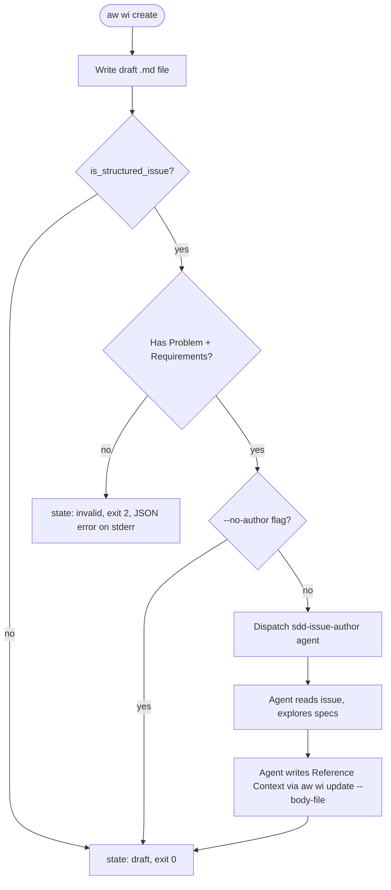

# Issues Cli Crud Spec

## Overview
<!-- type: overview lang: markdown -->

Extends the `aw wi` CLI and the underlying `IssueBackend` trait with full CRUD + search capabilities. The existing MVP (list/show/sync, read-only) becomes a complete lifecycle management interface that agents use to create, update, close, and search issues across local files, GitHub, and GitLab — all through a single uniform CLI.

### Architecture

**Arsenal layer** (`projects/agentic-workflow/src/issues/`):
- `IssueBackend` trait gains 4 new methods: `create`, `update`, `close`, `search`
- `LocalBackend` implements all via frontmatter read/write
- `GitHubBackend` shells out to `gh issue create/edit/close/list --search`
- New `GitLabBackend` shells out to `glab` (pattern from `fetch_issues.rs::fetch_issue_glab`)
- `IssuePatch` struct for partial updates (only changed fields)
- `Issue` frontmatter gains `related:` and `implements:` cross-reference fields

**Show case layer** (`projects/agentic-workflow/src/cli/issues.rs`):
- 4 new subcommands: `create`, `update`, `close`, `find`
- All verbs have `--json` output (agent-first)
- Structured JSON error output on stderr with exit codes
- `create` uses local lifecycle state plus config-driven push-through to the configured issue backend
- `update` uses `--body-file` for full body replacement (no patch)

### Agent-First Design

Score is an agent development tool. The CLI is designed for Claude Code agents, not humans:
- Every verb outputs `--json` for structured parsing
- No interactive prompts (`dialoguer`) anywhere
- Input via `--body-file -` (stdin pipe) for large content
- Structured errors: `{"error": "message", "code": "NOT_FOUND"}` on stderr
- Exit codes: 0=success, 1=not found, 2=validation error, 3=backend error

### Cross-Artifact References

Issue frontmatter gains two optional fields:
- `related: [slug-or-path, ...]` — soft "see also" links to other issues, BRDs, PRDs
- `implements: [slug-or-path, ...]` — hard links to changes, tech_designs that realize this issue

Validation is warn-at-list-time only — broken references don't block writes.
## Requirements
<!-- type: requirements lang: mermaid -->

```mermaid
---
id: issues-backend-requirements
title: Issues Backend CRUD Requirements
requirements:
  R1:
    text: "aw wi create — local lifecycle draft + config-driven remote push-through"
    type: functional
    priority: high
    risk: low
    verification: test
    notes: |
      `create --title T --type bug --body B` writes `.aw/issues/bug-T.md` with `state: draft`.
      Push-through to GitHub/GitLab is resolved from `.aw/config.toml`; there is no public remote selector.
      `--json` returns the `Issue` struct.
  R2:
    text: "aw wi update — metadata + body patch"
    type: functional
    priority: high
    risk: low
    verification: test
    notes: |
      `update <slug> --title T2 --add-label L` rewrites frontmatter.
      `--body-file path` replaces body entirely.
      `--push` syncs to GitHub via `gh issue edit`.
  R3:
    text: "aw wi close — close with reason"
    type: functional
    priority: medium
    risk: low
    verification: test
    notes: |
      `close <slug> --reason R` sets `state: closed` locally.
      `--push` calls `gh issue close`.
  R4:
    text: "aw wi find <query> — full-text search"
    type: functional
    priority: medium
    risk: low
    verification: test
    notes: |
      Local: grep across all `.aw/issues/*.md`.
      GitHub: `gh issue list --search`.
      Returns array of matching Issues sorted by relevance.
  R5:
    text: Cross-artifact references
    type: functional
    priority: medium
    risk: low
    verification: test
    notes: |
      Issue frontmatter gains `related: [...]` and `implements: [...]` optional fields.
      Broken references warned at list time, not at write time.
  R6:
    text: GitLab backend
    type: functional
    priority: low
    risk: medium
    verification: test
    notes: |
      `make_backend("gitlab", ...)` returns `GitLabBackend` that shells out to
      `glab issue {list,view,create,edit,close}`. Tested with mocked glab output.
  R7:
    text: Agent-first design (all verbs)
    type: interface
    priority: high
    risk: low
    verification: test
    notes: |
      `--json` on every verb. No dialoguer prompts. Structured JSON errors on stderr.
      Exit codes: 0=ok, 1=not_found, 2=validation, 3=backend. `--body-file -` for stdin.
  R8:
    text: IssueBackend trait extension
    type: interface
    priority: high
    risk: medium
    verification: test
    notes: |
      Trait gains: create(&Issue) -> Issue, update(&str, &IssuePatch) -> Issue,
      close(&str, Option<&str>), search(&str) -> Vec<Issue>.
      Local + GitHub + GitLab implement all. Jira stays todo!().
  R9:
    text: Write-time validation on create
    type: functional
    priority: high
    risk: medium
    verification: test
    notes: |
      Parse body with `is_structured_issue()` and validate required sections.
      On failure: exit code 2, JSON error on stderr, state: invalid.
  R10:
    text: sdd-issue-author agent dispatch on create
    type: functional
    priority: medium
    risk: medium
    verification: test
    notes: |
      After successful create with valid sections, dispatch sdd-issue-author agent
      to fill Reference Context. Dispatch automatic when `--no-author` absent.
---
requirementDiagram
    requirement R1 {
      id: R1
      text: aw wi create — local draft + optional GitHub push
      risk: low
      verifymethod: test
    }
    requirement R2 {
      id: R2
      text: aw wi update — metadata + body patch
      risk: low
      verifymethod: test
    }
    requirement R3 {
      id: R3
      text: aw wi close — close with reason
      risk: low
      verifymethod: test
    }
    requirement R4 {
      id: R4
      text: aw wi find — full-text search
      risk: low
      verifymethod: test
    }
    requirement R5 {
      id: R5
      text: Cross-artifact references
      risk: low
      verifymethod: test
    }
    requirement R6 {
      id: R6
      text: GitLab backend
      risk: medium
      verifymethod: test
    }
    requirement R7 {
      id: R7
      text: Agent-first design
      risk: low
      verifymethod: test
    }
    requirement R8 {
      id: R8
      text: IssueBackend trait extension
      risk: medium
      verifymethod: test
    }
    requirement R9 {
      id: R9
      text: Write-time validation on create
      risk: medium
      verifymethod: test
    }
    requirement R10 {
      id: R10
      text: sdd-issue-author agent dispatch on create
      risk: medium
      verifymethod: test
    }
```

## Scenarios
<!-- type: scenarios lang: yaml -->

```yaml
scenarios:
  S1:
    name: Create local draft issue
    verifies: [R1, R7]
    given: |
      User runs `aw wi create --title "Fix login bug" --type bug --body "Login fails on Safari"`
    when: The command completes
    then: |
      - `.aw/issues/bug-fix-login-bug.md` exists
      - frontmatter: type=bug, state=draft, id=null, title="Fix login bug"
      - body: "Login fails on Safari"
      - exit code 0
      - --json returns {"type":"bug","title":"Fix login bug","state":"draft","id":null,...}
  S2:
    name: Create push-through uses configured GitHub backend
    verifies: [R1]
    given: "`gh auth status` is authenticated"
    when: |
      User runs `aw wi create --title "New feature" --type enhancement --body "..."`
    then: |
      - configured backend push-through calls gh issue create
      - Local file updated with id and url populated from GitHub response
      - state: open
  S3:
    name: Update metadata locally
    verifies: [R2]
    given: "`.aw/issues/bug-fix-login-bug.md` exists with state: draft"
    when: |
      User runs `aw wi update bug-fix-login-bug --add-label priority:p1 --state open`
    then: |
      - frontmatter gains priority:p1 in labels
      - state: open
      - body unchanged
  S4:
    name: Update body via --body-file
    verifies: [R2]
    given: A file /tmp/new-body.md with updated content
    when: "`aw wi update bug-fix-login-bug --body-file /tmp/new-body.md`"
    then: |
      - body fully replaced
      - frontmatter unchanged
  S5:
    name: Close with reason
    verifies: [R3]
    given: "bug-fix-login-bug.md exists with state: open"
    when: "`aw wi close bug-fix-login-bug --reason \"Fixed in PR #42\"`"
    then: |
      - frontmatter state: closed
      - body unchanged
      - exit 0
      - --json returns closed issue
  S6:
    name: Close with --push syncs to GitHub
    verifies: [R3]
    given: "Issue has id: 1234 (synced to GitHub)"
    when: "`aw wi close bug-fix-login-bug --push --reason \"Resolved\"`"
    then: |
      - `gh issue close 1234 --comment "Resolved"` is called
      - Local state updated
  S7:
    name: Find across local backend
    verifies: [R4]
    given: "3 issues in .aw/issues/: bug-login, enhancement-oauth, epic-auth"
    when: "`aw wi find \"auth\"`"
    then: |
      - Returns enhancement-oauth and epic-auth (body/title match "auth")
      - bug-login excluded
      - --json returns array
  S8:
    name: Find across GitHub backend
    verifies: [R4]
    given: GitHub backend configured
    when: "`aw wi find \"auth\"`"
    then: |
      - Runs `gh issue list --search "auth" --json ...`
      - Returns matching issues
  S9:
    name: Cross-references at list time
    verifies: [R5]
    given: |
      bug-fix-login.md has `related: [epic-auth]` and epic-auth.md exists.
      Separately, bug-fix-login.md has `related: [nonexistent-slug]`.
    when: "`aw wi list`"
    then: |
      - Valid reference: no warnings, both issues listed
      - Invalid reference: warning printed "broken reference 'nonexistent-slug' in bug-fix-login"
  S10:
    name: GitLab backend list
    verifies: [R6]
    given: "config has [agentic_workflow.issue_platform] type = \"gitlab\""
    when: "`aw wi list`"
    then: |
      - `glab issue list --output json` is called
      - Issues parsed and returned
  S11:
    name: Structured error output
    verifies: [R7]
    given: No issue named nonexistent-slug
    when: "`aw wi show nonexistent-slug --json`"
    then: |
      - stderr: {"error":"issue 'nonexistent-slug' not found","code":"NOT_FOUND"}
      - exit code 1
  S12:
    name: Create validates structured issue sections
    verifies: [R9, R7]
    given: |
      User runs create with body containing `## Problem` and `## Scope` but no `## Requirements`
    when: The command completes
    then: |
      - Draft file written but is_structured_issue() detects missing ## Requirements
      - exit code 2
      - stderr: {"error":"missing required sections","code":"VALIDATION_ERROR","missing":["Requirements"]}
      - frontmatter state: invalid
  S13:
    name: Create with valid sections dispatches sdd-issue-author
    verifies: [R10]
    given: |
      User runs create with body containing `## Problem`, `## Requirements`, `## Scope`
    when: The command completes with valid structured sections
    then: |
      - Draft written with state: draft
      - sdd-issue-author agent dispatched with the issue slug
      - Agent explores .aw/tech-design/ and writes Reference Context back
  S14:
    name: Create with --no-author skips agent dispatch
    verifies: [R10]
    given: User runs create with valid sections and `--no-author`
    when: The command completes
    then: |
      - Draft written with state: draft
      - No sdd-issue-author agent is dispatched
  S15:
    name: IssueBackend trait uniformity
    verifies: [R8]
    given: |
      LocalBackend, GitHubBackend, GitLabBackend all implement IssueBackend
    when: Any code holds `&dyn IssueBackend`
    then: |
      - create, update, close, search, list, get, write are all callable
        without knowing the concrete backend type
```

## Create Flow: Validation + Agent Dispatch
<!-- type: logic lang: mermaid -->


## Diagrams
<!-- type: diagram lang: mermaid -->

### Interaction
<!-- type: interaction lang: mermaid -->
<!-- score-td-placeholder -->

### Logic
<!-- type: logic lang: mermaid -->
<!-- score-td-placeholder -->

### Dependencies
<!-- type: dependency lang: mermaid -->
<!-- score-td-placeholder -->

### State Machine
<!-- type: state-machine lang: mermaid -->
<!-- score-td-placeholder -->

### Data Model
<!-- type: db-model lang: mermaid -->
<!-- score-td-placeholder -->

## API Spec
<!-- type: api lang: yaml -->

### REST API
<!-- type: rest-api lang: yaml -->
<!-- score-td-placeholder -->

### RPC API
<!-- type: rpc-api lang: json -->
<!-- score-td-placeholder -->

### Async API
<!-- type: async-api lang: yaml -->
<!-- score-td-placeholder -->

### CLI
<!-- type: cli lang: yaml -->
<!-- score-td-placeholder -->

### Schema
<!-- type: schema lang: json -->
<!-- score-td-placeholder -->

### Config
<!-- type: config lang: json -->
<!-- score-td-placeholder -->

## Test Plan
<!-- type: test-plan lang: mermaid -->


<!-- TODO -->

## Changes
<!-- type: changes lang: yaml -->

```yaml
changes:
  - file: projects/agentic-workflow/src/issues/backend.rs
    section: source
    action: modify
    impl_mode: hand-written
    description: Add create, update, close, search methods to IssueBackend trait. Add IssuePatch struct.

  - file: projects/agentic-workflow/src/issues/types.rs
    section: source
    action: modify
    impl_mode: hand-written
    description: Add IssuePatch struct. Add related/implements fields to Issue. Add IssueError enum for structured errors.

  - file: projects/agentic-workflow/src/issues/backends/local.rs
    section: source
    action: modify
    impl_mode: hand-written
    description: Implement create (write draft), update (patch frontmatter + body), close (set state), search (grep content).

  - file: projects/agentic-workflow/src/issues/backends/github.rs
    section: source
    action: modify
    impl_mode: hand-written
    description: Implement create (gh issue create), update (gh issue edit), close (gh issue close), search (gh issue list --search). Mark is_writable=true.

  - file: projects/agentic-workflow/src/issues/backends/gitlab.rs
    section: source
    action: create
    impl_mode: hand-written
    description: New GitLabBackend — shells out to glab CLI. Implements full IssueBackend trait. Pattern from fetch_issues.rs::fetch_issue_glab.

  - file: projects/agentic-workflow/src/issues/backends/mod.rs
    section: source
    action: modify
    impl_mode: hand-written
    description: Add pub mod gitlab. Re-export GitLabBackend.

  - file: projects/agentic-workflow/src/issues/mod.rs
    section: source
    action: modify
    impl_mode: hand-written
    description: Update make_backend to return GitLabBackend for "gitlab". Re-export new types.

  - file: projects/agentic-workflow/src/cli/issues.rs
    action: modify
    section: logic
    impl_mode: hand-written
    description: Add Create, Update, Close, Find subcommands. Structured error handling with exit codes. --body-file support for stdin pipe.

  - file: projects/agentic-workflow/src/cli/commands.rs
    action: no-change
    section: cli
    impl_mode: hand-written
    description: Issues already wired. No change needed.
  - action: annotate
    section: async-api
    impl_mode: hand-written
    description: "Traceability metadata edge for the async-api section."

  - action: annotate
    section: config
    impl_mode: hand-written
    description: "Traceability metadata edge for the config section."

  - action: annotate
    section: db-model
    impl_mode: hand-written
    description: "Traceability metadata edge for the db-model section."

  - action: annotate
    section: dependency
    impl_mode: hand-written
    description: "Traceability metadata edge for the dependency section."

  - action: annotate
    section: interaction
    impl_mode: hand-written
    description: "Traceability metadata edge for the interaction section."

  - action: annotate
    section: requirements
    impl_mode: hand-written
    description: "Traceability metadata edge for the requirements section."

  - action: annotate
    section: rest-api
    impl_mode: hand-written
    description: "Traceability metadata edge for the rest-api section."

  - action: annotate
    section: rpc-api
    impl_mode: hand-written
    description: "Traceability metadata edge for the rpc-api section."

  - action: annotate
    section: scenarios
    impl_mode: hand-written
    description: "Traceability metadata edge for the scenarios section."

  - action: annotate
    section: schema
    impl_mode: hand-written
    description: "Traceability metadata edge for the schema section."

  - action: annotate
    section: state-machine
    impl_mode: hand-written
    description: "Traceability metadata edge for the state-machine section."

  - action: annotate
    section: unit-test
    impl_mode: hand-written
    description: "Traceability metadata edge for the unit-test section."

```
## Doc
<!-- type: doc lang: markdown -->

<!-- TODO -->

## Changes (issue-lifecycle-crr)
<!-- type: changelog lang: markdown -->

### New IssuePatch Fields

`IssuePatch` now carries all workflow fields for the dual-write from StateManager:

| Field | Type | Purpose |
|-------|------|---------|
| `change_id` | `Option<String>` | Link to `.aw/changes/{id}/` |
| `iteration` | `Option<u32>` | Re-proposal counter |
| `current_task_id` | `Option<String>` | Active workflow task |
| `impl_spec_phase` | `Option<HashMap<String, String>>` | Per-spec impl tracking |
| `task_revisions` | `Option<HashMap<String, u32>>` | Per-task revision counts |
| `revision_counts` | `Option<HashMap<String, u32>>` | Per-artifact CRR counts |
| `last_action` | `Option<String>` | Last workflow action |
| `session_id` | `Option<String>` | Session identifier |
| `validation_errors` | `Option<Vec<String>>` | CRR validation errors |

When `IssuePatch::apply()` is called, these fields are applied to the Issue. Transient fields (iteration, current_task_id, impl_spec_phase, task_revisions, revision_counts, last_action, session_id, validation_errors) are first cleared before applying the patch values, ensuring stale data does not persist.

### `aw wi validate <slug>` CLI Subcommand

New subcommand that runs `validate_issue_quality()` against an issue body:

```yaml
commands:
  score:
    issues:
      validate:
        description: "Run CRR quality validation on an issue; auto-promotes draft to open on pass"
        args:
          slug:
            type: string
            required: true
        flags:
          --json:
            type: bool
            description: "Output validation result as structured JSON"
        behavior:
          - Load issue from .aw/issues/open/{slug}.md
          - Run validate_issue_quality() checks
          - On pass: if state=draft, promote to state=open; clear validation_errors
          - On fail: store errors in validation_errors frontmatter field
        exit_codes:
          0: "Validation passed (issue promoted to open if was draft)"
          2: "Validation failed (errors stored in frontmatter)"
```

### Draft-to-Open Auto-Promotion

When `aw wi validate <slug>` passes all quality checks:
- If the issue is in `state: draft`, it is automatically promoted to `state: open`
- The `validation_errors` field is cleared
- This is the only path from draft to open -- manual state changes are not supported for this transition in the SDD workflow
