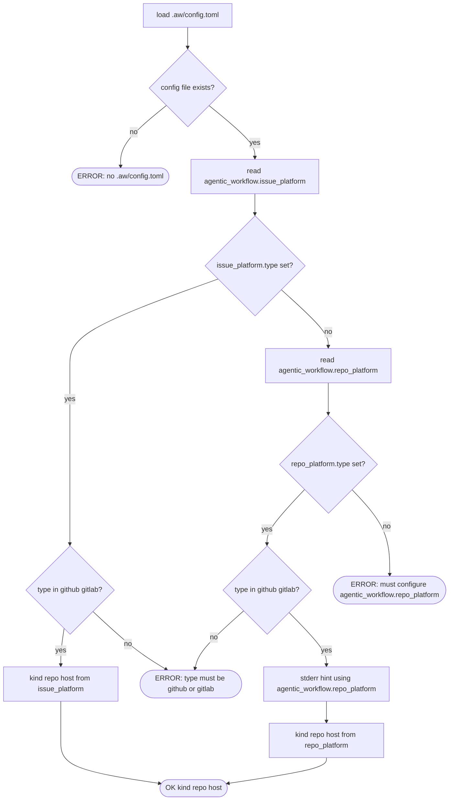

## Resolution Logic
<!-- type: logic lang: mermaid -->



## CLI Surface
<!-- type: cli lang: yaml -->

```yaml
$schema: "http://json-schema.org/draft-07/schema#"
title: score-issues-cli-backend-flag
type: object
properties:
  backend_kind:
    type: string
    enum: [local, github, gitlab]
    description: "Resolved backend kind string passed to make_backend."

  list_args:
    type: object
    description: "aw wi list — flags relevant to this refactor."
    properties:
      backend:
        type: ["string", "null"]
        enum: [local, github, gitlab, null]
        default: null
        description: "Optional. None triggers config-driven resolution."
      json:
        type: boolean
        default: false
      quiet:
        type: boolean
        default: false
        description: "Suppress fallback-hint stderr line."

  show_args:
    type: object
    properties:
      id:
        type: string
        description: "Positional issue identifier."
      backend:
        type: ["string", "null"]
        enum: [local, github, gitlab, null]
        default: null
      json:
        type: boolean
        default: false

  create_args:
    type: object
    description: "aw wi create — no ad-hoc backend selector; lifecycle writes the repo working copy and push-through resolves backend from config."
    properties:
      title: {type: string}
      type: {type: string}
      label:
        type: array
        items: {type: string}
        default: []

  search_args:
    type: object
    properties:
      query:
        type: string
        description: "Positional query string."
      backend:
        type: ["string", "null"]
        enum: [local, github, gitlab, null]
        default: null

  resolve_default_backend:
    type: object
    description: "Helper added to projects/agentic-workflow/src/issues/mod.rs."
    properties:
      signature:
        type: string
        const: "fn resolve_default_backend(project_root: &Path) -> Result<(String, Option<String>, Option<String>)>"
      returns:
        type: array
        items: [{type: string}]
        description: "(kind, repo, host) — repo and host carry through to backend constructor."
      errors:
        type: array
        items: {type: string}
        const:
          - "no .aw/config.toml found at project_root"
          - "must configure [agentic_workflow.repo_platform] in .aw/config.toml"
          - "platform type must be github or gitlab, got: <value>"

  make_backend:
    type: object
    description: "Existing factory in projects/agentic-workflow/src/issues/mod.rs — signature extended."
    properties:
      old_signature:
        type: string
        const: "fn make_backend(kind: &str, project_root: &Path, repo: Option<String>) -> Result<Box<dyn IssueBackend>>"
      new_signature:
        type: string
        const: "fn make_backend(kind: &str, project_root: &Path, repo: Option<String>, host: Option<String>) -> Result<Box<dyn IssueBackend>>"

required: [backend_kind, list_args, show_args, create_args, search_args, resolve_default_backend, make_backend]
```

## Test Plan
<!-- type: test-plan lang: mermaid -->

```mermaid
---
id: backend_resolution_test_plan
requirements:
  R1: {text: "resolve_default_backend returns kind+repo+host from issue_platform else repo_platform else error", risk: medium, verifymethod: test}
  R2: {text: "config-resolved type must be github or gitlab; local rejected", risk: low, verifymethod: test}
  R3: {text: "Public work-item verbs expose no backend selector; backend resolution comes from config", risk: medium, verifymethod: test}
  R4: {text: "RepoPlatformConfig gains host Option String with serde default", risk: low, verifymethod: test}
  R5: {text: "PlatformConfig gains host Option String mirror of R4", risk: low, verifymethod: test}
  R6: {text: "make_backend accepts host parameter threaded into github gitlab constructors", risk: medium, verifymethod: test}
  R7: {text: "stderr hint emitted on fallback suppressed under quiet or json", risk: low, verifymethod: inspection}
  R8: {text: "five worktree internal LocalBackend callsites untouched", risk: high, verifymethod: inspection}
  R9: {text: "stale doc comment in mod.rs and CLAUDE.md envelope section updated", risk: low, verifymethod: inspection}
  R10: {text: "resolve_default_backend has tests for paths a through e", risk: low, verifymethod: test}
  R11: {text: "no Phase B or Phase C work bleeds into this PR", risk: high, verifymethod: inspection}
tests:
  T1: {text: "issue_platform set returns its values", type: unit, verifies: [R1, R6, R10]}
  T2: {text: "issue_platform absent returns repo_platform values plus stderr hint", type: unit, verifies: [R1, R6, R7, R10]}
  T3: {text: "no config file returns ENOENT-style error", type: unit, verifies: [R10]}
  T4: {text: "config has no platform sections returns must-configure error", type: unit, verifies: [R10]}
  T5: {text: "type=jira or local returns invalid-type error", type: unit, verifies: [R2, R10]}
  T6: {text: "issue_platform without repo inherits from repo_platform.repo", type: unit, verifies: [R1]}
  T7: {text: "issue_platform.host overrides repo_platform.host when both set", type: unit, verifies: [R4, R5]}
  T8: {text: "aw wi list with no flag uses backend resolved from config", type: integration, verifies: [R3]}
  T9: {text: "aw wi create uses local lifecycle plus config-driven push-through", type: integration, verifies: [R3]}
  T10: {text: "loading existing config.toml without host field succeeds", type: unit, verifies: [R4, R5]}
  T11: {text: "fill-section --apply still writes to worktree-local LocalBackend regardless of resolved backend", type: integration, verifies: [R8]}
---
requirementDiagram

requirement R1 {
  id: R1
  text: resolve_default_backend chain
  risk: medium
  verifymethod: test
}
requirement R2 {
  id: R2
  text: reject local in config
  risk: low
  verifymethod: test
}
requirement R3 {
  id: R3
  text: optional backend flag
  risk: medium
  verifymethod: test
}
requirement R4 {
  id: R4
  text: RepoPlatformConfig host
  risk: low
  verifymethod: test
}
requirement R5 {
  id: R5
  text: PlatformConfig host
  risk: low
  verifymethod: test
}
requirement R6 {
  id: R6
  text: make_backend host param
  risk: medium
  verifymethod: test
}
requirement R7 {
  id: R7
  text: fallback hint
  risk: low
  verifymethod: inspection
}
requirement R8 {
  id: R8
  text: preserve worktree LocalBackend
  risk: high
  verifymethod: inspection
}
requirement R9 {
  id: R9
  text: doc refresh
  risk: low
  verifymethod: inspection
}
requirement R10 {
  id: R10
  text: unit tests for resolution paths
  risk: low
  verifymethod: test
}
requirement R11 {
  id: R11
  text: phase boundary
  risk: high
  verifymethod: inspection
}

element T1 {
  type: test
}
element T2 {
  type: test
}
element T3 {
  type: test
}
element T4 {
  type: test
}
element T5 {
  type: test
}
element T6 {
  type: test
}
element T7 {
  type: test
}
element T8 {
  type: test
}
element T9 {
  type: test
}
element T10 {
  type: test
}
element T11 {
  type: test
}

T1 - verifies -> R1
T1 - verifies -> R6
T2 - verifies -> R1
T2 - verifies -> R7
T3 - verifies -> R10
T4 - verifies -> R10
T5 - verifies -> R2
T6 - verifies -> R1
T7 - verifies -> R4
T8 - verifies -> R3
T9 - verifies -> R3
T10 - verifies -> R4
T10 - verifies -> R5
T11 - verifies -> R8
```

## Changes
<!-- type: changes lang: yaml -->

```yaml
$schema: "http://json-schema.org/draft-07/schema#"
title: phase-a-file-change-list
type: object
properties:
  changes:
    type: array
    items:
      type: object
      required: [path, action]
      properties:
        path: {type: string}
        action: {type: string, enum: [edit, add]}
        note: {type: string}
required: [changes]

changes:
  - path: projects/agentic-workflow/src/issues/mod.rs
    section: source
    action: edit
    impl_mode: hand-written
    note: "Add resolve_default_backend(project_root). Extend make_backend signature with host. Drop stale doc comment. Add #[cfg(test)] mod with R10 cases."
  - path: projects/agentic-workflow/src/issues/backend.rs
    section: source
    action: edit
    impl_mode: hand-written
    note: "Thread host if trait constructors take it. Otherwise no-op."
  - path: projects/agentic-workflow/src/issues/backends/github.rs
    section: source
    action: edit
    impl_mode: hand-written
    note: "Constructor accepts host (default github.com); thread to gh CLI / REST URL."
  - path: projects/agentic-workflow/src/issues/backends/gitlab.rs
    section: source
    action: edit
    impl_mode: hand-written
    note: "Constructor accepts host (default gitlab.com); URL-encode repo for nested groups."
  - path: projects/agentic-workflow/src/issues/backends/local.rs
    section: source
    action: edit
    impl_mode: hand-written
    note: "Constructor signature gains host param (ignored)."
  - path: projects/agentic-workflow/src/models/change.rs
    section: source
    action: edit
    impl_mode: hand-written
    note: "Add host: Option<String> to RepoPlatformConfig with serde default."
  - path: projects/agentic-workflow/src/services/platform_sync/config.rs
    section: source
    action: edit
    impl_mode: hand-written
    note: "Add host: Option<String> to PlatformConfig with serde default."
  - path: projects/agentic-workflow/src/cli/issues.rs
    section: source
    action: edit
    impl_mode: hand-written
    note: "ListArgs CreateArgs SearchArgs ShowArgs expose no public backend selector. Resolution helper at top of read verbs uses config; create uses local lifecycle plus config-driven push-through. NOT touching the internal LocalBackend::from_project_root callsites."
  - path: projects/agentic-workflow/CLAUDE.md
    section: doc
    action: edit
    impl_mode: hand-written
    note: "Document the new resolution chain under Score envelope section."
  - path: .aw/config.toml
    section: config
    action: edit
    impl_mode: hand-written
    note: "Add commented-out [agentic_workflow.issue_platform] example."
  - action: annotate
    section: cli
    impl_mode: hand-written
    description: "Traceability metadata edge for the cli section."

  - action: annotate
    section: logic
    impl_mode: hand-written
    description: "Traceability metadata edge for the logic section."

  - action: annotate
    section: unit-test
    impl_mode: hand-written
    description: "Traceability metadata edge for the unit-test section."

```

# Reviews

## Review 1
<!-- type: doc lang: markdown -->
**Verdict:** approved

- [logic] Resolution chain Mermaid Plus is unambiguous: 4 decision nodes (config_present, issue_platform_set, validate_issue_type, repo_platform_set, validate_repo_type) drive 4 terminal states (done, err_no_config, err_no_platform, err_invalid_type). emit_from_issue's label correctly notes that repo falls back to repo_platform when issue_platform.repo is unset, matching test T6.
- [cli] JSON Schema covers the public args structs plus the two helpers (resolve_default_backend, make_backend) with explicit old vs new signatures. backend_kind is now a resolved string from config; public work-item verbs do not expose nullable backend selectors.
- [test-plan] 11 requirements ↔ 11 tests with bidirectional coverage; high-risk R8 (worktree LocalBackend untouched) and R11 (no Phase B/C bleed) verified by inspection, which is appropriate for negative-space invariants. T11 explicitly exercises the R8 boundary.
- [changes] All 10 touch-points from R1-R11 enumerated; notes explicitly call out the R8 boundary on issues.rs ("NOT touching the five LocalBackend::from_project_root callsites"). github.rs note covers Phase A's narrowest valid scope (URL endpoint only, not auth).
