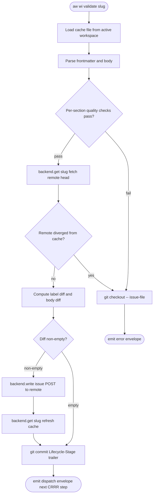

> **Phase C amendment.** This spec was written while old per-change workspaces
> and in-place branch switching were still being compared. Current local cache
> writes happen under the current checkout root returned by `find_project_root()`;
> `[agentic_workflow.workspace]` no longer selects a filesystem root, and linked git checkouts do
> not redirect to a sibling checkout.

Phase C of the branch-lifecycle chain. Two storage substrates exist
today: (1) `LocalBackend` writes `.aw/issues/{open,closed}/<slug>.md`
in the active checkout, (2) `GitHubBackend` / `GitLabBackend`
shell out to `gh` / `glab`. CRRR currently runs entirely on (1); (2) is
read-only at top-level verbs and never participates in the
fill→validate→review loop.

This spec defines the architecture under which the configured remote
backend (`gh` / `glab`) becomes the **source of truth** for issue
state, while local files demote to a **read-through cache** synced on
demand. The design preserves three load-bearing properties of the
current pipeline:

1. **Two-phase commit** — `--apply` is a pure local merge (no network);
   `validate` is the sole point that mutates remote state and commits
   a `Lifecycle-Stage:` trailer. Failure rolls back locally with
   `git checkout --`; the remote is never touched on a failed validate.
2. **CRRR-state round-tripping** — `phase` / `review_count` /
   `flagged_sections` / `fill_retry_count` / `ship_status` /
   `ship_commit` / `slug` survive remote storage via the label-prefix
   scheme defined in `projects/agentic-workflow/issues/labels.md` (encoded directly
   on the GitHub/GitLab issue's label set).
3. **Checkout-as-staging** — branch switching selects the active checkout as
   the local staging surface. This spec is orthogonal to that branch choice;
   all modes use the same apply/validate/push contract.

The single largest open design question (R14: rollback on remote-API
patch failure) collapses to "never push on a failed validate" — i.e.
the apply/validate split already gives us atomic rollback for free,
provided we move the remote push from `--apply` to `validate`.

## Logic
<!-- type: logic lang: mermaid -->



## Test-Plan
<!-- type: test-plan lang: mermaid -->

```mermaid
---
id: remote-as-source-test-plan
---
requirementDiagram

requirement R1_pure_apply {
  id: R1
  text: "aw wi fill-section --apply MUST NOT call any remote API. It merges the section payload into the local cache file in the active workspace and exits."
  risk: high
  verifymethod: test
}

requirement R2_validate_pushes {
  id: R2
  text: "aw wi validate MUST push the merged Issue (body + labels via labels.md scheme) to the configured remote backend AFTER per-section quality checks pass and BEFORE the Lifecycle-Stage trailer is committed. On push failure, validate MUST exit non-zero with the local cache state unchanged."
  risk: high
  verifymethod: test
}

requirement R3_rollback_on_validate_fail {
  id: R3
  text: "If validate's quality checks fail OR the remote push fails, the local cache MUST be reverted via git checkout -- <issue-file>. No remote API call is made on the failure path. The user-visible state is identical to today's local-only model."
  risk: high
  verifymethod: test
}

requirement R4_cache_refresh_after_push {
  id: R4
  text: "After a successful remote push in validate, the local cache MUST be refreshed by re-fetching the issue from remote (backend.get(slug)) and re-serialising to the cache file. This ensures backend-side normalisation (label ordering, body whitespace) round-trips back into git."
  risk: medium
  verifymethod: test
}

requirement R5_cache_optional_for_reads {
  id: R5
  text: "Read verbs (aw wi show / list / find) MUST work with cache absent. They fall back to backend.list / backend.get on cache miss and write through to the cache directory. --backend local short-circuits to the cache (no remote call)."
  risk: low
  verifymethod: test
}

requirement R6_lifecycle_trailer_unchanged {
  id: R6
  text: "Each successful validate MUST commit exactly one trailer-only commit on the active branch carrying the Lifecycle-Stage trailer. Trailer schema and naming (Create / Fill-Requirements / Fill-Scope / Fill-ReferenceContext / Review / Revise / Merge) is unchanged from the local-only model."
  risk: low
  verifymethod: test
}

requirement R7_in_place_mode_compat {
  id: R7
  text: "Current-checkout branch mode MUST keep apply/validate/push behavior stable. The push target is the same remote regardless of which branch wrote the cache."
  risk: medium
  verifymethod: test
}

requirement R8_concurrent_writers_detected {
  id: R8
  text: "If validate detects that the remote issue's labels or body changed since the last cache refresh (concurrent writer via the GitHub UI or another score session), validate MUST exit non-zero with a 'remote diverged' error envelope. No silent overwrite. Operator runs aw wi sync and retries."
  risk: medium
  verifymethod: test
}

requirement R9_label_writes_idempotent {
  id: R9
  text: "Repeated push of identical Issue state MUST be a no-op on remote (label diff is empty, body is byte-equal). gh issue edit / glab issue update is invoked only when the diff is non-empty."
  risk: low
  verifymethod: test
}

requirement R10_backend_local_unchanged {
  id: R10
  text: "score --backend local continues to satisfy the full CRRR contract via LocalBackend.write writing the cache file directly. No push step runs; no remote API is called. All existing local-backend tests pass without modification."
  risk: high
  verifymethod: test
}

requirement R11_mainthread_only {
  id: R11
  text: "The push step runs on mainthread (per Phase 1+2 mainthread-only model). No subagent dispatch is added. Validate dispatches the next CRRR envelope (next section's apply / reviewer / merge) after the push commits."
  risk: low
  verifymethod: inspection
}

requirement R12_envelope_shape_unchanged {
  id: R12
  text: "The dispatch / done / error envelope shapes from issue-cli-envelope.md are unchanged. Only the implementation behind --apply and validate is rewritten."
  risk: low
  verifymethod: inspection
}

requirement R13_no_migrate_worktrees_verb {
  id: R13
  text: "`score migrate-worktrees` MUST NOT exist as a public verb. Current Score commands write only to the active checkout returned by `find_project_root()`."
  risk: medium
  verifymethod: test
}

requirement R14_obsolete_inherited_marker_bypass {
  id: R14
  text: "Once current-checkout branch staging is the only model, the cb-fill inherited-marker pollution gate has no sibling Score workspaces to leak from. The bypass note in feedback_cb_fill_gate_inherited_markers.md is sunset; the gate's all-marker-count semantics revert to slug-scoped count."
  risk: low
  verifymethod: inspection
}

test test_apply_no_network {
  id: T1
  text: "Run `aw wi fill-section --apply` with `gh` / `glab` shadowed to a stub that exits non-zero on any invocation. Apply must succeed and write the cache file."
  type: unit
}

test test_validate_pushes_then_commits {
  id: T2
  text: "Run validate against a fixture; assert remote API receives the encoded labels (decoded via labels::decode_labels) and the trailer commit lands AFTER the push."
  type: integration
}

test test_validate_rollback_on_quality_fail {
  id: T3
  text: "Inject a quality-check failure; assert no remote API call and `git diff` shows the cache file restored to HEAD."
  type: unit
}

test test_validate_rollback_on_push_fail {
  id: T4
  text: "Stub remote.write to fail; assert error envelope and cache file restored to HEAD."
  type: unit
}

test test_cache_refresh_round_trip {
  id: T5
  text: "Stub remote.write to canonicalise labels (different order than written); assert post-refresh cache file matches the canonicalised remote view."
  type: unit
}

test test_show_list_find_no_cache {
  id: T6
  text: "Delete the cache directory; assert show / list / find succeed against the remote and re-populate the cache."
  type: integration
}

test test_lifecycle_trailers_unchanged {
  id: T7
  text: "Run a full CRRR cycle on --backend github; assert the seven Lifecycle-Stage trailers (Create / Fill-Requirements / Fill-Scope / Fill-ReferenceContext / Review / Merge / Revise) appear in `git log` in the unchanged order."
  type: integration
}

test test_in_place_mode_push_parity {
  id: T8
  text: "Run the same fill→validate sequence from the active checkout branch; assert remote API call sequences are byte-equivalent."
  type: integration
}

test test_concurrent_writer_detected {
  id: T9
  text: "Stub remote.get to return labels different from cache last-known; assert validate emits 'remote diverged' error envelope and does not push."
  type: unit
}

test test_label_diff_idempotent_noop {
  id: T10
  text: "Run validate twice with no body change; assert the second run does NOT call remote.write (label diff empty, body byte-equal)."
  type: unit
}

test test_local_backend_no_remote {
  id: T11
  text: "Run full CRRR with --backend local and `gh` / `glab` absent from PATH; assert success and zero remote calls."
  type: integration
}

test test_migrate_worktrees_absent {
  id: T12
  text: "CLI help does not list `score migrate-worktrees`; invoking it fails as an unknown command or retired command."
  type: integration
}

R1_pure_apply - satisfies -> test_apply_no_network
R2_validate_pushes - satisfies -> test_validate_pushes_then_commits
R3_rollback_on_validate_fail - satisfies -> test_validate_rollback_on_quality_fail
R3_rollback_on_validate_fail - satisfies -> test_validate_rollback_on_push_fail
R4_cache_refresh_after_push - satisfies -> test_cache_refresh_round_trip
R5_cache_optional_for_reads - satisfies -> test_show_list_find_no_cache
R6_lifecycle_trailer_unchanged - satisfies -> test_lifecycle_trailers_unchanged
R7_in_place_mode_compat - satisfies -> test_in_place_mode_push_parity
R8_concurrent_writers_detected - satisfies -> test_concurrent_writer_detected
R9_label_writes_idempotent - satisfies -> test_label_diff_idempotent_noop
R10_backend_local_unchanged - satisfies -> test_local_backend_no_remote
R13_no_migrate_worktrees_verb - satisfies -> test_migrate_worktrees_absent
```

## Changes
<!-- type: changes lang: yaml -->

```yaml
changes:
  - path: projects/agentic-workflow/src/issues/backend.rs
    section: source
    action: revise
    impl_mode: hand-written
    notes: |
      No new trait methods needed — write() / get() already cover push and
      refresh. Add a `RemoteDiverged` variant to a new `BackendError` enum
      (or reuse anyhow with a sentinel) so validate can distinguish
      remote-side conflicts from generic IO failures.

  - path: projects/agentic-workflow/src/issues/push_through.rs
    section: source
    action: new
    impl_mode: hand-written
    notes: |
      Introduce push_through(local_cache_path, remote_backend, slug) that
      (1) reads cache, (2) calls remote.write, (3) calls remote.get, (4)
      writes cache back. Used by validate's push step. Single helper
      shared across issues / td / cb validate paths.

  - path: projects/agentic-workflow/src/cli/issues.rs
    action: revise
    section: logic
    impl_mode: hand-written
    notes: |
      Within run_validate (and its per-section routers), insert the
      push_through call between the quality-check pass and commit_lifecycle.
      On push failure, run git checkout -- <issue-file> and emit error
      envelope. The 13 IssuePatch / LocalBackend.write sites in this file
      switch to: write cache locally → push_through → commit. No structural
      rearrangement of the verb handlers themselves.

  - path: projects/agentic-workflow/src/cli/td.rs
    action: revise
    section: logic
    impl_mode: hand-written
    notes: |
      run_validate (TD CRRR) gains the same push step. The IssuePatch
      writes that advance phase (Td-Init / Td-Create / Td-Review /
      Td-Revise / Td-Merge / Cb-Gen / Cb-Fill / Cb-Review / Cb-Revise /
      Cb-Arbitrate) all flow through push_through after the quality check
      and before commit_lifecycle. Branch activation uses
      branch_switch::switch_or_create_branch against the current checkout.

  - path: projects/agentic-workflow/src/cli/cb_fill.rs
    action: revise
    section: logic
    impl_mode: hand-written
    notes: |
      Two LocalBackend.write sites in run_apply move to the push_through
      pattern. The marker-fill payload writes (.aw/payloads/) stay
      local-only — payloads are never pushed; they are intermediate
      authoring artifacts.

  - path: projects/agentic-workflow/src/cli/cb_review.rs
    action: revise
    section: logic
    impl_mode: hand-written
    notes: |
      Same pattern as cb_fill: phase advance after review approval pushes
      via push_through.

  - path: projects/agentic-workflow/src/cli/cb_revise.rs
    action: revise
    section: logic
    impl_mode: hand-written
    notes: |
      Same pattern.

  - path: projects/agentic-workflow/src/cli/cb_arbitrate.rs
    action: revise
    section: logic
    impl_mode: hand-written
    notes: |
      Arbitrate writes ship_status / ship_commit; same push pattern.

  - path: projects/agentic-workflow/templates/mainthread/skills/score-issue/SKILL.md
    action: revise
    section: logic
    impl_mode: hand-written
    notes: |
      Strip references to per-slug Score workspace paths. Document
      that --apply is local-only and validate is the push point. Mirror
      copy at .claude/skills/score-issue/SKILL.md updated in lock-step.

  - path: projects/agentic-workflow/templates/mainthread/skills/score-td-create/SKILL.md
    action: revise
    section: logic
    impl_mode: hand-written
    notes: |
      Same — payload paths shift to .aw/payloads/ at repo root in
      InPlace mode. Mainthread-loop description gains the push-on-validate
      step.

  - path: projects/agentic-workflow/templates/mainthread/skills/score-td-create/SKILL.md
    action: revise
    section: logic
    impl_mode: hand-written
    notes: |
      Same as score-td-init — workspace path resolution and push step.

  - path: projects/agentic-workflow/templates/mainthread/skills/score-cb-fill/SKILL.md
    action: revise
    section: logic
    impl_mode: hand-written
    notes: |
      Same — payload paths and push semantics in the gate-clean step.

  - path: .claude/skills/score-issue/SKILL.md
    action: revise
    section: logic
    impl_mode: hand-written
    notes: lock-step mirror of templates copy

  - path: .claude/skills/score-td-init/SKILL.md
    action: revise
    section: logic
    impl_mode: hand-written
    notes: lock-step mirror of templates copy

  - path: .claude/skills/score-td-create/SKILL.md
    action: revise
    section: logic
    impl_mode: hand-written
    notes: lock-step mirror of templates copy

  - path: .claude/skills/score-cb-fill/SKILL.md
    action: revise
    section: logic
    impl_mode: hand-written
    notes: lock-step mirror of templates copy

  - path: CLAUDE.md
    action: revise
    section: logic
    impl_mode: hand-written
    notes: |
      § Score envelope — add a sentence: "validate is the sole point
      that pushes to the configured remote backend (per
      projects/agentic-workflow/logic/issues/remote-as-source.md). Failure rolls back the local
      cache; the remote is never touched on validate failure."

  - path: projects/agentic-workflow/CLAUDE.md
    action: revise
    section: logic
    impl_mode: hand-written
    notes: |
      Document the apply/validate/push three-step sequence. Note that
      --backend local skips the push step.

  - path: projects/agentic-workflow/tech-design/core/interfaces/issues/labels.md
    action: new
    section: logic
    impl_mode: hand-written
    notes: |
      Spec for the label-prefix encoding scheme (already implemented in
      projects/agentic-workflow/src/issues/labels.rs). Documents phase: / review: /
      retry: / ship: / ship-commit: / flagged:* / slug: prefixes and the
      diff_labels managed-only-removal contract.

  - path: projects/agentic-workflow/CLAUDE.md
    impl_mode: hand-written
    action: revise
    section: logic
    notes: |
      Add a paragraph in the regenerability section: local checkout storage
      is a cache, not a source-of-truth. The seven standardization
      actions still apply; only the storage substrate moves.

  - path: tests/integration/remote_as_source.rs
    action: new
    section: test-plan
    impl_mode: hand-written
    notes: |
      End-to-end test gated on GH_TOKEN + sandbox repo env var. Runs full
      CRRR loop (create → fill x3 → review approved → merge) on
      --backend github; asserts each phase advance round-trips through
      labels (decode_labels round-trip == encode_labels round-trip).

  - path: tests/integration/local_backend_unchanged.rs
    action: new
    section: test-plan
    impl_mode: hand-written
    notes: |
      Mirror of remote_as_source.rs but with --backend local. Asserts
      that no remote calls are made (gh / glab binaries absent on PATH
      via env munging) and that the legacy file-as-source path still
      passes the full CRRR loop. This is R10's verification.

  - path: tests/integration/no_migrate_worktrees.rs
    action: new
    section: test-plan
    impl_mode: hand-written
    notes: |
      Assert `score migrate-worktrees` is absent from public help and cannot
      create or mutate per-slug Score workspace directories.

  - path: tests/integration/validate_remote_diverged.rs
    action: new
    section: test-plan
    impl_mode: hand-written
    notes: |
      Inject a divergence: write a cache file, run validate. Concurrently
      modify the remote (mocked via gh stub or test fixture) so its
      labels disagree. validate must emit error envelope with
      "remote diverged" message and leave cache unchanged. R8.
```

# Reviews

## Review 1
<!-- type: doc lang: markdown -->
**Verdict:** approved

- [logic] The validate-push flow is precise and covers the full happy/failure split. The decoupling of quality-check failure and push failure into a shared rollback node correctly captures R3's "no remote call on failure" invariant.
- [test-plan] All 14 requirements have at least one satisfying test and the verification edges form a complete bipartite mapping. R3 is correctly double-covered (T3 quality-fail rollback, T4 push-fail rollback).
- [changes] File-level scope is comprehensive — covers backend.rs, sync.rs (push_through helper), all 5 score files that mutate Issue state, the new migrate verb, both skill template trees in lock-step, and the four integration test files. The labels.md spec entry correctly points back to the already-implemented labels.rs.
- [logic] Suggestion (non-blocking): the divergence-detection step compares remote head to "cache last-known"; implementation should track the last-fetched ETag/labels snapshot inside the cache file (or a sidecar) rather than re-deriving on each validate. Worth calling out in the implementation, but not a spec defect.
- [changes] Superseded by Phase C: the migrate verb is no longer a public command surface; R13 now asserts its absence.
