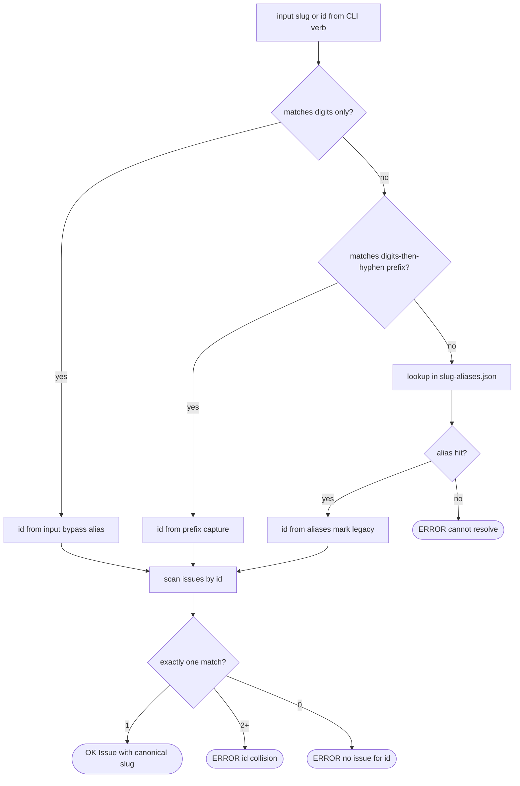

> **Phase C root note.** Slug/id resolution remains current. CLI callers pass
> a `project_root` that must be the current checkout root returned by
> `find_project_root()` from the CLI process CWD; linked git checkouts must
> resolve to their own `.aw/` tree.

## Slug Resolution Logic
<!-- type: logic lang: mermaid -->



## CLI Surface
<!-- type: cli lang: yaml -->

```yaml
$schema: "http://json-schema.org/draft-07/schema#"
title: phase-b-slug-id-cli-surface
type: object
properties:
  slug_input_grammar:
    type: object
    description: "Accepted forms for any aw wi/td/cb verb that takes a slug positional."
    properties:
      bare_numeric:
        type: string
        pattern: "^[0-9]+$"
        description: "e.g. '1234' — direct platform issue number; bypasses alias table."
      legacy_prefix:
        type: string
        pattern: "^[0-9]+-[a-z0-9-]+$"
        description: "legacy-compatible input, e.g. '1234-fix-auth-flow' — id prefix + ignored tail."
      legacy:
        type: string
        description: "Pre-Phase-B free-form slug; resolved via .aw/issues/.slug-aliases.json. Honoured for one release."

  frontmatter_id:
    type: object
    description: "New required field on every .aw/issues/{open,closed}/*.md frontmatter."
    properties:
      key: {type: string, const: "id"}
      type_: {type: string, const: "u64"}
      source:
        type: string
        enum: [github_number, gitlab_iid, local_counter]
        description: "github = github_number, gitlab = gitlab_iid, local = .aw/issues/.next-id"
    required: [key, type_, source]

  on_disk_artifacts:
    type: object
    properties:
      next_id_counter:
        type: object
        properties:
          path: {type: string, const: ".aw/issues/.next-id"}
          format: {type: string, const: "single u64 line, atomic write via temp+rename"}
          purpose: {type: string, const: "monotonic id allocator for local lifecycle creates"}
      alias_table:
        type: object
        properties:
          path: {type: string, const: ".aw/issues/.slug-aliases.json"}
          format: {type: string, const: "{ \"<old-slug>\": <id>, ... }"}
          ttl: {type: string, const: "one release after migrate-slugs --apply; then operator deletes"}

  migrate_slugs_verb:
    type: object
    description: "New CLI verb: aw wi migrate-slugs."
    properties:
      command:
        type: string
        const: "aw wi migrate-slugs"
      args:
        type: object
        properties:
          dry_run:
            type: boolean
            default: true
            description: "Default. Print plan without writing."
          apply:
            type: boolean
            default: false
            description: "Write all renames + alias table + counter file."
          json:
            type: boolean
            default: false
            description: "Emit migration plan as JSON."
      side_effects:
        type: array
        items: {type: string}
        const:
          - "allocate id for each issue lacking frontmatter.id (read .next-id, increment)"
          - "rename .aw/issues/<state>/<old>.md -> <id>.md"
          - "rewrite frontmatter.branch fields inside the file"
          - "rename git branches issue-<old> / td-<old> -> <kind>-<id>"
          - "append entries to .aw/issues/.slug-aliases.json"
      preconditions:
        type: array
        items: {type: string}
        const:
          - "current checkout is clean (no uncommitted changes)"
          - ".next-id counter exists or is created at migration start (initialised to max(existing ids) + 1)"

  branch_name_grammar:
    type: object
    properties:
      issue: {type: string, const: "issue-<id>"}
      td: {type: string, const: "td-<id>"}
      cb: {type: string, const: "cb-<id>"}
      parser_rule:
        type: string
        const: "extract id via regex ^(issue|td|cb)-([0-9]+)(?:-.+)?$ ; second capture group is u64"

  envelope_slug_format:
    type: object
    description: "Phase B does NOT change envelope schema; only the slug field's content shape."
    properties:
      old_form: {type: string, const: "<title-kebab>"}
      new_form: {type: string, const: "<id>"}
      payload_dir: {type: string, const: ".aw/payloads/<id>/"}
      lifecycle_trailer: {type: string, const: "Lifecycle-Stage: <Stage> slug=<id>"}

required:
  - slug_input_grammar
  - frontmatter_id
  - on_disk_artifacts
  - migrate_slugs_verb
  - branch_name_grammar
  - envelope_slug_format
```

## Test Plan
<!-- type: test-plan lang: mermaid -->

```mermaid
---
id: slug_id_test_plan
requirements:
  R1: {text: "frontmatter.id field threaded through Issue serialise/deserialise", risk: medium, verifymethod: test}
  R2: {text: "canonical slug emitter is exactly <id>; title tails are legacy input only", risk: low, verifymethod: test}
  R3: {text: "slug parser resolves bare-numeric, canonical, and legacy alias forms", risk: high, verifymethod: test}
  R4: {text: "branch-name parser extracts id from issue/td/cb prefix", risk: medium, verifymethod: test}
  R5: {text: "aw wi migrate-slugs --dry-run prints plan with no writes", risk: medium, verifymethod: test}
  R6: {text: "aw wi migrate-slugs --apply renames file + branch + writes alias table", risk: high, verifymethod: test}
  R7: {text: "migration honours .next-id counter atomicity (concurrent processes safe)", risk: high, verifymethod: test}
  R8: {text: "aw wi create allocates id from backend response (github/gitlab) or counter (local)", risk: medium, verifymethod: test}
  R9: {text: "envelope payloads carry canonical slug; payload dirs use canonical form", risk: medium, verifymethod: test}
  R10: {text: "alias table lookup is single-file, single-roundtrip; missing alias falls through to prefix-id parse", risk: low, verifymethod: test}
  R11: {text: "Phase A behaviour preserved: local lifecycle backend unchanged", risk: high, verifymethod: inspection}
  R12: {text: "Phase C surfaces untouched: current-checkout branch model unchanged", risk: high, verifymethod: inspection}
tests:
  T1: {text: "Issue::serialize emits id field and round-trips through deserialize", type: unit, verifies: [R1]}
  T2: {text: "build_canonical_slug(id=1234, title='Fix auth, restore SSO') = '1234-fix-auth-restore-sso'", type: unit, verifies: [R2]}
  T3: {text: "build_canonical_slug truncates title at word boundary at 60 chars", type: unit, verifies: [R2]}
  T4: {text: "resolve_slug('1234') returns Id(1234) without consulting alias table", type: unit, verifies: [R3]}
  T5: {text: "resolve_slug('1234-fix-auth') returns Id(1234) ignoring kebab tail", type: unit, verifies: [R3]}
  T6: {text: "resolve_slug('legacy-old-slug') consults alias table and returns mapped id", type: unit, verifies: [R3, R10]}
  T7: {text: "resolve_slug('unknown-with-no-id') returns ErrUnresolvable", type: unit, verifies: [R3]}
  T8: {text: "parse_branch_name('td-1234-fix-auth') returns Id(1234, kind=Td)", type: unit, verifies: [R4]}
  T9: {text: "parse_branch_name('issue-9999-do-thing') returns Id(9999, kind=Issue)", type: unit, verifies: [R4]}
  T10: {text: "migrate-slugs --dry-run prints plan with no writes (filesystem snapshot identical)", type: integration, verifies: [R5]}
  T11: {text: "migrate-slugs --apply on a sandbox: file renamed, branch renamed, alias entry added", type: integration, verifies: [R6]}
  T12: {text: "migrate-slugs --apply is idempotent (re-run with no new issues = no-op)", type: integration, verifies: [R6]}
  T13: {text: "migrate-slugs --apply rejects rename when the current checkout has uncommitted changes", type: integration, verifies: [R6]}
  T14: {text: "frontmatter.id collision raises explicit error during migration", type: integration, verifies: [R6]}
  T15: {text: "next_id counter survives across two sequential allocator calls", type: unit, verifies: [R7]}
  T16: {text: "next_id counter is atomic under concurrent process simulation (file lock)", type: unit, verifies: [R7]}
  T17: {text: "aw wi create through the local lifecycle backend writes id from .next-id", type: integration, verifies: [R8]}
  T18: {text: "aw wi create with a mocked configured GitHub backend writes id from gh number response", type: integration, verifies: [R8]}
  T19: {text: "envelope.slug emitted by aw wi create equals canonical form", type: integration, verifies: [R9]}
  T20: {text: ".aw/payloads/<canonical-slug>/ created on first apply", type: integration, verifies: [R9]}
  T21: {text: "Phase A resolve_default_backend tests still pass after Phase B changes", type: integration, verifies: [R11]}
  T22: {text: "no Phase C surfaces touched (grep for fill_section/section_create handlers untouched)", type: inspection, verifies: [R12]}
---
requirementDiagram

requirement R1 {
  id: R1
  text: frontmatter id field
  risk: medium
  verifymethod: test
}
requirement R2 {
  id: R2
  text: canonical slug builder
  risk: low
  verifymethod: test
}
requirement R3 {
  id: R3
  text: slug parser
  risk: high
  verifymethod: test
}
requirement R4 {
  id: R4
  text: branch-name parser
  risk: medium
  verifymethod: test
}
requirement R5 {
  id: R5
  text: migrate-slugs dry-run
  risk: medium
  verifymethod: test
}
requirement R6 {
  id: R6
  text: migrate-slugs apply
  risk: high
  verifymethod: test
}
requirement R7 {
  id: R7
  text: next-id counter
  risk: high
  verifymethod: test
}
requirement R8 {
  id: R8
  text: create allocates id
  risk: medium
  verifymethod: test
}
requirement R9 {
  id: R9
  text: envelope canonical
  risk: medium
  verifymethod: test
}
requirement R10 {
  id: R10
  text: alias single-roundtrip
  risk: low
  verifymethod: test
}
requirement R11 {
  id: R11
  text: phase A preserved
  risk: high
  verifymethod: inspection
}
requirement R12 {
  id: R12
  text: phase C untouched
  risk: high
  verifymethod: inspection
}

element T1 { type: test }
element T2 { type: test }
element T3 { type: test }
element T4 { type: test }
element T5 { type: test }
element T6 { type: test }
element T7 { type: test }
element T8 { type: test }
element T9 { type: test }
element T10 { type: test }
element T11 { type: test }
element T12 { type: test }
element T13 { type: test }
element T14 { type: test }
element T15 { type: test }
element T16 { type: test }
element T17 { type: test }
element T18 { type: test }
element T19 { type: test }
element T20 { type: test }
element T21 { type: test }
element T22 { type: test }

T1 - verifies -> R1
T2 - verifies -> R2
T3 - verifies -> R2
T4 - verifies -> R3
T5 - verifies -> R3
T6 - verifies -> R3
T6 - verifies -> R10
T7 - verifies -> R3
T8 - verifies -> R4
T9 - verifies -> R4
T10 - verifies -> R5
T11 - verifies -> R6
T12 - verifies -> R6
T13 - verifies -> R6
T14 - verifies -> R6
T15 - verifies -> R7
T16 - verifies -> R7
T17 - verifies -> R8
T18 - verifies -> R8
T19 - verifies -> R9
T20 - verifies -> R9
T21 - verifies -> R11
T22 - verifies -> R12
```

## Changes
<!-- type: changes lang: yaml -->

```yaml
$schema: "http://json-schema.org/draft-07/schema#"
title: phase-b-file-change-list
type: object
properties:
  changes:
    type: array
    items:
      type: object
      required: [path, action]
      properties:
        path: {type: string}
        action: {type: string, enum: [edit, add]}
        note: {type: string}
required: [changes]

changes:
  - path: projects/agentic-workflow/src/issues/types.rs
    section: source
    action: edit
    impl_mode: hand-written
    note: "Add `pub id: u64` to Issue struct (serde with backwards-compat default of 0 for legacy files; migration backfills)."
  - path: projects/agentic-workflow/src/issues/slug.rs
    section: source
    action: add
    impl_mode: hand-written
    note: "New module. Functions: build_canonical_slug(id, title), parse_slug_input(input, alias_table) -> ResolvedId, parse_branch_name(branch) -> Option<(Kind, u64)>. Loads .slug-aliases.json on demand."
  - path: projects/agentic-workflow/src/issues/next_id.rs
    section: source
    action: add
    impl_mode: hand-written
    note: "Atomic file-locked counter at .aw/issues/.next-id. allocate_next_id(project_root) -> u64. Initialises to max(existing ids) + 1 on first call."
  - path: projects/agentic-workflow/src/issues/mod.rs
    section: source
    action: edit
    impl_mode: hand-written
    note: "Export slug + next_id modules. Add resolve_issue_slug(input, project_root) helper used by all CLI lookup sites."
  - path: projects/agentic-workflow/src/issues/backends/github.rs
    section: source
    action: edit
    impl_mode: hand-written
    note: "On create(), capture gh issue create returned number; thread into Issue.id. On list/get, populate Issue.id from gh number field."
  - path: projects/agentic-workflow/src/issues/backends/gitlab.rs
    section: source
    action: edit
    impl_mode: hand-written
    note: "Same as github: capture iid on create; populate id on list/get."
  - path: projects/agentic-workflow/src/issues/backends/local.rs
    section: source
    action: edit
    impl_mode: hand-written
    note: "On create(), allocate id via next_id::allocate_next_id; emit canonical filename <id>.md."
  - path: projects/agentic-workflow/src/issues/slug.rs
    section: source
    action: edit
    impl_mode: hand-written
    note: "Branch builder accepts (kind, id, title) -> '<kind>-<id>'. Branch name parser extracts (kind, id), accepting legacy tails."
  - path: projects/agentic-workflow/src/cli/issues.rs
    action: edit
    section: cli
    impl_mode: hand-written
    note: "Every <verb> <slug> handler routes input through resolve_issue_slug. New verb: MigrateSlugs handler with --dry-run/--apply."
  - path: projects/agentic-workflow/src/cli/td.rs
    action: edit
    section: cli
    impl_mode: hand-written
    note: "Slug input parsing identical to issues; branch builder uses new <kind>-<id> form."
  - path: projects/agentic-workflow/src/cli/cb_fill.rs
    action: edit
    section: cli
    impl_mode: hand-written
    note: "Same slug/branch updates as td.rs."
  - path: projects/agentic-workflow/src/cli/cb_review.rs
    action: edit
    section: cli
    impl_mode: hand-written
    note: "Same."
  - path: projects/agentic-workflow/src/cli/cb_revise.rs
    action: edit
    section: cli
    impl_mode: hand-written
    note: "Same."
  - path: projects/agentic-workflow/src/cli/migrate_slugs.rs
    action: add
    section: cli
    impl_mode: hand-written
    note: "Implements migrate-slugs verb body: scan issues, allocate ids, rename files/branches, write alias table. Emits structured JSON plan when --json."
  - path: projects/agentic-workflow/CLAUDE.md
    action: edit
    section: cli
    impl_mode: hand-written
    note: "Document <id> canonical slug rule, alias-table TTL, bare-numeric and legacy input acceptance."
  - action: annotate
    section: logic
    impl_mode: hand-written
    description: "Traceability metadata edge for the logic section."

  - action: annotate
    section: unit-test
    impl_mode: hand-written
    description: "Traceability metadata edge for the unit-test section."

```

# Reviews

## Review 1
<!-- type: doc lang: markdown -->
**Verdict:** approved

- [logic] Slug resolution flowchart covers all four branches (bare-numeric short-circuit, prefix-id parse, alias fallback, unresolvable error) plus the load-by-id step's three terminal outcomes (ok / collision / not-found). Mermaid Plus YAML matches the rendered flowchart node-for-node.
- [cli] Required keys (slug grammar, frontmatter id, on-disk artifacts, migrate verb, branch grammar, envelope content) are concretely specified — paths, regexes, side-effects, preconditions all enumerated with no prose hand-waving.
- [test-plan] 22 tests verify 12 requirements with explicit bidirectional coverage; high-risk requirements (R3 parser, R6 migration, R7 atomicity) get 4+/5/2 tests respectively. R11/R12 are inspection-only which is correct (preserving Phase A and not-touching Phase C surfaces is a negative property).
- [changes] File changes align 1:1 with the requirements: slug.rs ↔ R2/R3/R4, next_id.rs ↔ R7, migrate_slugs.rs ↔ R5/R6, backend edits ↔ R8, score files ↔ R3 thread-through. No missing surfaces.
