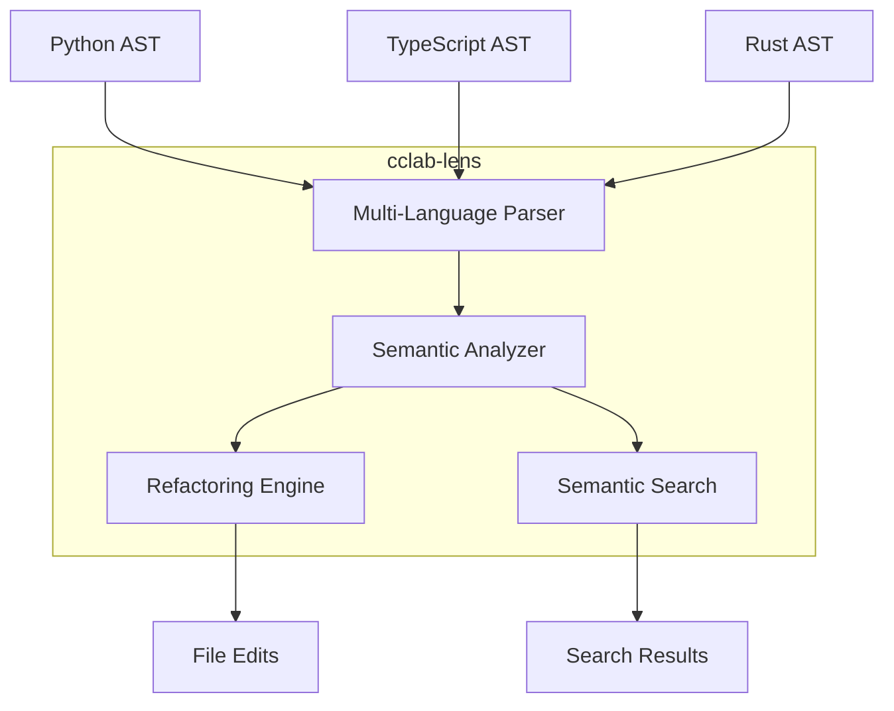

# cclab-lens: Code Intelligence Engine

High-performance multi-language code analysis, semantic search, and refactoring engine.

## Features
<!-- type: doc lang: markdown -->

- **Multi-Language Support**: Python, TypeScript, Rust
- **7 Refactoring Operations**: Rename, Extract (variable/function/method), Inline, Change Signature, Move Definition
- **7 Semantic Search Types**: Usages, Type Signature, Implementations, Call/Type Hierarchy, Patterns, Documentation
- **MCP Integration**: Available as MCP tools for LLM agents

## Documentation
<!-- type: doc lang: markdown -->

### API Reference
- **[Refactoring API](./refactoring-api.md)**: Complete refactoring operations reference (~700 lines)
- **[Semantic Search API](./semantic-search-api.md)**: Search types and usage patterns (~600 lines)

### Guides
- **[Usage Examples](./usage-examples.md)**: 14 practical examples (~550 lines)

## MCP Tools
<!-- type: doc lang: markdown -->

| Tool | Description |
|------|-------------|
| `cclab_lens_check` | Lint + type analysis |
| `cclab_lens_symbols` | List symbols in file |
| `cclab_lens_diagnostics` | Get errors/warnings |
| `cclab_lens_hover` | Type info at position |
| `cclab_lens_definition` | Go to definition |
| `cclab_lens_references` | Find all references |
| `cclab_lens_type_at` | Get type at position |

## Architecture
<!-- type: doc lang: markdown -->

## Quick Stats
<!-- type: doc lang: markdown -->

- **Tests**: 67 (all passing)
- **Code**: ~1,037 lines
- **Documentation**: ~2,900 lines
- **Feature Maturity**: 7.0/10

## Tech Stack
<!-- type: doc lang: markdown -->

Code analysis, LSP server, and refactoring dependencies.

### Parser & Grammar

| Category | Technology | Version |
|----------|------------|---------|
| Parser | tree-sitter | 0.24 |
| Python Grammar | tree-sitter-python | 0.23 |
| TypeScript Grammar | tree-sitter-typescript | 0.23 |
| Rust Grammar | tree-sitter-rust | 0.23 |

### LSP Server

| Category | Technology | Version |
|----------|------------|---------|
| LSP Protocol | tower-lsp | 0.20 |
| Tower Middleware | tower | 0.5 |

### File System

| Category | Technology | Version |
|----------|------------|---------|
| File Watch | notify | 7.0 |
| File Walking | walkdir | 2.5 |
| Fast Walk | jwalk | 0.8 |

### Core

| Category | Technology | Version |
|----------|------------|---------|
| Async Runtime | Tokio | 1.40 |
| Regex | regex | 1.11 |
| Graph | petgraph | 0.6 |
