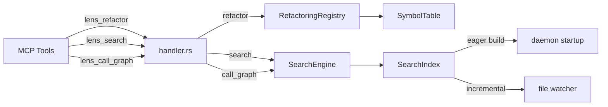

# Lens Beyond Ide Spec

## Overview
<!-- type: doc lang: markdown -->

Beyond-IDE upgrade to cclab-lens covering 5 areas:

**1. RPC/MCP Wiring (#799, #800)**
- Wire existing refactoring engine (6 operations) into daemon handler.rs as `refactor` RPC method
- Wire existing search engine (6 modes) into daemon handler.rs as `search` and `call_graph` RPC methods
- Register 3 new MCP tools: `lens_refactor`, `lens_search`, `lens_call_graph`
- Build search index eagerly on daemon startup

**2. JSON Schema Validation (#803)**
- Bundle full K8s API schemas (1.28, 1.29, 1.30) via include_bytes!() — ~15MB raw JSON
- Bundle GitLab CI JSON schema
- SchemaRegistry struct with validate_k8s(value, version) and validate_gitlab_ci(value)
- Wire to K8s rules K8002/K8008 and GitLab CI rule GL002

**3. HCL Grammar Fix**
- Upgrade tree-sitter from 0.24 to 0.25+ to support grammar version 15
- Upgrade all grammar crates (python, typescript, rust, javascript, html, css, yaml, hcl) to matching versions
- Resolve 116 pre-existing test failures caused by HCL grammar incompatibility

**4. HTML/CSS Expansion**
- HTML symbol builder: tag IDs, classes, form names, anchor hrefs, meta tags
- CSS symbol builder: selectors, class names, ID selectors, custom properties, @keyframes, @media
- HTML lint expansion to 10+ rules (missing alt, lang, deprecated tags, etc.)
- CSS lint expansion to 10+ rules (vendor prefixes, shorthand optimization, etc.)

**5. Go Language Support**
- Add tree-sitter-go grammar to MultiParser
- Go lint checker with 8-10 rules (unchecked err, unused imports, shadowed vars, etc.)
- Go symbol builder (functions, types, interfaces, methods, constants, packages)

### Key Decisions
- tree-sitter: upgrade all grammars (not downgrade HCL)
- K8s schemas: full API, raw JSON (not compressed, not subset)
- Search index: eager build on daemon start
- Refactor: dry_run parameter (preview by default)
- New languages: Go only (Java/C++ deferred)
- CSS: strict CSS only (no SCSS/LESS)
- HTML: plain HTML only (no template awareness)
## Requirements
<!-- type: doc lang: markdown -->

### R1 - RPC Refactor Method

```yaml
id: R1
priority: high
status: draft
```

Add `refactor` RPC method to handler.rs. Accepts `RefactoringRequest` (operation, file, position/range, params). Dispatches to `RefactoringRegistry`. Returns `Vec<TextEdit>` in preview mode (dry_run=true, default) or applies edits and returns confirmation (dry_run=false).

### R2 - RPC Search Methods

```yaml
id: R2
priority: high
status: draft
```

Add `search` and `call_graph` RPC methods to handler.rs. `search` accepts `SearchQuery` with mode enum (ByTypeSignature, CallHierarchy, Implementations, Usages, SimilarCode, DocumentationSearch). `call_graph` accepts symbol position + depth. Both return `Vec<SearchResult>`.

### R3 - MCP Tools Registration

```yaml
id: R3
priority: high
status: draft
```

Register 3 daemon-backed MCP tools in mcp/tools.rs:
- `lens_refactor` — operation, file, line, col, params, dry_run
- `lens_search` — mode, query, file, line, col, depth
- `lens_call_graph` — file, line, col, depth

### R4 - Search Index Eager Build

```yaml
id: R4
priority: high
status: draft
```

On daemon startup, after initial file discovery, build the SearchIndex eagerly across all indexed files. Store in-memory. Update incrementally via existing file watcher events (create/modify/delete).

### R5 - SchemaRegistry

```yaml
id: R5
priority: high
status: draft
```

CREATE `src/schemas/mod.rs` with `SchemaRegistry`:
- `include_bytes!()` for K8s 1.28, 1.29, 1.30 full API schemas and GitLab CI schema
- `validate_k8s(&self, value: &serde_json::Value, version: &str) -> Vec<Diagnostic>`
- `validate_gitlab_ci(&self, value: &serde_json::Value) -> Vec<Diagnostic>`
- Use `jsonschema` crate for validation

### R6 - Schema-Backed Lint Rules

```yaml
id: R6
priority: high
status: draft
```

Wire SchemaRegistry into K8s checker (K8002: missing required fields, K8008: deprecated APIs) and GitLab CI checker (GL002: unknown keywords). Parse YAML source to serde_json::Value, then validate against bundled schema.

### R7 - Tree-sitter Upgrade

```yaml
id: R7
priority: high
status: draft
```

Upgrade tree-sitter from 0.24 to 0.25+ and all grammar crates to compatible versions:
- tree-sitter-python, tree-sitter-typescript, tree-sitter-rust, tree-sitter-javascript
- tree-sitter-html, tree-sitter-css, tree-sitter-yaml, tree-sitter-hcl
- Verify all existing tests pass after upgrade (116 HCL-related failures should resolve)
- Update any API changes in parser.rs (e.g. `set_language` signature changes)

### R8 - HTML Symbol Builder

```yaml
id: R8
priority: medium
status: draft
```

CREATE `src/semantic/symbols/html.rs`:
- Extract element IDs (`id="..."` attributes)
- Extract class names (`class="..."` attributes)
- Extract form names, anchor hrefs (as references)
- Extract meta tags, script/link sources
- Register in symbols/mod.rs

### R9 - CSS Symbol Builder

```yaml
id: R9
priority: medium
status: draft
```

CREATE `src/semantic/symbols/css.rs`:
- Extract selectors (class, ID, element, pseudo)
- Extract custom properties (`--var-name`)
- Extract @keyframes animation names
- Extract @media query descriptors
- Register in symbols/mod.rs

### R10 - HTML Lint Expansion

```yaml
id: R10
priority: medium
status: draft
```

Add 10+ rules to HTML checker:
- HTM002: Missing `alt` on ``
- HTM003: Missing `lang` on `<html>`
- HTM004: Deprecated tags (`<center>`, `<font>`, `<marquee>`, etc.)
- HTM005: Empty `href` attribute
- HTM006: Missing `<meta charset>`
- HTM007: `<form>` without `action`
- HTM008: Duplicate element IDs
- HTM009: Inline `style` attribute usage
- HTM010: Missing `<title>` tag
- HTM011: `<script>` without `type` or `defer`/`async`

### R11 - CSS Lint Expansion

```yaml
id: R11
priority: medium
status: draft
```

Add 5+ rules to CSS checker (total 10+):
- CSS006: Vendor prefix without standard property
- CSS007: Shorthand property optimization opportunity
- CSS008: Inconsistent color format (mix of hex/rgb/hsl)
- CSS009: Zero value with unnecessary unit (`0px` → `0`)
- CSS010: Missing `font-display` in `@font-face`

### R12 - Go Language Support

```yaml
id: R12
priority: medium
status: draft
```

Add Go language to MultiParser:
- Add `tree-sitter-go` to Cargo.toml
- Add `Language::Go` variant and parser initialization
- CREATE `src/lint/go.rs` with GoChecker implementing Checker trait
- CREATE `src/semantic/symbols/go.rs` with Go symbol builder
- Register checker and symbol builder
- 8-10 lint rules:
  - GO001: Unchecked error return
  - GO002: Unused import
  - GO003: Shadowed variable
  - GO004: Naked return in named-return function
  - GO005: context.Background() in non-main function
  - GO006: Empty error branch
  - GO007: String formatting with Sprintf in Error()
  - GO008: Exported function missing doc comment
## Scenarios
<!-- type: doc lang: markdown -->

### S1 - MCP Refactor Rename

**Given** daemon running with indexed project containing `utils.py` with function `process_data`
**When** `lens_refactor` called with operation=rename, file=utils.py, line=5, col=4, new_name=transform_data, dry_run=true
**Then** returns preview with TextEdits across utils.py, main.py, test.py (all reference sites)

### S2 - MCP Search by Type Signature

**Given** daemon running with indexed project
**When** `lens_search` called with mode=ByTypeSignature, query="(str) -> bool"
**Then** returns all functions matching that signature with file positions

### S3 - MCP Call Graph

**Given** daemon running with indexed project
**When** `lens_call_graph` called with file=utils.py, line=10, col=4, depth=3
**Then** returns callers and callees up to 3 levels deep

### S4 - K8s Schema Validation

**Given** K8s Deployment manifest missing required `spec.selector` field
**When** `cclab lens check deploy.yaml --k8s-version 1.30`
**Then** reports K8002 with JSON path to missing field from schema validation

### S5 - GitLab CI Schema Validation

**Given** `.gitlab-ci.yml` with unknown keyword `scrpit:` (typo)
**When** `cclab lens check .gitlab-ci.yml`
**Then** reports GL002 "Unknown keyword 'scrpit'" from schema validation

### S6 - HCL Grammar Works After Upgrade

**Given** tree-sitter 0.25+ with matching tree-sitter-hcl
**When** `cclab lens check main.tf`
**Then** parses HCL correctly, reports TF* diagnostics without grammar errors

### S7 - HTML Symbol Hover

**Given** daemon running, HTML file with `<div id="main-content" class="container">`
**When** `cclab lens symbols index.html`
**Then** lists symbols: ID "main-content", class "container"

### S8 - CSS Symbol Extraction

**Given** CSS file with `.btn-primary { --bg-color: #007bff; }` and `@keyframes fadeIn {}`
**When** `cclab lens symbols styles.css`
**Then** lists symbols: selector ".btn-primary", custom property "--bg-color", keyframe "fadeIn"

### S9 - HTML Missing Alt Lint

**Given** HTML file with ``
**When** `cclab lens check index.html`
**Then** reports HTM002 "Missing alt attribute on img"

### S10 - Go Unchecked Error

**Given** Go file with `f, _ := os.Open("file.txt")`
**When** `cclab lens check main.go`
**Then** reports GO001 "Error return value not checked"

### S11 - Go Symbol Navigation

**Given** Go file with `type UserService interface { GetUser(id string) (*User, error) }`
**When** `cclab lens symbols service.go`
**Then** lists interface "UserService" with method "GetUser"

### S12 - Search Index Eager Load

**Given** daemon started with project root containing 100 files
**When** daemon finishes startup
**Then** search index is built and first `lens_search` query returns instantly
## Diagrams
<!-- type: doc lang: markdown -->

### RPC Wiring Architecture



### Schema Validation Flow

```mermaid
flowchart TD
    YAML["YAML source"] --> PARSE["serde_yaml::from_str"]
    PARSE --> VALUE["serde_json::Value"]
    VALUE --> SR{SchemaRegistry}
    SR -->|K8s manifest| K8V["validate_k8s(value, version)"]
    SR -->|GitLab CI| GLV["validate_gitlab_ci(value)"]
    K8V --> |"1.28/1.29/1.30"| SCHEMA["include_bytes! JSON schema"]
    GLV --> SCHEMA
    SCHEMA --> JSONSCHEMA["jsonschema::validate"]
    JSONSCHEMA --> DIAG["Vec<Diagnostic>"]
	```
## API Spec
<!-- type: doc lang: markdown -->

### OpenAPI 3.1
<!-- TODO -->

### OpenRPC 1.3
<!-- TODO -->

### AsyncAPI 2.6
<!-- TODO -->

### Serverless Workflow 0.8
<!-- TODO -->

## Test Plan
<!-- type: doc lang: markdown -->

### T1 - RPC Refactor Method
Test handler accepts refactor request, dispatches to RefactoringRegistry, returns TextEdits. Test dry_run=true (preview) and dry_run=false (apply). Test error on invalid operation.

### T2 - RPC Search Methods
Test handler accepts search request with each of 6 modes. Test call_graph with depth parameter. Verify results contain file positions.

### T3 - MCP Tools Registration
Verify lens_refactor, lens_search, lens_call_graph appear in registered tools list. Test parameter validation (missing required fields).

### T4 - Search Index Eager Build
Start daemon, verify search index is populated before first query. Verify incremental update on file change event.

### T5 - SchemaRegistry Loading
Test SchemaRegistry::new() loads all 4 schemas (K8s 1.28/1.29/1.30, GitLab CI). Test validate_k8s with valid and invalid manifests. Test version selection.

### T6 - K8s Schema-Backed Rules
Test K8002 fires on missing required fields via schema. Test K8008 fires on deprecated API versions. Compare with previous line-heuristic results.

### T7 - GitLab CI Schema-Backed Rules
Test GL002 fires on unknown keywords via schema validation.

### T8 - Tree-sitter Upgrade
After upgrade, verify all grammars load without errors. Run full test suite — 116 HCL-related failures should resolve. Verify parser.rs API compatibility.

### T9 - HTML Symbol Builder
Parse HTML file with IDs, classes, forms. Verify SymbolTable contains expected symbols with correct SymbolKind and positions.

### T10 - CSS Symbol Builder
Parse CSS file with selectors, custom properties, keyframes. Verify SymbolTable contains expected symbols.

### T11 - HTML Lint Rules
For each of HTM002-HTM011, create fixture with known violation. Verify diagnostic fires with correct rule ID and severity.

### T12 - CSS Lint Rules
For each of CSS006-CSS010, create fixture with known violation. Verify diagnostic fires.

### T13 - Go Parser
Parse Go source files via MultiParser with Language::Go. Verify tree-sitter AST is correct.

### T14 - Go Lint Rules
For each of GO001-GO008, create fixture with known violation. Verify diagnostic fires.

### T15 - Go Symbol Builder
Parse Go file with functions, types, interfaces, methods. Verify SymbolTable contains all expected symbols.
## Changes
<!-- type: doc lang: markdown -->

| File | Action | Description |
|------|--------|-------------|
| `src/server/handler.rs` | MODIFY | Add `refactor`, `search`, `call_graph` RPC methods; eager search index build on startup |
| `src/mcp/tools.rs` | MODIFY | Register `lens_refactor`, `lens_search`, `lens_call_graph` MCP tools |
| `src/server/protocol.rs` | MODIFY | Add request/response types for refactor and search |
| `src/schemas/mod.rs` | CREATE | SchemaRegistry with include_bytes!() for K8s and GitLab CI schemas |
| `src/schemas/k8s_1_28.json` | CREATE | Bundled K8s 1.28 API schema |
| `src/schemas/k8s_1_29.json` | CREATE | Bundled K8s 1.29 API schema |
| `src/schemas/k8s_1_30.json` | CREATE | Bundled K8s 1.30 API schema |
| `src/schemas/gitlab_ci.json` | CREATE | Bundled GitLab CI schema |
| `src/lint/kubernetes.rs` | MODIFY | Wire SchemaRegistry for K8002, K8008 |
| `src/lint/gitlab_ci.rs` | MODIFY | Wire SchemaRegistry for GL002 |
| `Cargo.toml` | MODIFY | Upgrade tree-sitter 0.24→0.25+, all grammar crates, add tree-sitter-go, jsonschema |
| `src/syntax/parser.rs` | MODIFY | Upgrade grammar APIs, add Language::Go + Go parser |
| `src/lint/html.rs` | MODIFY | Add HTM002-HTM011 rules |
| `src/lint/css.rs` | MODIFY | Add CSS006-CSS010 rules |
| `src/semantic/symbols/html.rs` | CREATE | HTML symbol builder |
| `src/semantic/symbols/css.rs` | CREATE | CSS symbol builder |
| `src/semantic/symbols/mod.rs` | MODIFY | Register HTML, CSS, Go symbol builders |
| `src/lint/go.rs` | CREATE | GoChecker with GO001-GO008 rules |
| `src/semantic/symbols/go.rs` | CREATE | Go symbol builder |
| `src/lint/mod.rs` | MODIFY | Register GoChecker in CheckerRegistry |
| `src/lib.rs` | MODIFY | Add `pub mod schemas;` |
