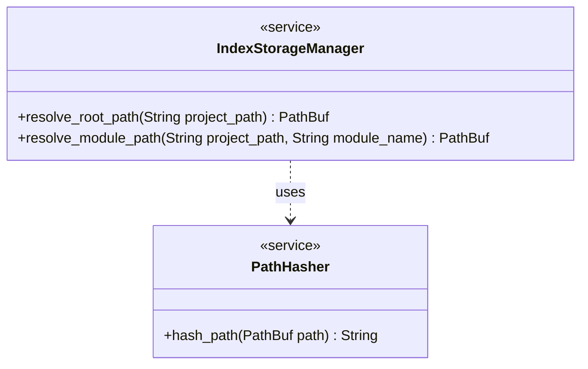

# Lens Index Storage & Resolution

## Overview
<!-- type: doc lang: markdown -->

A utility specification for resolving and managing the persistent storage location of Lens code indexes. It ensures that indexes are stored in a consistent, project-local directory structure (`{project_root}/cclab/.index/`), derived from the canonical path of the project root. This enables index persistence across server restarts and supports multiple projects and monorepo modules without collision.

## Requirements
<!-- type: doc lang: markdown -->

### R1 - Persistent Storage Path

```yaml
id: R1
priority: medium
status: draft
```

The system must resolve the persistent storage root for a project at `{project_root}/cclab/.index/`, where `{project_root}` is the canonicalized project root directory.

### R2 - Path Canonicalization

```yaml
id: R2
priority: medium
status: draft
```

The project root path must be canonicalized (resolving symlinks and relative paths) before hashing to ensure that the same project always maps to the same storage location.

### R3 - Path Hashing

```yaml
id: R3
priority: medium
status: draft
```

The canonical project root path must be hashed using a stable algorithm (e.g., SHA256) to generate the `{path_hash}` segment of the storage path.

### R4 - Module Index Separation

```yaml
id: R4
priority: medium
status: draft
```

The storage structure must support separate index files or subdirectories for distinct modules defined in the project configuration, preventing conflicts in monorepos.

## Acceptance Criteria
<!-- type: doc lang: markdown -->

### Scenario: Resolve New Project Path

- **WHEN** The index storage path is requested for a new project at `/user/dev/my-project`.
- **THEN** The canonicalized project path is used to construct `{project_root}/cclab/.index/` and returned.

### Scenario: Resolve Existing Project Path

- **WHEN** The index storage path is requested again for the same project root.
- **THEN** The same hash and storage path are returned as the first request.

### Scenario: Module Sub-path Resolution

- **WHEN** The index path for a specific module named 'backend' is requested.
- **THEN** The returned path includes the module's identifier (e.g., `cclab/.index/backend.idx`).

## Diagrams
<!-- type: doc lang: markdown -->

### Index Path Resolution Flow

```mermaid
flowchart TB
    start([Start: Resolve Path])
    canon[Canonicalize Project Root]
    hash[Compute SHA256 Hash]
    construct[Construct {project_root}/cclab/.index/]
    ensure[Ensure Directory Exists]
    end([Return PathBuf])
    start --> canon
    canon --> hash
    hash --> construct
    construct --> ensure
    ensure --> end
```

### Storage Components


