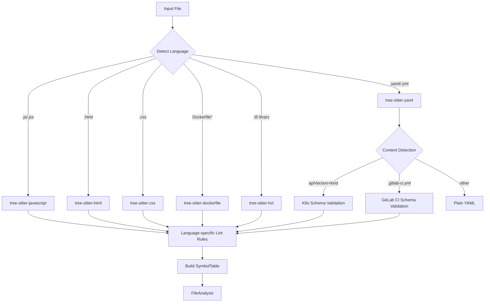
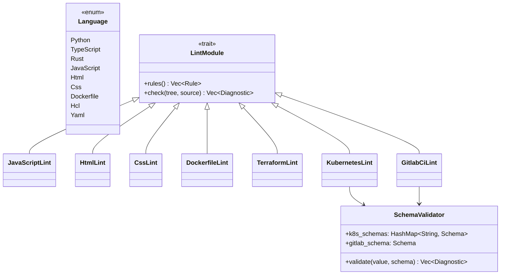

# Lens Lang Support Spec

## Overview
<!-- type: doc lang: markdown -->


Extend Lens code analysis to support 7 new languages/formats across two implementation approaches:

**Tree-sitter languages** (#767, #768, #769):
- JavaScript/JSX, HTML, CSS — full frontend language support with JSDoc type inference and template languages (Jinja2, EJS)
- Dockerfile — Hadolint-inspired lint rules (DK001-DK010)
- Terraform/HCL — tflint-inspired rules (TF001-TF010) with embedded provider schema validation

**Schema-based validators** (#770, #771):
- Kubernetes/Kustomize YAML — bundled JSON schemas for K8s 1.28-1.30, kube-linter inspired rules (K8001-K8010)
- GitLab CI/CD YAML — bundled GitLab CI schema, job dependency graph, variable inheritance

### Key Decisions
- All languages use tree-sitter for parsing (including YAML via tree-sitter-yaml)
- JSON schemas bundled in binary for offline use
- K8s supports multiple API versions (1.28, 1.29, 1.30) via `--k8s-version`
- GitLab CI only resolves `include:local` (no network access)
- Full lint rule sets implemented (not minimal)
- JS includes JSDoc type inference; HTML includes Jinja2/EJS templates
- Terraform embeds AWS/GCP provider schemas for attribute validation

### Non-Goals
- No new daemon RPC methods
- No changes to MCP server
- No GitLab CI `include:remote`/`include:template` resolution
## Requirements
<!-- type: doc lang: markdown -->


### R1 - Language Enum Extension

```yaml
id: R1
priority: high
status: draft
```

Add new variants to the `Language` enum: `JavaScript`, `Html`, `Css`, `Dockerfile`, `Hcl`, `Yaml`.
File extension detection:
- `.js`, `.jsx` → JavaScript
- `.html`, `.htm` → Html
- `.css` → Css
- `Dockerfile`, `Dockerfile.*`, `*.dockerfile` → Dockerfile
- `.tf`, `.tfvars` → Hcl
- `.yaml`, `.yml` → Yaml (further classified as K8s/GitLab CI by content)

### R2 - Tree-sitter Grammar Integration

```yaml
id: R2
priority: high
status: draft
```

Add tree-sitter grammars to Cargo.toml:
- `tree-sitter-javascript` for JS/JSX
- `tree-sitter-html` for HTML (including template language support)
- `tree-sitter-css` for CSS
- `tree-sitter-dockerfile` for Dockerfile
- `tree-sitter-hcl` for Terraform/HCL
- `tree-sitter-yaml` for K8s/GitLab CI YAML

### R3 - JavaScript/JSX Lint Rules & JSDoc Inference

```yaml
id: R3
priority: high
status: draft
```

Reuse applicable TypeScript lint rules for JS. Add JSDoc-based type inference for `@type`, `@param`, `@returns` annotations. Symbol table builder for functions, classes, imports/exports.

### R4 - HTML Lint Rules & Template Support

```yaml
id: R4
priority: high
status: draft
```

Lint rules: unclosed tags, deprecated attributes, accessibility (a11y). Template language support for Jinja2 (``, `{{ }}`) and EJS (`<% %>`, `<%= %>`).

### R5 - CSS Lint Rules

```yaml
id: R5
priority: high
status: draft
```

Lint rules: unknown properties, duplicate selectors, color format consistency. Symbol table for selectors, custom properties, `@import` references.

### R6 - Dockerfile Lint Rules (DK001-DK010)

```yaml
id: R6
priority: high
status: draft
```

| Rule | Description |
|------|-------------|
| DK001 | Missing or invalid FROM instruction |
| DK002 | Using `latest` tag (pin versions) |
| DK003 | Multiple CMD instructions |
| DK004 | COPY/ADD `--chown` best practices |
| DK005 | RUN apt-get without `--no-install-recommends` |
| DK006 | Missing HEALTHCHECK |
| DK007 | Using ADD when COPY suffices |
| DK008 | RUN with unchained commands (layer bloat) |
| DK009 | Hardcoded secrets in ENV/ARG |
| DK010 | Missing .dockerignore reference |

Symbol table: FROM stages, EXPOSE ports, ENV vars.

### R7 - Terraform/HCL Lint Rules (TF001-TF010)

```yaml
id: R7
priority: high
status: draft
```

| Rule | Description |
|------|-------------|
| TF001 | Syntax errors |
| TF002 | Deprecated resource attributes |
| TF003 | Missing required attributes |
| TF004 | Hardcoded secrets in variables |
| TF005 | Missing description on variables/outputs |
| TF006 | Missing terraform.required_version |
| TF007 | Missing terraform.required_providers |
| TF008 | Unused variables/locals |
| TF009 | Missing tags on taggable resources |
| TF010 | S3 bucket without encryption/versioning |

Embed AWS/GCP provider schemas for attribute validation. Symbol table: resources, data sources, variables, outputs, locals, modules.

### R8 - K8s/Kustomize Validation (K8001-K8010)

```yaml
id: R8
priority: high
status: draft
```

Bundle K8s JSON schemas for versions 1.28, 1.29, 1.30. `--k8s-version` flag for version selection.
Content-based detection: YAML files with `apiVersion` + `kind` fields → K8s manifest. `kustomization.yaml` → Kustomize.

| Rule | Description |
|------|-------------|
| K8001 | Invalid apiVersion/kind combination |
| K8002 | Missing required fields |
| K8003 | Using `latest` image tag |
| K8004 | Missing resource limits/requests |
| K8005 | Missing liveness/readiness probes |
| K8006 | Running as root (securityContext) |
| K8007 | Missing namespace |
| K8008 | Deprecated API versions |
| K8009 | Duplicate resource names |
| K8010 | Kustomization referencing non-existent files |

### R9 - GitLab CI/CD Validation (GL001-GL012)

```yaml
id: R9
priority: high
status: draft
```

Bundle GitLab CI JSON schema. Detection: `.gitlab-ci.yml` exact match.

| Rule | Description |
|------|-------------|
| GL001 | Syntax errors / invalid YAML |
| GL002 | Unknown job keywords |
| GL003 | Invalid stage reference |
| GL004 | Missing script in job |
| GL005 | needs referencing non-existent job |
| GL006 | Circular needs dependencies |
| GL007 | rules and only/except mixed |
| GL008 | Hardcoded secrets in variables |
| GL009 | Missing timeout on long-running jobs |
| GL010 | allow_failure without when:manual check |
| GL011 | Unused extends templates |
| GL012 | Invalid include references |

Semantic: job dependency graph, variable inheritance (global→job→extends), `include:local` resolution.

### R10 - Symbol Tables Per Language

```yaml
id: R10
priority: medium
status: draft
```

Each language must produce a `SymbolTable` for hover, go-to-definition, and references support:
- JS: functions, classes, variables, imports/exports
- HTML: elements, IDs, classes, template blocks
- CSS: selectors, custom properties, @import
- Dockerfile: FROM stages, ENV vars, EXPOSE ports, LABEL keys
- HCL: resources, data, variables, outputs, locals, modules
- K8s: resources, labels, selectors, service→deployment refs
- GitLab: jobs, stages, variables, templates
## Scenarios
<!-- type: doc lang: markdown -->


### S1 - JavaScript Lint

**Given** a `.js` file with `var` usage and missing semicolons
**When** `cclab lens check src/app.js`
**Then** reports JS lint violations with line/col positions

### S2 - HTML Template Lint

**Given** an HTML file with Jinja2 `` templates
**When** `cclab lens check templates/base.html`
**Then** validates HTML structure including template blocks, reports unclosed tags and a11y issues

### S3 - Dockerfile Best Practices

**Given** a Dockerfile using `FROM node:latest` and `ADD` instead of `COPY`
**When** `cclab lens check Dockerfile`
**Then** reports DK002 (pin version) and DK007 (use COPY)

### S4 - Terraform Missing Required Attributes

**Given** a `.tf` file with an AWS S3 bucket resource missing encryption
**When** `cclab lens check infra/main.tf`
**Then** reports TF010 (S3 without encryption/versioning)

### S5 - K8s Manifest Validation

**Given** a YAML file with `apiVersion: apps/v1` and `kind: Deployment` missing resource limits
**When** `cclab lens check k8s/deployment.yaml`
**Then** detects as K8s manifest, validates against K8s 1.30 schema, reports K8004

### S6 - K8s Version Selection

**Given** a K8s manifest using a deprecated API
**When** `cclab lens check k8s/ingress.yaml --k8s-version 1.28`
**Then** validates against K8s 1.28 schema, may not flag the deprecation

### S7 - GitLab CI Cycle Detection

**Given** `.gitlab-ci.yml` with jobs A→B→C→A in `needs`
**When** `cclab lens check .gitlab-ci.yml`
**Then** reports GL006 (circular needs dependencies)

### S8 - GitLab CI Include Local

**Given** `.gitlab-ci.yml` with `include: local: ci/templates.yml`
**When** `cclab lens check .gitlab-ci.yml`
**Then** resolves and validates the included file

### S9 - CSS Duplicate Selectors

**Given** a CSS file with duplicate `.btn` selectors
**When** `cclab lens check styles/main.css`
**Then** reports duplicate selector warning

### S10 - Hover on Terraform Resource

**Given** daemon running with indexed `.tf` files
**When** `cclab lens hover infra/main.tf 5 10`
**Then** returns resource type info and attribute documentation
## Diagrams
<!-- type: doc lang: markdown -->


### Flowchart



### Class Diagram


## API Spec
<!-- type: doc lang: markdown -->

### OpenAPI 3.1
<!-- TODO -->

### OpenRPC 1.3
<!-- TODO -->

### AsyncAPI 2.6
<!-- TODO -->

### Serverless Workflow 0.8
<!-- TODO -->

## Test Plan
<!-- type: doc lang: markdown -->


### T1 - Language Detection

Verify file extension → Language mapping for all new extensions (.js, .jsx, .html, .css, Dockerfile, .tf, .tfvars, .yaml, .yml).

### T2 - K8s Content Detection

Verify YAML files with `apiVersion` + `kind` are detected as K8s manifests. Verify `kustomization.yaml` detected as Kustomize.

### T3 - GitLab CI Detection

Verify `.gitlab-ci.yml` exact match detection.

### T4 - JavaScript Lint Rules

Test JS-specific lint rules and JSDoc type extraction on sample `.js` files.

### T5 - HTML Lint + Templates

Test HTML lint (unclosed tags, a11y) on pure HTML and Jinja2/EJS template files.

### T6 - CSS Lint Rules

Test duplicate selectors, unknown properties on sample `.css` files.

### T7 - Dockerfile Lint DK001-DK010

Test each Dockerfile lint rule with a crafted Dockerfile containing known violations.

### T8 - Terraform Lint TF001-TF010

Test each Terraform rule with sample `.tf` files. Verify provider schema attribute validation.

### T9 - K8s Schema Validation

Test K8s manifest against bundled schemas for 1.28, 1.29, 1.30. Verify `--k8s-version` selects correct schema.

### T10 - GitLab CI Validation GL001-GL012

Test each GitLab CI rule. Verify cycle detection in `needs` graph.

### T11 - Symbol Tables

For each language, verify SymbolTable contains expected symbols (functions, classes, resources, jobs, etc.).

### T12 - Include Local Resolution

Verify GitLab CI `include:local` resolves referenced files. Verify `include:remote` is ignored.
## Changes
<!-- type: doc lang: markdown -->


| File | Action | Description |
|------|--------|-------------|
| `crates/cclab-lens/Cargo.toml` | MODIFY | Add tree-sitter-javascript, tree-sitter-html, tree-sitter-css, tree-sitter-dockerfile, tree-sitter-hcl, tree-sitter-yaml, jsonschema dependencies |
| `crates/cclab-lens/src/syntax/parser.rs` | MODIFY | Add JavaScript, Html, Css, Dockerfile, Hcl, Yaml to Language enum + file detection |
| `crates/cclab-lens/src/lint/javascript.rs` | CREATE | JS lint rules (reuse TS where applicable) + JSDoc type inference |
| `crates/cclab-lens/src/lint/html.rs` | CREATE | HTML lint rules + Jinja2/EJS template support |
| `crates/cclab-lens/src/lint/css.rs` | CREATE | CSS lint rules |
| `crates/cclab-lens/src/lint/dockerfile.rs` | CREATE | Dockerfile lint rules DK001-DK010 |
| `crates/cclab-lens/src/lint/terraform.rs` | CREATE | Terraform lint rules TF001-TF010 + provider schema validation |
| `crates/cclab-lens/src/lint/kubernetes.rs` | CREATE | K8s lint rules K8001-K8010 + JSON schema validation |
| `crates/cclab-lens/src/lint/gitlab_ci.rs` | CREATE | GitLab CI lint rules GL001-GL012 + job dependency graph |
| `crates/cclab-lens/src/lint/mod.rs` | MODIFY | Register new lint modules |
| `crates/cclab-lens/src/symbols/javascript.rs` | CREATE | JS symbol table builder |
| `crates/cclab-lens/src/symbols/html.rs` | CREATE | HTML symbol table builder |
| `crates/cclab-lens/src/symbols/css.rs` | CREATE | CSS symbol table builder |
| `crates/cclab-lens/src/symbols/dockerfile.rs` | CREATE | Dockerfile symbol table builder |
| `crates/cclab-lens/src/symbols/terraform.rs` | CREATE | Terraform symbol table builder |
| `crates/cclab-lens/src/symbols/kubernetes.rs` | CREATE | K8s symbol table builder |
| `crates/cclab-lens/src/symbols/gitlab_ci.rs` | CREATE | GitLab CI symbol table builder |
| `crates/cclab-lens/src/symbols/mod.rs` | MODIFY | Register new symbol builders |
| `crates/cclab-lens/src/schemas/mod.rs` | CREATE | Schema loading + bundled JSON schemas |
| `crates/cclab-lens/src/schemas/k8s/` | CREATE | Bundled K8s JSON schemas (1.28, 1.29, 1.30) |
| `crates/cclab-lens/src/schemas/gitlab_ci.json` | CREATE | Bundled GitLab CI schema |
| `crates/cclab-lens/src/schemas/terraform/` | CREATE | Bundled AWS/GCP provider schemas |
