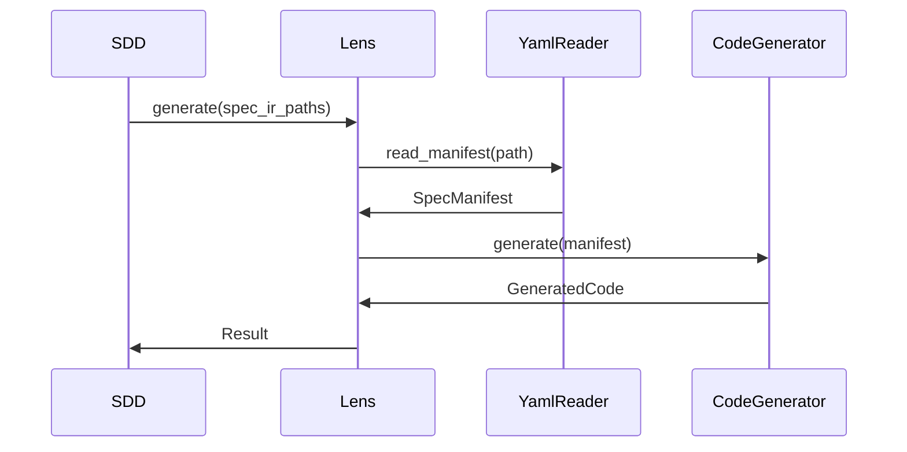

<spec>

# Lens YAML-Based Code Generation

## Overview
<!-- type: doc lang: markdown -->

Updates Lens to read SpecIR YAML manifests from disk and dispatch them to the appropriate CodeGenerator implementation. This replaces the direct Rust struct injection used previously.

## Requirements
<!-- type: doc lang: markdown -->

### R1 - YAML Reader

```yaml
id: R1
priority: medium
status: draft
```

Lens must provide a reader that deserializes YAML files into the `SpecManifest` struct defined in the schema spec.

### R2 - Generic Generator Input

```yaml
id: R2
priority: medium
status: draft
```

The `CodeGenerator` trait must be updated (or wrapped) to accept `SpecManifest` input, allowing generators to consume the standard IR format.

### R3 - Generator Dispatch

```yaml
id: R3
priority: medium
status: draft
```

Lens must dispatch the parsed manifest to the correct generator based on the `kind` field and the target language configuration.

## Acceptance Criteria
<!-- type: doc lang: markdown -->

### Scenario: Generate from YAML

- **WHEN** Lens is invoked with valid YAML IR paths
- **THEN** Code is generated successfully matching the spec content

### Scenario: Invalid YAML Format

- **WHEN** Lens encounters a malformed YAML file
- **THEN** An error is returned describing the parsing failure

### Scenario: Unsupported Kind

- **WHEN** Lens encounters a manifest with an unknown kind
- **THEN** An error is returned stating no generator found for kind

## Diagrams
<!-- type: doc lang: markdown -->

### Codegen Flow



</spec>
