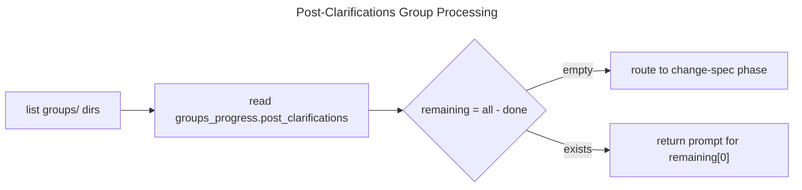

> **ARCHIVED**: This phase was absorbed by the issue lifecycle CRR (issue-lifecycle-crr).
> Pre-SDD preparation (clarifications, reference context) now happens during issue authoring
> via `aw wi create` + `aw wi validate`, before `score workflow` begins.

# Post-Clarifications

> **NOTE (2026-04-12):** This phase is absorbed by issue preparation.
> The issue's `## Scope` + `## Acceptance Criteria` sections provide the post-clarification content.
> `init_change` → `try_structured_issue_skip` auto-generates `groups/default/post_clarifications.md`
> from the issue body. No agent-driven phase exists for post-clarifications in the SDD change flow.
> See: `issue-centric-workflow.md` R7, `structured-issue.md` R2.

## Overview
<!-- type: overview lang: markdown -->

Post-clarifications is the phase that surfaces contradictions between requirements and referenced specs before change-spec creation. Like pre-clarifications, it runs breadth-first across groups.

| Field | Value |
|-------|-------|
| from | PostClarificationsCreated |
| to | ChangeSpecCreated (via run_change routing after all groups done) |
| executor | mainthread |
| crr | false (create-only, no review/revise) |
| progress_key | groups_progress.post_clarifications |

## Diagrams
<!-- type: diagram lang: mermaid -->

### Logic
<!-- type: logic lang: mermaid -->

Same breadth-first pattern as pre-clarifications. One group per call.



## Prompt Template
<!-- type: prompt lang: markdown -->

```text
Task: Post-Clarifications for group '{{group_id}}'

Read all context gathered so far and identify contradictions or gaps.

Context Sources (read all 4):
1. sdd_read_artifact(scope="user_input")
2. sdd_read_artifact(scope="pre_clarifications", group_id="{{group_id}}")
3. sdd_read_artifact(scope="reference_context", group_id="{{group_id}}")
4. Read the group's requirements.md

Analysis:
1. Contradiction mining: Compare requirements against referenced specs.
   - Does any requirement conflict with an existing spec?
   - Do different referenced specs contradict each other?
2. Assumption surfacing: What implicit assumptions need explicit confirmation?
3. Skip-fast decision: If no contradictions and no ambiguities → skip

Output:
- If contradictions found: ask user to resolve, then call sdd_artifact_create_post_clarifications
- If no contradictions: call sdd_artifact_create_post_clarifications with skipped: true
```

## Schema
<!-- type: schema lang: yaml -->

### Input params

```yaml
type: object
required: [group_id]
properties:
  group_id:
    type: string
  skipped:
    type: boolean
    description: true if no contradictions found
  questions:
    type: array
    items:
      type: object
      required: [topic, question, answer]
      properties:
        topic:
          type: string
        question:
          type: string
        answer:
          type: string
  contradictions:
    type: array
    items:
      type: object
      required: [spec_id, requirement, conflict, resolution]
      properties:
        spec_id:
          type: string
        requirement:
          type: string
        conflict:
          type: string
        resolution:
          type: string
```

### Output file

Path: `.aw/changes/{change_id}/groups/{group_id}/post_clarifications.md`

Two variants:

**Skipped** (no contradictions):

```text
---
status: skipped
group_id: "{group_id}"
---
No contradictions found. Proceeding to spec creation.
```

**Clarified** (contradictions resolved):

```text
---
status: clarified
group_id: "{group_id}"
---
Contradictions:
- spec_id: {spec_id}
  requirement: {requirement}
  conflict: {conflict}
  resolution: {resolution}

Additional Questions:
- topic: {topic}
  Q: {question}
  A: {answer}
```

## Side Effects
<!-- type: side-effects lang: markdown -->

| Action | STATE.yaml change |
|--------|-------------------|
| `sdd_artifact_create_post_clarifications` | Appends group_id to `groups_progress.post_clarifications` |
| All groups done | run_change routes to `sdd_workflow_create_change_spec` |

## Changes
<!-- type: changes lang: yaml -->

```yaml
changes:
  - action: annotate
    section: logic
    impl_mode: hand-written
    description: "Traceability metadata edge for the logic section."

  - action: annotate
    section: schema
    impl_mode: hand-written
    description: "Traceability metadata edge for the schema section."

```