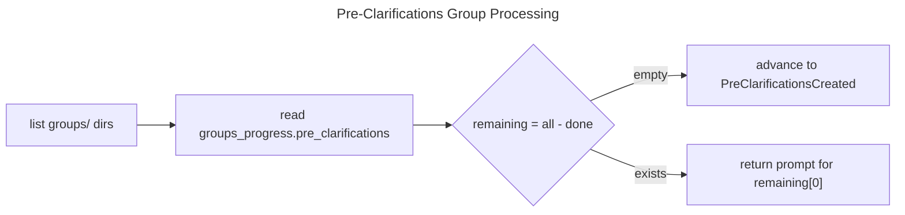

> **ARCHIVED**: This phase was absorbed by the issue lifecycle CRR (issue-lifecycle-crr).
> Pre-SDD preparation (clarifications, reference context) now happens during issue authoring
> via `aw wi create` + `aw wi validate`, before `score workflow` begins.

# Pre-Clarifications

> **NOTE (2026-04-12):** This phase is absorbed by issue preparation.
> The issue's `## Key Decisions` section provides the pre-clarification content.
> `init_change` → `try_structured_issue_skip` auto-generates `groups/default/pre_clarifications.md`
> from the issue body. No agent-driven phase exists for pre-clarifications in the SDD change flow.
> See: `issue-centric-workflow.md` R7, `structured-issue.md` R2.

## Overview
<!-- type: overview lang: markdown -->

Pre-clarifications is the phase that answers pre-generated questions for each group before reference context exploration. It runs breadth-first across groups, one group per workflow call, and advances to `PreClarificationsCreated` when all groups are processed.

| Field | Value |
|-------|-------|
| from | InputRestructured |
| to | PreClarificationsCreated |
| executor | mainthread |
| crr | false (create-only, no review/revise) |
| progress_key | groups_progress.pre_clarifications |

## Diagrams
<!-- type: diagram lang: mermaid -->

### Logic
<!-- type: logic lang: mermaid -->

Breadth-first group processing: one group per `sdd_workflow_create_pre_clarifications` call. The workflow tool determines the next unfinished group from `groups_progress.pre_clarifications`.



## Prompt Template
<!-- type: prompt lang: markdown -->

```text
Task: Pre-Clarifications for group '{{group_id}}'

Read the pre-generated questions and ask the user for answers.

Steps:
1. Read: sdd_read_artifact(scope="pre_clarifications", group_id="{{group_id}}")
2. For each question with status: pending:
   - Present the question to the user (use your own judgment to determine what needs clarifying)
   - If the answer is obvious from context, fill it yourself
   - If genuinely ambiguous, ask the user
3. Call sdd_artifact_create_pre_clarifications with all answers

Important:
- Do NOT invent new questions — only answer the pre-generated ones
- If a question is irrelevant, answer "N/A — {reason}"
- Include follow_up_questions only if the answer reveals new ambiguities
```

## Schema
<!-- type: schema lang: yaml -->

### Input: answers array

```yaml
type: array
minItems: 1
items:
  type: object
  required: [topic, answer]
  properties:
    topic:
      type: string
    answer:
      type: string
    follow_up_questions:
      type: array
      items:
        type: string
```

### Output: pre_clarifications.md (updated)

Two-phase lifecycle:

1. **Pending** (written by `restructure_input`): questions only, `status: pending`
2. **Answered** (written by `create_pre_clarifications`): questions + answers, `status: answered`

```yaml
type: object
required: [status, group_id]
properties:
  status:
    type: string
    enum: [pending, answered]
  group_id:
    type: string
  questions:
    type: array
    items:
      type: object
      required: [topic, question]
      properties:
        topic:
          type: string
        question:
          type: string
        answer:
          type: string
```

Example frontmatter-based output file:

```text
---
status: answered
group_id: "{group_id}"
---
Questions:

- topic: {topic}
  Q: {question}
  A: {answer}
```

## Side Effects
<!-- type: side-effects lang: markdown -->

| Action | STATE.yaml change |
|--------|-------------------|
| `sdd_artifact_create_pre_clarifications` | Appends group_id to `groups_progress.pre_clarifications` |
| All groups done | `phase → PreClarificationsCreated` |

## Changes
<!-- type: changes lang: yaml -->

```yaml
changes:
  - action: annotate
    section: logic
    impl_mode: hand-written
    description: "Traceability metadata edge for the logic section."

  - action: annotate
    section: schema
    impl_mode: hand-written
    description: "Traceability metadata edge for the schema section."

```