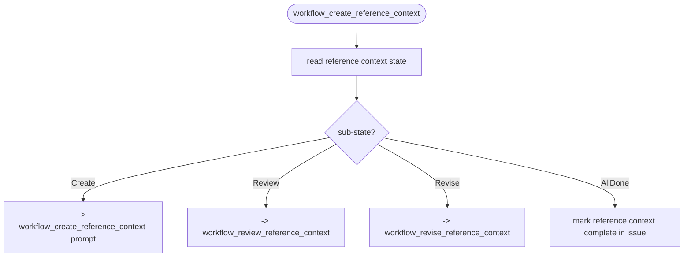
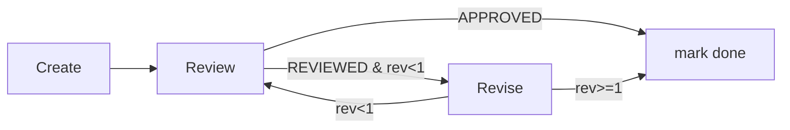
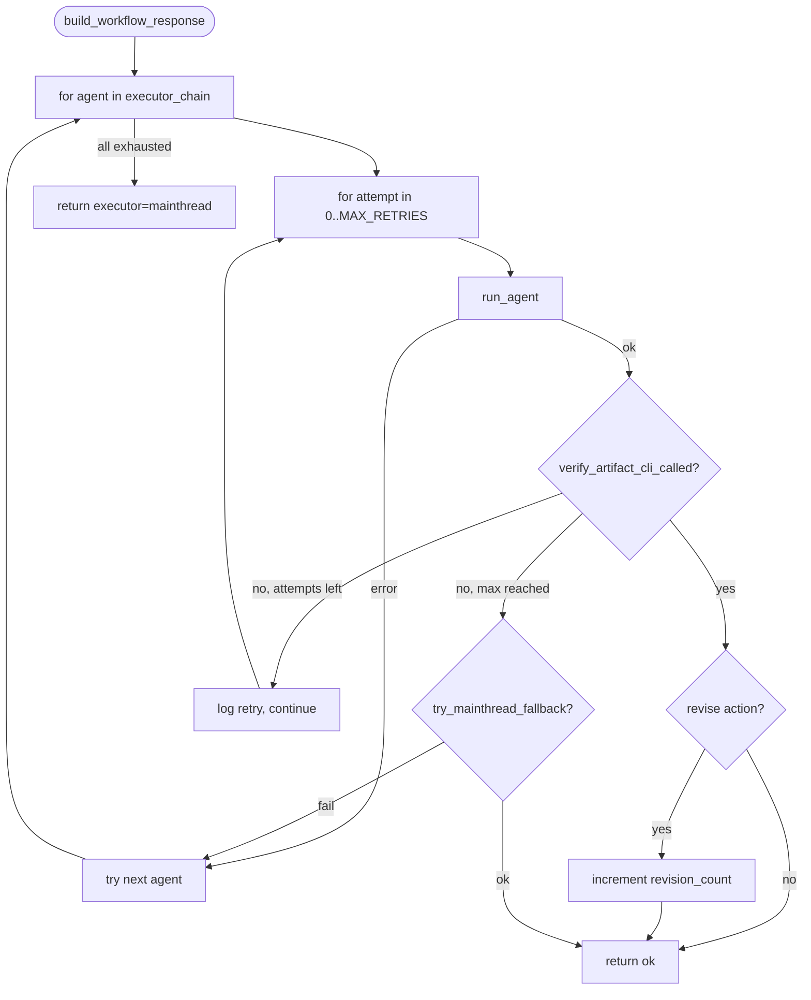

# Reference Context

> **NOTE (2026-04-13):** This phase is now absorbed by issue preparation.
> Reference context is filled during issue authoring via `aw wi enrich <slug>`
> (dispatches `score-issue-author` agent). The SDD change spec prompt reads the
> `## Reference Context` section from the issue body directly -- no intermediate
> artifacts are generated. The CRR cycle below does NOT run in the SDD change
> flow -- it describes the agent-driven exploration that happens BEFORE
> `score run-change`.
> See: `issue-centric-workflow.md` R7, `structured-issue.md` R2.

## Phase Transition
<!-- type: overview lang: markdown -->

```yaml
# NOTE: This phase no longer runs during the SDD change workflow.
# Reference context is filled during issue authoring (score-issue-author agent).
# The phase transition below describes the historical CRR cycle.
from: PreClarificationsCreated  # REMOVED -- no longer a valid phase
to: PostClarificationsCreated    # REMOVED -- no longer a valid phase
executor: [mainthread]
crr: true  # CRR cycle ran during issue authoring, not during SDD change
max_revisions: 1  # auto-approve on exceed
```

## Central Router
<!-- type: doc lang: markdown -->

`sdd_workflow_create_reference_context` is a **central router** that manages CRR lifecycle for the change. Each call:

1. Reads sub-state (Create/Review/Revise/AllDone)
2. Returns `next_actions` pointing to the appropriate tool



## Sub-State Enum
<!-- type: overview lang: markdown -->

```yaml
SubState:
  Create: "No reference_context.md -- needs creation"
  Review: "reference_context.md exists, no review section -- needs review"
  Revise: "Reviewed with issues, revision_count < max -- needs revision"
  AllDone: "APPROVED or revision_count >= max -- mark done"
```

## Artifact Writing Enforcement
<!-- type: overview lang: markdown -->

Agents must write artifacts via CLI (`cclab sdd artifact create-reference-context`), not by directly writing files. The system enforces this with a two-layer approach:

### Layer 1: Prompt Constraint

All agent prompts include:

```
### CRITICAL: Artifact Writing Rule

DO NOT use Write or Edit tools to create/modify artifact files directly.
You MUST use the artifact CLI command. Direct file writes will be REJECTED.
```

### Layer 2: Retry Loop + Mainthread Fallback

Handled by `build_workflow_response()` in `workflow_common.rs`. See [Agent Retry Mechanism](#agent-retry-mechanism) for the full flow.

On each agent attempt, `verify_artifact_cli_called()` checks for the `written_by: artifact_cli` marker. If absent after max retries, `try_mainthread_fallback()` extracts spec references from the agent's prose and calls `execute_artifact()` internally.

## Prompt Templates
<!-- type: doc lang: markdown -->

### Create

```markdown
# Task: Build Reference Context for change '{{change_id}}'

Explore the codebase and specs to identify relevant references for this change.

### Steps

1. Read: `pre_clarifications.md`
2. Read: `user_input.md`
3. Explore:
   - Search `.aw/tech-design/` for related specs
   - Search `cclab/knowledge/` for relevant docs
4. For each relevant spec/doc, assess relevance (high/medium/low)
5. Write payload JSON, then run:
   `cclab sdd artifact create-reference-context {{change_id}} <payload_path>`

### Output: specs array

Each spec reference must include:
- spec_id: path relative to .aw/tech-design/
- spec_group: logical grouping (e.g. "mcp-tools", "state-machine")
- relevance: high | medium | low
- key_requirements: array of relevant requirement summaries

### Output: spec_plan array

For each change spec that will be created:
- spec_id: identifier for the new change spec
- action: "modify" (copy existing) or "create" (new skeleton)
- main_spec_ref: target path in .aw/tech-design/ (REQUIRED)
- source: path of existing spec to copy (only for "modify")
- sections: array of section types this spec needs (see change-spec.md Section Selection)
```

### Review

```markdown
# Task: Review Reference Context for change '{{change_id}}'

### Checklist

- [ ] Coverage: all relevant specs identified (no major gaps)
- [ ] Relevance scores: high/medium/low correctly assigned
- [ ] Key requirements: accurately summarize what matters
- [ ] No false positives: irrelevant specs not included
- [ ] Completeness: knowledge docs and code references included
- [ ] spec_plan: every entry has main_spec_ref set (not null)
- [ ] spec_plan: sections are reasonable for the requirements
- [ ] spec_plan: modify entries have valid source paths

### Verdict

- APPROVED: checklist passes -> mark done
- REVIEWED: issues found, revision_count < 1 -> route to revise
- Auto-approve: revision_count >= 1 -> mark done regardless
```

### Revise

```markdown
# Task: Revise Reference Context for change '{{change_id}}'

Read review feedback and update reference context.

1. Read current: `reference_context.md`
2. Address each review issue
3. Write corrected payload JSON, then run:
   `cclab sdd artifact revise-reference-context {{change_id}} <payload_path>`
```

## CRR Cycle
<!-- type: doc lang: markdown -->



Max 1 revision per change. Auto-approve on exceed.

## Artifact Schema
<!-- type: schema lang: yaml -->

```yaml
# specs array (create + revise input)
specs:
  type: array
  minItems: 1
  items:
    type: object
    required: [spec_id, spec_group, relevance]
    properties:
      spec_id: {type: string}
      spec_group: {type: string}
      relevance:
        type: string
        enum: [high, medium, low]
      key_requirements:
        type: array
        items: {type: string}

# spec_plan array (create input)
# Determines which change specs will be created, where they merge to, and which sections each spec needs.
spec_plan:
  type: array
  minItems: 1
  items:
    type: object
    required: [spec_id, action, main_spec_ref, sections]
    properties:
      spec_id:
        type: string
        description: Change spec identifier
      action:
        type: string
        enum: [modify, create]
      main_spec_ref:
        type: string
        description: Target path in .aw/tech-design/ (REQUIRED)
      source:
        type: string
        description: Existing spec to copy (only for modify)
      sections:
        type: array
        items:
          type: string
          enum:
            - overview
            - rest-api
            - rpc-api
            - async-api
            - cli
            - schema
            - logic
            - interaction
            - state-machine
            - db-model
            - test-plan
            - dependency
            - wireframe
            - component
            - design-token
            - config
            - changes
        description: Section types this spec needs. Determined by rule engine + agent input.

# review params
review_params:
  type: object
  properties:
    verdict:
      type: string
      enum: [APPROVED, REVIEWED]
    summary: {type: string}
    checklist_results:
      type: array
      items:
        type: object
        required: [item, passed]
        properties:
          item: {type: string}
          passed: {type: boolean}
          note: {type: string}
    issues:
      type: array
      items:
        type: object
        required: [severity, description]
        properties:
          severity:
            type: string
            enum: [HIGH, MEDIUM, LOW]
          description: {type: string}
          recommendation: {type: string}
```

**Section selection**: CLI rule engine matches requirements text against keyword patterns to suggest sections (see `change-spec.md` Section Selection). Agent may adjust during reference_context creation. Review CRR catches gaps.

After reference_context is approved, the system uses `spec_plan` to **prepare spec files**:
- `action: modify` -> copy `.aw/tech-design/{source}` to `specs/{spec_id}.md` at the change root, set `main_spec_ref`
- `action: create` -> write skeleton with `<!-- TODO -->` for each section in `sections` at the change root, set `main_spec_ref`

This ensures every spec has `main_spec_ref` and `sections` set before change_spec phase begins.

## Agent Retry Mechanism
<!-- type: doc lang: markdown -->

When an agent completes but doesn't call the artifact CLI, the workflow layer retries before falling back to mainthread.

```yaml
MAX_AGENT_RETRIES: 2  # 3 total attempts (initial + 2 retries)
```



### Verification Function

`verify_artifact_cli_called(action, change_dir, extra_fields) -> bool`:

| Action pattern | Checks for |
|---------------|------------|
| `create_reference_context`, `revise_reference_context` | `written_by: artifact_cli` marker in change's `reference_context.md` |
| `review_reference_context` | `review_verdict:` presence in frontmatter |
| Other actions | Returns `true` (no verification, preserves existing behavior) |

### Mainthread Fallback

`try_mainthread_fallback(action, change_dir, extra_fields, project_root) -> bool`:

Only applies to `create_reference_context` and `revise_reference_context`. Reads agent's prose file, extracts spec references via `extract_specs_from_prose()`, and calls `execute_artifact()` internally.

## Side Effects
<!-- type: overview lang: markdown -->

| Action | STATE.yaml change | Owner |
|--------|-------------------|-------|
| Create artifact | write `reference_context.md` at change root | artifact CLI |
| Review artifact (APPROVED) | Marks reference context as complete | workflow layer |
| Review artifact (auto-approve) | Same as APPROVED | workflow layer |
| Revise artifact | write `reference_context.md` at change root | artifact CLI |
| Revise workflow (post-agent) | `revision_counts.{key} += 1` | workflow layer |
| Done (issue authoring) | Marks `## Reference Context` complete in issue body | score-issue-author agent |


## Changes
<!-- type: doc lang: markdown -->

### Update: Create Prompt Template

Replace the `### Create` block with an updated version containing two additions.

**Addition 1 -- `## Existing Spec Structure` block.**

Insert immediately before `## Steps`:

```
### Existing Spec Structure

The following ASCII tree shows existing spec directories for the affected crate(s). Use this to plan spec_plan entries -- prefer modifying existing files over creating new ones.

{{spec_dir_tree}}
```

`{{spec_dir_tree}}` is a template variable substituted by `build_create_prompt` with an ASCII tree (same format as the `tree` CLI tool) generated by `build_spec_dir_tree` in `workflow/scope.rs`:

```yaml
function: build_spec_dir_tree
module: workflow/scope.rs
signature: >
  pub fn build_spec_dir_tree(spec_scopes: &[String], project_root: &Path, config: Option<&SddConfig>) -> String
behavior:
  - For each scope, call resolve_spec_dir to get the spec root path
  - Walk directory recursively
  - Render ASCII tree: / / |  prefix (tree CLI format)
  - Return empty string if no spec directories found
```

**Addition 2 -- spec_plan guidance.**

In `## Output: spec_plan array`, replace the `main_spec_ref` bullet and add rules after the `sections` bullet:

```
- main_spec_ref: target path in .aw/tech-design/ (REQUIRED -- must include a named subfolder,
  e.g. `crates/cclab-sdd/logic/foo.md`, not `crates/cclab-sdd/foo.md`)

**Action preference**: Use `action: modify` for any file visible in the spec directory tree
above. Reserve `action: create` for genuinely new subsystems with no existing spec file.
```

### Update: Review Prompt Checklist

Add one item after `spec_plan: sections are reasonable for the requirements`:

```
- [ ] spec_plan: main_spec_ref paths include a subfolder (not root-level under crate)
```

### Add: Spec_plan Path Validation

New section `## Spec_plan Path Validation` to be inserted after `## Artifact Schema`.

`prepare_specs_from_plan` validates each `spec_plan` entry before preparing files. Validation is a hard error -- spec preparation is aborted if any entry fails.

| Check | Rule | Failure Mode |
|-------|------|--------------|
| Subfolder required | `main_spec_ref` must have >= 4 path components separated by `/` (e.g. `crates/cclab-sdd/logic/foo.md`). Root-level crate paths such as `crates/cclab-sdd/foo.md` are rejected. | Hard error -- spec preparation aborted, no files written |

### Update: spec_plan Schema -- `main_spec_ref` Description

In the `### spec_plan array` JSON Schema block, update the `main_spec_ref` property description:

| Before | After |
|--------|-------|
| `"description": "Target path in .aw/tech-design/ (REQUIRED)"` | `"description": "Target path in .aw/tech-design/ (REQUIRED -- must reside in a named subfolder, min 4 path components: {category}/{crate}/{subdir}/{file}.md)"` |

## Changes (issue-lifecycle-crr)
<!-- type: changelog lang: markdown -->

### reference_context.md No Longer Generated as init_change Artifact

Previously, `try_structured_issue_skip()` in init_change would auto-generate `reference_context.md` from the issue's `## Reference Context` section. This intermediate artifact generation has been removed.

The spec prompt now reads the issue file directly to obtain reference context information. The `## Reference Context` section in the issue body serves as the canonical source of reference context data, replacing the `groups/default/reference_context.md` artifact during the early phases.

### Issue Section Replaces Artifact

| Before (removed) | After (current) |
|-------------------|-----------------|
| init_change generates `reference_context.md` from issue body | Spec prompt reads `## Reference Context` from issue file directly |
| `try_structured_issue_skip()` writes intermediate artifacts | No intermediate artifacts; issue body is the source of truth |
| Artifacts: `requirements.md`, `pre_clarifications.md`, `post_clarifications.md`, `reference_context.md` | None of these are generated at init_change time |

The CRR cycle documented above (Create/Review/Revise sub-states) still applies to the agent-driven exploration during issue authoring via `aw wi enrich`, but does NOT run during the SDD change flow itself.

## Traceability Changes
<!-- type: changes lang: yaml -->

```yaml
changes:
  - action: annotate
    section: schema
    impl_mode: hand-written
    description: "Traceability metadata edge for the schema section."

```