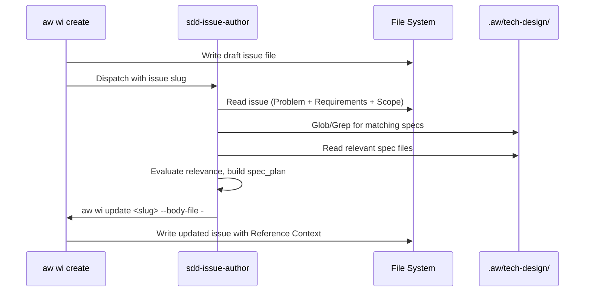
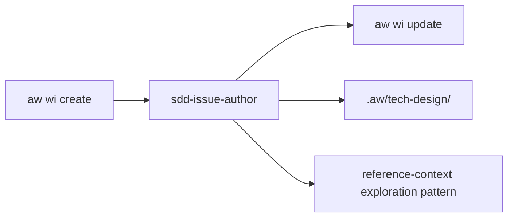

# SDD Issue Author Agent

## Overview
<!-- type: overview lang: markdown -->

The `sdd-issue-author` subagent handles Reference Context exploration during issue creation. It reads an issue's Problem + Requirements + Scope sections, explores specs in `.aw/tech-design/`, and writes back a completed Reference Context section (spec table + spec_plan) to the issue file.

| Aspect | Value |
|--------|-------|
| Agent name | `sdd-issue-author` |
| Tools | Read, Glob, Grep, Bash (read-only) |
| disallowedTools | Write, Edit, Agent |
| Model | sonnet |
| maxTurns | 20 |
| Input | Issue file with Problem + Requirements + Scope |
| Output | Issue file updated with Reference Context via `aw wi update --body-file` |
| Dispatch | `aw wi create` (after local draft written) |

### Interaction Pattern

1. `aw wi create` writes local draft (Problem + Requirements + Scope)
2. CLI dispatches `sdd-issue-author` with issue slug
3. Agent reads issue, explores `.aw/tech-design/` specs
4. Agent builds spec table (path, relevance, summary) and spec_plan (spec_id, action, main_spec_ref, sections)
5. Agent writes updated issue body via `aw wi update <slug> --body-file -`
6. CLI validates on write (write-time validation)

### Relationship to sdd-reference-context

Reuses the same exploration pattern (read specs, evaluate relevance, build spec_plan) but:
- Operates on issues, not change artifacts
- Input is issue sections, not change requirements
- Output is written to issue file, not to `reference_context.md` artifact
- No CRR cycle -- single pass, no review/revise

## Requirements
<!-- type: requirements lang: mermaid -->

```mermaid
---
id: sdd-issue-author-requirements
title: SDD Issue Author Requirements
requirements:
  R1:
    text: Agent reads issue Problem + Requirements + Scope sections
    type: functional
    priority: high
    risk: low
    verification: test
  R2:
    text: Agent explores specs under .aw/tech-design/ matching issue scope
    type: functional
    priority: high
    risk: medium
    verification: test
  R3:
    text: Agent evaluates spec relevance (high/medium/low)
    type: functional
    priority: high
    risk: low
    verification: test
  R4:
    text: Agent builds spec_plan with spec_id, action (create/modify), main_spec_ref, sections
    type: functional
    priority: high
    risk: low
    verification: test
  R5:
    text: Agent writes Reference Context back to issue via `aw wi update --body-file`
    type: functional
    priority: high
    risk: low
    verification: test
  R6:
    text: Agent prompt reuses exploration logic from sdd-reference-context
    type: functional
    priority: medium
    risk: low
    verification: inspection
  R7:
    text: Read-only tools only -- no Write, Edit, Agent
    type: security
    priority: high
    risk: low
    verification: inspection
---
requirementDiagram
    requirement R1 {
      id: R1
      text: Agent reads issue Problem + Requirements + Scope sections
      risk: low
      verifymethod: test
    }
    requirement R2 {
      id: R2
      text: Agent explores specs under .aw/tech-design/
      risk: medium
      verifymethod: test
    }
    requirement R3 {
      id: R3
      text: Agent evaluates spec relevance
      risk: low
      verifymethod: test
    }
    requirement R4 {
      id: R4
      text: Agent builds spec_plan
      risk: low
      verifymethod: test
    }
    requirement R5 {
      id: R5
      text: Agent writes Reference Context back via issues update
      risk: low
      verifymethod: test
    }
    requirement R6 {
      id: R6
      text: Reuses sdd-reference-context exploration pattern
      risk: low
      verifymethod: inspection
    }
    requirement R7 {
      id: R7
      text: Read-only tools only
      risk: low
      verifymethod: inspection
    }
```

## Scenarios
<!-- type: scenarios lang: yaml -->

```yaml
scenarios:
  S1:
    name: Agent reads issue and explores specs
    verifies: [R1, R2]
    given: |
      An issue `enhancement-add-retry.md` exists with Problem, Requirements, and Scope sections
    when: |
      `sdd-issue-author` is dispatched with slug `enhancement-add-retry`
    then: |
      - The agent reads the issue file
      - Explores `.aw/tech-design/` for specs matching the scope (e.g. `projects/agentic-workflow/`)
  S2:
    name: Agent builds spec table with relevance
    verifies: [R3]
    given: The agent has explored specs in `.aw/tech-design/`
    when: The agent evaluates each spec
    then: |
      Each spec entry includes path, relevance (high/medium/low), and a summary of key requirements
  S3:
    name: Agent builds spec_plan
    verifies: [R4]
    given: The agent has identified relevant specs
    when: The agent builds the spec_plan
    then: |
      Each entry has spec_id, action (create or modify), main_spec_ref, and sections array
  S4:
    name: Agent writes Reference Context to issue
    verifies: [R5]
    diagram_ref: "#interaction"
    given: The agent has built the spec table and spec_plan
    when: The agent writes the output
    then: |
      - Uses `aw wi update <slug> --body-file -` to pipe the updated body
      - The issue file now contains a `## Reference Context` section with the spec table and spec_plan
  S5:
    name: Agent uses read-only tools only
    verifies: [R7]
    given: The agent is dispatched
    when: The agent executes
    then: |
      - Only uses Read, Glob, Grep, and Bash (read-only) tools
      - Write, Edit, and Agent tools are disallowed
```

## Diagrams
<!-- type: diagram lang: mermaid -->

### Interaction
<!-- type: interaction lang: mermaid -->



### Dependencies

<!-- type: dependency lang: mermaid -->



## Changes (issue-lifecycle-crr)
<!-- type: changelog lang: markdown -->

### CRR Awareness

The sdd-issue-author agent's output is now subject to CRR (Create-Review-Revise) quality review via `aw wi validate <slug>`. The agent should target the following quality criteria to pass validation on first attempt:

| Criterion | Validation Check |
|-----------|-----------------|
| Required sections | `## Problem`, `## Requirements`, `## Scope` all present with non-empty content |
| R-id format | Every requirement list item matches `^R\d+:` pattern |
| Out of Scope | `### Out of Scope` sub-heading present under `## Scope` |
| Spec Plan | `### Spec Plan` table present under `## Reference Context` |
| No ambiguity | No TBD, TODO, maybe, unclear, uncertain in requirement text |

The agent does not run the validation itself -- the downstream `aw wi validate` command handles that. But the agent should be aware of these criteria to produce issue content that passes on the first attempt, avoiding unnecessary CRR revision cycles.

### Draft-to-Open Promotion

After the agent writes the issue, the issue remains in `state: draft`. The CRR loop (`aw wi validate <slug>`) must be run separately to promote the issue to `state: open`, which is the prerequisite for entering `init_change`.

## Changes
<!-- type: changes lang: yaml -->

```yaml
changes:
  - action: annotate
    section: dependency
    impl_mode: hand-written
    description: "Traceability metadata edge for the dependency section."

  - action: annotate
    section: interaction
    impl_mode: hand-written
    description: "Traceability metadata edge for the interaction section."

  - action: annotate
    section: requirements
    impl_mode: hand-written
    description: "Traceability metadata edge for the requirements section."

  - action: annotate
    section: scenarios
    impl_mode: hand-written
    description: "Traceability metadata edge for the scenarios section."

```