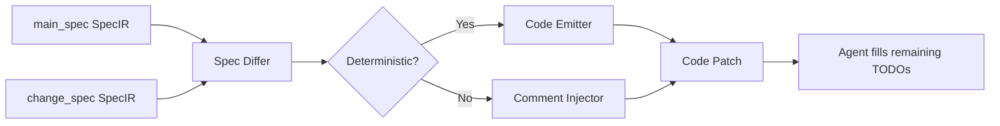

# Spec Diff → Code Diff Pipeline

## Problem
<!-- type: doc lang: markdown -->

SDD's implementation phase gives agents a change spec and asks them to write code from scratch. This is expensive (tokens), unreliable (agent drift), and doesn't leverage SDD's structured spec format.

## Core Insight
<!-- type: doc lang: markdown -->

Change specs modify main specs. Both are structured (JSON Schema, Mermaid, OpenRPC, YAML). The diff between main_spec and change_spec is **computable** and maps to deterministic code changes.

```
main_spec ←→ change_spec → spec_diff → code_diff
```

## Pipeline
<!-- type: doc lang: markdown -->



## Determinism by Section Type
<!-- type: doc lang: markdown -->

| Section Type | Format | Diffable? | Codegen | Example Diff → Code |
|---|---|---|---|---|
| data-model | JSON Schema | ✅ | ✅ deterministic | +field → `pub email: String` |
| state-machine | Mermaid | ✅ | ✅ deterministic | +state → match arm |
| rest-api | OpenAPI | ✅ | ✅ deterministic | +endpoint → handler stub + route |
| rpc-api | OpenRPC | ✅ | ✅ deterministic | +method → handler fn |
| cli | YAML | ✅ | ✅ deterministic | +subcommand → clap variant |
| config | JSON Schema | ✅ | ✅ deterministic | +field → config struct field |
| async-api | AsyncAPI | ✅ | ✅ deterministic | +channel → subscriber/publisher |
| scenarios | GWT markdown | ⚠️ semi | ⚠️ skeleton | +scenario → test fn with todo!() |
| requirements | prose | ❌ | ❌ inject | → `// REQ: <text>` comment |
| overview | prose | ❌ | ❌ inject | → module doc comment |

## Existing Infrastructure
<!-- type: doc lang: markdown -->

### SpecIR (fully built)

```
spec/ir.rs — 5 variants:
  DataModel(DataModelSpec)   — models, enums, relationships, fields with constraints
  RestApi(RestApiSpec)       — endpoints, parameters, request bodies, responses, security
  EventApi(EventApiSpec)     — channels, messages, payload schemas
  StateMachine(StateMachineSpec) — states, transitions, guards, actions
  ControlFlow(ControlFlowSpec)   — nodes, edges, conditions
```

All variants have **structured ASTs** with typed fields — not strings.

### Parsers (fully built)

- Mermaid parser → StateMachineSpec, ControlFlowSpec, etc.
- OpenAPI parser → RestApiSpec
- JSON Schema → DataModelSpec
- AsyncAPI → EventApiSpec

### Code Generators (fully built, but full-gen only)

```
gen/rust/   — Serde structs, Axum handlers, Sqlx models, Reqwest clients
gen/python/ — Validation models, PostgreSQL ORM, MongoDB ORM, HTTP clients, API routes
gen/framework/ — FastAPI, Express, Axum full project scaffolds
```

All implement `CodeGenerator::generate(spec: &SpecIR) → Vec<GeneratedCode>`.

### Template Engine (Tera — ready)

Custom filters: `pascal_case`, `camel_case`, `snake_case`, `kebab_case`.

## What's Missing
<!-- type: doc lang: markdown -->

### 1. SpecDiff IR

```rust
/// Represents a structured diff between two SpecIR instances
pub enum SpecDiff {
    DataModel(DataModelDiff),
    StateMachine(StateMachineDiff),
    RestApi(RestApiDiff),
    // ...
}

pub struct DataModelDiff {
    pub added_models: Vec<ModelDef>,
    pub removed_models: Vec<String>,
    pub modified_models: Vec<ModelModification>,
}

pub struct ModelModification {
    pub model_name: String,
    pub added_fields: Vec<FieldDef>,
    pub removed_fields: Vec<String>,
    pub changed_fields: Vec<(FieldDef, FieldDef)>, // (old, new)
}
```

### 2. Diff-Aware Code Emitters

Current generators output **full files**. Need incremental emitters:

```rust
pub trait IncrementalCodeGenerator {
    fn can_apply(&self, diff: &SpecDiff) -> bool;
    fn apply(&self, diff: &SpecDiff, existing_code: &str) -> GenResult<CodePatch>;
}
```

### 3. Non-Deterministic Injector

For prose/requirement diffs — inject as comments referencing the change spec:

```rust
// SPEC-CHANGE(sdd-index-scoped-toolchain/index-config-model):
// "Add scope-specific search paths for import resolution"
// See: .aw/changes/sdd-index-scoped-toolchain/specs/index-config-model.md
todo!("implement scope search path resolution")
```

## MVP Strategy
<!-- type: doc lang: markdown -->

**Phase 1: Full-gen + unified diff** (2-3 weeks)
1. Parse main_spec → SpecIR (old)
2. Parse change_spec → SpecIR (new)
3. Run existing generators on both → old_code, new_code
4. `unified_diff(old_code, new_code)` → patch
5. Inject patch + non-deterministic comments into implementation prompt

No new generators needed — reuse existing ones, just diff their outputs.

**Phase 2: SpecDiff IR** (2-3 weeks)
1. Define SpecDiff types for each SpecIR variant
2. Implement tree-structural diff algorithms
3. Use SpecDiff for richer prompt context ("these 3 fields were added")

**Phase 3: Incremental code emitters** (4-6 weeks)
1. Diff-aware generators that output patches, not full files
2. AST-based patch application (tree-sitter)
3. Conflict detection

## Why #1 and #2 Are Unnecessary
<!-- type: doc lang: markdown -->

This pipeline eliminates the need for:
- **Code → Spec traceability** (#1): Direction is always spec → code
- **"Code references spec" scope** (#2): Spec diff itself defines the scope of changes
- The spec IS the source of truth; code is a derived artifact
