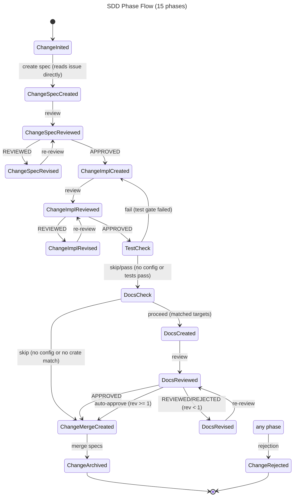

# Refactor Eliminate State Yaml User Input Md Groups Nesting Spec

## Overview
<!-- type: overview lang: markdown -->

Eliminate the vestigial `STATE.yaml` store and enforce the invariant that `change_id == issue_slug` across the SDD toolchain. Today `init_change` unconditionally treats `change_id` as the issue slug and, when that mismatches reality, silently falls back to writing `STATE.yaml` — producing changes with no title, no phase in issue frontmatter, and invisible workflow state. This change (a) rejects mismatched `change_id`/`issue_slug` pairs at the `init_change` boundary, (b) removes the `save_yaml_fallback` and `load_yaml` paths so sync-to-issue failures propagate as hard errors, and (c) deletes the dead `user_input.md` and `groups/{gid}/` nesting from the change scaffold. After the change, issue frontmatter is the single source of workflow truth; `meta.yaml` remains only for per-iteration operational data (checksums, telemetry, delegation guard).

## Requirements
<!-- type: requirements lang: mermaid -->

```mermaid
---
id: requirements
---
requirementDiagram

requirement R1 {
  id: R1
  text: "init_change rejects requests where resolved issue_slug differs from change_id with error 'change_id <x> does not match resolved issue slug <y>. change_id must equal the issue slug (one issue = one change).'"
  risk: high
  verifymethod: test
}

requirement R2 {
  id: R2
  text: "score run-change and score workflow <action> <change_id> refuse to operate when .aw/issues/{open,closed}/<change_id>.md does not exist, returning the same change_id-must-equal-issue-slug error."
  risk: high
  verifymethod: test
}

requirement R3 {
  id: R3
  text: "CLI entry points that accept both --change-id and --issue are deprecated. change_id is auto-derived from issue slug; the --change-id override is removed."
  risk: medium
  verifymethod: inspection
}

requirement R4 {
  id: R4
  text: "StateManager::save() removes the STATE.yaml fallback. If sync_to_issue() returns Err, the error bubbles up unchanged. Non-issue code paths must migrate to an explicit alternate API."
  risk: high
  verifymethod: test
}

requirement R5 {
  id: R5
  text: "StateManager::load() removes the STATE.yaml read path. Only meta.yaml plus issue frontmatter are read. Legacy change directories containing STATE.yaml return Err with message 'STATE.yaml is deprecated. Migrate via <migration command>.'"
  risk: high
  verifymethod: test
}

requirement R6 {
  id: R6
  text: "The save_yaml_fallback branch in manager.rs:165-174 and the State::load_yaml path in legacy readers are deleted from source."
  risk: low
  verifymethod: inspection
}

requirement R7 {
  id: R7
  text: "user_input.md generator is removed and associated unused test fixtures are deleted."
  risk: low
  verifymethod: inspection
}

requirement R8 {
  id: R8
  text: "create_change_internal no longer creates groups/{gid}/ subtrees. Specs, prompts, and payloads live flat at .aw/changes/{id}/{specs,prompts,payloads}/."
  risk: medium
  verifymethod: test
}

requirement R9 {
  id: R9
  text: "check_branch_uniqueness is retired with the old workflow entrypoint; current Score lifecycle branches are activated by explicit `aw wi` / `aw td` commands."
  risk: medium
  verifymethod: test
}

requirement R10 {
  id: R10
  text: "meta.yaml continues to hold per-iteration operational data — checksums, validations, telemetry, delegation_guard. These fields are NOT migrated to issue frontmatter."
  risk: low
  verifymethod: inspection
}

requirement R11 {
  id: R11
  text: "meta.yaml is written only when operational data is non-empty — current manager.rs:182-191 conditional write behavior is preserved."
  risk: low
  verifymethod: test
}

requirement R12 {
  id: R12
  text: "One-time migration CLI 'score changes migrate-legacy' walks .aw/changes/*/STATE.yaml, copies workflow fields to the corresponding issue frontmatter, writes meta.yaml, then deletes STATE.yaml, user_input.md, and groups/. No-op when no legacy dirs exist. Out-of-scope fallback: document manual migration steps in issue-centric-workflow.md."
  risk: medium
  verifymethod: test
}

R2 - derive -> R1
R4 - derive -> R1
R5 - derive -> R4
R6 - derive -> R4
R9 - derive -> R1
```

## Scenarios
<!-- type: scenarios lang: yaml -->

```yaml
scenarios:
  - id: S1
    title: Mismatched change_id is rejected at init_change
    given: >-
      Issue 'enhancement-real-module-import-system' exists at
      .aw/issues/open/enhancement-real-module-import-system.md with state: open.
      No worktree or change directory exists for either identifier.
    when: >-
      Caller invokes `score workflow init-change feat-mamba-import-system`
      with payload `{"description":"issue:enhancement-real-module-import-system"}`
      (change_id != resolved issue_slug).
    then: >-
      init_change returns Err with message
      "change_id 'feat-mamba-import-system' does not match resolved issue slug
      'enhancement-real-module-import-system'. change_id must equal the issue slug
      (one issue = one change). Re-run with change_id='enhancement-real-module-import-system'
      or fix the issue reference."
      No per-slug workspace is created.
      No directory is created under .aw/changes/.
      No mutation occurs on the issue frontmatter.
    verifies: [R1, R2]

  - id: S2
    title: Matched change_id activates a branch without STATE.yaml
    given: >-
      Issue 'refactor-eliminate-state-yaml-user-input-md-groups-nesting' exists at
      .aw/issues/open/refactor-eliminate-state-yaml-user-input-md-groups-nesting.md
      with state: open, no phase/change_id/branch in frontmatter.
    when: >-
      Caller invokes `score workflow init-change refactor-eliminate-state-yaml-user-input-md-groups-nesting`
      with payload `{"description":"issue:refactor-eliminate-state-yaml-user-input-md-groups-nesting"}`.
    then: >-
      Branch cclab/refactor-eliminate-state-yaml-user-input-md-groups-nesting is activated.
      Issue frontmatter in the current checkout is updated with
      phase: change_inited,
      change_id: refactor-eliminate-state-yaml-user-input-md-groups-nesting,
      branch: cclab/refactor-eliminate-state-yaml-user-input-md-groups-nesting.
      `find .aw -name STATE.yaml` returns empty inside the worktree.
      No .aw/changes/<id>/user_input.md and no .aw/changes/<id>/groups/ subtree
      exists.
    verifies: [R1, R7, R8]

  - id: S3
    title: sync_to_issue failure bubbles up with no STATE.yaml fallback
    given: >-
      A change directory .aw/changes/<id>/ exists with a StateManager in memory.
      The issue file at .aw/issues/open/<id>.md has been externally deleted or
      made unwritable so that backend.update(<id>, patch) returns Err(NotFound) or
      Err(PermissionDenied).
    when: >-
      Caller invokes StateManager::save() to persist a phase transition.
    then: >-
      save() returns Err propagated from sync_to_issue() unchanged.
      No STATE.yaml is written at .aw/changes/<id>/STATE.yaml.
      meta.yaml is written only if operational data is non-empty (R11 preserved).
      The caller observes the underlying backend error, not a "wrote fallback" success.
    verifies: [R4, R5, R6, R11]
```

<!-- Diagrams, API Spec, Wireframe, Component, Design Token, Doc sections omitted — not applicable to this refactor (no UI, no new API, no public docs). -->

## Diagrams
<!-- type: diagram lang: mermaid -->

### Interaction
<!-- type: interaction lang: mermaid -->
<!-- score-td-placeholder -->

### Logic
<!-- type: logic lang: mermaid -->
<!-- score-td-placeholder -->

### Dependencies
<!-- type: dependency lang: mermaid -->
<!-- score-td-placeholder -->

### State Machine
<!-- type: state-machine lang: mermaid -->



### Data Model
<!-- type: db-model lang: mermaid -->
<!-- score-td-placeholder -->

## API Spec
<!-- type: api lang: yaml -->

### REST API
<!-- type: rest-api lang: yaml -->
<!-- score-td-placeholder -->

### RPC API
<!-- type: rpc-api lang: json -->
<!-- score-td-placeholder -->

### Async API
<!-- type: async-api lang: yaml -->
<!-- score-td-placeholder -->

### CLI
<!-- type: cli lang: yaml -->
<!-- score-td-placeholder -->

### Schema
<!-- type: schema lang: yaml -->

```yaml
$schema: https://json-schema.org/draft/2020-12/schema
title: StatePhase
type: string
enum:
  - change_inited
  - change_spec_created
  - change_spec_reviewed
  - change_spec_revised
  - change_implementation_created
  - change_implementation_reviewed
  - change_implementation_revised
  - test_check
  - docs_check
  - docs_created
  - docs_reviewed
  - docs_revised
  - change_merge_created
  - change_archived
  - change_rejected
x-terminal: [change_archived, change_rejected]
x-transient: [test_check, docs_check]
x-total-variants: 15
x-note: |
  Removed phases (absorbed by issue lifecycle CRR): pre_clarifications_created,
  input_restructured, reference_context_created, reference_context_reviewed,
  reference_context_revised, post_clarifications_created.
  Spec, impl, docs have CRR (Created/Reviewed/Revised). TestCheck and DocsCheck
  are transient — resolved inline in route(), not persisted phases. Merge is
  create-only (programmatic replace, no review cycle). APPROVED verdict advances
  directly to next phase's Created — no intermediate Approved state. No groups —
  each change has exactly one scope. Issue body is the source of truth for
  requirements, reference context, and scope.
```

### Config
<!-- type: config lang: yaml -->
<!-- score-td-placeholder -->

## Test Plan
<!-- type: test-plan lang: mermaid -->

```mermaid
---
id: test-plan
---
requirementDiagram

element T1 {
  type: "Test"
}

element T2 {
  type: "Test"
}

element T3 {
  type: "Test"
}

element T4 {
  type: "Test"
}

element T5 {
  type: "Test"
}

element T6 {
  type: "Test"
}

T1 - verifies -> R1
T2 - verifies -> R2
T3 - verifies -> R4
T4 - verifies -> R5
T5 - verifies -> R8
T6 - verifies -> R9
```

## Changes
<!-- type: changes lang: yaml -->

```yaml
- path: projects/agentic-workflow/src/tools/init_change.rs
  section: source
  action: modify
  impl_mode: hand-written
  satisfies: [R1, R2, R3, R8, R9]
  summary: >-
    Resolve issue_slug from description or --issue flag, compare against
    change_id, return structured Err on mismatch. Remove --change-id override.
    Retire old check_branch_uniqueness scanning. Stop creating groups/{gid}/
    subtree in create_change_internal.

- path: projects/agentic-workflow/src/state/manager.rs
  section: source
  action: modify
  impl_mode: hand-written
  satisfies: [R4, R5, R6, R10, R11]
  summary: >-
    Delete save_yaml_fallback branch (lines ~165-174) and State::load_yaml
    legacy read path. save() bubbles sync_to_issue() Err unchanged. load()
    reads only meta.yaml plus issue frontmatter; emits deprecation Err when
    STATE.yaml detected. Preserve conditional meta.yaml write (empty → skip).

- path: projects/agentic-workflow/src/models/state.rs
  section: source
  action: modify
  impl_mode: hand-written
  satisfies: [R4, R10]
  summary: >-
    Slim State struct — drop fields that now live in issue frontmatter
    (phase, change_id, branch, iteration). Retain only operational fields
    persisted in meta.yaml (checksums, validations, telemetry, delegation_guard).

- path: projects/agentic-workflow/src/tools/create_change_merge.rs
  section: source
  action: modify
  impl_mode: hand-written
  satisfies: [R4, R8]
  summary: >-
    Align merge flow with new storage — write phase: change_archived and
    state: closed to issue frontmatter only. Remove any STATE.yaml teardown
    that assumes the file exists.

- path: projects/agentic-workflow/src/cli/list.rs
  action: verify
  section: logic
  impl_mode: hand-written
  satisfies: [R1]
  summary: >-
    No code change expected — confirm the scan path (per list-command spec
    line 407) correctly resolves `<change-id>.md` now that the invariant
    holds. Add/adjust regression test if behavior drift is observed.

- path: projects/agentic-workflow/tech-design/core/logic/issue-centric-workflow.md
  action: modify
  section: cli
  impl_mode: hand-written
  satisfies: [R4, R5, R10, R12]
  summary: >-
    Rewrite Storage Model + Phase Storage sections (lines ~309-315): remove
    "dual-write" language, state issue frontmatter as single source for
    workflow fields, meta.yaml for per-iteration operational data only.
    Document manual migration steps if R12 CLI is deferred.

- path: projects/agentic-workflow/tech-design/core/logic/state-machine.md
  action: modify
  section: schema
  impl_mode: hand-written
  satisfies: [R4, R10]
  summary: >-
    Update state-fields section — mark workflow fields (phase, change_id,
    branch, iteration) as stored in issue frontmatter. Append a Storage Model
    subsection describing the single-writer contract.
  - action: annotate
    section: async-api
    impl_mode: hand-written
    description: "Traceability metadata edge for the async-api section."

  - action: annotate
    section: config
    impl_mode: hand-written
    description: "Traceability metadata edge for the config section."

  - action: annotate
    section: db-model
    impl_mode: hand-written
    description: "Traceability metadata edge for the db-model section."

  - action: annotate
    section: dependency
    impl_mode: hand-written
    description: "Traceability metadata edge for the dependency section."

  - action: annotate
    section: interaction
    impl_mode: hand-written
    description: "Traceability metadata edge for the interaction section."

  - action: annotate
    section: requirements
    impl_mode: hand-written
    description: "Traceability metadata edge for the requirements section."

  - action: annotate
    section: rest-api
    impl_mode: hand-written
    description: "Traceability metadata edge for the rest-api section."

  - action: annotate
    section: rpc-api
    impl_mode: hand-written
    description: "Traceability metadata edge for the rpc-api section."

  - action: annotate
    section: scenarios
    impl_mode: hand-written
    description: "Traceability metadata edge for the scenarios section."

  - action: annotate
    section: state-machine
    impl_mode: hand-written
    description: "Traceability metadata edge for the state-machine section."

  - action: annotate
    section: unit-test
    impl_mode: hand-written
    description: "Traceability metadata edge for the unit-test section."

```
## Doc
<!-- type: doc lang: markdown -->

### Updated Phase Routing (15 phases)

| StatePhase | Next Tool |
|------------|----------|
| _(no lifecycle branch)_ | retired `sdd_workflow_init_change`; use `aw td create <slug>` |
| `ChangeInited` | `sdd_workflow_create_change_spec` (reads issue file directly for requirements + reference context) |
| `ChangeSpecCreated` | `sdd_workflow_review_change_spec` |
| `ChangeSpecReviewed` | verdict-based: APPROVED → `ChangeImplCreated`, REVIEWED → `sdd_workflow_revise_change_spec` |
| `ChangeSpecRevised` | `sdd_workflow_review_change_spec` (re-review) |
| `ChangeImplCreated` | `sdd_workflow_create_change_implementation` |
| `ChangeImplReviewed` | verdict-based: APPROVED → `TestCheck`, REVIEWED → `sdd_workflow_revise_change_implementation` |
| `ChangeImplRevised` | `sdd_workflow_review_change_implementation` (re-review) |
| `TestCheck` | _(transient — resolved inline in route(); skip/pass → DocsCheck, fail → ChangeImplCreated)_ |
| `DocsCheck` | _(transient — resolved inline in route(); skip → ChangeMergeCreated, proceed → DocsCreated)_ |
| `DocsCreated` | `sdd_workflow_review_change_docs` |
| `DocsReviewed` | verdict-based: APPROVED/auto-approve → `ChangeMergeCreated`, REVIEWED → `sdd_workflow_revise_change_docs` |
| `DocsRevised` | `sdd_workflow_review_change_docs` (re-review) |
| `ChangeMergeCreated` | `sdd_workflow_create_change_merge` (SDD archive → auto-commit → `git merge cclab/<slug>` → `git worktree remove` → auto-PR → close issue) |

### Storage Model (single-writer contract)

Workflow state and operational state are stored separately:

| Field | Store | Writer |
|-------|-------|--------|
| `phase`, `change_id`, `branch`, `iteration`, `git_workflow`, `session_id`, `last_action` | Issue frontmatter (`.aw/issues/{open,closed}/<slug>.md`) | `StateManager::sync_to_issue()` |
| `checksums`, `validations`, `telemetry`, `delegation_guard`, `revision_counts`, `current_task_id`, `task_revisions`, `impl_spec_phase`, `dag` | `meta.yaml` (`.aw/changes/<slug>/meta.yaml`) | `StateManager::save_meta()` |

**Invariant**: `change_id == issue_slug`. The change directory and the worktree directory both use the same identifier. `init_change` rejects mismatched pairs at the boundary (see `refactor-eliminate-state-yaml-user-input-md-groups-nesting-spec#R1`).

**Deprecated**: `STATE.yaml` is removed. Legacy change directories containing `STATE.yaml` trigger a hard error directing users at the migration path (`score changes migrate-legacy` or manual copy into issue frontmatter). See `issue-centric-workflow.md` for migration guidance.

**Write path**: `StateManager::save()` writes operational fields to `meta.yaml` (conditional — skipped when empty) then syncs workflow fields to issue frontmatter. If the issue backend returns an error, `save()` bubbles it up unchanged — no silent fallback.
| `ChangeArchived` / `ChangeRejected` | _(terminal)_ |

## Traceability Changes Repair
<!-- type: changes lang: yaml -->

```yaml
changes:
  - action: annotate
    section: cli
    impl_mode: hand-written
    description: "Traceability metadata edge for the cli section."
  - action: annotate
    section: logic
    impl_mode: hand-written
    description: "Traceability metadata edge for the logic section."
  - action: annotate
    section: schema
    impl_mode: hand-written
    description: "Traceability metadata edge for the schema section."
```

## Traceability Changes
<!-- type: changes lang: yaml -->

```yaml
# aw-traceability-repair-1780398547209
changes:
  - action: annotate
    section: async-api
    impl_mode: hand-written
    description: "Traceability metadata edge for the async-api section."
  - action: annotate
    section: cli
    impl_mode: hand-written
    description: "Traceability metadata edge for the cli section."
  - action: annotate
    section: config
    impl_mode: hand-written
    description: "Traceability metadata edge for the config section."
  - action: annotate
    section: db-model
    impl_mode: hand-written
    description: "Traceability metadata edge for the db-model section."
  - action: annotate
    section: dependency
    impl_mode: hand-written
    description: "Traceability metadata edge for the dependency section."
  - action: annotate
    section: interaction
    impl_mode: hand-written
    description: "Traceability metadata edge for the interaction section."
  - action: annotate
    section: logic
    impl_mode: hand-written
    description: "Traceability metadata edge for the logic section."
  - action: annotate
    section: requirements
    impl_mode: hand-written
    description: "Traceability metadata edge for the requirements section."
  - action: annotate
    section: rest-api
    impl_mode: hand-written
    description: "Traceability metadata edge for the rest-api section."
  - action: annotate
    section: rpc-api
    impl_mode: hand-written
    description: "Traceability metadata edge for the rpc-api section."
  - action: annotate
    section: scenarios
    impl_mode: hand-written
    description: "Traceability metadata edge for the scenarios section."
  - action: annotate
    section: schema
    impl_mode: hand-written
    description: "Traceability metadata edge for the schema section."
  - action: annotate
    section: state-machine
    impl_mode: hand-written
    description: "Traceability metadata edge for the state-machine section."
  - action: annotate
    section: unit-test
    impl_mode: hand-written
    description: "Traceability metadata edge for the unit-test section."
```
