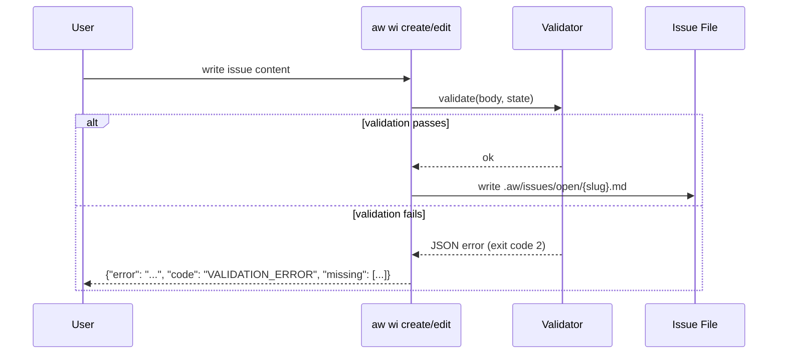
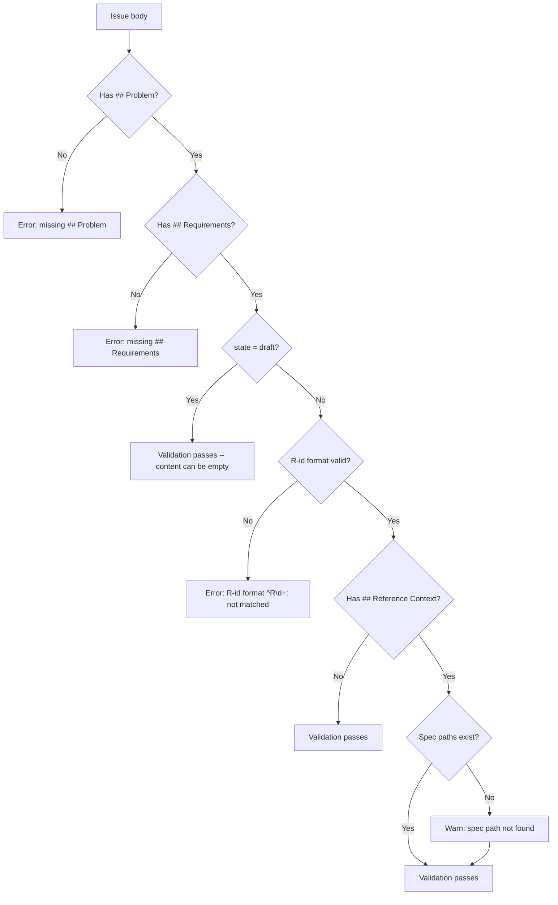
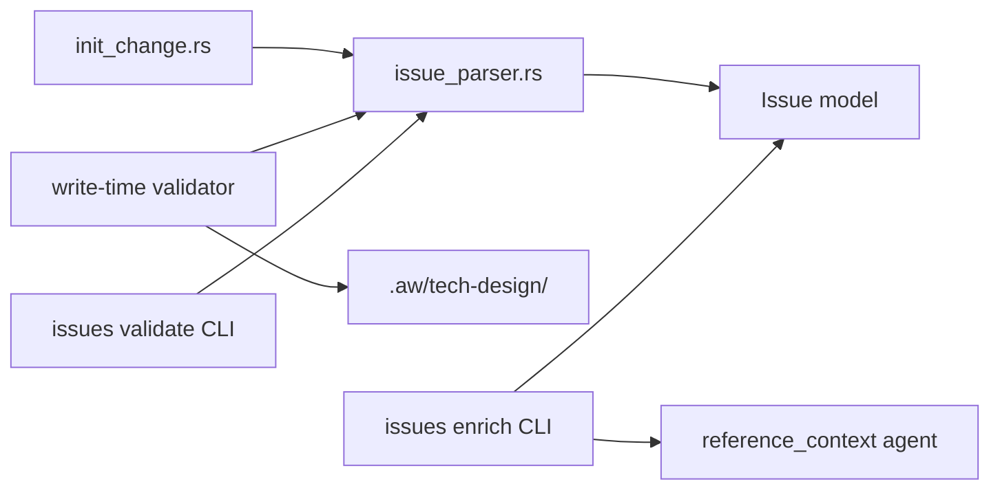
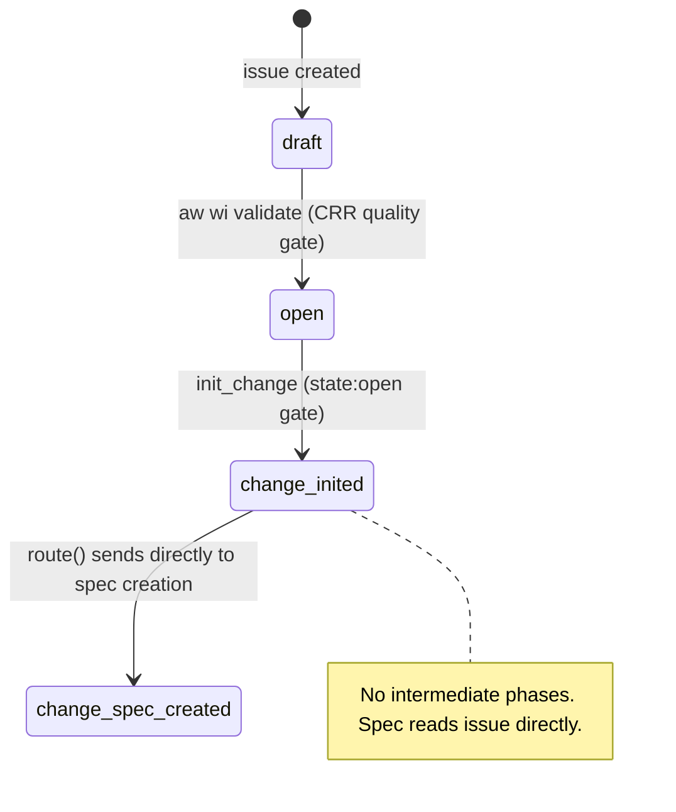
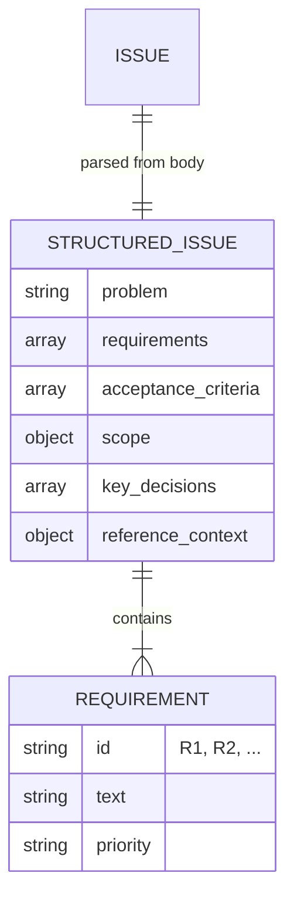

# Sdd Structured Issue

## Overview
<!-- type: overview lang: markdown -->

Structured issue format for SDD that absorbs early phases (restructure_input, pre/post_clarifications, reference_context) into issue authoring.

### Problem

SDD phases 2-3 and 7 re-derive information that a well-structured issue should already contain. This adds ~6 mainthread round-trips per change.

### Solution

| Issue Section | Replaces SDD Phase |
|---------------|--------------------|
| `## Problem` + `## Requirements` | restructure_input (phase 2) |
| `## Key Decisions` | pre_clarifications (phase 3) |
| `## Scope` + `## Acceptance Criteria` | post_clarifications (phase 7) |
| `## Reference Context` | reference_context (phase 4-6) |

### Components

| Component | Location | Responsibility |
|-----------|----------|----------------|
| Issue section parser | `projects/agentic-workflow/src/services/issue_parser.rs` | Extract structured sections from issue markdown |
| init_change update | `projects/agentic-workflow/src/tools/init_change.rs` | Enforce state:open gate, set ChangeInited, route directly to spec |
| `aw wi enrich` | `projects/agentic-workflow/src/cli/issues.rs` | Run reference_context agent to fill Reference Context section |
| `aw wi validate` | `projects/agentic-workflow/src/cli/issues.rs` | CRR quality gate: promote draft to open |

### Constraints

- No backward compat: unstructured issues are REJECTED at init_change (hard gate via state:open check)
- No intermediate artifacts -- issue body is the source of truth
- Reference Context is agent-filled via `aw wi enrich`, not manual
## Requirements
<!-- type: requirements lang: mermaid -->

```mermaid
---
id: structured-issue-requirements
title: Structured Issue Requirements
requirements:
  R1:
    text: Detect structured issue via required section header matching
    type: functional
    priority: high
    risk: low
    verification: test
    notes: |
      Required headers: `## Problem`, `## Requirements`, `## Scope`.
      All three must be present for `is_structured_issue()` to return true.
      Optional headers (Acceptance Criteria, Key Decisions, Reference Context)
      enhance quality but are not required for detection.
  R2:
    text: Structured issue is a hard gate -- init_change enforces state:open and rejects non-structured issues
    type: functional
    priority: high
    risk: medium
    verification: test
    notes: |
      init_change enforces `state: open` gate. Issues in `state: draft` are rejected.
      There is NO legacy fallback path -- unstructured issues cannot enter SDD.
      All prep phases (2-7: restructure, pre-clar, ref-ctx, post-clar) are
      absorbed by the issue. The SDD change starts at ChangeInited -> ChangeSpecCreated.
      No intermediate artifacts are generated -- spec prompt reads issue file directly.
  R3:
    text: Tiered write-time validation by state frontmatter field
    type: functional
    priority: high
    risk: medium
    verification: test
    notes: |
      - `state: draft` -- headers present only (content may be empty)
      - `state: open` -- headers + non-empty content + R-id format enforced
      Required sections (always): `## Problem`, `## Requirements`
  R4:
    text: R-id format validation -- each requirement item matches `^R\d+:`
    type: functional
    priority: medium
    risk: low
    verification: test
    notes: Applies only in non-draft state. Example valid- "R1: Support X".
  R5:
    text: Spec path validation -- referenced spec paths exist under .aw/tech-design/
    type: functional
    priority: medium
    risk: low
    verification: test
    notes: Warn (not error) for missing spec paths.
  R6:
    text: Validation error format is structured JSON with code VALIDATION_ERROR
    type: interface
    priority: high
    risk: low
    verification: test
    notes: |
      Format: `{"error": "...", "code": "VALIDATION_ERROR", "missing": [...]}`
      Exit code 2 for validation errors (distinct from exit code 1 for runtime errors).
  R7:
    text: aw wi enrich command fills Reference Context section via agent exploration
    type: functional
    priority: medium
    risk: low
    verification: test
    notes: |
      Validates required sections before enriching.
      `--dry-run` flag prints result without writing.
---
requirementDiagram
    requirement R1 {
      id: R1
      text: Detect structured issue via required section header matching
      risk: low
      verifymethod: test
    }
    requirement R2 {
      id: R2
      text: init_change enforces state:open gate, routes to ChangeSpecCreated
      risk: medium
      verifymethod: test
    }
    requirement R3 {
      id: R3
      text: Tiered write-time validation by state frontmatter field
      risk: medium
      verifymethod: test
    }
    requirement R4 {
      id: R4
      text: R-id format validation
      risk: low
      verifymethod: test
    }
    requirement R5 {
      id: R5
      text: Spec path validation
      risk: low
      verifymethod: test
    }
    requirement R6 {
      id: R6
      text: Validation error format is structured JSON
      risk: low
      verifymethod: test
    }
    requirement R7 {
      id: R7
      text: aw wi enrich command
      risk: low
      verifymethod: test
    }
```

## Scenarios
<!-- type: scenarios lang: yaml -->

```yaml
scenarios:
  S1:
    name: Structured issue routes directly to spec creation
    verifies: [R1, R2]
    diagram_ref: "#interaction"
    given: |
      User creates issue with `## Problem`, `## Requirements`, `## Scope` sections
      and promotes it to state:open via `aw wi validate`
    when: |
      User runs `score run-change --issue <slug>`
    then: |
      - init_change detects structured issue via state:open gate
      - STATE.yaml phase set to change_inited
      - route() sends directly to sdd_workflow_create_change_spec
      - Spec prompt reads issue file directly for requirements and reference context
  S2:
    name: Draft issue is rejected at init_change
    verifies: [R1, R2]
    given: User creates issue with state:draft (not yet validated)
    when: init_change runs
    then: |
      - init_change rejects with error: "Issue is still in draft state"
      - Directs user to run `aw wi validate <slug>`
  S3:
    name: Write-time validation -- draft state, missing Requirements
    verifies: [R3, R6]
    given: |
      User creates issue with `state: draft` and only `## Problem` header
      (no `## Requirements` section)
    when: aw wi create runs validation
    then: |
      - Validation fails
      - Error returned as JSON: {"error": "missing required section: ## Requirements", "code": "VALIDATION_ERROR", "missing": ["## Requirements"]}
      - Process exits with code 2
  S4:
    name: Write-time validation -- open state with bad R-id
    verifies: [R3, R4, R6]
    given: |
      User creates issue with `state: open`, `## Requirements` contains:
      `- Add feature X` (no R-id prefix)
    when: aw wi create runs validation
    then: |
      - Validation fails
      - Error- requirement item does not match `^R\d+:` pattern
      - Process exits with code 2
  S5:
    name: Write-time validation -- spec path check produces warning
    verifies: [R5]
    given: |
      Issue has `## Reference Context` referencing `crates/nonexistent/logic/foo.md`
    when: aw wi create runs validation
    then: |
      - Validation passes (warning only, not error)
      - Warning printed: spec path does not exist under .aw/tech-design/
      - Process exits with code 0
  S6:
    name: Enrich fills Reference Context section
    verifies: [R7]
    diagram_ref: "#interaction"
    given: |
      Issue exists with `## Problem` and `## Requirements` but no `## Reference Context`
    when: User runs `aw wi enrich <slug>`
    then: |
      - System validates Problem and Requirements exist
      - Reference context agent explores specs and codebase
      - `## Reference Context` section written to issue file with spec table + spec_plan
```

## Diagrams
<!-- type: diagram lang: mermaid -->

### Interaction
<!-- type: doc lang: markdown -->



### Logic
<!-- type: doc lang: markdown -->



### Dependencies
<!-- type: doc lang: markdown -->



### State Machine
<!-- type: doc lang: markdown -->



### Data Model
<!-- type: doc lang: markdown -->



## API Spec
<!-- type: api lang: yaml -->

### REST API
<!-- type: rest-api lang: yaml -->
<!-- score-td-placeholder -->

N/A -- CLI-only workflow.

### RPC API
<!-- type: rpc-api lang: yaml -->
<!-- score-td-placeholder -->

N/A -- CLI-only workflow.

### Async API
<!-- type: async-api lang: yaml -->
<!-- score-td-placeholder -->

N/A -- CLI-only workflow.

### CLI
<!-- type: cli lang: yaml -->
<!-- score-td-placeholder -->

See [CLI section](#cli) below for `aw wi enrich` command.

### Schema
<!-- type: schema lang: yaml -->
<!-- score-td-placeholder -->

See [Schema section](#schema) below for StructuredIssue and validation error schemas.

### Config
<!-- type: config lang: yaml -->
<!-- score-td-placeholder -->

N/A -- no new config fields.

## Test Plan
<!-- type: test-plan lang: mermaid -->

```mermaid
---
id: structured-issue-test-plan
title: Structured Issue Test Plan
tests:
  T1:
    type: test
    name: test_is_structured_issue_returns_true_with_required_headers
    file: projects/agentic-workflow/src/services/issue_parser.rs
    verifies: [R1]
  T2:
    type: test
    name: test_is_structured_issue_returns_false_for_freeform_body
    file: projects/agentic-workflow/src/services/issue_parser.rs
    verifies: [R1]
  T3:
    type: test
    name: test_parse_structured_issue_extracts_all_sections
    file: projects/agentic-workflow/src/services/issue_parser.rs
    verifies: [R1]
  T4:
    type: test
    name: test_init_change_rejects_draft_state_issue
    file: projects/agentic-workflow/src/tools/init_change.rs
    verifies: [R2]
  T5:
    type: test
    name: test_init_change_accepts_open_state_issue
    file: projects/agentic-workflow/src/tools/init_change.rs
    verifies: [R2]
  T6:
    type: test
    name: test_draft_state_missing_requirements_returns_error
    file: projects/agentic-workflow/src/services/issue_parser.rs
    verifies: [R3]
  T7:
    type: test
    name: test_open_state_empty_problem_content_returns_error
    file: projects/agentic-workflow/src/services/issue_parser.rs
    verifies: [R3]
  T8:
    type: test
    name: test_requirement_item_missing_rid_pattern_returns_error
    file: projects/agentic-workflow/src/services/issue_parser.rs
    verifies: [R4]
  T9:
    type: test
    name: test_requirement_item_valid_rid_pattern_passes
    file: projects/agentic-workflow/src/services/issue_parser.rs
    verifies: [R4]
  T10:
    type: test
    name: test_reference_context_nonexistent_spec_path_emits_warning
    file: projects/agentic-workflow/src/services/issue_parser.rs
    verifies: [R5]
  T11:
    type: test
    name: test_reference_context_valid_spec_path_passes
    file: projects/agentic-workflow/src/services/issue_parser.rs
    verifies: [R5]
  T12:
    type: test
    name: test_validation_error_json_format
    file: projects/agentic-workflow/src/cli/issues.rs
    verifies: [R6]
  T13:
    type: test
    name: test_validation_error_exits_code_2
    file: projects/agentic-workflow/src/cli/issues.rs
    verifies: [R6]
  T14:
    type: test
    name: test_issues_enrich_fills_reference_context
    file: projects/agentic-workflow/src/cli/issues.rs
    verifies: [R7]
  T15:
    type: test
    name: test_issues_enrich_dry_run_prints_without_writing
    file: projects/agentic-workflow/src/cli/issues.rs
    verifies: [R7]
---
requirementDiagram
    element T1 { type: test }
    element T2 { type: test }
    element T3 { type: test }
    T1 - verifies -> R1
    T2 - verifies -> R1
    T3 - verifies -> R1

    element T4 { type: test }
    element T5 { type: test }
    T4 - verifies -> R2
    T5 - verifies -> R2

    element T6 { type: test }
    element T7 { type: test }
    T6 - verifies -> R3
    T7 - verifies -> R3

    element T8 { type: test }
    element T9 { type: test }
    T8 - verifies -> R4
    T9 - verifies -> R4

    element T10 { type: test }
    element T11 { type: test }
    T10 - verifies -> R5
    T11 - verifies -> R5

    element T12 { type: test }
    element T13 { type: test }
    T12 - verifies -> R6
    T13 - verifies -> R6

    element T14 { type: test }
    element T15 { type: test }
    T14 - verifies -> R7
    T15 - verifies -> R7
```

## Changes
<!-- type: changes lang: yaml -->

```yaml
changes:
  - file: projects/agentic-workflow/src/services/issue_parser.rs
    section: source
    action: create
    impl_mode: hand-written
    description: New issue section parser that extracts StructuredIssue from markdown body
    details: |
      pub struct StructuredIssue { ... }
      pub fn parse_structured_issue(body: &str) -> Option<StructuredIssue>
      pub fn is_structured_issue(body: &str) -> bool
      pub fn validate_issue_quality(body: &str) -> IssueQualityResult

  - file: projects/agentic-workflow/src/tools/init_change.rs
    section: source
    action: modify
    impl_mode: hand-written
    description: state:open gate, ChangeInited phase, no intermediate artifacts
    details: |
      init_change enforces state:open gate. Issues in draft state are rejected.
      Sets phase to ChangeInited. route() sends directly to sdd_workflow_create_change_spec.
      No intermediate artifact generation (requirements.md, pre_clarifications.md, etc.).

  - file: projects/agentic-workflow/src/cli/issues.rs
    action: modify
    section: cli
    impl_mode: hand-written
    description: Add enrich and validate subcommands
    details: |
      Enrich { slug: String, #[arg(long)] dry_run: bool }
      Validate { slug: String }
      validate runs validate_issue_quality(), promotes draft to open on pass.
  - action: annotate
    section: async-api
    impl_mode: hand-written
    description: "Traceability metadata edge for the async-api section."

  - action: annotate
    section: config
    impl_mode: hand-written
    description: "Traceability metadata edge for the config section."

  - action: annotate
    section: requirements
    impl_mode: hand-written
    description: "Traceability metadata edge for the requirements section."

  - action: annotate
    section: rest-api
    impl_mode: hand-written
    description: "Traceability metadata edge for the rest-api section."

  - action: annotate
    section: rpc-api
    impl_mode: hand-written
    description: "Traceability metadata edge for the rpc-api section."

  - action: annotate
    section: scenarios
    impl_mode: hand-written
    description: "Traceability metadata edge for the scenarios section."

  - action: annotate
    section: schema
    impl_mode: hand-written
    description: "Traceability metadata edge for the schema section."

  - action: annotate
    section: unit-test
    impl_mode: hand-written
    description: "Traceability metadata edge for the unit-test section."

```

## Doc
<!-- type: doc lang: markdown -->

N/A -- covered by CLI help text and this spec.


## Schema
<!-- type: doc lang: markdown -->

### Structured Issue Sections

Required sections detected by `## Header` matching. Schema expressed as YAML (JSON Schema dialect):

```yaml
$schema: https://json-schema.org/draft/2020-12/schema
title: StructuredIssue
description: Parsed sections from a structured issue markdown file
type: object
required: [problem, requirements]
properties:
  problem:
    type: string
    description: "## Problem section body -- what's wrong or needed"
  requirements:
    type: array
    items:
      type: object
      required: [id, text]
      properties:
        id:
          type: string
          pattern: '^R\d+$'
        text:
          type: string
        priority:
          type: string
          enum: [high, medium, low]
  acceptance_criteria:
    type: array
    items:
      type: object
      required: [id, text]
      properties:
        id:
          type: string
          pattern: '^AC\d+$'
        text:
          type: string
  scope:
    type: object
    properties:
      in_scope:
        type: string
      out_of_scope:
        type: string
  key_decisions:
    type: array
    items:
      type: object
      required: [id, text]
      properties:
        id:
          type: string
          pattern: '^D\d+$'
        text:
          type: string
  reference_context:
    type: object
    properties:
      specs:
        type: array
        items:
          type: object
          properties:
            path:
              type: string
            relevance:
              type: string
              enum: [high, medium, low]
            key_requirements:
              type: string
      spec_plan:
        type: array
        items:
          type: object
          properties:
            spec_id:
              type: string
            action:
              type: string
              enum: [create, modify]
            main_spec_ref:
              type: string
            sections:
              type: array
              items:
                type: string
```

### Detection Logic

```rust
// Structured issue = has all required section headers
fn is_structured_issue(body: &str) -> bool {
    let required = ["## Problem", "## Requirements"];
    required.iter().all(|h| body.contains(h))
}
```

Optional sections (`## Acceptance Criteria`, `## Key Decisions`, `## Reference Context`) enhance skip quality but are not required.

### Write-Time Validation Rules

Validation runs on `aw wi create` and `aw wi edit` before writing the file.

#### Tiered validation by state

| State | Required sections | Content check | R-id format | Spec path check |
|-------|-------------------|---------------|-------------|-----------------|
| `draft` | Headers present: `## Problem`, `## Requirements` | No (content can be empty) | No | No |
| `open` | Headers present + non-empty content | Yes | Yes (`^R\d+:`) | Yes (warn only) |

#### Required sections (always)

- `## Problem` -- must be present in all states
- `## Requirements` -- must be present in all states

#### Optional sections

- `## Acceptance Criteria`
- `## Key Decisions`
- `## Scope`
- `## Reference Context`

#### R-id format validation

Each list item in `## Requirements` must match pattern `^R\d+:` when `state != draft`:

```
- R1: Support structured issue detection        (valid)
- R2: Add write-time validation                 (valid)
- Add feature X                                 (INVALID -- missing R-id)
```

#### Spec path validation

If `## Reference Context` is present and contains spec paths, each path is checked against `.aw/tech-design/`. Missing paths produce a warning (not a hard error).

### Validation Error Format

```json
{
  "$schema": "https://json-schema.org/draft/2020-12/schema",
  "title": "ValidationError",
  "type": "object",
  "properties": {
    "error": {
      "type": "string",
      "description": "Human-readable error message"
    },
    "code": {
      "type": "string",
      "const": "VALIDATION_ERROR"
    },
    "missing": {
      "type": "array",
      "items": { "type": "string" },
      "description": "List of missing required sections or invalid items"
    }
  },
  "required": ["error", "code"]
}
```

#### Exit codes

| Code | Meaning |
|------|---------|
| 0 | Success |
| 1 | Runtime error (I/O, parse failure) |
| 2 | Validation error (missing sections, bad R-id format, etc.) |

#### Examples

Missing required section:
```json
{"error": "missing required section: ## Requirements", "code": "VALIDATION_ERROR", "missing": ["## Requirements"]}
```

Multiple missing sections:
```json
{"error": "missing required sections: ## Problem, ## Requirements", "code": "VALIDATION_ERROR", "missing": ["## Problem", "## Requirements"]}
```

Bad R-id format:
```json
{"error": "requirement item does not match R-id format (^R\\d+:): 'Add feature X'", "code": "VALIDATION_ERROR", "missing": []}
```


## CLI
<!-- type: cli lang: yaml -->

```yaml
commands:
  score:
    issues:
      enrich:
        description: "Fill Reference Context section of a structured issue by exploring specs and codebase"
        args:
          slug:
            type: string
            required: true
            description: "Issue slug (filename stem from .aw/issues/)"
        flags:
          --dry-run:
            type: bool
            default: false
            description: "Print Reference Context without writing to issue file"
        behavior:
          - Read issue from .aw/issues/open/{slug}.md
          - Validate it has ## Problem and ## Requirements sections
          - Run reference_context exploration (reuse sdd-reference-context agent logic)
          - Parse requirements to identify affected crates and spec areas
          - Build spec table (path, relevance, key_requirements) and spec_plan
          - Write ## Reference Context section back to the issue file
        output:
          success: "Enriched {slug} with {n} specs and {m} spec_plan entries"
          error: "Issue missing required sections: ## Problem, ## Requirements"
      validate:
        description: "Run CRR quality gate on issue, promote draft to open on pass"
        args:
          slug:
            type: string
            required: true
            description: "Issue slug"
        behavior:
          - Read issue from .aw/issues/open/{slug}.md
          - Run validate_issue_quality() checks
          - On pass: set state:open in frontmatter
          - On fail: store validation_errors in frontmatter
        output:
          success: "Issue {slug} promoted to state:open"
          error: "Validation failed: {errors}"
```

## Changes (issue-lifecycle-crr)
<!-- type: changelog lang: markdown -->

### state:open Gate at init_change

`init_change` now enforces a `state: open` gate. Issues in `draft` state are rejected with an error message directing the user to run `aw wi validate <slug>` to promote the issue to `open`. This ensures only quality-validated issues can enter the SDD workflow.

### CRR Validation (validate_issue_quality)

A new `validate_issue_quality()` function in `issue_parser.rs` serves as the CRR quality gate for the `draft` to `open` promotion. It checks:

1. Required sections present: `## Problem`, `## Requirements`, `## Scope`
2. R-id format in Requirements items (`^R\d+:`)
3. `### Out of Scope` sub-heading present and non-empty
4. `### Spec Plan` present in `## Reference Context`
5. No ambiguous language (TBD, TODO, maybe, unclear, uncertain) in requirement text

Returns `IssueQualityResult { passed: bool, errors: Vec<String> }`.

### CLI: `aw wi validate <slug>`

New CLI subcommand that runs `validate_issue_quality()` on an issue. On pass, auto-promotes `state: draft` to `state: open`. On failure, stores errors in the issue's `validation_errors` frontmatter field.

### Intermediate Artifacts Removed

`try_structured_issue_skip()` has been removed. The spec prompt now reads the issue file directly (via `## Problem`, `## Requirements`, `## Reference Context` sections) rather than intermediate artifacts like `requirements.md`, `pre_clarifications.md`, or `post_clarifications.md`.
