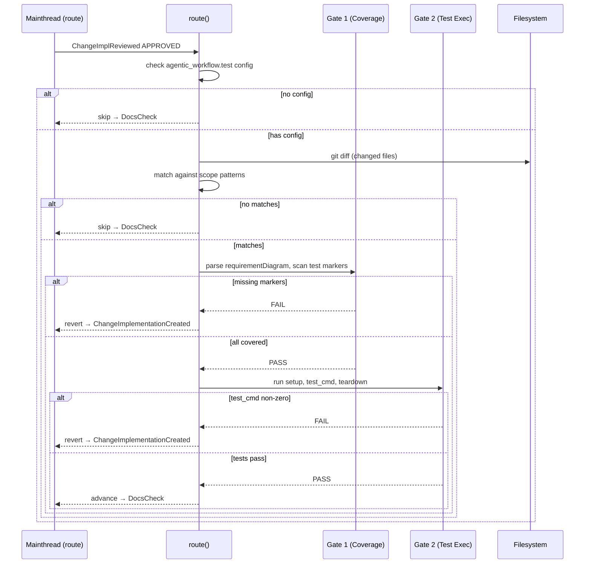
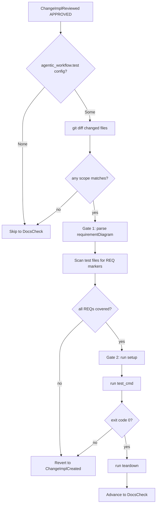
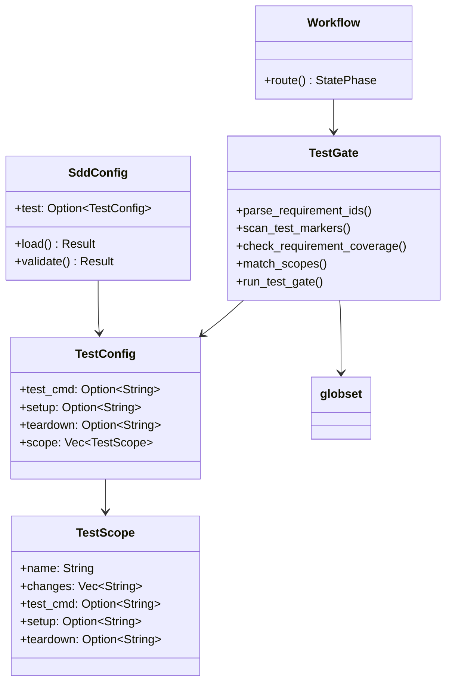
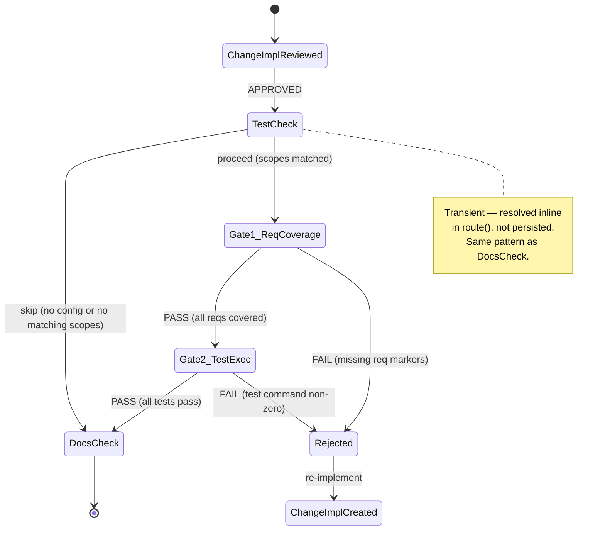
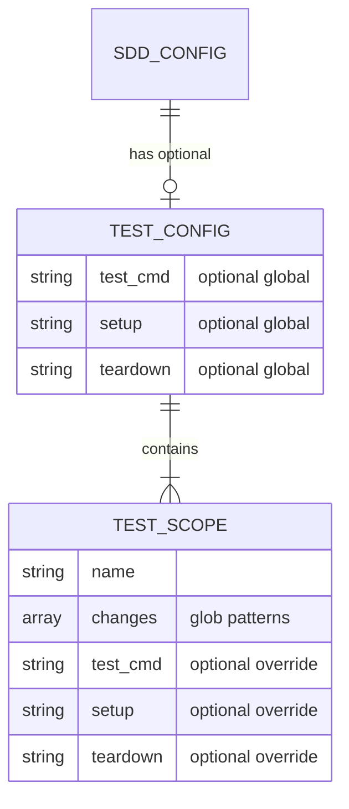

# Sdd Tdd Gate Spec

## Overview
<!-- type: overview lang: markdown -->

Add a TDD (Test-Driven Development) gate to the SDD workflow that enforces test coverage and test execution before implementation can advance to review.

This change has two parts:

| Part | Scope | Description |
|------|-------|-------------|
| PR1: test-config | Data | Add `[agentic_workflow.test]` config section with `TestConfig`/`TestScope` structs to `SddConfig`. Parse `[[agentic_workflow.test.scope]]` entries with GitLab CI-style `changes` glob patterns. |
| PR2: tdd-workflow-gate | Logic | Insert `TestCheck` transient phase between `ChangeImplementationReviewed` and `DocsCheck`. Gate 1: parse Mermaid `requirementDiagram` from specs, verify test files contain `REQ:` markers. Gate 2: match changed files against scope `changes` patterns, execute `test_cmd`. Update implementation agent prompt with TDD instructions. |

**Design pattern**: Follows the `DocsCheck` transient phase pattern — `TestCheck` is resolved inline in `route()`, skips when no `[agentic_workflow.test]` config or no matching scopes.

**Config pattern**: `TestConfig`/`TestScope` mirror `DocsConfig`/`DocsTarget` struct layout in `models/change.rs`.

## Requirements
<!-- type: requirements lang: mermaid -->

```mermaid
---
id: sdd-tdd-gate-requirements
title: SDD TDD Gate Requirements
requirements:
  R1:
    text: TestConfig and TestScope structs added to SddConfig
    type: functional
    priority: high
    risk: low
    verification: test
    notes: |
      TestConfig fields: test_cmd, setup, teardown, scope: Vec<TestScope>.
      TestScope fields: name, changes, test_cmd, setup, teardown.
      Add test: Option<TestConfig> to SddConfig. Presence = enabled.
  R2:
    text: TOML config parsing for agentic_workflow.test section
    type: functional
    priority: high
    risk: low
    verification: test
    notes: |
      Deserialize [agentic_workflow.test] and [[agentic_workflow.test.scope]] in SddConfig::load().
      Follow overlay pattern used for repo_platform and agents.
  R3:
    text: Config entries for conductor and cclab-queue
    type: functional
    priority: medium
    risk: low
    verification: test
    notes: |
      Add [agentic_workflow.test] with test_cmd = "cargo test".
      Add scope for conductor (projects/conductor/**) with bash test-env.sh.
      Add scope for cclab-queue (crates/cclab-queue/**).
  R4:
    text: TestCheck transient phase inserted in workflow
    type: functional
    priority: high
    risk: medium
    verification: test
    notes: |
      Insert between ChangeImplementationReviewed (APPROVED) and DocsCheck.
      Resolved inline in route(), not persisted.
      Skip when no agentic_workflow.test config OR no changed files match scope patterns.
      Add StatePhase::TestCheck variant.
  R5:
    text: Gate 1 — Requirement coverage check via REQ markers
    type: functional
    priority: high
    risk: medium
    verification: test
    notes: |
      Parse Mermaid requirementDiagram blocks from approved spec files.
      Extract REQ-{id} patterns, scan test files for REQ: REQ-{id} markers.
      Regex: REQ:\s*(REQ-\w+). Reject if any requirement has no marker.
  R6:
    text: Gate 2 — Test execution gate via globset
    type: functional
    priority: high
    risk: medium
    verification: test
    notes: |
      Match changed files against changes patterns in TestScope entries.
      For each match, run setup, test_cmd, teardown. Reject on non-zero exit.
  R7:
    text: Implementation agent TDD instructions
    type: functional
    priority: medium
    risk: low
    verification: test
    notes: |
      Update .claude/agents/sdd-change-implementation.md with TDD instructions.
      Agent writes tests alongside implementation, adds REQ markers.
  R8:
    text: Conductor test-env.sh script
    type: functional
    priority: medium
    risk: low
    verification: test
    notes: |
      Create projects/conductor/scripts/test-env.sh for setup/test/teardown.
  R9:
    text: --skip-tests escape hatch flag
    type: functional
    priority: low
    risk: low
    verification: test
    notes: |
      Add --skip-tests flag to score run-change.
      Skip TestCheck, log warning, set tests_skipped: true in STATE.yaml.
---
requirementDiagram
    requirement R1 {
      id: R1
      text: TestConfig and TestScope structs
      risk: low
      verifymethod: test
    }
    requirement R2 {
      id: R2
      text: TOML config parsing
      risk: low
      verifymethod: test
    }
    requirement R3 {
      id: R3
      text: Config entries for conductor and cclab-queue
      risk: low
      verifymethod: test
    }
    requirement R4 {
      id: R4
      text: TestCheck transient phase
      risk: medium
      verifymethod: test
    }
    requirement R5 {
      id: R5
      text: Gate 1 requirement coverage check
      risk: medium
      verifymethod: test
    }
    requirement R6 {
      id: R6
      text: Gate 2 test execution gate
      risk: medium
      verifymethod: test
    }
    requirement R7 {
      id: R7
      text: Implementation agent TDD instructions
      risk: low
      verifymethod: test
    }
    requirement R8 {
      id: R8
      text: Conductor test-env.sh script
      risk: low
      verifymethod: test
    }
    requirement R9 {
      id: R9
      text: --skip-tests escape hatch flag
      risk: low
      verifymethod: test
    }
```

## Scenarios
<!-- type: scenarios lang: yaml -->

```yaml
scenarios:
  S1:
    name: Config parsing — round-trip
    verifies: [R1, R2]
    given: |
      Write [agentic_workflow.test] with test_cmd and two [[agentic_workflow.test.scope]] entries to config.toml
    when: SddConfig::load() is called
    then: |
      - test field is Some(TestConfig) with 2 scopes
      - Serialize back to TOML produces matching structure
  S2:
    name: Config absent — test field is None
    verifies: [R1, R2]
    given: config.toml has no [agentic_workflow.test] section
    when: SddConfig::load() is called
    then: |
      - test field is None
      - SddConfig::validate() passes (test config is optional)
  S3:
    name: TestCheck skip — no config
    verifies: [R4]
    diagram_ref: "#state-machine"
    given: ChangeImplementationReviewed APPROVED
    when: TestCheck transient runs with no [agentic_workflow.test] config
    then: |
      - Skip to DocsCheck
      - No test execution
  S4:
    name: TestCheck skip — no matching scopes
    verifies: [R4, R6]
    given: |
      Config has scope for projects/conductor/**
      Changed files: projects/agentic-workflow/src/models/change.rs
    when: TestCheck transient runs
    then: |
      - No scope matches
      - Skip to DocsCheck, no test execution
  S5:
    name: Gate 1 pass — all requirements covered
    verifies: [R5]
    given: |
      Spec has requirementDiagram with REQ-001, REQ-002
      Test file contains // REQ: REQ-001 and // REQ: REQ-002
    when: Gate 1 runs
    then: PASS — all requirements have markers
  S6:
    name: Gate 1 fail — missing requirement marker
    verifies: [R5]
    given: |
      Spec has requirementDiagram with REQ-001, REQ-002
      Test file only contains // REQ: REQ-001
    when: Gate 1 runs
    then: |
      - FAIL — REQ-002 has no test marker
      - Advancement rejected, error lists uncovered requirements
  S7:
    name: Gate 2 pass — tests pass
    verifies: [R6]
    given: |
      Changed file: projects/conductor/fe/src/App.tsx
      Matches scope conductor (projects/conductor/**)
    when: Gate 2 runs setup, test_cmd (exit 0), teardown
    then: PASS
  S8:
    name: Gate 2 fail — test command fails
    verifies: [R6]
    given: Matched scope runs test_cmd
    when: test_cmd exits with code 1
    then: |
      - FAIL — test execution failed
      - Advancement rejected, error includes test output
  S9:
    name: --skip-tests escape hatch
    verifies: [R9]
    given: User runs score run-change --skip-tests
    when: TestCheck transient detects flag
    then: |
      - Skip to DocsCheck
      - Warning logged
      - tests_skipped: true set in STATE.yaml
  S10:
    name: TestScope inherits global test_cmd
    verifies: [R1, R6]
    given: |
      Config: [agentic_workflow.test] test_cmd = "cargo test"
      Scope has no test_cmd
    when: Scope matched and Gate 2 runs
    then: cargo test executes (inherited from global)
```

## Diagrams
<!-- type: diagram lang: mermaid -->

### Interaction
<!-- type: interaction lang: mermaid -->
<!-- score-td-placeholder -->



### Logic
<!-- type: logic lang: mermaid -->
<!-- score-td-placeholder -->



### Dependencies
<!-- type: dependency lang: mermaid -->
<!-- score-td-placeholder -->



### State Machine
<!-- type: state-machine lang: mermaid -->
<!-- score-td-placeholder -->



### Data Model
<!-- type: db-model lang: mermaid -->
<!-- score-td-placeholder -->



## API Spec
<!-- type: api lang: yaml -->

### REST API
<!-- type: rest-api lang: yaml -->
<!-- score-td-placeholder -->

N/A — CLI-only workflow.

### RPC API
<!-- type: rpc-api lang: yaml -->
<!-- score-td-placeholder -->

N/A — CLI-only workflow.

### Async API
<!-- type: async-api lang: yaml -->
<!-- score-td-placeholder -->

N/A — CLI-only workflow.

### CLI
<!-- type: cli lang: yaml -->

```yaml
commands:
  score:
    run-change:
      flags:
        --skip-tests:
          type: bool
          default: false
          description: "Skip TestCheck gate (logs warning, sets tests_skipped: true in STATE.yaml)"
```

### Schema
<!-- type: schema lang: yaml -->

```yaml
$schema: https://json-schema.org/draft/2020-12/schema
title: TestConfig
description: "[agentic_workflow.test] section in .aw/config.toml"
type: object
properties:
  test_cmd:
    type: string
    description: Global default test command. Scopes inherit if they omit test_cmd.
  setup:
    type: string
    description: Global setup command run before tests.
  teardown:
    type: string
    description: Global teardown command run after tests.
  scope:
    type: array
    items:
      $ref: "#/$defs/TestScope"
    description: "Per-module test scope definitions [[agentic_workflow.test.scope]]."
required: [scope]
$defs:
  TestScope:
    type: object
    properties:
      name:
        type: string
        description: Human-readable scope name.
      changes:
        type: array
        items: { type: string }
        description: GitLab CI-style gitignore glob patterns matching file paths.
      test_cmd:
        type: string
        description: Override test command for this scope.
      setup:
        type: string
        description: Override setup command.
      teardown:
        type: string
        description: Override teardown command.
    required: [name, changes]
```

### Config
<!-- type: config lang: yaml -->

```yaml
# .aw/config.toml (example)
#
# [agentic_workflow.test]
# test_cmd = "cargo test"
#
# [[agentic_workflow.test.scope]]
# name = "conductor"
# changes = ["projects/conductor/**"]
# test_cmd = "bash projects/conductor/scripts/test-env.sh"
# setup = "docker compose -f projects/conductor/docker-compose.test.yml up -d"
# teardown = "docker compose -f projects/conductor/docker-compose.test.yml down"
#
# [[agentic_workflow.test.scope]]
# name = "cclab-queue"
# changes = ["crates/cclab-queue/**"]
# # inherits test_cmd = "cargo test" from global
#
# [[agentic_workflow.test.scope]]
# name = "agentic-workflow"
# changes = ["projects/agentic-workflow/**"]
# test_cmd = "cargo test -p agentic-workflow"
#
# [[agentic_workflow.test.scope]]
# name = "agentic-workflow"
# changes = ["projects/agentic-workflow/**"]
# test_cmd = "cargo test -p agentic-workflow"
sdd:
  test:
    test_cmd: cargo test
    scope:
      - name: conductor
        changes: ["projects/conductor/**"]
        test_cmd: bash projects/conductor/scripts/test-env.sh
      - name: cclab-queue
        changes: ["crates/cclab-queue/**"]
      - name: sdd
        changes: ["projects/agentic-workflow/**"]
        test_cmd: cargo test -p agentic-workflow
      - name: score
        changes: ["projects/agentic-workflow/**"]
        test_cmd: cargo test -p agentic-workflow
```

## Test Plan
<!-- type: test-plan lang: mermaid -->

```mermaid
---
id: sdd-tdd-gate-test-plan
title: SDD TDD Gate Test Plan
tests:
  T1:
    type: test
    name: test_test_config_roundtrip
    file: projects/agentic-workflow/src/models/change.rs
    verifies: [R1, R2]
  T2:
    type: test
    name: test_test_config_absent_is_none
    file: projects/agentic-workflow/src/models/change.rs
    verifies: [R1, R2]
  T3:
    type: test
    name: test_score_config_has_test_scopes
    file: .aw/config.toml
    verifies: [R3]
  T4:
    type: test
    name: test_test_check_transient_skip_no_config
    file: projects/agentic-workflow/src/workflow/mod.rs
    verifies: [R4]
  T5:
    type: test
    name: test_test_check_transient_skip_no_match
    file: projects/agentic-workflow/src/workflow/mod.rs
    verifies: [R4, R6]
  T6:
    type: test
    name: test_parse_requirement_ids
    file: projects/agentic-workflow/src/workflow/test_gate.rs
    verifies: [R5]
  T7:
    type: test
    name: test_scan_test_markers
    file: projects/agentic-workflow/src/workflow/test_gate.rs
    verifies: [R5]
  T8:
    type: test
    name: test_check_requirement_coverage_pass
    file: projects/agentic-workflow/src/workflow/test_gate.rs
    verifies: [R5]
  T9:
    type: test
    name: test_check_requirement_coverage_missing
    file: projects/agentic-workflow/src/workflow/test_gate.rs
    verifies: [R5]
  T10:
    type: test
    name: test_match_scopes_globset
    file: projects/agentic-workflow/src/workflow/test_gate.rs
    verifies: [R6]
  T11:
    type: test
    name: test_run_test_gate_success
    file: projects/agentic-workflow/src/workflow/test_gate.rs
    verifies: [R6]
  T12:
    type: test
    name: test_run_test_gate_nonzero_exit
    file: projects/agentic-workflow/src/workflow/test_gate.rs
    verifies: [R6]
  T13:
    type: test
    name: test_impl_agent_has_tdd_section
    file: .claude/agents/sdd-change-implementation.md
    verifies: [R7]
  T14:
    type: test
    name: test_conductor_test_env_sh_exists
    file: projects/conductor/scripts/test-env.sh
    verifies: [R8]
  T15:
    type: test
    name: test_skip_tests_flag
    file: projects/agentic-workflow/src/cli/run_change.rs
    verifies: [R9]
---
requirementDiagram
    element T1 { type: test }
    element T2 { type: test }
    element T3 { type: test }
    element T4 { type: test }
    element T5 { type: test }
    element T6 { type: test }
    element T7 { type: test }
    element T8 { type: test }
    element T9 { type: test }
    element T10 { type: test }
    element T11 { type: test }
    element T12 { type: test }
    element T13 { type: test }
    element T14 { type: test }
    element T15 { type: test }

    T1 - verifies -> R1
    T1 - verifies -> R2
    T2 - verifies -> R1
    T2 - verifies -> R2
    T3 - verifies -> R3
    T4 - verifies -> R4
    T5 - verifies -> R4
    T5 - verifies -> R6
    T6 - verifies -> R5
    T7 - verifies -> R5
    T8 - verifies -> R5
    T9 - verifies -> R5
    T10 - verifies -> R6
    T11 - verifies -> R6
    T12 - verifies -> R6
    T13 - verifies -> R7
    T14 - verifies -> R8
    T15 - verifies -> R9
```

## Changes
<!-- type: changes lang: yaml -->

```yaml
changes:
  # PR1: test-config (data only)
  - path: projects/agentic-workflow/src/models/change.rs
    section: source
    action: modify
    impl_mode: hand-written
    description: |
      Add TestConfig struct (test_cmd, setup, teardown, scope: Vec<TestScope>).
      Add TestScope struct (name, changes: Vec<String>, test_cmd, setup, teardown).
      Add `test: Option<TestConfig>` field to SddConfig.
      Add #[serde(default, skip_serializing_if = "Option::is_none")] on test field.
      Update SddConfig::load() to extract [agentic_workflow.test] from parsed TOML table.
      Update SddConfig::Default to set test: None.

  - path: .aw/config.toml
    action: modify
    section: schema
    impl_mode: hand-written
    description: |
      Add [agentic_workflow.test] section with global test_cmd = "cargo test".
      Add [[agentic_workflow.test.scope]] for conductor (changes: ["projects/conductor/**"]).
      Add [[agentic_workflow.test.scope]] for cclab-queue (changes: ["crates/cclab-queue/**"]).

  # PR2: tdd-workflow-gate (logic + infrastructure)
  - path: projects/agentic-workflow/src/models/state.rs
    section: source
    action: modify
    impl_mode: hand-written
    description: |
      Add StatePhase::TestCheck variant (transient, between ChangeImplementationReviewed and DocsCheck).
      Add serde serialize/deserialize for "test_check" string.
      Update total variant count comment.

  - path: projects/agentic-workflow/src/workflow/mod.rs
    section: source
    action: modify
    impl_mode: hand-written
    description: |
      Add TestCheck routing in route() function.
      TestCheck resolved inline: load SddConfig, check test config presence,
      match changed files against scope patterns, run gates.
      On skip: advance to DocsCheck.
      On gate pass: advance to DocsCheck.
      On gate fail: revert to ChangeImplementationCreated.

  - path: projects/agentic-workflow/src/workflow/test_gate.rs
    section: source
    action: create
    impl_mode: hand-written
    description: |
      New module: test gate logic.
      - parse_requirement_ids(spec_content: &str) -> Vec<String>
        Regex-extract REQ-\w+ from requirementDiagram blocks.
      - scan_test_markers(test_files: &[PathBuf]) -> HashSet<String>
        Regex-match REQ:\s*(REQ-\w+) in test file contents.
      - check_requirement_coverage(spec_reqs, test_markers) -> Result<(), Vec<String>>
        Return missing requirement IDs.
      - match_scopes(changed_files: &[String], config: &TestConfig) -> Vec<&TestScope>
        Use globset to match files against scope changes patterns.
      - run_test_gate(scope: &TestScope, global: &TestConfig) -> Result<()>
        Execute setup, test_cmd, teardown. Return error on non-zero exit.

  - path: .claude/agents/sdd-change-implementation.md
    action: modify
    section: cli
    impl_mode: hand-written
    description: |
      Add TDD instructions section:
      - Write tests alongside implementation code
      - Include // REQ: REQ-{id} comments in test files
      - Reference requirement IDs from the change spec requirementDiagram
      - Tests must pass before implementation is considered complete

  - path: projects/conductor/scripts/test-env.sh
    action: create
    section: test-plan
    impl_mode: hand-written
    description: |
      Test environment setup/teardown script for conductor.
      Setup: start mock backend, seed test data.
      Test: run Playwright e2e tests.
      Teardown: stop mock backend, clean up.

  - path: projects/agentic-workflow/Cargo.toml
    section: manifest
    action: modify
    impl_mode: hand-written
    description: |
      Add globset dependency for gitignore-style glob matching.
  - action: annotate
    section: async-api
    impl_mode: hand-written
    description: "Traceability metadata edge for the async-api section."

  - action: annotate
    section: config
    impl_mode: hand-written
    description: "Traceability metadata edge for the config section."

  - action: annotate
    section: db-model
    impl_mode: hand-written
    description: "Traceability metadata edge for the db-model section."

  - action: annotate
    section: dependency
    impl_mode: hand-written
    description: "Traceability metadata edge for the dependency section."

  - action: annotate
    section: interaction
    impl_mode: hand-written
    description: "Traceability metadata edge for the interaction section."

  - action: annotate
    section: logic
    impl_mode: hand-written
    description: "Traceability metadata edge for the logic section."

  - action: annotate
    section: requirements
    impl_mode: hand-written
    description: "Traceability metadata edge for the requirements section."

  - action: annotate
    section: rest-api
    impl_mode: hand-written
    description: "Traceability metadata edge for the rest-api section."

  - action: annotate
    section: rpc-api
    impl_mode: hand-written
    description: "Traceability metadata edge for the rpc-api section."

  - action: annotate
    section: scenarios
    impl_mode: hand-written
    description: "Traceability metadata edge for the scenarios section."

  - action: annotate
    section: state-machine
    impl_mode: hand-written
    description: "Traceability metadata edge for the state-machine section."

```

## Doc
<!-- type: doc lang: markdown -->

N/A — covered by agent prompt updates and this spec.
