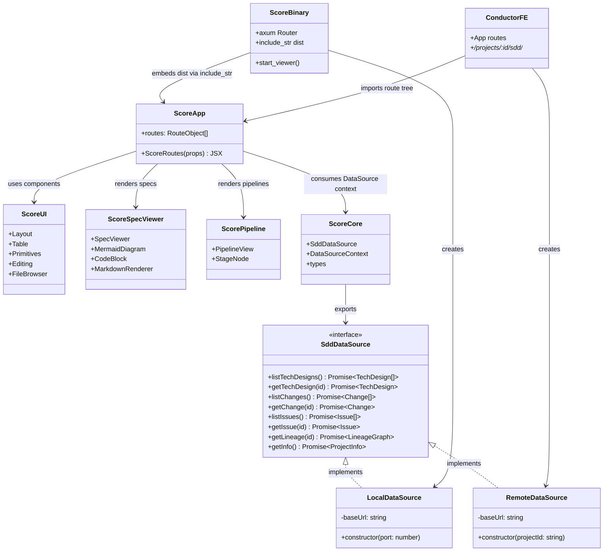

# Sdd Unified Frontend Spec

## Overview
<!-- type: doc lang: markdown -->

Unifies the Score plan viewer (vanilla JS, axum-served, `projects/agentic-workflow/src/ui/viewer/`) and the Conductor frontend (React, `projects/conductor/fe/`) into a single React application under `projects/agentic-workflow/packages/@score/`.

### Current State

- **Score viewer**: Vanilla JS SPA embedded via `include_str!()` in the aw binary. Axum serves 6 static assets + 7 API routes. Renders specs, annotations, and review actions.
- **Conductor FE**: React 18 + React Router + TailwindCSS. Renders projects, issues, changes, specs, pipelines, workflows via REST API.
- **Shared components**: `packages/@cclab/{ui,spec-viewer,pipeline}` — React components consumed only by Conductor FE today.

### Target State

- **@score/core**: `SddDataSource` TypeScript interface abstracting data access. Two implementations: `LocalDataSource` (axum REST) and `RemoteDataSource` (Conductor REST).
- **@score/ui**: Moved from `@cclab/ui`. Shared presentational components (tables, layout, primitives, editing).
- **@score/spec-viewer**: Moved from `@cclab/spec-viewer`. Mermaid + Markdown rendering.
- **@score/pipeline**: Moved from `@cclab/pipeline`. Pipeline visualization.
- **@score/app**: React Router SPA. Consumes core + ui + spec-viewer + pipeline. Routes: `/tech-designs`, `/changes`, `/issues`, `/lineage`.
- **Score**: `score view` embeds pre-built `@score/app` dist/ via `include_str!()`. Axum API expanded to full `SddDataSource` interface.
- **Conductor FE**: Imports `@score/app` route tree as nested routes under `/projects/:id/sdd/*`.

### Key Decisions

- **React Router** for routing (consistent with Conductor FE).
- **jet** for building (`cclab jet build -p @score/app` produces dist/).
- **Pre-built assets committed** to repo — no Node.js required at `cargo build` time.
- **API path naming**: Uses `tech-designs` not `specs` (matches `.aw/tech-design/` convention).
- **DataSource adapter pattern**: Frontend code is backend-agnostic; only the DataSource impl differs between Score and Conductor.
## Requirements
<!-- type: doc lang: markdown -->

| ID | Title | Description | Priority |
|----|-------|-------------|----------|
| R1 | Move @cclab packages to @score | Move `packages/@cclab/{ui,spec-viewer,pipeline}` to `projects/agentic-workflow/packages/@score/{ui,spec-viewer,pipeline}`. Update all import paths. Packages become SDD-owned, co-located with the score crate. | P0 |
| R2 | Create @score/core with SddDataSource interface | Define TypeScript `SddDataSource` interface with methods: `listTechDesigns()`, `getTechDesign(id)`, `listChanges()`, `getChange(id)`, `listIssues()`, `getIssue(id)`, `getLineage(artifactId)`, `getInfo()`. All methods return `Promise<T>`. | P0 |
| R3 | Implement LocalDataSource | `LocalDataSource` implements `SddDataSource` by calling the axum REST API at `http://localhost:{port}/api/*`. Used when `score view` serves the app locally. | P0 |
| R4 | Implement RemoteDataSource | `RemoteDataSource` implements `SddDataSource` by calling the Conductor REST API at `/api/projects/{projectId}/*`. Used when Conductor FE mounts the SDD pages. | P0 |
| R5 | Create @score/app React SPA | React Router SPA with routes: `/tech-designs`, `/tech-designs/:id`, `/changes`, `/changes/:id`, `/issues`, `/issues/:id`, `/lineage`. Receives `SddDataSource` via React Context. Exports route tree for embedding. | P0 |
| R6 | Replace viewer assets with @score/app build | Remove `projects/agentic-workflow/src/ui/viewer/assets/{index.html,app.js,styles.css}`. Replace with `@score/app` dist/ output. Update `include_str!()` paths in `mod.rs` to reference new build artifacts. Pre-built dist/ committed to repo. | P0 |
| R7 | Expand axum API to SddDataSource interface | Add axum routes: `GET /api/tech-designs`, `GET /api/tech-designs/:id`, `GET /api/changes`, `GET /api/changes/:id`, `GET /api/issues`, `GET /api/issues/:id`, `GET /api/lineage/:id`. Keep existing `/api/files`, `/api/annotations`, `/api/review/*` routes. | P1 |
| R8 | Update Conductor FE to import @score/app | Refactor `projects/conductor/fe/src/App.tsx` to mount `@score/app` route tree under `/projects/:id/sdd/*`. Pass `RemoteDataSource` via context. Remove duplicated spec/change/issue pages from Conductor FE. | P1 |
## Scenarios
<!-- type: doc lang: markdown -->

| ID | Title | Given | When | Then |
|----|-------|-------|------|------|
| S1 | score view opens React UI with local data | A project with `.aw/tech-design/` containing specs and `.aw/changes/` containing changes | User runs `score view <change-id>` | Browser opens at `http://localhost:3000`. React SPA loads. `LocalDataSource` fetches data from axum API. Tech designs, changes, issues render correctly. |
| S2 | Conductor loads SDD pages from @score/app | Conductor FE is running. A project with `id=P1` exists with synced SDD artifacts. | User navigates to `/projects/P1/sdd/tech-designs` | `@score/app` route tree renders inside Conductor layout. `RemoteDataSource` fetches from `/api/projects/P1/tech-designs`. Tech design list displays. |
| S3 | Spec viewer renders Mermaid in both contexts | A tech design spec contains a `stateDiagram-v2` Mermaid block | Spec is viewed via `score view` (local) AND via Conductor FE (remote) | In both contexts, `@score/spec-viewer` renders the Mermaid diagram as SVG. Markdown sections render with syntax highlighting. No rendering differences between contexts. |
| S4 | cclab jet build produces dist bundle | `projects/agentic-workflow/packages/@score/app/` contains the React SPA source with all dependencies | User runs `cclab jet build -p @score/app` | `dist/` directory created with `index.html`, bundled JS, and CSS. Bundle is self-contained (no external CDN deps). Output is suitable for `include_str!()` embedding. |

| Scenario | Covers |
|----------|--------|
| S1 | R2, R3, R5, R6, R7 |
| S2 | R2, R4, R5, R8 |
| S3 | R1, R5 |
| S4 | R6 |
## Diagrams
<!-- type: doc lang: markdown -->

### Interaction
<!-- type: interaction lang: mermaid -->
<!-- score-td-placeholder -->
<!-- TODO -->

### Logic
<!-- type: logic lang: mermaid -->
<!-- score-td-placeholder -->
<!-- TODO -->

### Dependencies
<!-- type: dependency lang: mermaid -->
<!-- score-td-placeholder -->
<!-- TODO -->

### State Machine
<!-- type: state-machine lang: mermaid -->
<!-- score-td-placeholder -->
<!-- TODO -->

### Data Model
<!-- type: db-model lang: mermaid -->
<!-- score-td-placeholder -->
<!-- TODO -->

## API Spec
<!-- type: doc lang: markdown -->

### REST API
<!-- type: rest-api lang: yaml -->
<!-- score-td-placeholder -->
<!-- TODO -->

### RPC API
<!-- type: rpc-api lang: yaml -->
<!-- score-td-placeholder -->
<!-- TODO -->

### Async API
<!-- type: async-api lang: yaml -->
<!-- score-td-placeholder -->
<!-- TODO -->

### CLI
<!-- type: cli lang: yaml -->
<!-- score-td-placeholder -->
<!-- TODO -->

### Schema
<!-- type: schema lang: yaml -->
<!-- score-td-placeholder -->
<!-- TODO -->

### Config
<!-- type: config lang: yaml -->
<!-- score-td-placeholder -->
<!-- TODO -->

## Test Plan
<!-- type: doc lang: markdown -->

| Test | Covers |
|------|--------|
| local-score-view-smoke | R2, R3, R5, R6, R7 |
| conductor-sdd-route-smoke | R2, R4, R5, R8 |
| shared-spec-viewer-render | R1, R5 |

## Changes
<!-- type: changes lang: yaml -->

```yaml
changes:
  # R1: Move @cclab packages to @score
  - file: projects/agentic-workflow/packages/@score/ui/
    impl_mode: hand-written
    action: create
    section: logic
    description: Move from packages/@cclab/ui/. All source files, update package.json name to @score/ui.

  - file: projects/agentic-workflow/packages/@score/spec-viewer/
    impl_mode: hand-written
    action: create
    section: cli
    description: Move from packages/@cclab/spec-viewer/. Update package.json name to @score/spec-viewer.

  - file: projects/agentic-workflow/packages/@score/pipeline/
    impl_mode: hand-written
    action: create
    section: schema
    description: Move from packages/@cclab/pipeline/. Update package.json name to @score/pipeline.

  - file: packages/@cclab/ui/
    impl_mode: hand-written
    action: delete
    section: rpc-api
    description: Removed after move to @score/ui.

  - file: packages/@cclab/spec-viewer/
    impl_mode: hand-written
    action: delete
    section: rest-api
    description: Removed after move to @score/spec-viewer.

  - file: packages/@cclab/pipeline/
    impl_mode: hand-written
    action: delete
    section: async-api
    description: Removed after move to @score/pipeline.

  # R2: Create @score/core
  - file: projects/agentic-workflow/packages/@score/core/package.json
    impl_mode: hand-written
    action: create
    section: config
    description: Package manifest for @score/core.

  - file: projects/agentic-workflow/packages/@score/core/src/data-source.ts
    impl_mode: hand-written
    action: create
    section: state-machine
    description: SddDataSource interface definition with all method signatures.

  - file: projects/agentic-workflow/packages/@score/core/src/types.ts
    impl_mode: hand-written
    action: create
    section: dependency
    description: Shared TypeScript types (TechDesign, Change, Issue, LineageGraph, ProjectInfo).

  - file: projects/agentic-workflow/packages/@score/core/src/context.ts
    impl_mode: hand-written
    action: create
    section: db-model
    description: React Context for SddDataSource. Provider and useDataSource hook.

  - file: projects/agentic-workflow/packages/@score/core/src/index.ts
    impl_mode: hand-written
    action: create
    section: interaction
    description: Barrel export for @score/core.

  # R3: LocalDataSource
  - file: projects/agentic-workflow/packages/@score/core/src/local-data-source.ts
    impl_mode: hand-written
    action: create
    section: component
    description: LocalDataSource impl — calls axum REST API at localhost.

  # R4: RemoteDataSource
  - file: projects/agentic-workflow/packages/@score/core/src/remote-data-source.ts
    impl_mode: hand-written
    action: create
    section: wireframe
    description: RemoteDataSource impl — calls Conductor REST API.

  # R5: Create @score/app
  - file: projects/agentic-workflow/packages/@score/app/package.json
    impl_mode: hand-written
    action: create
    section: design-token
    description: Package manifest for @score/app. Dependencies on @score/core, @score/ui, @score/spec-viewer, @score/pipeline.

  - file: projects/agentic-workflow/packages/@score/app/src/routes.tsx
    impl_mode: hand-written
    action: create
    section: doc
    description: React Router route definitions. Exports RouteObject[] and ScoreRoutes component.

  - file: projects/agentic-workflow/packages/@score/app/src/pages/TechDesignList.tsx
    impl_mode: hand-written
    action: create
    section: logic
    description: List page for tech designs.

  - file: projects/agentic-workflow/packages/@score/app/src/pages/TechDesignDetail.tsx
    impl_mode: hand-written
    action: create
    section: cli
    description: Detail page for a single tech design with spec viewer.

  - file: projects/agentic-workflow/packages/@score/app/src/pages/ChangeList.tsx
    impl_mode: hand-written
    action: create
    section: schema
    description: List page for SDD changes.

  - file: projects/agentic-workflow/packages/@score/app/src/pages/ChangeDetail.tsx
    impl_mode: hand-written
    action: create
    section: rpc-api
    description: Detail page for a single change with specs, annotations, review actions.

  - file: projects/agentic-workflow/packages/@score/app/src/pages/IssueList.tsx
    impl_mode: hand-written
    action: create
    section: rest-api
    description: List page for issues.

  - file: projects/agentic-workflow/packages/@score/app/src/pages/IssueDetail.tsx
    impl_mode: hand-written
    action: create
    section: async-api
    description: Detail page for a single issue.

  - file: projects/agentic-workflow/packages/@score/app/src/pages/Lineage.tsx
    impl_mode: hand-written
    action: create
    section: config
    description: Lineage DAG visualization page.

  - file: projects/agentic-workflow/packages/@score/app/src/main.tsx
    impl_mode: hand-written
    action: create
    section: state-machine
    description: Standalone entry point for score view. Mounts ScoreRoutes with LocalDataSource.

  - file: projects/agentic-workflow/packages/@score/app/src/index.ts
    impl_mode: hand-written
    action: create
    section: dependency
    description: Library entry point. Exports ScoreRoutes and route config for Conductor embedding.

  - file: projects/agentic-workflow/packages/@score/app/index.html
    impl_mode: hand-written
    action: create
    section: db-model
    description: HTML shell for standalone mode (score view).

  # R6: Replace viewer assets
  - file: projects/agentic-workflow/src/ui/viewer/assets/index.html
    impl_mode: hand-written
    action: delete
    section: interaction
    description: Replaced by @score/app dist/index.html.

  - file: projects/agentic-workflow/src/ui/viewer/assets/app.js
    impl_mode: hand-written
    action: delete
    section: component
    description: Replaced by @score/app dist/ bundle.

  - file: projects/agentic-workflow/src/ui/viewer/assets/styles.css
    impl_mode: hand-written
    action: delete
    section: wireframe
    description: Replaced by @score/app dist/ bundle.

  - file: projects/agentic-workflow/src/ui/viewer/assets/highlight.min.css
    impl_mode: hand-written
    action: delete
    section: design-token
    description: No longer needed — bundled in @score/app.

  - file: projects/agentic-workflow/src/ui/viewer/assets/highlight.min.js
    impl_mode: hand-written
    action: delete
    section: doc
    description: No longer needed — bundled in @score/app.

  - file: projects/agentic-workflow/src/ui/viewer/assets/mermaid.min.js
    impl_mode: hand-written
    action: delete
    section: logic
    description: No longer needed — bundled in @score/app.

  - file: projects/agentic-workflow/src/ui/viewer/dist/
    impl_mode: hand-written
    action: create
    section: cli
    description: Pre-built @score/app output (index.html + JS + CSS). Committed to repo.

  - file: projects/agentic-workflow/src/ui/viewer/mod.rs
    section: source
    impl_mode: hand-written
    action: modify
    description: Update include_str!() paths to reference dist/. Replace 6 individual asset routes with catchall static file serving. Add new API routes for R7.

  # R7: Expand axum API
  - file: projects/agentic-workflow/src/ui/viewer/api.rs
    section: source
    impl_mode: hand-written
    action: create
    description: New axum handlers for /api/tech-designs, /api/changes, /api/issues, /api/lineage. Reads from .aw/ filesystem.

  - file: projects/agentic-workflow/src/ui/viewer/render.rs
    section: source
    impl_mode: hand-written
    action: modify
    description: Add functions to read and serialize tech designs, changes, issues from .aw/ directory.

  - file: projects/agentic-workflow/src/ui/viewer/manager.rs
    section: source
    impl_mode: hand-written
    action: modify
    description: Extend ViewerManager with methods matching SddDataSource interface (list_tech_designs, get_tech_design, list_changes, etc.).

  # R8: Update Conductor FE
  - file: projects/conductor/fe/src/App.tsx
    impl_mode: hand-written
    action: modify
    section: schema
    description: Add route for /projects/:id/sdd/* that mounts ScoreRoutes from @score/app with RemoteDataSource.

  - file: projects/conductor/fe/src/pages/ChangeDetail.tsx
    impl_mode: hand-written
    action: delete
    section: rpc-api
    description: Replaced by @score/app ChangeDetail.

  - file: projects/conductor/fe/src/pages/IssueDetail.tsx
    impl_mode: hand-written
    action: delete
    section: rest-api
    description: Replaced by @score/app IssueDetail.

  - file: projects/conductor/fe/src/pages/IssueList.tsx
    impl_mode: hand-written
    action: delete
    section: async-api
    description: Replaced by @score/app IssueList.

  - file: projects/conductor/fe/package.json
    impl_mode: hand-written
    action: modify
    section: config
    description: Add @score/app dependency (workspace reference).
```
## Wireframe
<!-- type: wireframe lang: yaml -->

```yaml
wireframes: []
```

## Component
<!-- type: component lang: yaml -->

```yaml
components: []
```

## Design Token
<!-- type: design-token lang: yaml -->

```yaml
tokens: []
```

## Doc
<!-- type: doc lang: markdown -->

<!-- TODO -->


## Dependencies
<!-- type: dependency lang: mermaid -->


