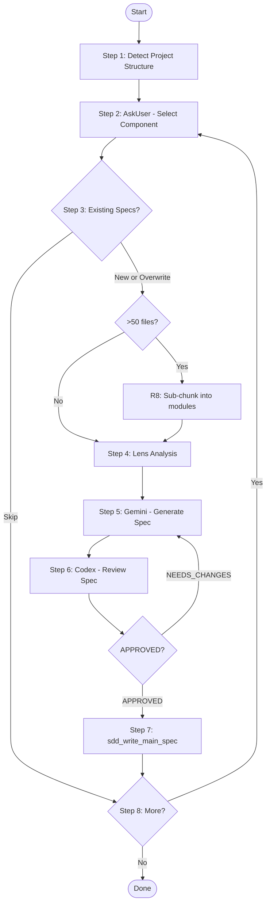

# /cclab:sdd:fillback-main-specs Skill

## Overview
<!-- type: overview lang: markdown -->

A Claude Code skill that generates SDD-compatible specs from existing code and writes them to `.aw/tech-design/{group}/`. This is a **standalone workflow** — it does NOT use the change pipeline (no proposal/review cycle). Instead, it orchestrates Lens code analysis, Gemini spec generation, and Codex quality review in a direct loop.

The skill is designed for brownfield adoption: teams with existing code can quickly bootstrap their spec library without manual authoring.

**Template source**: `crates/cclab-sdd/templates/mainthread/skills/cclab-sdd-fillback-main-specs/SKILL.md` (392 lines — referenced by path, not embedded here)

## Installation
<!-- type: doc lang: markdown -->

### R1 - Compile-Time Embedding

```yaml
id: R1
priority: high
status: draft
```

The template is embedded via `include_str!()` as `SKILL_FILLBACK` in `init.rs:17`. The installer does NOT read from the filesystem at runtime.

### R2 - Installation Path

```yaml
id: R2
priority: high
status: draft
```

`cclab init` writes the template to `.claude/skills/cclab-sdd-fillback-main-specs/SKILL.md`. The file is **overwritten on every `cclab init`** — this is a system-managed skill, not user-editable.

## Workflow
<!-- type: doc lang: markdown -->

The skill follows an 8-step process. The mainthread (Claude Code) acts as orchestrator, delegating heavy lifting to specialized tools and agents.

### R3 - Project Structure Detection

```yaml
id: R3
priority: high
status: draft
```

Detects mono-repo vs single-project by checking for:

| Indicator | Project Type |
|-----------|-------------|
| `Cargo.toml` with `[workspace]` | Cargo workspace |
| `package.json` with `workspaces` | npm/yarn workspace |
| `go.work` | Go workspace |
| `pnpm-workspace.yaml` | pnpm workspace |
| Multiple `go.mod` files | Go multi-module |

For mono-repos, workspace member lists are extracted. For single projects, the directory structure is scanned to identify functional domains.

### R4 - Interactive Component Selection

```yaml
id: R4
priority: high
status: draft
```

Presents discovered components to the user via `AskUserQuestion` with `multiSelect: false`. Each option shows the component name and file count (e.g. `"cclab-orbit"` — `"Event loop (45 .rs files)"`).

If existing specs are found for a component, the user chooses: skip existing, overwrite all, or cancel.

### R5 - Lens Code Analysis

```yaml
id: R5
priority: high
status: draft
```

Uses Lens tools for code analysis:

| Tool | Purpose |
|------|---------|
| `lens_symbols` | Extract symbols (functions, classes, variables) per file |
| `lens_check` | Check code quality (linting + type analysis) |
| `lens_code_to_mermaid` | Generate Mermaid diagrams from source code |

Results feed into the Gemini prompt as structured context. The analysis also determines `spec_type` per module (e.g. `http-api`, `data-model`, `algorithm`).

### R6 - Gemini Spec Generation

```yaml
id: R6
priority: high
status: draft
```

Delegates spec generation to Gemini (2M context window) via `/cclab:sdd:agent`. The prompt includes Lens analysis results, source code, and the target spec format (frontmatter + overview + requirements + scenarios + diagrams).

Gemini produces complete spec markdown including YAML frontmatter, requirements (R1, R2...), acceptance scenarios, and Mermaid diagrams appropriate for the `spec_type`.

### R7 - Codex Quality Gate

```yaml
id: R7
priority: high
status: draft
```

Validates each generated spec via Codex review (`/cclab:sdd:agent codex:balanced review`). The review checks:

1. Requirements match actual code behavior (not invented)
2. Scenarios reflect real code paths
3. Diagrams are consistent with code structure
4. Frontmatter is complete and valid

**Verdict**: `APPROVED` or `NEEDS_CHANGES` (with specific issues). On `NEEDS_CHANGES`, the spec is sent back to Gemini for revision — this loops until approved.

### R8 - Sub-Chunking for Large Components

```yaml
id: R8
priority: medium
status: draft
```

Components with >50 source files are split into modules of 5-15 files each. Chunking strategy:

1. **Group by directory**: use directory structure as primary grouping
2. **Dependency analysis**: check imports to find tightly-coupled file groups
3. **Multiple specs**: generate one spec per logical module instead of one monolithic spec

## Diagrams
<!-- type: doc lang: markdown -->

### Fillback Workflow



## Test Plan
<!-- type: doc lang: markdown -->

| Test | Covers |
|------|--------|
| fillback_skill_embedded_and_installed_by_init | R1, R2 |
| fillback_detects_project_structure | R3 |
| fillback_prompts_for_component_selection | R4 |
| fillback_collects_lens_analysis_context | R5 |
| fillback_generates_spec_with_agent | R6 |
| fillback_codex_review_loops_until_approved | R7 |
| fillback_splits_large_components_into_chunks | R8 |
