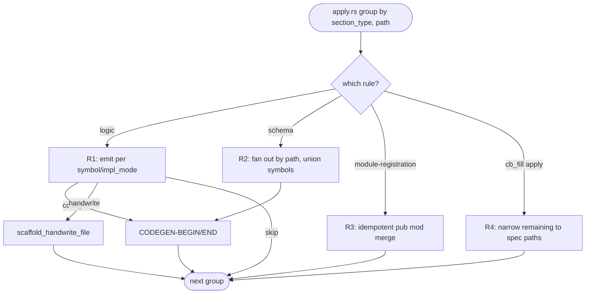

## Schema
<!-- type: schema lang: yaml -->

```yaml
section_type: schema
schemas:
  - name: ModuleRegistrationEntry
    description: |
      One entry in a `module-registration` section. Specifies a child
      module to be merged into the SPEC-MANAGED CODEGEN block at the
      target `mod.rs`.
    fields:
      - name: name
        type: String
        description: |
          The module identifier — emitted as `pub mod <name>;`. Must be
          a valid Rust identifier.
      - name: re_exports
        type: Vec<String>
        description: |
          Optional `pub use <name>::<item>;` re-exports to emit
          beneath the `pub mod` line. Order is preserved by the
          merge.

  - name: ModuleRegistrationPayload
    description: |
      Payload deserialized from a `section_type: module-registration`
      block in a TD spec. Drives the `module_registration` emitter.
    fields:
      - name: path
        type: String
        description: |
          Target `mod.rs` (relative to the project root). The emitter
          merges entries into the SPEC-MANAGED CODEGEN block at this
          path; creates the block when absent.
      - name: spec_managed_ref
        type: String
        description: |
          Value for the `// SPEC-MANAGED: <path>#<anchor>` directive
          written above the CODEGEN block. Usually the spec's own
          path + the section anchor.
      - name: entries
        type: Vec<ModuleRegistrationEntry>
        description: |
          Modules to register at `path`. Merged with any existing
          entries; alphabetical order preserved.

  - name: SectionType
    description: |
      Extension only — adds the `module-registration` variant to the
      closed enum recognised by `validate/rules/r3f_codegen_ready.rs`.
      All other variants unchanged.
    fields:
      - name: Schema
        type: unit
      - name: Logic
        type: unit
      - name: Cli
        type: unit
      - name: StateMachine
        type: unit
      - name: Interaction
        type: unit
      - name: TestPlan
        type: unit
      - name: DbModel
        type: unit
      - name: Requirement
        type: unit
      - name: Scenario
        type: unit
      - name: Config
        type: unit
      - name: ModuleRegistration
        type: unit
```

## Logic
<!-- type: logic lang: mermaid -->



Concrete rules enforced by the four sub-emitters:

**R1 (logic emitter).** Function name is taken verbatim from `symbol`
(never `enter`, never `parse_mermaid_plus_block`). Body for
`impl_mode: codegen` is `todo!("@spec <spec_ref>: <symbol>");` —
compiles and surfaces the spec link in panic output. Pipeline-text
variables (`section_type`, `line_start`, `frontmatter_raw`) never
appear in emitted source. For `impl_mode: hand-written`, delegates to
`handwrite_scaffold::scaffold_handwrite_file` carrying the entry's
`gap` / `tracker` / `reason`.

**R2 (schema emitter).** Two entries sharing a `path:` produce the
**union** of their declared symbols in a single CODEGEN block — not
the full schema, not duplicate definitions. Same symbol on
different paths is a spec error: the apply layer surfaces
`schema-symbol-duplicated-across-paths` and aborts before writing.
Rust output layout (field order, derives) is unchanged from today.

**R3 (module-registration emitter).** Block format mirrors other
CODEGEN blocks: `// SPEC-MANAGED: <ref>` + `// CODEGEN-BEGIN` +
`// CODEGEN-END`. Body is `pub mod <name>;` lines followed by any
`pub use` lines from `re_exports`. Two consecutive runs over the
same `mod.rs` produce byte-identical output. HANDWRITE regions
elsewhere in the file are not touched.

**R4 (cb fill apply scope).** Reuses the existing
`scope_markers_for_change_paths` helper from `cb_fill.rs` (today
called only from brief mode). The `spec_path` is already plumbed
into `run_apply` via `CbFillArgs`. Termination check (empty
`remaining`) uses the narrowed list. Out-of-scope markers (e.g.
the jet `react_dom_oracle_conformance.rs` marker) are left intact.

## Test Plan

```mermaid
---
id: codegen-emitter-fanout-and-cb-fill-scope-test-plan
title: Codegen Emitter Fan-Out and CbFill Scope Test Plan
tests:
  T1:
    type: test
    name: logic_emitter_honours_distinct_symbols_per_path
    file: projects/agentic-workflow/tests/codegen_emitter_fanout.rs
    verifies: [R1, R5]
  T2:
    type: test
    name: logic_emitter_handwrite_mode_emits_marker_block
    file: projects/agentic-workflow/tests/codegen_emitter_fanout.rs
    verifies: [R1, R5]
  T3:
    type: test
    name: schema_emitter_groups_two_entries_one_codegen_block
    file: projects/agentic-workflow/tests/codegen_emitter_fanout.rs
    verifies: [R2, R5]
  T4:
    type: test
    name: schema_emitter_aborts_on_cross_path_symbol_collision
    file: projects/agentic-workflow/tests/codegen_emitter_fanout.rs
    verifies: [R2, R5]
  T5:
    type: test
    name: module_registration_creates_block_in_new_file
    file: projects/agentic-workflow/tests/codegen_emitter_fanout.rs
    verifies: [R3, R5]
  T6:
    type: test
    name: module_registration_idempotent_second_run_byte_equal
    file: projects/agentic-workflow/tests/codegen_emitter_fanout.rs
    verifies: [R3, R5]
  T7:
    type: test
    name: module_registration_merges_into_existing_block_alphabetic
    file: projects/agentic-workflow/tests/codegen_emitter_fanout.rs
    verifies: [R3, R5]
  T8:
    type: test
    name: module_registration_preserves_sibling_handwrite_blocks
    file: projects/agentic-workflow/tests/codegen_emitter_fanout.rs
    verifies: [R3, R5]
  T9:
    type: test
    name: cb_fill_apply_skips_out_of_scope_markers
    file: projects/agentic-workflow/tests/cb_fill_scope.rs
    verifies: [R4, R5]
  T10:
    type: test
    name: cb_fill_apply_completes_when_all_in_scope_markers_filled
    file: projects/agentic-workflow/tests/cb_fill_scope.rs
    verifies: [R4, R5]
  T11:
    type: test
    name: regenerability_baseline_and_mermaid_plus_byte_equal
    file: projects/agentic-workflow/tests/codegen_emitter_fanout.rs
    verifies: [R6]
---
graph TD
  R1((R1)) --> T1
  R1 --> T2
  R2((R2)) --> T3
  R2 --> T4
  R3((R3)) --> T5
  R3 --> T6
  R3 --> T7
  R3 --> T8
  R4((R4)) --> T9
  R4 --> T10
  R5((R5)) --> T1
  R5 --> T3
  R5 --> T5
  R5 --> T9
  R6((R6)) --> T11
```

<!-- type: test-plan lang: mermaid -->



## Changes
<!-- type: changes lang: yaml -->

```yaml
section_type: changes
changes:
  - path: projects/agentic-workflow/src/generate/gen/rust/module_registration.rs
    action: create
    section: logic
    section_id: logic
    symbol: emit_module_registration
    impl_mode: hand-written
    handwrite_gap: missing-generator:logic
    handwrite_tracker: 2192
    handwrite_reason: |
      Bootstrapping problem — this file IS the module-registration
      emitter. It cannot be emitted by itself; the first cycle is
      hand-written. Once landed, future `## Changes` entries that
      register new modules call into this emitter; this file itself
      is exempt as its own gap-blocker is closed.
    description: |
      New emitter implementing R3. Public entry: `pub fn
      emit_module_registration(payload: &ModuleRegistrationPayload,
      project_root: &Path) -> Result<()>` — idempotent merge of
      `pub mod` lines into the SPEC-MANAGED CODEGEN block at
      `payload.path`.

  - path: projects/agentic-workflow/src/generate/gen/rust/mod.rs
    action: update
    section: logic
    section_id: logic
    symbol: dispatch_by_section_type
    impl_mode: hand-written
    handwrite_gap: missing-generator:dispatch-extend
    handwrite_tracker: 2192
    handwrite_reason: |
      The generator-dispatch table is currently hand-maintained (no
      generator for "table of section_type → emitter fn"). Extending
      it by one variant follows the same hand-edit path as the rest
      of the file. Will become CODEGEN once a dispatch-table emitter
      exists (out of scope for this issue).
    description: |
      Add `SectionType::ModuleRegistration =>
      module_registration::emit_module_registration(...)` arm.

  - path: projects/agentic-workflow/src/generate/gen/rust/schema.rs
    action: update
    section: schema
    section_id: logic
    symbol: emit_schema_block
    impl_mode: hand-written
    handwrite_gap: missing-generator:logic
    handwrite_tracker: 2192
    handwrite_reason: |
      Rewriting `emit_schema_block` to fan out by path requires
      cross-entry reasoning that today's `logic` emitter cannot
      express. Hand-written until the rewritten logic emitter (R1)
      can describe path-grouping in a mermaid diagram.
    description: |
      Rewrite `emit_schema_block` per R2 — group entries by `path`,
      emit one CODEGEN block per path with the union of declared
      symbols, surface `schema-symbol-duplicated-across-paths`
      diagnostic on cross-path symbol collision.

  - path: projects/agentic-workflow/src/generate/gen/rust/logic.rs
    action: update
    section: logic
    section_id: logic
    symbol: emit_logic_block
    impl_mode: hand-written
    handwrite_gap: missing-generator:logic
    handwrite_tracker: 2192
    handwrite_reason: |
      Rewriting the `logic` emitter while still using the current
      broken `logic` emitter is the bootstrapping problem this issue
      exists to fix. First cycle is hand-written; once landed, this
      file becomes self-hosting.
    description: |
      Rewrite `emit_logic_block` per R1 — emit functions named after
      declared `symbol`, with bodies dispatched by `impl_mode`
      (codegen → `todo!("@spec ...")`, handwrite → scaffold via
      handwrite_scaffold, skip → no emission).

  - path: projects/agentic-workflow/src/generate/apply.rs
    action: update
    section: logic
    section_id: logic
    symbol: apply_changes
    impl_mode: hand-written
    handwrite_gap: missing-generator:logic
    handwrite_tracker: 2192
    handwrite_reason: |
      `apply_changes` orchestrates the per-section emitters; adding
      the path-grouping pass that R1/R2 depend on is cross-cutting
      pipeline logic that the current `logic` emitter cannot
      express. Hand-written for this cycle.
    description: |
      Add a path-grouping pre-pass before per-section emitter
      dispatch. Group entries by `(section_type, path)`. Emit one
      CODEGEN/HANDWRITE block per group, passing the group as the
      emitter's unit of work instead of a single entry.

  - path: projects/agentic-workflow/src/validate/rules/r3f_codegen_ready.rs
    action: update
    section: logic
    section_id: logic
    symbol: parse_section_type
    impl_mode: hand-written
    handwrite_gap: missing-generator:logic
    handwrite_tracker: 2192
    handwrite_reason: |
      One-line enum extension; tracked together with the emitter
      changes it enables.
    description: |
      Add `"module-registration" => Some("ModuleRegistration")`
      arm to `parse_section_type`. No other rule changes.

  - path: projects/agentic-workflow/src/cli/cb_fill.rs
    action: update
    section: logic
    section_id: logic
    symbol: run_apply
    impl_mode: hand-written
    handwrite_gap: missing-generator:logic
    handwrite_tracker: 2192
    handwrite_reason: |
      Two-line wiring change inside `run_apply` — call
      `scope_markers_for_change_paths` on `remaining` using the
      spec_path's `## Changes` paths. The helper already exists.
    description: |
      After `let remaining = enumerate_worktree_markers(...);`, read
      the TD spec at `args.spec_path`, extract its `## Changes`
      paths via `agentic_workflow::td_ast::parse_td`, and narrow
      `remaining` to in-scope markers before picking
      `remaining[0]`. Termination check (`remaining.is_empty()`)
      now uses the narrowed list.

  - path: projects/agentic-workflow/tests/codegen_emitter_fanout.rs
    action: create
    section: test-plan
    section_id: test-plan
    symbol: tests
    impl_mode: hand-written
    handwrite_gap: missing-generator:test-plan
    handwrite_tracker: 2192
    handwrite_reason: |
      Test-plan emitter does not exist yet (sibling gap to R1/R2).
      Hand-written for this cycle; will be regenerated when the
      test-plan emitter lands as its own issue.
    description: |
      Implement T1..T8 + T11. Use `tempfile::TempDir` for isolated
      filesystem fixtures; never touch the live repo.

  - path: projects/agentic-workflow/tests/cb_fill_scope.rs
    action: create
    section: test-plan
    section_id: test-plan
    symbol: tests
    impl_mode: hand-written
    handwrite_gap: missing-generator:test-plan
    handwrite_tracker: 2192
    handwrite_reason: |
      Same as above — test-plan emitter does not exist yet.
    description: |
      Implement T9 + T10. Use `tempfile::TempDir` for the worktree
      fixture; stage two synthetic HANDWRITE markers; run
      `run_apply` through the public CLI verb.

  - path: projects/agentic-workflow/src/td_ast/mod.rs
    action: update
    section: schema
    section_id: logic
    symbol: register_mermaid_plus
    impl_mode: hand-written
    handwrite_gap: missing-generator:logic
    handwrite_tracker: 2192
    handwrite_reason: |
      R7 cleanup. Drops the `// HANDWRITE-BEGIN reason: #2080 ...
      pub mod mermaid_plus; // HANDWRITE-END` block and replaces it
      with a `pub mod mermaid_plus;` line inside the SPEC-MANAGED
      CODEGEN block once the module-registration emitter (R3) is
      in place. Hand-written here because the
      `td_ast/interfaces/types.md` spec that owns this file's
      CODEGEN block does not yet declare a module-registration
      entry for `mermaid_plus`. A follow-up spec edit will close
      the loop by adding it via the new emitter.
    description: |
      Replace the HANDWRITE block left by #2080 with a `pub mod
      mermaid_plus;` line in the SPEC-MANAGED CODEGEN block.

  - path: projects/agentic-workflow/CHANGELOG.md
    action: skip
    section: logic
    section_id: skip
    impl_mode: hand-written
    description: |
      No CHANGELOG entry — internal codegen-pipeline fix. The
      surfaced behavior change is "multi-file specs now compile",
      which is captured by the issue title.
```

# Reviews

- **2026-05-16 · self-review**
  - **Verdict:** approved
  - [Schema] `ModuleRegistrationEntry` + `ModuleRegistrationPayload` are
    flat closed-shape records — no `serde_yaml::Value` escape hatch.
    `entries` is `Vec<ModuleRegistrationEntry>` so two specs targeting
    the same `mod.rs` produce comparable structural diffs. The
    `SectionType` enum extension (adding `ModuleRegistration`) is the
    one-line change that lets `r3f_codegen_ready.rs` accept the new
    section type without touching its other arms.
  - [Logic] One consolidated `flowchart TD` with four labelled
    sub-flows (R1..R4). Entry node `dispatch` routes by section_type
    or by cb_fill apply, so each gap-fix lives on its own edge but
    shares the same group-by-(section_type, path) pre-pass. The
    prose rules below the diagram pin the per-rule invariants
    (function-name source, schema cross-path collision diagnostic,
    R3 idempotency, R4 helper reuse).
  - [Test Plan] T1..T11 cover all four rules + the regenerability
    invariant (T11). T-to-R traceability is explicit in both the YAML
    `verifies:` arrays and the `graph TD` body — no orphan tests, every
    requirement has at least one test. T11 (regenerability) is the
    cross-cutting guardrail that fails loud if any of R1/R2/R3 produces
    output drift for already-merged TDs.
  - [Changes] 11 entries — one per touched file plus the R7 cleanup
    (`td_ast/mod.rs`) and the CHANGELOG skip. All non-test entries
    are `impl_mode: hand-written` with `handwrite_gap: missing-generator:logic`
    pointing back to this very issue (#2192) — the bootstrapping
    problem (using the broken codegen to fix the broken codegen)
    is made explicit. Once landed, future TDs reusing the
    `module-registration` section type emit CODEGEN directly.
  - [Reference Context] Already approved in CRRR phase (2026-05-16
    review #1); preserved on the issue.
