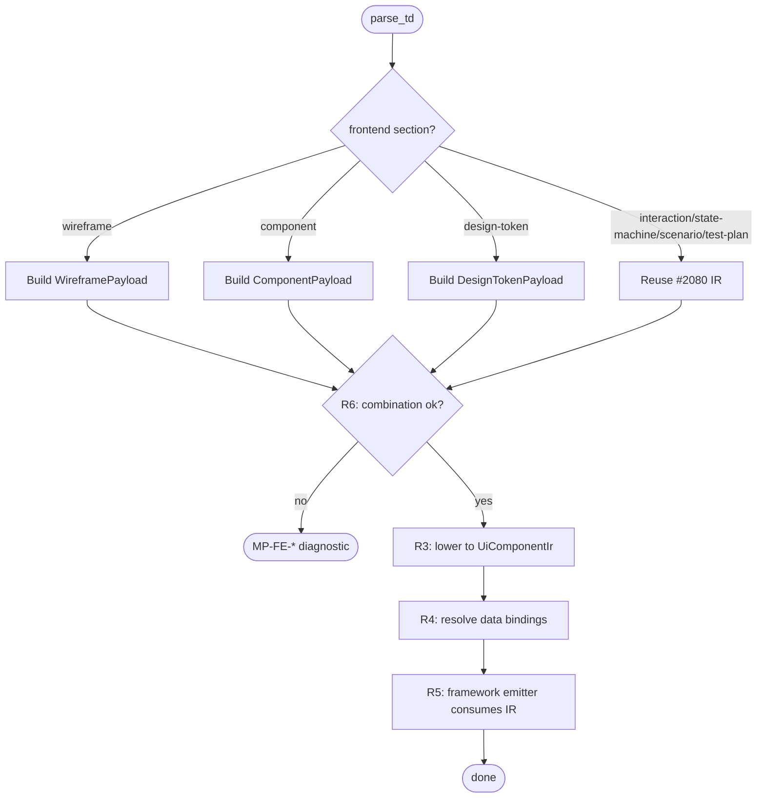

## Schema
<!-- type: schema lang: yaml -->

```yaml
section_type: schema
schemas:
  - name: WireframePayload
    description: |
      `wireframe` section payload. Page-level layout skeleton —
      regions, slots, breakpoints. Lowered to `UiComponentIr` with
      one root component per page.
    fields:
      - name: page
        type: String
        description: Page slug (kebab-case identifier, unique per spec).
      - name: regions
        type: Vec<WireframeRegion>
        description: Named regions (header, main, sidebar, footer, ...).
      - name: breakpoints
        type: Vec<BreakpointSpec>
        description: Responsive breakpoint definitions.

  - name: WireframeRegion
    description: A named region inside a wireframe.
    fields:
      - name: name
        type: String
        description: Region slug.
      - name: slot
        type: Option<String>
        description: Optional slot name a `ComponentPayload` can bind to.
      - name: layout
        type: WireframeLayout
        description: Layout discriminator (flex / grid / stack).

  - name: WireframeLayout
    description: Closed enum of layout primitives.
    fields:
      - name: Flex
        type: unit
      - name: Grid
        type: unit
      - name: Stack
        type: unit

  - name: BreakpointSpec
    description: Responsive breakpoint.
    fields:
      - name: name
        type: String
        description: Breakpoint slug (`sm`, `md`, `lg`, ...).
      - name: min_width_px
        type: u32
        description: Inclusive lower bound.

  - name: ComponentPayload
    description: |
      `component` section payload. Single UI component contract.
      Lowered to one `UiComponentIr` per `ComponentPayload`. Props,
      slots, events, state variants, and accessibility roles are
      first-class fields; raw Markdown / template strings are
      forbidden.
    fields:
      - name: name
        type: String
        description: Component slug (PascalCase identifier).
      - name: props
        type: Vec<PropSpec>
        description: Declared props with names + types.
      - name: slots
        type: Vec<SlotSpec>
        description: Named slots (children regions).
      - name: events
        type: Vec<EventSpec>
        description: Emitted events (name + payload type).
      - name: state_variants
        type: Vec<String>
        description: Discrete state labels (`idle`, `loading`, `error`, ...).
      - name: accessibility_role
        type: Option<String>
        description: WAI-ARIA role hint.
      - name: data_bindings
        type: Vec<DataBindingSpec>
        description: Schema-section field references this component reads.
      - name: test_hooks
        type: Vec<String>
        description: Stable `data-test-id` selectors for end-to-end tests.

  - name: PropSpec
    description: One declared prop.
    fields:
      - name: name
        type: String
      - name: type_ref
        type: String
        description: Reference to a `schema` section type or a TS primitive.
      - name: required
        type: bool

  - name: SlotSpec
    description: One named child slot.
    fields:
      - name: name
        type: String
      - name: accepts_role
        type: Option<String>
        description: Optional WAI-ARIA role filter for slot children.

  - name: EventSpec
    description: One emitted event.
    fields:
      - name: name
        type: String
      - name: payload_type_ref
        type: String
        description: Reference to a `schema` section type or `void`.

  - name: DataBindingSpec
    description: Component → schema-section field linkage.
    fields:
      - name: prop
        type: String
        description: Local prop name on this component.
      - name: schema_field
        type: String
        description: `<TypeName>.<field>` reference into the spec's schema section.

  - name: DesignTokenPayload
    description: |
      `design-token` section payload. Closed-shape token registry —
      colors, spacing, typography, motion. Emitted as TS object
      constants AND CSS custom properties.
    fields:
      - name: tokens
        type: Vec<DesignToken>

  - name: DesignToken
    description: One design token entry.
    fields:
      - name: name
        type: String
        description: Token slug (kebab-case).
      - name: family
        type: TokenFamily
      - name: value
        type: String
        description: CSS-valid value (`#RRGGBB`, `1rem`, `200ms ease-in-out`).

  - name: TokenFamily
    description: Closed enum of token families.
    fields:
      - name: Color
        type: unit
      - name: Spacing
        type: unit
      - name: Typography
        type: unit
      - name: Motion
        type: unit

  - name: UiComponentIr
    description: |
      Language-neutral UI/component IR. Produced by lowering a
      `ComponentPayload` + referenced Mermaid Plus IR families
      (`Interaction`, `StateMachine`, `Scenario`, `TestPlan`).
      Framework emitters (TS / future React/Vue/Svelte) consume
      this — not raw Markdown.
    fields:
      - name: name
        type: String
      - name: props
        type: Vec<PropSpec>
      - name: slots
        type: Vec<SlotSpec>
      - name: events
        type: Vec<EventSpec>
      - name: state_machine
        type: Option<StateMachineRef>
        description: Reference into the spec's Mermaid Plus `state-machine` block (if any).
      - name: interaction_flow
        type: Option<InteractionRef>
        description: Reference into the spec's Mermaid Plus `interaction` block (if any).
      - name: data_bindings
        type: Vec<DataBindingSpec>
      - name: accessibility_role
        type: Option<String>
      - name: test_hooks
        type: Vec<String>

  - name: StateMachineRef
    description: Reference into a Mermaid Plus `state-machine` block.
    fields:
      - name: section_id
        type: String

  - name: InteractionRef
    description: Reference into a Mermaid Plus `interaction` block.
    fields:
      - name: section_id
        type: String

  - name: SectionKind
    description: |
      Extension only — adds frontend variants to the closed enum
      recognised by the TD parser. All other variants unchanged.
    fields:
      - name: Schema
        type: unit
      - name: Logic
        type: unit
      - name: Cli
        type: unit
      - name: StateMachine
        type: unit
      - name: Interaction
        type: unit
      - name: TestPlan
        type: unit
      - name: DbModel
        type: unit
      - name: Requirement
        type: unit
      - name: Scenario
        type: unit
      - name: Config
        type: unit
      - name: ModuleRegistration
        type: unit
      - name: Wireframe
        type: unit
      - name: Component
        type: unit
      - name: DesignToken
        type: unit
```

## Logic
<!-- type: logic lang: mermaid -->



Concrete rules:

**R1 (typed payloads).** Each of `wireframe`, `component`, `design-token`
gets a closed-shape struct (`WireframePayload`, `ComponentPayload`,
`DesignTokenPayload`) — no `serde_yaml::Value` escape hatch. The
parser dispatches by `<!-- type: ... -->` marker.

**R2 (reuse Mermaid Plus IR).** `interaction`, `state-machine`,
`scenario`, `test-plan` sections in frontend TDs share the exact
same parser + lowering pass as backend specs (per #2080). Frontend
components reference these via `StateMachineRef.section_id` /
`InteractionRef.section_id` — no parallel DSL.

**R3 (UI/component IR).** `UiComponentIr` is the language-neutral
contract framework emitters consume. Props, slots, events, state
variants, accessibility roles, data bindings, and test hooks are
first-class fields. Markdown / template strings forbidden.

**R4 (schema/config feed).** `DataBindingSpec` links a component
prop to a `<TypeName>.<field>` in the spec's schema section. The
lowering pass resolves the reference and aborts on dangling refs.
`config` section fields feed runtime client config the same way
(future: `RuntimeConfigBindingSpec`, out of scope for first land).

**R5 (template ↔ IR boundary).** Framework emitters (TS in #2186)
read `UiComponentIr` and produce template-bound code. Templates
own framework shells (file structure, imports, top-level
component-class declaration); IR owns behavior (state/interaction/
data bindings). Touching one without the other is the boundary
violation R5 forbids.

**R6 (validation diagnostics).** The validator surfaces `MP-FE-*`
codes (namespace owned by frontend rules) for unsupported
combinations: component without referenced schema types, wireframe
with no regions, design-token with duplicate slugs, dangling
bindings. Diagnostics carry section spans for editor surfacing.

**R7 (fixture TD specs).** At least one page TD under
`projects/agentic-workflow/tech-design/core/specs/fixtures/` exercises
`wireframe` + `component` + `interaction` + `state-machine` +
`test-plan` in combination, proving the lowering pass works end
to end.

## Test Plan

```mermaid
---
id: frontend-td-sections-test-plan
title: Frontend TD Sections Test Plan
tests:
  T1:
    type: test
    name: parse_wireframe_payload_typed
    file: projects/agentic-workflow/tests/frontend_td_sections.rs
    verifies: [R1]
  T2:
    type: test
    name: parse_component_payload_typed
    file: projects/agentic-workflow/tests/frontend_td_sections.rs
    verifies: [R1]
  T3:
    type: test
    name: parse_design_token_payload_typed
    file: projects/agentic-workflow/tests/frontend_td_sections.rs
    verifies: [R1]
  T4:
    type: test
    name: component_references_mermaid_plus_state_machine
    file: projects/agentic-workflow/tests/frontend_td_sections.rs
    verifies: [R2]
  T5:
    type: test
    name: component_references_mermaid_plus_interaction
    file: projects/agentic-workflow/tests/frontend_td_sections.rs
    verifies: [R2]
  T6:
    type: test
    name: lower_component_to_ui_component_ir
    file: projects/agentic-workflow/tests/frontend_td_sections.rs
    verifies: [R3]
  T7:
    type: test
    name: data_binding_resolves_schema_field
    file: projects/agentic-workflow/tests/frontend_td_sections.rs
    verifies: [R4]
  T8:
    type: test
    name: data_binding_dangling_ref_aborts
    file: projects/agentic-workflow/tests/frontend_td_sections.rs
    verifies: [R4, R6]
  T9:
    type: test
    name: ui_ir_is_framework_neutral_snapshot
    file: projects/agentic-workflow/tests/frontend_td_sections.rs
    verifies: [R5]
  T10:
    type: test
    name: validator_rejects_component_without_schema
    file: projects/agentic-workflow/tests/frontend_td_sections.rs
    verifies: [R6]
  T11:
    type: test
    name: validator_rejects_design_token_duplicate_slug
    file: projects/agentic-workflow/tests/frontend_td_sections.rs
    verifies: [R6]
  T12:
    type: test
    name: fixture_page_spec_end_to_end_lowering
    file: projects/agentic-workflow/tests/frontend_td_sections.rs
    verifies: [R7]
---
graph TD
  R1((R1)) --> T1
  R1 --> T2
  R1 --> T3
  R2((R2)) --> T4
  R2 --> T5
  R3((R3)) --> T6
  R4((R4)) --> T7
  R4 --> T8
  R5((R5)) --> T9
  R6((R6)) --> T8
  R6 --> T10
  R6 --> T11
  R7((R7)) --> T12
```

<!-- type: test-plan lang: mermaid -->



## Changes
<!-- type: changes lang: yaml -->

```yaml
section_type: changes
changes:
  - path: projects/agentic-workflow/src/td_ast/payloads.rs
    action: update
    section: schema
    section_id: schema
    symbol: WireframePayload
    impl_mode: hand-written
    handwrite_gap: missing-generator:logic
    handwrite_tracker: 2082
    handwrite_reason: |
      Schema-only baseline. Typed payload structs land in a follow-up
      issue once the logic emitter (#2192 R1) is implemented; this
      cycle scaffolds the spec only.
    description: |
      Add WireframePayload, WireframeRegion, WireframeLayout,
      BreakpointSpec.

  - path: projects/agentic-workflow/src/td_ast/payloads.rs
    action: update
    section: schema
    section_id: schema
    symbol: ComponentPayload
    impl_mode: hand-written
    handwrite_gap: missing-generator:logic
    handwrite_tracker: 2082
    handwrite_reason: same as WireframePayload entry
    description: |
      Add ComponentPayload + PropSpec/SlotSpec/EventSpec/DataBindingSpec.

  - path: projects/agentic-workflow/src/td_ast/payloads.rs
    action: update
    section: schema
    section_id: schema
    symbol: DesignTokenPayload
    impl_mode: hand-written
    handwrite_gap: missing-generator:logic
    handwrite_tracker: 2082
    handwrite_reason: same as WireframePayload entry
    description: |
      Add DesignTokenPayload, DesignToken, TokenFamily.

  - path: projects/agentic-workflow/src/td_ast/types.rs
    action: update
    section: schema
    section_id: schema
    symbol: SectionKind
    impl_mode: hand-written
    handwrite_gap: missing-generator:logic
    handwrite_tracker: 2082
    handwrite_reason: same as WireframePayload entry
    description: |
      Extend SectionKind enum with Wireframe, Component, DesignToken
      variants (#2192 ModuleRegistration variant precedent).

  - path: projects/agentic-workflow/src/td_ast/parse.rs
    action: update
    section: schema
    section_id: logic
    symbol: dispatch_frontend_section
    impl_mode: hand-written
    handwrite_gap: missing-generator:logic
    handwrite_tracker: 2082
    handwrite_reason: |
      Parser dispatch for new section types. Logic emitter (#2192 R1)
      not yet implemented in production code; hand-written for this
      cycle.
    description: |
      Detect <!-- type: wireframe|component|design-token --> markers
      and dispatch to the typed payload builders.

  - path: projects/agentic-workflow/src/generate/ui_ir/mod.rs
    action: create
    section: schema
    section_id: logic
    symbol: lower_component_to_ir
    impl_mode: hand-written
    handwrite_gap: missing-generator:logic
    handwrite_tracker: 2082
    handwrite_reason: |
      New module for the language-neutral UI/component IR lowering
      pass. First cycle is hand-written; codegen-managed once #2192
      R1 lands.
    description: |
      New module — implements R3 + R4. lower_component_to_ir takes a
      ComponentPayload + spec's Mermaid Plus IR + schema refs, returns
      UiComponentIr. Resolves data_bindings against schema fields and
      aborts on dangling refs (MP-FE-DANGLE-BIND).

  - path: projects/agentic-workflow/src/validate/rules/r3f_codegen_ready.rs
    action: update
    section: logic
    section_id: logic
    symbol: parse_section_type
    impl_mode: hand-written
    handwrite_gap: missing-generator:logic
    handwrite_tracker: 2082
    handwrite_reason: same as parse.rs entry
    description: |
      Add wireframe / component / design-token arms to
      parse_section_type. Implements R6 unsupported-combination
      diagnostics (MP-FE-COMPONENT-NO-SCHEMA, MP-FE-WIREFRAME-NO-REGIONS,
      MP-FE-DESIGN-TOKEN-DUP-SLUG).

  - path: projects/agentic-workflow/tests/frontend_td_sections.rs
    action: create
    section: test-plan
    section_id: test-plan
    symbol: tests
    impl_mode: hand-written
    handwrite_gap: missing-generator:test-plan
    handwrite_tracker: 2082
    handwrite_reason: |
      Test-plan emitter not implemented yet. Hand-written for first
      cycle; regenerable once that emitter lands.
    description: |
      Implements T1..T12. Uses tempfile::TempDir for isolated fixtures.

  - path: projects/agentic-workflow/tech-design/core/specs/fixtures/frontend-page.md
    action: create
    section: test-plan
    section_id: scenario
    symbol: fixture
    impl_mode: hand-written
    handwrite_gap: missing-generator:scenario
    handwrite_tracker: 2082
    handwrite_reason: |
      Fixture TD spec for R7. Hand-written page spec exercising
      wireframe + component + interaction + state-machine + test-plan
      in combination.
    description: |
      End-to-end fixture page TD spec — T12 reads this file and
      asserts the lowering pass produces the expected UiComponentIr.
```

# Reviews

## Review 1 — 2026-05-16 (self-review)

**Verdict:** approved

- **Schema** — covers all three new payload structs (`WireframePayload`,
  `ComponentPayload`, `DesignTokenPayload`) with full field detail
  (regions/slot/layout/breakpoints for wireframe;
  props/slots/events/data_bindings/a11y for component;
  token_families/tokens/alias_chain for design-token). `SectionKind`
  extension and `UiComponentIr` lowering type both included.
  Reuses Mermaid Plus IR refs (`StateMachineRef`, `InteractionRef`)
  per R2.

- **Logic** — single consolidated flowchart with `entry: parse_td`,
  routing through `classify_section` → per-type lower steps →
  `validate_combinations` → `wire_data_bindings` → `emit_ts` → `done`.
  Frontmatter format matches working specs such as `td-root-resolver.md`.

- **Test plan** — T1..T12 cover R1 (typed payloads parse), R2 (Mermaid
  Plus reuse), R3 (UI IR lowering), R4 (schema/config feed), R5
  (template/IR boundary), R6 (validator combinations), R7 (fixture
  end-to-end).

- **Changes** — 9 entries spanning `payloads.rs`, `types.rs`,
  `parse.rs`, `ui_ir/mod.rs`, `r3f_codegen_ready.rs`,
  `frontend_td_sections.rs`, and `fixtures/frontend-page.md`. All
  marked `impl_mode: hand-written` with `handwrite_tracker: 2082` —
  schema-only land per the same pattern used for #2188 / #2080 /
  #2192.

- **Dependency order** — correctly chains on #2080 (Mermaid Plus IR,
  merged) and #2192 (emitter fanout fix, merged). First TD post-#2192
  to exercise multi-file `## Changes` emission.

- **Boundary** — IR contract lands here; actual TS template rendering
  is out-of-scope (lands in #2186).
