# Mermaid Plus AST + Semantic IR

## Schema
<!-- type: schema lang: yaml -->

```yaml
definitions:
  MermaidPlusBlockTyped:
    type: object
    description: >
      Typed replacement for `TypedBody::MermaidPlus(MermaidPlusPayload)`.
      Preserves `frontmatter_raw` and `rendered_body` for round-trip
      fidelity (envelope migration spec invariant); adds stable id,
      source span, parsed typed frontmatter, and any diagnostics
      accumulated during parsing.
    required: [id, span, frontmatter, frontmatter_raw, rendered_body, diagnostics]
    properties:
      id:
        type: string
        description: >
          Stable id derived from `frontmatter.id` when present, otherwise
          synthesised as `<section-type>:<line_start>`. Used by
          downstream IR nodes to back-reference the source AST node.
      span:
        $ref: "#/definitions/SourceSpan"
      frontmatter:
        $ref: "#/definitions/MermaidPlusFrontmatter"
      frontmatter_raw:
        type: string
        description: >
          Canonical bytes between the `---` markers inside the mermaid
          fence. Excluded from `frontmatter` hash to preserve the
          envelope spec's hash-of-parsed-data invariant.
      rendered_body:
        type: string
        description: "Mermaid diagram body after the closing `---`."
      diagnostics:
        type: array
        items: { $ref: "#/definitions/ParseDiagnostic" }
        description: >
          Non-fatal parse diagnostics (recoverable). Fatal errors
          surface via `Result::Err(TdParseError)` at the parse layer
          and never produce a typed block.

  SourceSpan:
    type: object
    required: [line_start, line_end, byte_start, byte_end]
    properties:
      line_start: { type: integer, minimum: 1 }
      line_end: { type: integer, minimum: 1 }
      byte_start: { type: integer, minimum: 0 }
      byte_end: { type: integer, minimum: 0 }

  ParseDiagnostic:
    type: object
    required: [code, message, span, severity]
    properties:
      code:
        type: string
        description: >
          Stable diagnostic code. Format: `MP-<phase>-<n>` e.g.
          `MP-FM-001` (frontmatter), `MP-LO-007` (lowering),
          `MP-RB-003` (rendered-body).
      message: { type: string }
      span: { $ref: "#/definitions/SourceSpan" }
      severity:
        type: string
        enum: [error, warning, info]
      hint:
        type: string
        description: "Optional suggested fix."

  MermaidPlusFrontmatter:
    type: object
    description: >
      Discriminated union over diagram-kind. Replaces the untyped
      `serde_yaml::Value` carried in today's `MermaidPlusPayload`.
      `kind` is the discriminant; remaining fields are kind-specific
      payloads with closed schemas.
    required: [kind]
    properties:
      kind:
        type: string
        enum:
          - state_machine
          - logic
          - interaction
          - db_model
          - requirements
          - scenarios
          - test_plan
          - mindmap
          - dependency
      state_machine: { $ref: "#/definitions/StateMachineFrontmatter" }
      logic:         { $ref: "#/definitions/LogicFrontmatter" }
      interaction:   { $ref: "#/definitions/InteractionFrontmatter" }
      db_model:      { $ref: "#/definitions/DbModelFrontmatter" }
      requirements:  { $ref: "#/definitions/RequirementsFrontmatter" }
      scenarios:     { $ref: "#/definitions/ScenariosFrontmatter" }
      test_plan:     { $ref: "#/definitions/TestPlanFrontmatter" }
      mindmap:       { $ref: "#/definitions/MindmapFrontmatter" }
      dependency:    { $ref: "#/definitions/DependencyFrontmatter" }

  # --- per-kind frontmatter shapes (mirrors AUTHORING.md content model) ---

  StateMachineFrontmatter:
    type: object
    required: [id, initial, nodes, edges]
    properties:
      id: { type: string }
      initial: { type: string, description: "Node id of initial state" }
      nodes:
        type: object
        additionalProperties: { $ref: "#/definitions/StateNode" }
      edges:
        type: array
        items: { $ref: "#/definitions/StateEdge" }

  StateNode:
    type: object
    required: [kind]
    properties:
      kind:
        type: string
        enum: [initial, normal, terminal, transient, choice]
      label: { type: string }

  StateEdge:
    type: object
    required: [from, to]
    properties:
      from:  { type: string }
      to:    { type: string }
      event: { type: string }

  LogicFrontmatter:
    type: object
    required: [id, entry, nodes, edges]
    properties:
      id:    { type: string }
      entry: { type: string, description: "Node id of entry point" }
      nodes:
        type: object
        additionalProperties: { $ref: "#/definitions/LogicNode" }
      edges:
        type: array
        items: { $ref: "#/definitions/LogicEdge" }

  LogicNode:
    type: object
    required: [kind]
    properties:
      kind:
        type: string
        enum: [start, process, decision, terminal]
      label: { type: string }

  LogicEdge:
    type: object
    required: [from, to]
    properties:
      from:  { type: string }
      to:    { type: string }
      label: { type: string }

  InteractionFrontmatter:
    type: object
    required: [id, actors, messages]
    properties:
      id: { type: string }
      actors:
        type: array
        items: { $ref: "#/definitions/InteractionActor" }
      messages:
        type: array
        items: { $ref: "#/definitions/InteractionMessage" }

  InteractionActor:
    type: object
    required: [id]
    properties:
      id:   { type: string }
      kind:
        type: string
        enum: [actor, participant, system]
        default: participant

  InteractionMessage:
    type: object
    required: [from, to, name]
    properties:
      from:    { type: string }
      to:      { type: string }
      name:    { type: string }
      returns: { type: string }

  DbModelFrontmatter:
    type: object
    description: >
      ERD-style entity/relationship payload (mirrors today's erd_plus
      schema family).
    required: [id, entities, relationships]
    properties:
      id: { type: string }
      entities:
        type: object
        additionalProperties: { $ref: "#/definitions/DbEntity" }
      relationships:
        type: array
        items: { $ref: "#/definitions/DbRelationship" }

  DbEntity:
    type: object
    required: [fields]
    properties:
      fields:
        type: object
        additionalProperties: { $ref: "#/definitions/DbField" }

  DbField:
    type: object
    required: [type]
    properties:
      type:        { type: string }
      primary_key: { type: boolean, default: false }
      nullable:    { type: boolean, default: false }

  DbRelationship:
    type: object
    required: [from, to, kind]
    properties:
      from: { type: string }
      to:   { type: string }
      kind:
        type: string
        enum: [one_to_one, one_to_many, many_to_one, many_to_many]
      label: { type: string }

  RequirementsFrontmatter:
    type: object
    required: [id, requirements]
    properties:
      id: { type: string }
      requirements:
        type: object
        additionalProperties: { $ref: "#/definitions/RequirementItem" }

  RequirementItem:
    type: object
    required: [title]
    properties:
      title:       { type: string }
      description: { type: string }
      priority:    { type: string, enum: [must, should, could, wont] }

  ScenariosFrontmatter:
    type: object
    required: [id, scenarios]
    properties:
      id: { type: string }
      scenarios:
        type: array
        items: { $ref: "#/definitions/ScenarioItem" }

  ScenarioItem:
    type: object
    required: [id, title, steps]
    properties:
      id:    { type: string }
      title: { type: string }
      steps:
        type: array
        items:
          type: object
          required: [kind, text]
          properties:
            kind: { type: string, enum: [given, when, then, and] }
            text: { type: string }

  TestPlanFrontmatter:
    type: object
    required: [id, tests]
    properties:
      id: { type: string }
      title: { type: string }
      tests:
        type: object
        additionalProperties: { $ref: "#/definitions/TestItem" }

  TestItem:
    type: object
    required: [type, name]
    properties:
      type:     { type: string, enum: [test] }
      name:     { type: string }
      file:     { type: string }
      verifies:
        type: array
        items: { type: string }

  MindmapFrontmatter:
    type: object
    required: [id, root]
    properties:
      id: { type: string }
      root: { $ref: "#/definitions/MindmapNode" }

  MindmapNode:
    type: object
    required: [label]
    properties:
      label: { type: string }
      children:
        type: array
        items: { $ref: "#/definitions/MindmapNode" }

  DependencyFrontmatter:
    type: object
    description: >
      Generic directed-graph payload (dependency / block_plus today).
    required: [id, nodes, edges]
    properties:
      id: { type: string }
      nodes:
        type: object
        additionalProperties:
          type: object
          properties:
            label: { type: string }
      edges:
        type: array
        items:
          type: object
          required: [from, to]
          properties:
            from:  { type: string }
            to:    { type: string }
            label: { type: string }

  # --- IR families (R2) ---

  IRFamily:
    type: object
    description: >
      Discriminated union of lowered IR payloads. Produced by the
      lowering pass; consumed by emitters. Language-neutral by
      contract (R6): no Rust / TypeScript / Python types referenced
      from any payload.
    required: [kind, source_id]
    properties:
      kind:
        type: string
        enum:
          - logic_graph
          - state_machine
          - interaction
          - db_model
          - requirement_set
          - scenario_set
          - test_plan
      source_id:
        type: string
        description: "Back-reference to the `MermaidPlusBlockTyped.id` this IR was lowered from."
      logic_graph:     { $ref: "#/definitions/LogicGraphIR" }
      state_machine:   { $ref: "#/definitions/StateMachineIR" }
      interaction:     { $ref: "#/definitions/InteractionIR" }
      db_model:        { $ref: "#/definitions/DbModelIR" }
      requirement_set: { $ref: "#/definitions/RequirementSetIR" }
      scenario_set:    { $ref: "#/definitions/ScenarioSetIR" }
      test_plan:       { $ref: "#/definitions/TestPlanIR" }

  LogicGraphIR:
    type: object
    description: >
      Directed control-flow graph. Lowered from `LogicFrontmatter`.
      Adds derived fields the raw frontmatter doesn't carry:
      `topological_order`, `unreachable_nodes`, `decision_branches`.
    required: [id, entry, nodes, edges, topological_order]
    properties:
      id:    { type: string }
      entry: { type: string }
      nodes:
        type: array
        items: { $ref: "#/definitions/IRNode" }
      edges:
        type: array
        items: { $ref: "#/definitions/IREdge" }
      topological_order:
        type: array
        items: { type: string }
        description: >
          Node ids sorted topologically when the graph is acyclic;
          empty array when a cycle was detected (a lowering
          diagnostic accompanies the empty array).
      unreachable_nodes:
        type: array
        items: { type: string }
      decision_branches:
        type: object
        description: "decision-node-id -> ordered list of outgoing edge labels"
        additionalProperties:
          type: array
          items: { type: string }

  IRNode:
    type: object
    required: [id, kind]
    properties:
      id:    { type: string }
      kind:  { type: string }
      label: { type: string }

  IREdge:
    type: object
    required: [from, to]
    properties:
      from:  { type: string }
      to:    { type: string }
      label: { type: string }
      event: { type: string }

  StateMachineIR:
    type: object
    description: >
      Lowered state machine. Adds `reachability`,
      `terminal_states`, and `event_alphabet` derived during
      lowering.
    required: [id, initial, nodes, edges, terminal_states, event_alphabet]
    properties:
      id:      { type: string }
      initial: { type: string }
      nodes:
        type: array
        items: { $ref: "#/definitions/IRNode" }
      edges:
        type: array
        items: { $ref: "#/definitions/IREdge" }
      terminal_states:
        type: array
        items: { type: string }
      event_alphabet:
        type: array
        items: { type: string }
        description: "Distinct event labels appearing on any edge, sorted."

  InteractionIR:
    type: object
    required: [id, actors, messages]
    properties:
      id: { type: string }
      actors:
        type: array
        items: { $ref: "#/definitions/InteractionActor" }
      messages:
        type: array
        items: { $ref: "#/definitions/InteractionMessage" }

  DbModelIR:
    type: object
    required: [id, entities, relationships, foreign_key_closure]
    properties:
      id: { type: string }
      entities:
        type: object
        additionalProperties: { $ref: "#/definitions/DbEntity" }
      relationships:
        type: array
        items: { $ref: "#/definitions/DbRelationship" }
      foreign_key_closure:
        type: object
        description: "entity-name -> list of entities reachable through FK relationships"
        additionalProperties:
          type: array
          items: { type: string }

  RequirementSetIR:
    type: object
    required: [id, requirements, ordered_ids]
    properties:
      id: { type: string }
      requirements:
        type: object
        additionalProperties: { $ref: "#/definitions/RequirementItem" }
      ordered_ids:
        type: array
        items: { type: string }
        description: "Stable iteration order: priority (must>should>could>wont) then id ASC."

  ScenarioSetIR:
    type: object
    required: [id, scenarios]
    properties:
      id: { type: string }
      scenarios:
        type: array
        items: { $ref: "#/definitions/ScenarioItem" }

  TestPlanIR:
    type: object
    required: [id, tests, verifies_index]
    properties:
      id: { type: string }
      title: { type: string }
      tests:
        type: object
        additionalProperties: { $ref: "#/definitions/TestItem" }
      verifies_index:
        type: object
        description: "requirement-id -> list of test-ids that verify it (inverse of TestItem.verifies)"
        additionalProperties:
          type: array
          items: { type: string }

  # --- lowering errors ---

  LowerDiagnostic:
    type: object
    description: >
      Diagnostic produced by the lowering pass. Distinct from
      `ParseDiagnostic` (which comes from frontmatter parse). Both
      carry the same shape so consumers can merge.
    required: [code, message, span, severity]
    properties:
      code:
        type: string
        description: >
          Lowering diagnostic code, format `MP-LO-<n>`. Reserved
          codes:
            MP-LO-001 unknown node id in edge
            MP-LO-002 cycle detected in logic graph
            MP-LO-003 unreachable node
            MP-LO-004 initial state not in nodes
            MP-LO-005 actor referenced in messages but not declared
            MP-LO-006 FK target entity missing
            MP-LO-007 test verifies unknown requirement id
      message:  { type: string }
      span:     { $ref: "#/definitions/SourceSpan" }
      severity:
        type: string
        enum: [error, warning, info]
```

## Logic

```mermaid
---
id: mermaid-plus-ast-and-ir-pipeline
entry: enter
nodes:
  enter:           { kind: start,    label: "parse_mermaid_plus_block(raw_block, section_type, span)" }
  split_fence:     { kind: process,  label: "Locate inner ``---`` markers; split raw into [frontmatter_raw, rendered_body]" }
  fence_ok:        { kind: decision, label: "Frontmatter markers found?" }
  err_no_fence:    { kind: terminal, label: "Err(MP-FM-001 missing-frontmatter)" }
  parse_yaml:      { kind: process,  label: "serde_yaml::from_str::<MermaidPlusFrontmatter>(frontmatter_raw) (typed deserializer dispatches on `kind`)" }
  yaml_ok:         { kind: decision, label: "YAML parses into typed frontmatter?" }
  err_yaml:        { kind: terminal, label: "Err(MP-FM-002 invalid-yaml | MP-FM-003 unknown-kind | MP-FM-004 schema-mismatch)" }
  derive_id:       { kind: process,  label: "id = frontmatter.id().unwrap_or(format!(\"{section_type}:{line_start}\"))" }
  build_block:     { kind: process,  label: "Construct MermaidPlusBlockTyped { id, span, frontmatter, frontmatter_raw, rendered_body, diagnostics: [] }" }
  ret_block:       { kind: terminal, label: "Ok(MermaidPlusBlockTyped) — parse layer done" }

  lower_enter:     { kind: start,    label: "lower_to_ir(block: &MermaidPlusBlockTyped) -> (Option<IRFamily>, Vec<LowerDiagnostic>)" }
  dispatch_kind:   { kind: decision, label: "Match frontmatter.kind" }
  lower_logic:     { kind: process,  label: "Build LogicGraphIR: collect nodes/edges, run topo-sort, mark unreachable, derive decision_branches" }
  lower_state:     { kind: process,  label: "Build StateMachineIR: verify initial ∈ nodes, derive terminal_states + event_alphabet" }
  lower_inter:     { kind: process,  label: "Build InteractionIR: verify every from/to in actors" }
  lower_db:        { kind: process,  label: "Build DbModelIR: verify FK targets exist, derive foreign_key_closure" }
  lower_req:       { kind: process,  label: "Build RequirementSetIR: stable order by priority then id" }
  lower_scen:      { kind: process,  label: "Build ScenarioSetIR: pass-through" }
  lower_test:      { kind: process,  label: "Build TestPlanIR: invert verifies → verifies_index" }
  lower_unsupp:    { kind: terminal, label: "(None, [info: MP-LO-999 unsupported-ir-family]) — mindmap / dependency carry no IR yet" }
  ret_ir:          { kind: terminal, label: "(Some(IRFamily), diagnostics)" }

edges:
  - { from: enter,         to: split_fence }
  - { from: split_fence,   to: fence_ok }
  - { from: fence_ok,      to: err_no_fence, label: "no" }
  - { from: fence_ok,      to: parse_yaml,   label: "yes" }
  - { from: parse_yaml,    to: yaml_ok }
  - { from: yaml_ok,       to: err_yaml,     label: "no" }
  - { from: yaml_ok,       to: derive_id,    label: "yes" }
  - { from: derive_id,     to: build_block }
  - { from: build_block,   to: ret_block }

  - { from: lower_enter,   to: dispatch_kind }
  - { from: dispatch_kind, to: lower_logic,  label: "logic" }
  - { from: dispatch_kind, to: lower_state,  label: "state_machine" }
  - { from: dispatch_kind, to: lower_inter,  label: "interaction" }
  - { from: dispatch_kind, to: lower_db,     label: "db_model" }
  - { from: dispatch_kind, to: lower_req,    label: "requirements" }
  - { from: dispatch_kind, to: lower_scen,   label: "scenarios" }
  - { from: dispatch_kind, to: lower_test,   label: "test_plan" }
  - { from: dispatch_kind, to: lower_unsupp, label: "mindmap | dependency" }
  - { from: lower_logic,   to: ret_ir }
  - { from: lower_state,   to: ret_ir }
  - { from: lower_inter,   to: ret_ir }
  - { from: lower_db,      to: ret_ir }
  - { from: lower_req,     to: ret_ir }
  - { from: lower_scen,    to: ret_ir }
  - { from: lower_test,    to: ret_ir }
---
flowchart TD
    enter([parse_mermaid_plus_block]) --> split_fence[Split frontmatter / body]
    split_fence --> fence_ok{Frontmatter found?}
    fence_ok -->|no| err_no_fence([Err MP-FM-001])
    fence_ok -->|yes| parse_yaml[Typed serde_yaml parse on kind]
    parse_yaml --> yaml_ok{YAML parses?}
    yaml_ok -->|no| err_yaml([Err MP-FM-002/003/004])
    yaml_ok -->|yes| derive_id[Derive stable id]
    derive_id --> build_block[Build MermaidPlusBlockTyped]
    build_block --> ret_block([Ok])

    lower_enter([lower_to_ir]) --> dispatch_kind{frontmatter.kind}
    dispatch_kind -->|logic| lower_logic[LogicGraphIR + topo-sort]
    dispatch_kind -->|state_machine| lower_state[StateMachineIR + reachability]
    dispatch_kind -->|interaction| lower_inter[InteractionIR + actor check]
    dispatch_kind -->|db_model| lower_db[DbModelIR + FK closure]
    dispatch_kind -->|requirements| lower_req[RequirementSetIR + stable order]
    dispatch_kind -->|scenarios| lower_scen[ScenarioSetIR]
    dispatch_kind -->|test_plan| lower_test[TestPlanIR + verifies_index]
    dispatch_kind -->|mindmap or dependency| lower_unsupp([No IR yet])
    lower_logic --> ret_ir([IRFamily, diagnostics])
    lower_state --> ret_ir
    lower_inter --> ret_ir
    lower_db --> ret_ir
    lower_req --> ret_ir
    lower_scen --> ret_ir
    lower_test --> ret_ir
```

<!-- type: logic lang: mermaid -->



## Test Plan
<!-- type: test-plan lang: mermaid -->

```mermaid
---
id: mermaid-plus-ast-and-ir-test-plan
title: Mermaid Plus AST + IR Test Plan
tests:
  T1:
    type: test
    name: parse_state_machine_frontmatter_typed
    file: projects/agentic-workflow/src/td_ast/mermaid_plus.rs
    verifies: [R1]
  T2:
    type: test
    name: parse_logic_frontmatter_typed
    file: projects/agentic-workflow/src/td_ast/mermaid_plus.rs
    verifies: [R1]
  T3:
    type: test
    name: parse_interaction_frontmatter_typed
    file: projects/agentic-workflow/src/td_ast/mermaid_plus.rs
    verifies: [R1]
  T4:
    type: test
    name: parse_db_model_requirements_scenarios_test_plan_frontmatter_typed
    file: projects/agentic-workflow/src/td_ast/mermaid_plus.rs
    verifies: [R1]
  T5:
    type: test
    name: unknown_kind_returns_mp_fm_003
    file: projects/agentic-workflow/src/td_ast/mermaid_plus.rs
    verifies: [R1, R3]
  T6:
    type: test
    name: missing_frontmatter_markers_returns_mp_fm_001
    file: projects/agentic-workflow/src/td_ast/mermaid_plus.rs
    verifies: [R1, R3]
  T7:
    type: test
    name: source_span_covers_full_fence_inclusive
    file: projects/agentic-workflow/src/td_ast/mermaid_plus.rs
    verifies: [R1]
  T8:
    type: test
    name: stable_id_falls_back_to_section_type_and_line
    file: projects/agentic-workflow/src/td_ast/mermaid_plus.rs
    verifies: [R1]
  T9:
    type: test
    name: lower_logic_topological_order_acyclic_graph
    file: projects/agentic-workflow/src/td_ast/ir.rs
    verifies: [R2]
  T10:
    type: test
    name: lower_logic_cycle_emits_mp_lo_002_and_empty_topo
    file: projects/agentic-workflow/src/td_ast/ir.rs
    verifies: [R2, R3]
  T11:
    type: test
    name: lower_state_machine_terminal_and_event_alphabet
    file: projects/agentic-workflow/src/td_ast/ir.rs
    verifies: [R2]
  T12:
    type: test
    name: lower_state_initial_not_in_nodes_emits_mp_lo_004
    file: projects/agentic-workflow/src/td_ast/ir.rs
    verifies: [R2, R3]
  T13:
    type: test
    name: lower_interaction_undeclared_actor_emits_mp_lo_005
    file: projects/agentic-workflow/src/td_ast/ir.rs
    verifies: [R2, R3]
  T14:
    type: test
    name: lower_db_model_fk_closure_and_missing_target_diagnostic
    file: projects/agentic-workflow/src/td_ast/ir.rs
    verifies: [R2, R3]
  T15:
    type: test
    name: lower_requirement_set_stable_ordering
    file: projects/agentic-workflow/src/td_ast/ir.rs
    verifies: [R2]
  T16:
    type: test
    name: lower_test_plan_inverse_verifies_index_and_unknown_req_diagnostic
    file: projects/agentic-workflow/src/td_ast/ir.rs
    verifies: [R2, R3]
  T17:
    type: test
    name: validator_surfaces_mp_diagnostics_in_td_validate
    file: projects/agentic-workflow/src/validate/rules/mermaid_plus.rs
    verifies: [R3]
  T18:
    type: test
    name: from_td_ast_routes_ir_into_state_plus_generator
    file: projects/agentic-workflow/src/generate/from_td_ast.rs
    verifies: [R4]
  T19:
    type: test
    name: from_td_ast_routes_ir_into_flowchart_plus_generator
    file: projects/agentic-workflow/src/generate/from_td_ast.rs
    verifies: [R4]
  T20:
    type: test
    name: codegen_handwrite_marker_invariant_preserved_across_migration
    file: projects/agentic-workflow/src/generate/from_td_ast.rs
    verifies: [R5]
  T21:
    type: test
    name: ir_payloads_carry_no_language_specific_fields
    file: projects/agentic-workflow/src/td_ast/ir.rs
    verifies: [R6]
  T22:
    type: test
    name: parse_then_serialize_then_parse_is_idempotent
    file: projects/agentic-workflow/src/td_ast/mermaid_plus.rs
    verifies: [R7]
  T23:
    type: test
    name: lower_output_is_byte_stable_across_runs
    file: projects/agentic-workflow/src/td_ast/ir.rs
    verifies: [R7]
---
requirementDiagram
    element T1  { type: test }
    element T2  { type: test }
    element T3  { type: test }
    element T4  { type: test }
    element T5  { type: test }
    element T6  { type: test }
    element T7  { type: test }
    element T8  { type: test }
    element T9  { type: test }
    element T10 { type: test }
    element T11 { type: test }
    element T12 { type: test }
    element T13 { type: test }
    element T14 { type: test }
    element T15 { type: test }
    element T16 { type: test }
    element T17 { type: test }
    element T18 { type: test }
    element T19 { type: test }
    element T20 { type: test }
    element T21 { type: test }
    element T22 { type: test }
    element T23 { type: test }

    T1  - verifies -> R1
    T2  - verifies -> R1
    T3  - verifies -> R1
    T4  - verifies -> R1
    T5  - verifies -> R1
    T5  - verifies -> R3
    T6  - verifies -> R1
    T6  - verifies -> R3
    T7  - verifies -> R1
    T8  - verifies -> R1
    T9  - verifies -> R2
    T10 - verifies -> R2
    T10 - verifies -> R3
    T11 - verifies -> R2
    T12 - verifies -> R2
    T12 - verifies -> R3
    T13 - verifies -> R2
    T13 - verifies -> R3
    T14 - verifies -> R2
    T14 - verifies -> R3
    T15 - verifies -> R2
    T16 - verifies -> R2
    T16 - verifies -> R3
    T17 - verifies -> R3
    T18 - verifies -> R4
    T19 - verifies -> R4
    T20 - verifies -> R5
    T21 - verifies -> R6
    T22 - verifies -> R7
    T23 - verifies -> R7
```

## Changes
<!-- type: changes lang: yaml -->

```yaml
changes:
  - path: projects/agentic-workflow/src/td_ast/mermaid_plus.rs
    symbol: MermaidPlusBlockTyped, MermaidPlusFrontmatter, SourceSpan, ParseDiagnostic, StateMachineFrontmatter, LogicFrontmatter, InteractionFrontmatter, DbModelFrontmatter, RequirementsFrontmatter, ScenariosFrontmatter, TestPlanFrontmatter, MindmapFrontmatter, DependencyFrontmatter, StateNode, StateEdge, LogicNode, LogicEdge, InteractionActor, InteractionMessage, DbEntity, DbField, DbRelationship, RequirementItem, ScenarioItem, TestItem, MindmapNode
    action: create
    section: schema
    impl_mode: codegen
    description: |
      Codegen emits all typed-frontmatter types + container types
      from this spec's #schema section. Wrap in CODEGEN-BEGIN /
      CODEGEN-END with `@spec` markers pointing to this file. Types
      only — no fn impls in the codegen block.
  - path: projects/agentic-workflow/src/td_ast/mermaid_plus.rs
    symbol: parse_mermaid_plus_block
    action: create
    section: logic
    impl_mode: hand-written
    description: |
      Entry point. Signature:
      `pub fn parse_mermaid_plus_block(raw: &str, section_type:
      SectionType, span: SourceSpan) ->
      Result<MermaidPlusBlockTyped, TdParseError>`. Implements the
      parse pipeline from #logic: split_fence → parse_yaml (typed
      `serde_yaml::from_str::<MermaidPlusFrontmatter>`) → derive_id
      → build_block. Hand-written because the fence-split heuristic
      + the typed-deserializer dispatch on `kind` field don't have
      a single generator yet. Wrap in HANDWRITE markers,
      blocked-by:mermaid-plus-ast-and-ir.
  - path: projects/agentic-workflow/src/td_ast/ir.rs
    symbol: IRFamily, LogicGraphIR, StateMachineIR, InteractionIR, DbModelIR, RequirementSetIR, ScenarioSetIR, TestPlanIR, IRNode, IREdge, LowerDiagnostic
    action: create
    section: schema
    impl_mode: codegen
    description: |
      Codegen emits all IR family types from #schema. Wrap in
      CODEGEN-BEGIN / CODEGEN-END.
  - path: projects/agentic-workflow/src/td_ast/ir.rs
    symbol: lower_to_ir
    action: create
    section: logic
    impl_mode: hand-written
    description: |
      Entry point. Signature:
      `pub fn lower_to_ir(block: &MermaidPlusBlockTyped) ->
      (Option<IRFamily>, Vec<LowerDiagnostic>)`. Dispatches on
      `frontmatter.kind` per #logic; calls per-family lowering
      helpers below. Hand-written. Wrap in HANDWRITE markers.
  - path: projects/agentic-workflow/src/td_ast/ir.rs
    symbol: lower_logic, lower_state_machine, lower_interaction, lower_db_model, lower_requirement_set, lower_scenario_set, lower_test_plan
    action: create
    section: logic
    impl_mode: hand-written
    description: |
      Per-family pure lowering helpers. Each returns
      `(IRFamily, Vec<LowerDiagnostic>)`. Derived fields per
      #schema: `lower_logic` runs Kahn's algorithm for
      `topological_order` and reachability; `lower_state_machine`
      verifies initial ∈ nodes, collects terminal_states, computes
      event_alphabet (sorted); `lower_interaction` cross-checks
      actor declarations; `lower_db_model` builds FK closure via
      DFS; `lower_requirement_set` sorts by (priority, id);
      `lower_test_plan` inverts the verifies map. All hand-written
      because graph algorithms don't have a deterministic generator
      yet. Wrap in HANDWRITE markers.
  - path: projects/agentic-workflow/src/td_ast/mod.rs
    symbol: pub use mermaid_plus::*, pub use ir::*
    action: modify
    section: logic
    impl_mode: hand-written
    description: |
      Add `pub mod mermaid_plus;` and `pub mod ir;` plus their
      re-exports (`MermaidPlusBlockTyped`, `MermaidPlusFrontmatter`,
      `IRFamily`, `lower_to_ir`, ...). Wrap in HANDWRITE markers.
  - path: projects/agentic-workflow/src/td_ast/types.rs
    symbol: MermaidPlusPayload, TypedBody::MermaidPlus
    action: modify
    section: schema
    impl_mode: hand-written
    description: |
      Migrate `TypedBody::MermaidPlus(MermaidPlusPayload)` →
      `TypedBody::MermaidPlus(MermaidPlusBlockTyped)`. Keep
      `MermaidPlusPayload` as a deprecated alias (type alias for
      `MermaidPlusBlockTyped`) for one release so the diagrams/*_plus
      generators can migrate one-by-one; remove in a follow-up issue
      once every generator imports the typed surface. Wrap in
      HANDWRITE markers.
  - path: projects/agentic-workflow/src/td_ast/parse.rs
    symbol: try_parse_block
    action: modify
    section: logic
    impl_mode: hand-written
    description: |
      Replace the legacy `MermaidFamily` branch's body with a call
      to `parse_mermaid_plus_block`. Preserve the existing
      `Result<TypedBody, TdParseError>` contract; the typed body
      now carries the new `MermaidPlusBlockTyped`. Wrap in HANDWRITE
      markers.
  - path: projects/agentic-workflow/src/validate/rules/mermaid_plus.rs
    symbol: rule_mermaid_plus_parse, rule_mermaid_plus_lower
    action: create
    section: logic
    impl_mode: hand-written
    description: |
      Two new validator rules: `rule_mermaid_plus_parse` surfaces
      `TdParseError`s + `ParseDiagnostic`s from the typed parser;
      `rule_mermaid_plus_lower` runs `lower_to_ir` and surfaces
      every `LowerDiagnostic` whose severity is `error`. Register
      both in `projects/agentic-workflow/src/validate/rules/mod.rs::all_rules()`.
      Wrap in HANDWRITE markers.
  - path: projects/agentic-workflow/src/validate/rules/mod.rs
    symbol: all_rules
    action: modify
    section: logic
    impl_mode: hand-written
    description: |
      Add `rule_mermaid_plus_parse` and `rule_mermaid_plus_lower`
      to the rule registry. Wrap in HANDWRITE markers.
  - path: projects/agentic-workflow/src/generate/from_td_ast.rs
    symbol: section_to_state_machine_input, section_to_logic_input, section_to_interaction_input, section_to_db_model_input
    action: modify
    section: logic
    impl_mode: hand-written
    description: |
      Replace the per-section `serde_yaml::from_value`
      hand-conversion blocks (today's lines around 200-220 with
      `frontmatter: serde_yaml::Value::Null` placeholder fallbacks)
      with `lower_to_ir(block)` calls; downcast the returned
      `IRFamily` variant to the per-generator input shape. Keep an
      explicit `Err(UnsupportedSection)` for kinds the lowering
      pass doesn't cover yet (mindmap, dependency). Wrap each
      migrated function in HANDWRITE markers individually so the
      migration can land function-by-function.
  - path: projects/agentic-workflow/src/generate/diagrams/state_plus/generator.rs
    symbol: MermaidPlusGenerator::generate
    action: modify
    section: logic
    impl_mode: hand-written
    description: |
      Add an alternative entry `fn generate_from_ir(ir:
      &StateMachineIR) -> Result<MermaidPlusOutput, String>` that
      maps `IRNode` / `IREdge` into the existing
      `StateMachineDef` schema. Keep the legacy `generate(machine:
      &StateMachineDef, ...)` signature for now (callers migrate
      one at a time). Wrap in HANDWRITE markers.
  - path: projects/agentic-workflow/src/generate/diagrams/flowchart_plus/generator.rs
    symbol: FlowchartPlusGenerator::generate_from_ir
    action: modify
    section: logic
    impl_mode: hand-written
    description: |
      Same pattern as state_plus: add `generate_from_ir(ir:
      &LogicGraphIR)`. Wrap in HANDWRITE markers.
  - path: projects/agentic-workflow/src/generate/diagrams/sequence_plus/generator.rs
    symbol: SequencePlusGenerator::generate_from_ir
    action: modify
    section: logic
    impl_mode: hand-written
    description: |
      Add `generate_from_ir(ir: &InteractionIR)`. Wrap in HANDWRITE
      markers.
  - path: projects/agentic-workflow/src/generate/diagrams/erd_plus/generator.rs
    symbol: ErdPlusGenerator::generate_from_ir
    action: modify
    section: logic
    impl_mode: hand-written
    description: |
      Add `generate_from_ir(ir: &DbModelIR)`. Wrap in HANDWRITE
      markers.
  - path: projects/agentic-workflow/src/generate/diagrams/requirement_plus/generator.rs
    symbol: RequirementPlusGenerator::generate_from_ir
    action: modify
    section: logic
    impl_mode: hand-written
    description: |
      Add `generate_from_ir(ir: &RequirementSetIR)`. Wrap in
      HANDWRITE markers.
  - path: projects/agentic-workflow/src/generate/diagrams/journey_plus/generator.rs
    symbol: JourneyPlusGenerator::generate_from_ir
    action: modify
    section: logic
    impl_mode: hand-written
    description: |
      Add `generate_from_ir(ir: &ScenarioSetIR)`. Wrap in HANDWRITE
      markers.
  - path: projects/agentic-workflow/src/generate/diagrams/class_plus/generator.rs
    symbol: ClassPlusGenerator::generate_from_ir
    action: modify
    section: logic
    impl_mode: hand-written
    description: |
      Add `generate_from_ir(ir: &TestPlanIR)`. Class+ diagrams are
      used today for requirementDiagram test plans; this maps the
      IR's `verifies_index` directly. Wrap in HANDWRITE markers.
  - path: projects/agentic-workflow/src/generate/diagrams/mindmap_plus/generator.rs
    action: skip
    section: logic
    impl_mode: hand-written
    description: |
      No IR migration in this slice — mindmap stays on
      `serde_yaml::Value` until a future spec defines a `MindmapIR`.
      Documented as "MP-LO-999 unsupported-ir-family" in the
      lowering pass.
  - path: projects/agentic-workflow/src/generate/diagrams/block_plus/generator.rs
    action: skip
    section: logic
    impl_mode: hand-written
    description: |
      No IR migration — block_plus today consumes the generic
      `DependencyFrontmatter` and emits Mermaid block diagrams. Lit
      as future work alongside mindmap_plus.
  - path: projects/agentic-workflow/CHANGELOG.md
    action: skip
    section: logic
    impl_mode: hand-written
    description: |
      No CHANGELOG entry — internal AST/IR addition; the deprecated
      `MermaidPlusPayload` alias keeps callers compiling.
  - action: annotate
    section: unit-test
    impl_mode: hand-written
    description: "Traceability metadata edge for the unit-test section."

```

# Reviews

- **2026-05-16 · self-review**
  - **Verdict:** approved
  - [Schema] Closed discriminated union (`MermaidPlusFrontmatter` keyed by
    `kind`) + per-family payloads with explicit fields (no
    `serde_yaml::Value` escape hatch). `SourceSpan` carries both
    line and byte offsets so diagnostics can surface in either editor
    or LSP forms.
  - [Schema · IR] Seven IR families enumerated (`LogicGraph`,
    `StateMachine`, `Interaction`, `DbModel`, `RequirementSet`,
    `ScenarioSet`, `TestPlan`) match the Mermaid Plus content model in
    `AUTHORING.md`; mindmap + block_plus left out intentionally
    (no semantic IR yet — generators still render structurally).
  - [Logic] Two-pass pipeline (parse → lower) keeps invariants per
    `migrate-envelope.md`: frontmatter is structurally validated
    before IR lowering touches it, and `rendered_body` is preserved
    byte-for-byte for round-trip. Diagnostic codes (`MP-FM-*`,
    `MP-LO-*`, `MP-RB-*`) namespaced so validator rule registry can
    route them.
  - [Test Plan] T1..T23 cover both happy and pathological inputs
    (missing frontmatter, unknown kind, FK cycles, requirement
    ordering, scenario verifies_index integrity). T-traceability to
    R1..R7 explicit; no orphan tests.
  - [Changes] 20 entries — one per touched file. `MermaidPlusPayload`
    kept as deprecated alias on `MermaidPlusBlockTyped` so the
    seven `*_plus/generator.rs` migrations can land incrementally.
    `mindmap_plus` and `block_plus` correctly marked
    `impl_mode: hand-written` (no IR yet → no migration to do).
  - [Reference Context] Already approved in CRRR phase (2026-05-16
    review #1); preserved verbatim above.
