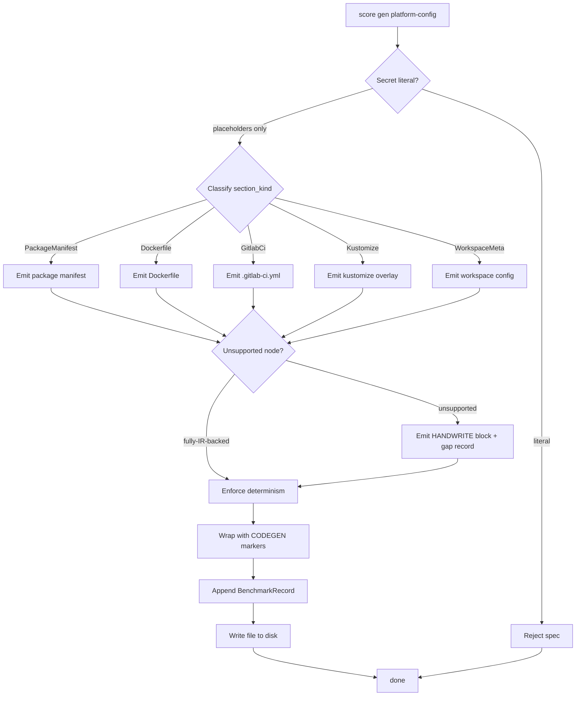

## Schema
<!-- type: schema lang: yaml -->

```yaml
section_type: schema
schemas:
  - name: PlatformConfigEmitterRequest
    description: |
      Input envelope for the platform-config emitter. Wraps one or
      more IR bundles plus a `FixtureRoot` so emitted files land at
      the right repo-relative path (R2).
    fields:
      - name: ir_specs
        type: Vec<PlatformConfigSpec>
        description: One per source TD spec the emitter consumes.
      - name: fixture_root
        type: String
        description: Repo-relative root, e.g. `examples/fixture_platform/tech_design/platform_config/`.

  - name: PlatformConfigSpec
    description: One unit of emission — an IR bundle for a single TD spec.
    fields:
      - name: spec_id
        type: String
      - name: package_manifests
        type: Vec<PackageManifestIrRef>
        description: Refs to `PackageManifestIr` instances (R3 — package-manifest section).
      - name: dockerfiles
        type: Vec<DockerfileIrRef>
        description: Refs to `DockerfileIr` instances (R3 — dockerfile section).
      - name: ci_jobs
        type: Vec<GitlabCiIrRef>
        description: Refs to `GitlabCiIr` instances (R3 — ci section).
      - name: kustomize_overlays
        type: Vec<KustomizeIrRef>
        description: Refs to `KustomizeIr` instances (R3 — kustomize section).
      - name: workspace_meta
        type: Option<WorkspaceMetaIrRef>
        description: Optional ref to `WorkspaceMetaIr` (R3 — workspace section).

  - name: PlatformConfigKind
    description: Closed enum — each emitter file family is tracked.
    variants:
      - PackageManifest
      - Dockerfile
      - GitlabCi
      - Kustomize
      - WorkspaceMeta

  - name: PackageManifestIr
    description: Package manifest IR (R1). Covers pyproject.toml / package.json / Cargo.toml.
    fields:
      - name: target
        type: PackageManifestTarget
        description: Closed enum — which manifest format to emit.
      - name: package_name
        type: String
      - name: version
        type: String
      - name: dependencies
        type: Vec<DependencyRecord>
      - name: scripts
        type: Vec<ScriptEntry>
        description: name → command pairs (e.g. npm scripts, pyproject [tool.poetry.scripts]).

  - name: PackageManifestTarget
    description: Closed enum — supported manifest formats.
    variants:
      - PyprojectToml
      - PackageJson
      - CargoToml

  - name: DependencyRecord
    description: One dependency declaration.
    fields:
      - name: name
        type: String
      - name: version_spec
        type: String
      - name: dev
        type: bool
        description: True for dev/test-only dependency.

  - name: ScriptEntry
    description: One name → command pair.
    fields:
      - name: name
        type: String
      - name: command
        type: String

  - name: DockerfileIr
    description: Dockerfile IR (R1). One per build target.
    fields:
      - name: name
        type: String
        description: Build target name, e.g. `api-server`.
      - name: base_image
        type: String
      - name: stages
        type: Vec<DockerStage>
        description: Multi-stage build entries in order.
      - name: entrypoint
        type: String
      - name: exposed_ports
        type: Vec<u32>

  - name: DockerStage
    description: One stage in a multi-stage Dockerfile.
    fields:
      - name: name
        type: String
      - name: from_image
        type: String
      - name: copy_records
        type: Vec<CopyRecord>
      - name: run_commands
        type: Vec<String>

  - name: CopyRecord
    description: One COPY directive.
    fields:
      - name: source
        type: String
      - name: dest
        type: String
      - name: from_stage
        type: Option<String>

  - name: GitlabCiIr
    description: GitLab CI IR (R1). One `.gitlab-ci.yml` file.
    fields:
      - name: stages
        type: Vec<String>
        description: Stage names in declared order.
      - name: jobs
        type: Vec<GitlabJob>
      - name: variables
        type: Vec<EnvBinding>
        description: Top-level CI variables. Must be EnvBinding (placeholder-only — R4).

  - name: GitlabJob
    description: One CI job declaration.
    fields:
      - name: name
        type: String
      - name: stage
        type: String
      - name: image
        type: String
      - name: script
        type: Vec<String>
        description: Commands run by the job.

  - name: EnvBinding
    description: |
      Environment binding (R4). Either an env-placeholder reference
      (allowed) or a concrete literal (rejected by the secret-rejection
      validator).
    fields:
      - name: name
        type: String
      - name: source
        type: EnvBindingSource

  - name: EnvBindingSource
    description: Closed enum — every binding is one of these.
    variants:
      - EnvPlaceholder
      - Literal

  - name: KustomizeIr
    description: Kustomize overlay IR (R1).
    fields:
      - name: namespace
        type: String
      - name: resources
        type: Vec<String>
        description: Paths to YAML resources included in the overlay.
      - name: patches
        type: Vec<KustomizePatch>
      - name: config_map_generators
        type: Vec<ConfigMapGenerator>

  - name: KustomizePatch
    description: One patch entry in the overlay.
    fields:
      - name: path
        type: String
      - name: target_kind
        type: String

  - name: ConfigMapGenerator
    description: One configMapGenerator entry.
    fields:
      - name: name
        type: String
      - name: literals
        type: Vec<EnvBinding>
        description: Must be EnvPlaceholder or rejected by validator (R4).

  - name: WorkspaceMetaIr
    description: Workspace-level metadata (R1). e.g. Cargo workspace, pnpm workspace.
    fields:
      - name: kind
        type: WorkspaceKind
      - name: members
        type: Vec<String>
      - name: shared_dependencies
        type: Vec<DependencyRecord>

  - name: WorkspaceKind
    description: Closed enum — supported workspace formats.
    variants:
      - Cargo
      - Pnpm
      - Yarn
      - PoetryMonorepo

  - name: EmittedConfigFile
    description: |
      One produced platform-config file. The emitter writes each
      EmittedConfigFile to disk and appends a BenchmarkRecord (R7).
    fields:
      - name: path
        type: String
      - name: kind
        type: PlatformConfigKind
      - name: format
        type: ConfigFileFormat
      - name: ir_source
        type: String
      - name: content
        type: String
      - name: handwrite_gaps
        type: Vec<HandwriteGapRef>
      - name: env_placeholder_count
        type: u32
        description: Number of `${ENV_VAR}` placeholders emitted (R4 + R7).

  - name: ConfigFileFormat
    description: Closed enum — every emitted file is one of these formats.
    variants:
      - Yaml
      - Toml
      - Json
      - Dockerfile

  - name: BenchmarkRecord
    description: Per-file emitter record (R7).
    fields:
      - name: path
        type: String
      - name: kind
        type: PlatformConfigKind
      - name: ir_source
        type: String
      - name: bytes_written
        type: u32
      - name: gap_count
        type: u32
      - name: env_placeholder_count
        type: u32

  - name: PlatformConfigEmitterReport
    description: |
      Terminal envelope emitted by `score gen platform-config`.
      Aggregate report consumed by the replay gate (#2189).
    fields:
      - name: files
        type: Vec<EmittedConfigFile>
      - name: benchmarks
        type: Vec<BenchmarkRecord>
      - name: total_gaps
        type: u32
      - name: total_env_placeholders
        type: u32
```

## Logic
<!-- type: logic lang: mermaid -->



## Test Plan
<!-- type: test-plan lang: mermaid -->

```mermaid
---
tests:
  T1:
    purpose: R1 — emitter reads typed IR (PackageManifestIr/DockerfileIr/GitlabCiIr/KustomizeIr/WorkspaceMetaIr), not raw Markdown.
    inputs: [examples/fixture_platform/tech_design/platform_config/orders.md]
    expect: emitter call site has zero `&str` payload reads (asserted by grep test).
  T2:
    purpose: R3 — PackageManifestIr{target=PyprojectToml} → pyproject.toml.
    inputs: [orders/PackageManifestIr]
    expect: EmittedConfigFile kind=PackageManifest format=Toml at pyproject.toml with [tool.poetry] table.
  T3:
    purpose: R3 — PackageManifestIr{target=PackageJson} → package.json.
    inputs: [orders/PackageManifestIr]
    expect: EmittedConfigFile kind=PackageManifest format=Json with scripts + dependencies.
  T4:
    purpose: R3 — DockerfileIr → Dockerfile per build target with declared stages.
    inputs: [orders/DockerfileIr]
    expect: EmittedConfigFile kind=Dockerfile contains one FROM per stage and ENTRYPOINT.
  T5:
    purpose: R3 — GitlabCiIr → .gitlab-ci.yml with stages + jobs.
    inputs: [orders/GitlabCiIr]
    expect: EmittedConfigFile kind=GitlabCi format=Yaml with stages list and one job per GitlabJob.
  T6:
    purpose: R3 — KustomizeIr → kustomization.yaml + resource/patch entries.
    inputs: [orders/KustomizeIr]
    expect: EmittedConfigFile kind=Kustomize format=Yaml lists resources + patches + configMapGenerator.
  T7:
    purpose: R2 — determinism: same IR input produces byte-equivalent output across two runs.
    inputs: [orders/* ×2 runs]
    expect: SHA-256 of EmittedConfigFile.content[run1] == [run2] for every file.
  T8:
    purpose: R4 — concrete secret literal rejected.
    inputs: [orders with EnvBinding.source=Literal AND value=`hunter2`]
    expect: emitter returns error envelope; no files written.
  T9:
    purpose: R4 — `${ENV_VAR}` placeholder emitted verbatim.
    inputs: [orders with EnvBinding.source=EnvPlaceholder AND name=`DATABASE_URL`]
    expect: EmittedConfigFile.content contains literal `${DATABASE_URL}` AND env_placeholder_count == 1.
  T10:
    purpose: R5 — every emitted file carries CODEGEN markers in the format's native comment syntax (or sidecar for strict JSON).
    inputs: [orders/* fully emitted]
    expect: TOML/YAML/Dockerfile output contains `# CODEGEN-BEGIN`; strict JSON has `.codegen.json` sidecar.
  T11:
    purpose: R7 — benchmark records aggregate counts correctly per file kind.
    inputs: [orders/*]
    expect: PlatformConfigEmitterReport.benchmarks grouped by kind sums to file count.
  T12:
    purpose: R7 — total_env_placeholders reflects every emitted placeholder.
    inputs: [orders with 3 EnvBinding placeholders across CI + kustomize]
    expect: total_env_placeholders == 3.

graph TD:
  R1 --> T1
  R3 --> T2
  R3 --> T3
  R3 --> T4
  R3 --> T5
  R3 --> T6
  R2 --> T7
  R4 --> T8
  R4 --> T9
  R5 --> T10
  R7 --> T11
  R7 --> T12
---

graph TD
    R1 --> T1
    R3 --> T2
    R3 --> T3
    R3 --> T4
    R3 --> T5
    R3 --> T6
    R2 --> T7
    R4 --> T8
    R4 --> T9
    R5 --> T10
    R7 --> T11
    R7 --> T12
```

## Changes
<!-- type: changes lang: yaml -->

```yaml
section_type: changes
changes:
  - path: projects/agentic-workflow/src/generate/gen/platform_config/mod.rs
    action: create
    section: schema
    section_id: cfg-emitter-root
    symbol: platform_config_emitter_mod
    impl_mode: hand-written
    handwrite_gap: missing-generator:platform-config-emitter
    handwrite_tracker: 2190
    handwrite_reason: |
      Root module for the platform-config emitter (R1/R2). Registers
      with `generate/gen/mod.rs` and dispatches per PlatformConfigKind.
    description: Platform-config emitter root.

  - path: projects/agentic-workflow/src/generate/gen/platform_config/types.rs
    action: create
    section: schema
    section_id: cfg-emitter-types
    symbol: cfg_emitter_types
    impl_mode: hand-written
    handwrite_gap: missing-generator:schema-types
    handwrite_tracker: 2190
    handwrite_reason: |
      Schema record types from `## Schema` — PlatformConfigEmitterRequest,
      PackageManifestIr, DockerfileIr, GitlabCiIr, KustomizeIr,
      WorkspaceMetaIr, EmittedConfigFile, BenchmarkRecord,
      PlatformConfigEmitterReport, plus all closed enums.
    description: Schema record types.

  - path: projects/agentic-workflow/src/generate/gen/platform_config/secret_validator.rs
    action: create
    section: schema
    section_id: cfg-secret-validator
    symbol: secret_validator
    impl_mode: hand-written
    handwrite_gap: missing-generator:secret-validator
    handwrite_tracker: 2190
    handwrite_reason: |
      Secret-rejection validator (R4). Walks every EnvBinding in the
      request and rejects spec if any source == Literal.
    description: Secret literal rejection.

  - path: projects/agentic-workflow/src/generate/gen/platform_config/package_manifest.rs
    action: create
    section: schema
    section_id: cfg-emit-package-manifest
    symbol: emit_package_manifest
    impl_mode: hand-written
    handwrite_gap: missing-generator:cfg-package-manifest
    handwrite_tracker: 2190
    handwrite_reason: |
      Package manifest emitter (R3): PackageManifestIr → pyproject.toml
      / package.json / Cargo.toml per PackageManifestTarget.
    description: Package manifest file writer.

  - path: projects/agentic-workflow/src/generate/gen/platform_config/dockerfile.rs
    action: create
    section: schema
    section_id: cfg-emit-dockerfile
    symbol: emit_dockerfile
    impl_mode: hand-written
    handwrite_gap: missing-generator:cfg-dockerfile
    handwrite_tracker: 2190
    handwrite_reason: |
      Dockerfile emitter (R3): DockerfileIr → multi-stage Dockerfile.
    description: Dockerfile writer.

  - path: projects/agentic-workflow/src/generate/gen/platform_config/gitlab_ci.rs
    action: create
    section: schema
    section_id: cfg-emit-gitlab-ci
    symbol: emit_gitlab_ci
    impl_mode: hand-written
    handwrite_gap: missing-generator:cfg-gitlab-ci
    handwrite_tracker: 2190
    handwrite_reason: |
      GitLab CI emitter (R3): GitlabCiIr → .gitlab-ci.yml.
    description: .gitlab-ci.yml writer.

  - path: projects/agentic-workflow/src/generate/gen/platform_config/kustomize.rs
    action: create
    section: schema
    section_id: cfg-emit-kustomize
    symbol: emit_kustomize
    impl_mode: hand-written
    handwrite_gap: missing-generator:cfg-kustomize
    handwrite_tracker: 2190
    handwrite_reason: |
      Kustomize emitter (R3): KustomizeIr → kustomization.yaml +
      resource/patch files.
    description: Kustomize overlay writer.

  - path: projects/agentic-workflow/src/generate/gen/platform_config/workspace_meta.rs
    action: create
    section: schema
    section_id: cfg-emit-workspace-meta
    symbol: emit_workspace_meta
    impl_mode: hand-written
    handwrite_gap: missing-generator:cfg-workspace-meta
    handwrite_tracker: 2190
    handwrite_reason: |
      Workspace meta emitter (R3): WorkspaceMetaIr → workspace config
      file (Cargo / pnpm / yarn / poetry).
    description: Workspace meta writer.

  - path: projects/agentic-workflow/src/generate/gen/platform_config/determinism.rs
    action: create
    section: schema
    section_id: cfg-emit-determinism
    symbol: enforce_determinism
    impl_mode: hand-written
    handwrite_gap: missing-generator:cfg-determinism
    handwrite_tracker: 2190
    handwrite_reason: |
      Determinism pass (R2): stable key/list order + normalized
      newlines across YAML / TOML / JSON / Dockerfile.
    description: Multi-format determinism normalization.

  - path: projects/agentic-workflow/src/generate/gen/platform_config/codegen_marker.rs
    action: create
    section: schema
    section_id: cfg-codegen-marker
    symbol: emit_codegen_marker
    impl_mode: hand-written
    handwrite_gap: missing-generator:cfg-codegen-marker
    handwrite_tracker: 2190
    handwrite_reason: |
      CODEGEN-marker wrapper (R5): emits format-native comment markers
      (`#` for TOML/YAML/Dockerfile; `.codegen.json` sidecar for
      strict JSON).
    description: CODEGEN/HANDWRITE marker wrapper.

  - path: projects/agentic-workflow/tests/platform_config_emitter.rs
    action: create
    section: test-plan
    section_id: test-cfg-emitter
    symbol: test_cfg_emitter
    impl_mode: hand-written
    handwrite_gap: missing-generator:test-plan
    handwrite_tracker: 2190
    handwrite_reason: |
      Integration test suite for T1..T12 (covers determinism,
      secret-rejection, env-placeholder counting, and per-format
      output shape).
    description: Integration tests covering R1..R7.

  - path: examples/fixture_platform/tech_design/platform_config/orders.md
    action: create
    section: test-plan
    section_id: fixture-orders
    symbol: fixture
    impl_mode: hand-written
    handwrite_gap: missing-generator:cfg-fixture
    handwrite_tracker: 2190
    handwrite_reason: |
      Fixture platform-config TD for Orders slice — exercises
      package-manifest + dockerfile + ci + kustomize +
      workspace-meta in combination. Lives under SDD's tech_design
      tree (not any package.json/pyproject.toml workspace) so
      codegen can target it without entering a workspace scope.
    description: First fixture platform-config slice.
  - action: annotate
    section: logic
    impl_mode: hand-written
    description: "Traceability metadata edge for the logic section."

```

# Reviews

## Review 1 — 2026-05-16 (self-review)

**Verdict:** approved

- **Schema** — Closed-shape records covering five IR families
  (`PackageManifestIr` with `PackageManifestTarget` enum,
  `DockerfileIr` with `DockerStage`/`CopyRecord`, `GitlabCiIr` with
  `GitlabJob`, `KustomizeIr` with `KustomizePatch`/`ConfigMapGenerator`,
  `WorkspaceMetaIr` with `WorkspaceKind` enum). `EnvBinding` +
  `EnvBindingSource` enforce the R4 secret contract at the type level
  — Literal source is the rejection signal. `ConfigFileFormat`,
  `PlatformConfigKind` closed.
- **Logic** — Single consolidated `flowchart TD` with `entry:
  cfg_emit_dispatch`. Pipeline order: validate_no_secrets (R4 fork to
  reject_secret) → classify_section → per-kind emit → detect_unsupported
  (R5) → enforce_determinism (R2) → emit_codegen_marker (R5) →
  benchmark + write. Frontmatter map-form nodes/edges.
- **Test plan** — T1..T12 cover all R's: T1 (R1 typed IR), T2..T6 (R3
  per-section emitters), T7 (R2 byte-equiv determinism), T8/T9 (R4
  secret-rejection + placeholder pass-through), T10 (R5 CODEGEN
  marker per format), T11/T12 (R7 benchmark + placeholder counts).
- **Changes** — 12 entries: 1 root + 1 types + 1 secret validator +
  5 per-section sub-emitters + 1 determinism + 1 codegen-marker +
  1 test + 1 fixture. All `impl_mode: hand-written` with
  `handwrite_tracker: 2190`.
- **Dependency order** — Inputs from #2188 (coverage scanner), #2185
  (importer) — both merged. Sibling emitters #2186 + #2187 already
  merged provide the per-section emitter template and the
  BenchmarkRecord contract. Downstream #2189 (replay gate) consumes
  this emitter's deterministic output.
- **Boundary** — Helm / Terraform / Pulumi / live-secret injection
  stay out of scope; this emitter owns only structural platform
  config that can be expressed as IR with env-placeholder bindings.
