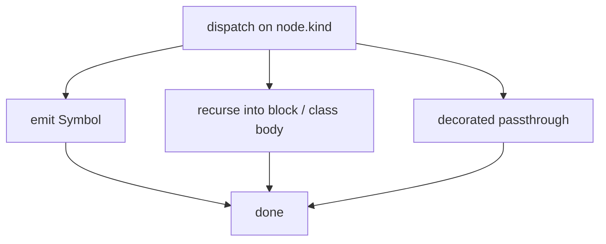

## Logic
<!-- type: logic lang: mermaid -->



## Changes
<!-- type: changes lang: yaml -->

```yaml
changes:
  - path: projects/agentic-workflow/src/fillback/ast.rs
    action: modify
    section: logic
    impl_mode: hand-written
    description: |
      Split `extract_python_node` into a thin public shim plus a new
      private `extract_python_node_in(node, source, symbols, imports,
      name_prefix, pending_decorators)` recursive worker. Worker
      behavior per kind:

      - `function_definition`: prepend `async ` to the signature when
        the node has an `async` keyword child; prepend each pending
        decorator as `@<text>\n`; push Symbol{name=prefix+raw, kind=
        Function} (R1, R3, R4).
      - `class_definition`: build signature `class <raw><superclasses>`,
        prepend pending decorators; push Symbol; then recurse into
        the body with `name_prefix = "<qualified>." (R1, R5).
      - `decorated_definition`: collect `decorator` children's verbatim
        source text (strip leading `@`); recurse into the `definition`
        field with `pending_decorators = Some(&collected)` (R3).
      - `if_statement` / `elif_clause` / `else_clause` / `try_statement`
        / `except_clause` / `finally_clause` / `with_statement` /
        `block`: walk children, recurse with the same `name_prefix`
        and `None` decorators (R2).
      - `import_statement` / `import_from_statement`: unchanged.
      - other kinds: ignored.

      New `#[cfg(test)]` cases:
      - `test_python_extracts_class_methods`: assert nested methods
        surface as `ClassName.method_name`.
      - `test_python_extracts_env_gated_def`: assert a def under
        `if FLAG:` reaches the symbol list.
      - `test_python_decorator_embedded_in_signature`: assert
        single + multi decorator capture lands as `@<text>\n` prefix.
      - `test_python_async_def_signature_prefix`: assert `async ` is
        prepended to signature.
      - `test_python_class_signature_includes_bases`: assert
        `class Foo(Base):` signature includes `(Base)`.

      Existing tests (`test_parse_python_decorated_definitions` and
      the rest) MUST continue to pass — recursion is additive.
    language: Rust
    symbols:
      - name: "extract_python_node"
        kind: function
        public: false
        signature: "extract_python_node(&self, node: &tree_sitter::Node, source: &str, symbols: &mut Vec<Symbol>, imports: &mut Vec<Import>)"
      - name: "extract_python_node_in"
        kind: function
        public: false
        signature: "extract_python_node_in(&self, node: &tree_sitter::Node, source: &str, symbols: &mut Vec<Symbol>, imports: &mut Vec<Import>, name_prefix: &str, pending_decorators: Option<&[String]>)"
```

# Reviews

### Review 1
**Verdict:** approved

- [logic] FSM covers every node kind the worker needs to reach; the `decorated_passthrough → recurse` edge correctly threads pending decorators while `block_passthrough` correctly passes `None`. The `class_definition → recurse into body` edge documents prefix propagation for method qualification.
- [changes] R1–R5 each map to a concrete branch in the new worker; the test-case list (class methods, env-gated, decorator, async, base classes) gives 1:1 coverage of the requirement matrix. R6 is structurally honoured — only the private worker is added and the public shim retains its signature.

