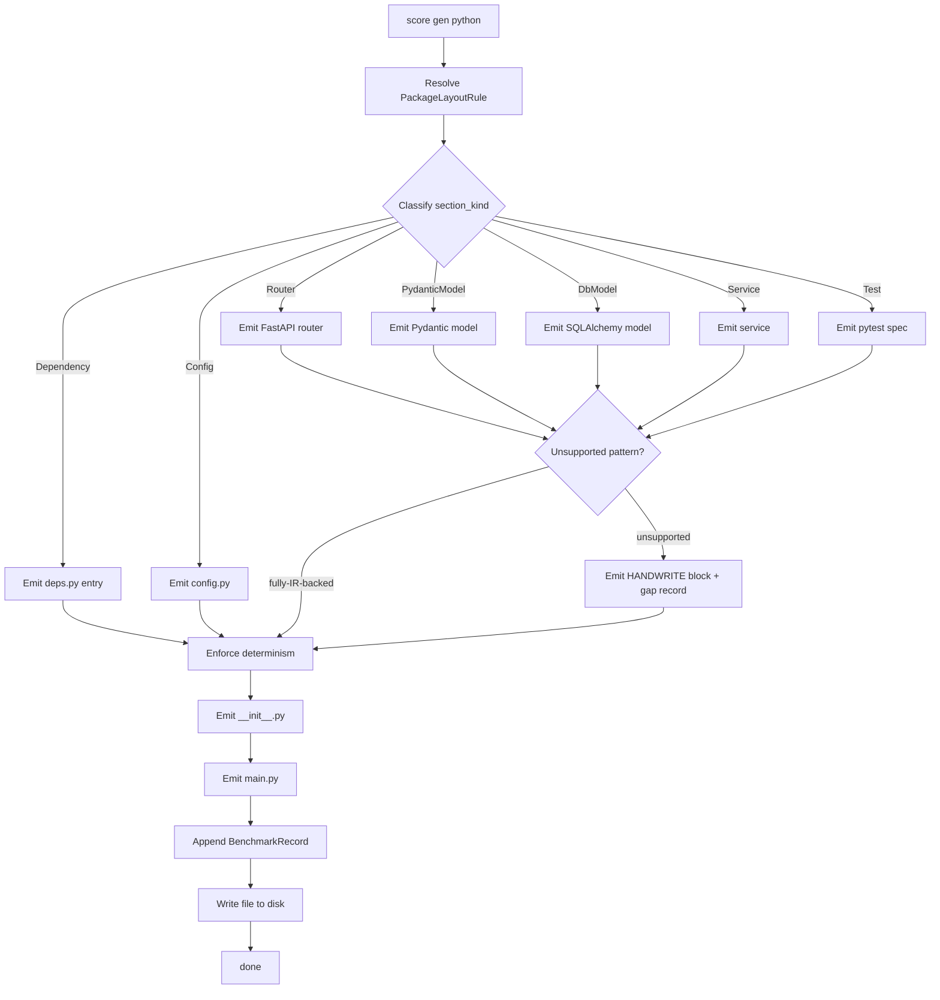

## Schema
<!-- type: schema lang: yaml -->

```yaml
section_type: schema
schemas:
  - name: PythonBackendEmitterRequest
    description: |
      Input envelope for the Python emitter. Wraps one or more
      IR bundles plus a `PackageLayout` so files land at the right
      package path (R2).
    fields:
      - name: ir_specs
        type: Vec<PythonBackendSpec>
        description: One per source TD spec the emitter consumes.
      - name: package_layout
        type: PackageLayout
        description: Maps spec_id prefix → package root + module path.
      - name: framework
        type: TargetFramework
        description: FastAPI is the only supported variant for now.

  - name: PythonBackendSpec
    description: One unit of emission — an IR bundle for a single TD spec.
    fields:
      - name: spec_id
        type: String
        description: Source TD spec ID.
      - name: routers
        type: Vec<RouterIrRef>
        description: Refs to `RouterIr` instances (R3 — interaction section).
      - name: pydantic_models
        type: Vec<PydanticModelIrRef>
        description: Refs to `PydanticModelIr` instances (R3 — schema section).
      - name: db_models
        type: Vec<DbModelIrRef>
        description: Refs to `DbModelIr` instances (R3 — schema section).
      - name: services
        type: Vec<ServiceIrRef>
        description: Refs to `ServiceIr` instances (R3 — state section).
      - name: dependencies
        type: Vec<DependencyProviderIrRef>
        description: Refs to `DependencyProviderIr` instances (R3 — interaction deps).
      - name: config
        type: Option<ConfigIrRef>
        description: Optional ref to `ConfigIr` (R3 — config section).
      - name: tests
        type: Vec<TestPlanRef>
        description: Refs to `TestPlan` payloads (R3 — test section).

  - name: TargetFramework
    description: Closed enum — supported Python frameworks.
    variants:
      - FastAPI

  - name: PackageLayout
    description: |
      Maps a spec_id prefix to a Python package root + module path (R2).
      Mirrors the conventions in `projects/agentic-workflow/examples/fixture_platform/backend/`.
    fields:
      - name: rules
        type: Vec<PackageLayoutRule>
      - name: package_root
        type: String
        description: Repo-relative root containing `pyproject.toml` (fixture only — emitted files are written below this root).

  - name: PackageLayoutRule
    description: One spec_id-prefix → package + module mapping rule.
    fields:
      - name: spec_prefix
        type: String
        description: e.g. `fixture_platform.backend.orders`.
      - name: package_name
        type: String
        description: Python package name, e.g. `fixture_platform_orders`.
      - name: module_path
        type: String
        description: Path inside the package, e.g. `routers/`.

  - name: PythonModuleIr
    description: |
      Closed shape of one emitted Python module before serialization (R1).
      The emitter folds router/model/service/etc. IR into this before
      writing to disk.
    fields:
      - name: module_path
        type: String
        description: Repo-relative `.py` path.
      - name: imports
        type: Vec<ImportRecord>
        description: Stable-sorted imports (R4).
      - name: body_kind
        type: PythonBodyKind
        description: Which sub-emitter produced this module.
      - name: handwrite_gaps
        type: Vec<HandwriteGapRef>
        description: Reuses the #2185 `HandwriteGap` shape (R5).

  - name: ImportRecord
    description: One import statement.
    fields:
      - name: module
        type: String
        description: e.g. `fastapi`.
      - name: names
        type: Vec<String>
        description: Imported symbols, sorted for determinism (R4).
      - name: is_relative
        type: bool
        description: True for `from .x import y` style.

  - name: PythonBodyKind
    description: Closed enum — each emitter file family is tracked.
    variants:
      - Router
      - PydanticModel
      - DbModel
      - Service
      - Dependency
      - Config
      - Test
      - PackageInit
      - Main

  - name: RouterIr
    description: FastAPI router IR (R1). One per interaction section.
    fields:
      - name: name
        type: String
        description: Router symbol name, e.g. `orders_router`.
      - name: prefix
        type: String
        description: URL prefix, e.g. `/orders`.
      - name: routes
        type: Vec<RouteRecord>
        description: One per OpenAPI operation in the source.
      - name: tag
        type: String
        description: Single OpenAPI tag for the router.

  - name: RouteRecord
    description: One route declaration inside a router.
    fields:
      - name: method
        type: HttpMethod
        description: GET / POST / PUT / DELETE / PATCH.
      - name: path
        type: String
        description: Path relative to router prefix.
      - name: handler_symbol
        type: String
        description: Function name the route binds to.
      - name: request_model
        type: Option<String>
        description: Pydantic request model symbol, when applicable.
      - name: response_model
        type: String
        description: Pydantic response model symbol.

  - name: HttpMethod
    description: Closed enum — HTTP methods the emitter supports.
    variants:
      - Get
      - Post
      - Put
      - Delete
      - Patch

  - name: PydanticModelIr
    description: Pydantic v2 model IR (R1). One per request/response schema.
    fields:
      - name: name
        type: String
        description: Class name.
      - name: fields
        type: Vec<PydanticField>
      - name: base
        type: String
        description: Base class — typically `BaseModel`.

  - name: PydanticField
    description: One field on a Pydantic model.
    fields:
      - name: name
        type: String
      - name: py_type
        type: String
        description: Python type expression, e.g. `list[str]`.
      - name: default
        type: Option<String>
        description: Default expression when the field is optional.

  - name: DbModelIr
    description: SQLAlchemy-style persistence model IR (R1).
    fields:
      - name: name
        type: String
      - name: table_name
        type: String
      - name: columns
        type: Vec<DbColumn>

  - name: DbColumn
    description: One column on a `DbModelIr`.
    fields:
      - name: name
        type: String
      - name: sql_type
        type: String
        description: e.g. `Integer`, `String(64)`.
      - name: primary_key
        type: bool
      - name: nullable
        type: bool

  - name: ServiceIr
    description: Service-layer IR (R1). One per state-machine section.
    fields:
      - name: name
        type: String
      - name: depends_on
        type: Vec<String>
        description: DependencyProvider names this service injects.
      - name: state_machine_ref
        type: StateMachineRef
        description: Reuses #2080 `StateMachineRef`.

  - name: DependencyProviderIr
    description: FastAPI dependency provider IR (R1).
    fields:
      - name: name
        type: String
        description: Provider function name.
      - name: provides
        type: String
        description: Type the provider yields.
      - name: scope
        type: DependencyScope
        description: Closed enum — request / app / session.

  - name: DependencyScope
    description: Closed enum — lifetime of an injected dependency.
    variants:
      - Request
      - App
      - Session

  - name: ConfigIr
    description: Application config IR (R1). Maps TD config section to `config.py`.
    fields:
      - name: name
        type: String
        description: Settings class name, e.g. `Settings`.
      - name: env_prefix
        type: String
        description: Pydantic Settings env prefix.
      - name: fields
        type: Vec<PydanticField>

  - name: EmittedPythonFile
    description: |
      One produced Python file. The emitter writes each EmittedPythonFile
      to disk and emits a `BenchmarkRecord` describing it (R7).
    fields:
      - name: path
        type: String
        description: Repo-relative output path.
      - name: kind
        type: PythonBodyKind
        description: Which sub-emitter produced it.
      - name: ir_source
        type: String
        description: `spec_id` + section_id of the IR that produced this file.
      - name: content
        type: String
        description: UTF-8 Python source (R4 — byte-equivalent across runs).
      - name: handwrite_gaps
        type: Vec<HandwriteGapRef>
        description: Reuses the #2185 `HandwriteGap` shape (R5).

  - name: BenchmarkRecord
    description: |
      Per-file emitter record (R7) consumed by the standardize driver
      to roll up coverage stats and surface remaining gaps.
    fields:
      - name: path
        type: String
      - name: kind
        type: PythonBodyKind
      - name: ir_source
        type: String
      - name: bytes_written
        type: u32
      - name: gap_count
        type: u32

  - name: PythonBackendEmitterReport
    description: |
      Terminal envelope emitted by `score gen python`. Aggregate report
      consumed by the replay gate (#2189) for determinism checks.
    fields:
      - name: files
        type: Vec<EmittedPythonFile>
      - name: benchmarks
        type: Vec<BenchmarkRecord>
      - name: total_gaps
        type: u32
```

## Logic
<!-- type: logic lang: mermaid -->



## Test Plan
<!-- type: test-plan lang: mermaid -->

```mermaid
---
tests:
  T1:
    purpose: R1 — emitter reads typed IR (PythonModuleIr/RouterIr/PydanticModelIr/DbModelIr/ServiceIr/DependencyProviderIr/ConfigIr), not stringly Markdown.
    inputs: [examples/fixture_platform/tech_design/backend/orders.md]
    expect: emitter call site has zero `&str` payload reads (asserted by grep test).
  T2:
    purpose: R3 — RouterIr → FastAPI router file with @router decorators per RouteRecord.
    inputs: [orders/RouterIr]
    expect: EmittedPythonFile kind=Router contains APIRouter() + one decorator per RouteRecord.
  T3:
    purpose: R3 — PydanticModelIr → Pydantic v2 model file.
    inputs: [orders/PydanticModelIr]
    expect: EmittedPythonFile kind=PydanticModel exports class extending BaseModel with typed fields.
  T4:
    purpose: R3 — DbModelIr → SQLAlchemy model file.
    inputs: [orders/DbModelIr]
    expect: EmittedPythonFile kind=DbModel exports Mapped[...] declarations + __tablename__.
  T5:
    purpose: R3 — ServiceIr → service-layer file with injected deps.
    inputs: [orders/ServiceIr]
    expect: EmittedPythonFile kind=Service binds StateMachineRef transitions + Depends(...) on each entry of depends_on.
  T6:
    purpose: R3 — ConfigIr → config.py with Pydantic Settings.
    inputs: [orders/ConfigIr]
    expect: EmittedPythonFile kind=Config exports Settings class with model_config.env_prefix.
  T7:
    purpose: R4 — determinism: same IR input produces byte-equivalent output across two runs.
    inputs: [orders/* ×2 runs]
    expect: SHA-256 of EmittedPythonFile.content[run1] == [run2] for every file.
  T8:
    purpose: R5 — unsupported pattern produces HANDWRITE block + gap record.
    inputs: [synthetic service with custom logic node]
    expect: EmittedPythonFile contains `# HANDWRITE-BEGIN reason: missing-generator:custom-service-logic` and HandwriteGapRef in record.
  T9:
    purpose: R2 — package-layout resolver routes specs into the right package + module path.
    inputs: [orders mapped to fixture_platform_orders package]
    expect: EmittedPythonFile paths sit under `fixture_platform_orders/<module_path>/...`.
  T10:
    purpose: R7 — benchmark records aggregate correctly per file kind.
    inputs: [orders/*]
    expect: PythonBackendEmitterReport.benchmarks grouped by kind sums to file count.
  T11:
    purpose: R7 — total_gaps reflects every HANDWRITE region emitted.
    inputs: [orders/* with 3 HANDWRITE blocks]
    expect: total_gaps == 3.
  T12:
    purpose: R2 — main.py wires every emitted router + dependency.
    inputs: [orders/* fully emitted]
    expect: main.py includes app.include_router(...) for every Router-kind EmittedPythonFile.

graph TD:
  R1 --> T1
  R3 --> T2
  R3 --> T3
  R3 --> T4
  R3 --> T5
  R3 --> T6
  R4 --> T7
  R5 --> T8
  R2 --> T9
  R2 --> T12
  R7 --> T10
  R7 --> T11
---

graph TD
    R1 --> T1
    R3 --> T2
    R3 --> T3
    R3 --> T4
    R3 --> T5
    R3 --> T6
    R4 --> T7
    R5 --> T8
    R2 --> T9
    R2 --> T12
    R7 --> T10
    R7 --> T11
```

## Changes
<!-- type: changes lang: yaml -->

```yaml
section_type: changes
changes:
  - path: projects/agentic-workflow/src/generate/gen/python/mod.rs
    action: create
    section: logic
    section_id: py-emitter-root
    symbol: python_emitter_mod
    impl_mode: hand-written
    handwrite_gap: missing-generator:python-emitter
    handwrite_tracker: 2187
    handwrite_reason: |
      Root module for the Python emitter (R1/R2). Dispatches per
      PythonBodyKind to the per-section sub-emitters.
    description: |
      Python emitter root — registers with `generate/gen/mod.rs` and dispatches.

  - path: projects/agentic-workflow/src/generate/gen/python/types.rs
    action: create
    section: schema
    section_id: py-emitter-types
    symbol: py_emitter_types
    impl_mode: hand-written
    handwrite_gap: missing-generator:schema-types
    handwrite_tracker: 2187
    handwrite_reason: |
      Schema record types from `## Schema` — PythonBackendEmitterRequest,
      PythonBackendSpec, PackageLayout, PythonModuleIr, RouterIr,
      PydanticModelIr, DbModelIr, ServiceIr, DependencyProviderIr,
      ConfigIr, EmittedPythonFile, BenchmarkRecord, PythonBackendEmitterReport.
    description: Schema record types.

  - path: projects/agentic-workflow/src/generate/gen/python/router.rs
    action: create
    section: logic
    section_id: py-emit-router
    symbol: emit_router
    impl_mode: hand-written
    handwrite_gap: missing-generator:py-router
    handwrite_tracker: 2187
    handwrite_reason: |
      Router emitter: RouterIr → FastAPI router file (R3).
    description: FastAPI router file writer.

  - path: projects/agentic-workflow/src/generate/gen/python/pydantic_model.rs
    action: create
    section: schema
    section_id: py-emit-pydantic-model
    symbol: emit_pydantic_model
    impl_mode: hand-written
    handwrite_gap: missing-generator:py-pydantic-model
    handwrite_tracker: 2187
    handwrite_reason: |
      Pydantic model emitter: PydanticModelIr → Pydantic v2 model file (R3).
    description: Pydantic model file writer.

  - path: projects/agentic-workflow/src/generate/gen/python/db_model.rs
    action: create
    section: schema
    section_id: py-emit-db-model
    symbol: emit_db_model
    impl_mode: hand-written
    handwrite_gap: missing-generator:py-db-model
    handwrite_tracker: 2187
    handwrite_reason: |
      DB model emitter: DbModelIr → SQLAlchemy model file (R3).
    description: SQLAlchemy model file writer.

  - path: projects/agentic-workflow/src/generate/gen/python/service.rs
    action: create
    section: logic
    section_id: py-emit-service
    symbol: emit_service
    impl_mode: hand-written
    handwrite_gap: missing-generator:py-service
    handwrite_tracker: 2187
    handwrite_reason: |
      Service emitter: ServiceIr → service-layer file (R3).
    description: Service-layer file writer.

  - path: projects/agentic-workflow/src/generate/gen/python/dependency.rs
    action: create
    section: logic
    section_id: py-emit-dependency
    symbol: emit_dependency
    impl_mode: hand-written
    handwrite_gap: missing-generator:py-dependency
    handwrite_tracker: 2187
    handwrite_reason: |
      Dependency emitter: DependencyProviderIr → deps.py entries (R3).
    description: deps.py provider writer.

  - path: projects/agentic-workflow/src/generate/gen/python/config.rs
    action: create
    section: schema
    section_id: py-emit-config
    symbol: emit_config
    impl_mode: hand-written
    handwrite_gap: missing-generator:py-config
    handwrite_tracker: 2187
    handwrite_reason: |
      Config emitter: ConfigIr → config.py with Pydantic Settings (R3).
    description: config.py writer.

  - path: projects/agentic-workflow/src/generate/gen/python/test.rs
    action: create
    section: test-plan
    section_id: py-emit-test
    symbol: emit_test
    impl_mode: hand-written
    handwrite_gap: missing-generator:py-test
    handwrite_tracker: 2187
    handwrite_reason: |
      Test emitter: TestPlan → pytest spec under tests/ (R3).
    description: pytest spec file writer.

  - path: projects/agentic-workflow/src/generate/gen/python/determinism.rs
    action: create
    section: logic
    section_id: py-emit-determinism
    symbol: enforce_determinism
    impl_mode: hand-written
    handwrite_gap: missing-generator:py-determinism
    handwrite_tracker: 2187
    handwrite_reason: |
      Determinism pass (R4): sort imports, normalize newlines, stable
      identifier order across runs.
    description: Determinism normalization pass.

  - path: projects/agentic-workflow/tests/python_backend_emitter.rs
    action: create
    section: test-plan
    section_id: test-py-emitter
    symbol: test_py_emitter
    impl_mode: hand-written
    handwrite_gap: missing-generator:test-plan
    handwrite_tracker: 2187
    handwrite_reason: |
      Integration test suite for T1..T12.
    description: Integration tests covering R1..R7.

  - path: examples/fixture_platform/tech_design/backend/orders.md
    action: create
    section: test-plan
    section_id: fixture-orders
    symbol: fixture
    impl_mode: hand-written
    handwrite_gap: missing-generator:py-fixture
    handwrite_tracker: 2187
    handwrite_reason: |
      Fixture backend TD for Orders slice — exercises router +
      pydantic-model + db-model + service + dependency + config +
      test in combination. Lives under SDD's tech_design tree (not
      the examples/ Python workspace) so codegen can target it
      without entering a pyproject.toml scope.
    description: First fixture backend slice.
```

# Reviews

## Review 1 — 2026-05-16 (self-review)

**Verdict:** approved

- **Schema** — Closed-shape records: `PythonBackendEmitterRequest`,
  `PythonBackendSpec`, `PackageLayout` (with `PackageLayoutRule`
  mapping rules), `PythonModuleIr`, `RouterIr` (with `RouteRecord`,
  `HttpMethod`), `PydanticModelIr` (with `PydanticField`), `DbModelIr`
  (with `DbColumn`), `ServiceIr`, `DependencyProviderIr` (with
  `DependencyScope`), `ConfigIr`, `EmittedPythonFile`,
  `BenchmarkRecord`, `PythonBackendEmitterReport`. `TargetFramework`,
  `HttpMethod`, `PythonBodyKind`, `DependencyScope` are closed.
- **Logic** — Single consolidated `flowchart TD` with
  `entry: py_emit_dispatch`. Routes by `section_kind` to per-emitter
  steps, converges at `detect_unsupported` (R5 fork) →
  `enforce_determinism` (R4) → package_init + main + benchmark + write.
  Frontmatter map-form nodes/edges.
- **Test plan** — T1..T12 cover all R's: T1 (R1 typed IR), T2..T6 (R3
  per-section emitters), T7 (R4 byte-equiv determinism), T8 (R5
  HANDWRITE block), T9/T12 (R2 package layout + main wiring), T10..T11
  (R7 benchmark records).
- **Changes** — 12 entries: 1 root + 1 types + 7 per-section
  sub-emitters + 1 determinism + 1 test + 1 fixture. All
  `impl_mode: hand-written` with `handwrite_tracker: 2187`.
- **Dependency order** — Inputs from #2185 (importer pipeline) and
  #2080 (`StateMachineRef`) — both merged. Sibling #2186 (TS emitter)
  follows the same template. Downstream #2189 (replay gate) consumes
  the deterministic output.
- **Boundary** — Emitter primitives land here; FastAPI/Pydantic/SQLAlchemy
  runtime libs are external dependencies, never embedded by the emitter.
- **Fixture path** — `examples/fixture_platform/tech_design/backend/orders.md`
  sits outside any pyproject.toml workspace so `aw td gen-code` does
  not abort on `UnsupportedLanguage`.
