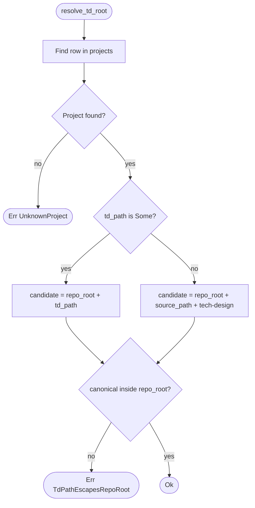

# TD Root Resolver

## Schema
<!-- type: schema lang: yaml -->

```yaml
definitions:
  TdRootInput:
    type: object
    description: |
      Project descriptor consumed by `ProjectRegistry::resolve_td_root`.
      Materialised from `[[projects]]` table rows in `.aw/config.toml`.
    properties:
      name:
        type: string
        description: Project name (matches `[[projects]].name`).
        x-config-source: projects[].name
      td_path:
        type: [string, "null"]
        description: |
          Optional per-project repo-relative spec root override
          (matches `[[projects]].td_path`). When non-null this value wins
          over the project-local convention.
        x-config-source: projects[].td_path
        examples:
          - projects/agentic-workflow/tech-design/core
          - projects/cgdb/tech_design
      source_path:
        type: string
        description: |
          Project root (matches `[[projects]].path`). Used to derive the
          conventional TD root `<source_path>/tech-design` when `td_path`
          is null.
        x-config-source: projects[].path
    required: [name, source_path]

  TdRootResult:
    type: object
    description: Output of `resolve_td_root`.
    properties:
      root:
        type: string
        description: Absolute filesystem path to the project's TD spec root.
      precedence:
        type: string
        enum: [td_path, project_path]
        description: |
          Indicates which precedence branch resolved the path. Surfaced for
          diagnostics; consumers MUST NOT branch on this value.
    required: [root, precedence]

  TdResolveError:
    type: object
    description: Failure modes of `resolve_td_root`.
    properties:
      kind:
        type: string
        enum:
          - unknown_project
          - td_path_escapes_repo_root
        description: |
          - unknown_project: project name not in `[[projects]]` table.
          - td_path_escapes_repo_root: `td_path` resolves outside the repo
            root after canonicalisation (e.g. `../../something`).
          Project-local fallback does not require global TD platform config.
      message:
        type: string
    required: [kind, message]
```
## Logic
<!-- type: logic lang: mermaid -->



## Test Plan
<!-- type: test-plan lang: mermaid -->

```mermaid
---
id: td-root-resolver-test-plan
title: TD Root Resolver Test Plan
tests:
  T1:
    type: test
    name: resolve_td_root_uses_td_path_when_present
    file: projects/agentic-workflow/src/project_registry.rs
    verifies: [R1, R2]
  T2:
    type: test
    name: resolve_td_root_explicit_td_path_outside_project_root_succeeds
    file: projects/agentic-workflow/src/project_registry.rs
    verifies: [R2, R7]
  T3:
    type: test
    name: resolve_td_root_falls_back_to_project_tech_design
    file: projects/agentic-workflow/src/project_registry.rs
    verifies: [R1]
  T4:
    type: test
    name: resolve_td_root_unknown_project_errors
    file: projects/agentic-workflow/src/project_registry.rs
    verifies: [R1, R2]
  T5:
    type: test
    name: resolve_td_root_td_path_escape_rejected
    file: projects/agentic-workflow/src/project_registry.rs
    verifies: [R2]
  T6:
    type: test
    name: spec_store_reads_from_resolver_for_existing_project_byte_identical
    file: projects/agentic-workflow/src/spec_store.rs
    verifies: [R1, R5]
  T7:
    type: test
    name: r6a_locates_project_via_registry_lookup
    file: projects/agentic-workflow/src/validate/rules/r6a_loose_root_file.rs
    verifies: [R3]
  T8:
    type: test
    name: r6a_accepts_spec_with_td_path_outside_global_base
    file: projects/agentic-workflow/src/validate/rules/r6a_loose_root_file.rs
    verifies: [R3, R7]
  T9:
    type: test
    name: viewer_lists_project_with_td_path_outside_global_base
    file: projects/agentic-workflow/src/ui/viewer/api.rs
    verifies: [R6, R7]
  T10:
    type: test
    name: viewer_open_resolves_through_per_project_td_path
    file: projects/agentic-workflow/src/ui/viewer/api.rs
    verifies: [R6, R7]
  T11:
    type: test
    name: hook_routing_longest_prefix_match_unchanged
    file: projects/agentic-workflow/src/validate/rules/r6a_loose_root_file.rs
    verifies: [R4]
  T12:
    type: test
    name: workspace_tech_design_path_returns_resolved_base
    file: projects/agentic-workflow/src/workspace.rs
    verifies: [R1, R5]
---
requirementDiagram
    element T1 { type: test }
    element T2 { type: test }
    element T3 { type: test }
    element T4 { type: test }
    element T5 { type: test }
    element T6 { type: test }
    element T7 { type: test }
    element T8 { type: test }
    element T9 { type: test }
    element T10 { type: test }
    element T11 { type: test }
    element T12 { type: test }

    T1 - verifies -> R1
    T1 - verifies -> R2
    T2 - verifies -> R2
    T2 - verifies -> R7
    T3 - verifies -> R1
    T4 - verifies -> R1
    T4 - verifies -> R2
    T5 - verifies -> R2
    T6 - verifies -> R1
    T6 - verifies -> R5
    T7 - verifies -> R3
    T8 - verifies -> R3
    T8 - verifies -> R7
    T9 - verifies -> R6
    T9 - verifies -> R7
    T10 - verifies -> R6
    T10 - verifies -> R7
    T11 - verifies -> R4
    T12 - verifies -> R1
    T12 - verifies -> R5
```

## Changes
<!-- type: changes lang: yaml -->

```yaml
changes:
  - path: projects/agentic-workflow/src/services/project_registry.rs
    symbol: ProjectRegistry::resolve_td_root
    action: modify
    section: schema
    impl_mode: hand-written
    description: |
      Add `resolve_td_root(project_name: &str) -> Result<TdRootResult,
      TdResolveError>` method on `ProjectRegistry`. Precedence: per-project
      `td_path` literal joined with `repo_root` first; otherwise
      `repo_root.join(row.source_path).join("tech-design")`. Canonicalise the
      candidate and reject if it escapes `repo_root`. Hand-written because
      path canonicalisation + error mapping does not have a deterministic
      generator yet — wrap in HANDWRITE markers with a gap reference back to
      this spec.
  - path: projects/agentic-workflow/src/services/project_registry.rs
    symbol: TdRootInput, TdRootResult, TdResolveError
    action: modify
    section: schema
    impl_mode: codegen
    description: |
      Codegen emits `TdRootInput`, `TdRootResult`, `TdResolveError` types and
      their derives from the schema section above. Wrap in CODEGEN-BEGIN /
      CODEGEN-END blocks with `@spec` markers referencing this file's
      #schema anchor.
  - path: projects/agentic-workflow/src/spec_store.rs
    symbol: FileSystemSpecStore::specs_base
    action: modify
    section: logic
    impl_mode: hand-written
    description: |
      Replace the literal join in `specs_base(&self) -> PathBuf` body
      (`self.root.join(".aw/tech-design")`) with a call to
      `shared::workspace::tech_design_root(&self.root, &config)` (new
      config-aware helper). Update sibling helpers in the same file
      (`resolve_group_dir`, `spec_path`, test fixtures) to route through
      the same helper so the call site reaches the resolver regardless of
      whether the caller has a specific project in hand. Wrap in HANDWRITE
      markers. Reference is by symbol, not line number, so the spec stays
      correct across future edits.
  - path: projects/agentic-workflow/src/validate/rules/r6a_loose_root_file.rs
    symbol: r6a_loose_root_file::run (needle lookup)
    action: modify
    section: logic
    impl_mode: hand-written
    description: |
      Replace the literal `let needle = ".aw/tech-design/crates/"` in
      the `run` function with a registry-driven longest-prefix lookup:
      for each project in `ProjectRegistry`, call
      `resolve_td_root(project)` and test
      `spec_path.starts_with(resolved_root)`; the longest match identifies
      the project. Adjust the module docs to describe the new lookup, not
      the old needle. Hook routing in `.aw/config.toml` (longest-prefix
      on `td_path`) is unchanged. Wrap in HANDWRITE markers.
  - path: projects/agentic-workflow/src/ui/viewer/api.rs
    symbol: list_tech_designs, get_tech_design_metadata, get_tech_design
    action: modify
    section: logic
    impl_mode: hand-written
    description: |
      Functions that today derive crate name from
      `workspace::tech_design_path(root)` must route through the registry:
      for list/mount operations enumerate every project in
      `ProjectRegistry` and call `resolve_td_root` per project; for
      open/get operations resolve through the requested project's
      `td_root`. Reference is by symbol, not line number. Wrap in
      HANDWRITE markers.
  - path: projects/agentic-workflow/src/ui/viewer/manager.rs
    symbol: ViewerManager (path validation)
    action: modify
    section: logic
    impl_mode: hand-written
    description: |
      Update `ViewerManager` path validation to accept any path under any
      project's resolved `td_root`, not only paths under the global base.
      Wrap in HANDWRITE markers.
  - path: projects/agentic-workflow/src/shared/workspace.rs
    symbol: tech_design_path, tech_design_root
    action: modify
    section: logic
    impl_mode: hand-written
    description: |
      Keep `tech_design_path(project_root)` as the legacy workspace/base TD
      helper for callers that intentionally scan the global TD platform.
      Project-specific callers must use `ProjectRegistry::resolve_td_root`
      so unset `td_path` resolves to `<project.path>/tech-design`.
      Wrap in HANDWRITE markers where project-specific callers are migrated.
  - path: projects/agentic-workflow/tech-design/core/interfaces/models/change.md
    action: modify
    section: schema
    impl_mode: hand-written
    description: |
      Promote the `TechDesignPlatformConfig.path` field description from
      "default location" to "authoritative runtime base"; cross-reference
      `interfaces/services/project_registry.md` for the resolver contract
      and per-project `td_path` override semantics.
  - path: projects/agentic-workflow/tech-design/core/interfaces/services/project_registry.md
    action: modify
    section: schema
    impl_mode: hand-written
    description: |
      Add the `resolve_td_root` method to the `ProjectRegistry` interface
      schema with the precedence rule (per-project `td_path` >
      `<project.path>/tech-design`) and the failure modes (UnknownProject,
      TdPathEscapesRepoRoot).
  - path: projects/agentic-workflow/tech-design/core/validate/rules/r6-r7-rule-specs.md
    action: modify
    section: logic
    impl_mode: hand-written
    description: |
      Rewrite R6a's "locate-project" step: replace the literal
      `".aw/tech-design/crates/"` needle with a registry-driven
      longest-prefix lookup using `ProjectRegistry::resolve_td_root` per
      project. Cover specs whose td_path lives outside the global base.
  - path: projects/agentic-workflow/tech-design/core/interfaces/ui/viewer/api.md
    action: modify
    section: schema
    impl_mode: hand-written
    description: |
      Mount/list/open operations dispatch on resolved `td_root` per
      project; viewer must succeed for projects whose TD sits outside the
      global base.
  - path: projects/agentic-workflow/CHANGELOG.md
    action: skip
    section: logic
    impl_mode: hand-written
    description: |
      No CHANGELOG entry — this is a refactor with no public API surface
      change beyond gaining a `resolve_td_root` method that did not exist
      before.
  - action: annotate
    section: unit-test
    impl_mode: hand-written
    description: "Traceability metadata edge for the unit-test section."

```

# Reviews

### Review 3
**Verdict:** approved

- [changes] All seven source-tree entries now reference real files:
  `projects/agentic-workflow/src/services/project_registry.rs`,
  `projects/agentic-workflow/src/spec_store.rs` (FileSystemSpecStore::specs_base),
  `projects/agentic-workflow/src/shared/workspace.rs` (tech_design_path /
  tech_design_root), plus the unchanged validate / viewer paths. All
  symbol references replace the brittle line-number citations.
- [schema] `TdRootInput` fields carry `x-config-source` annotations so
  the fillback/codegen adapter can wire the registry without inferring.
- [test-plan] T1-T5 and T12 still reference stale file paths
  (`project_registry.rs` / `workspace.rs` instead of
  `services/project_registry.rs` / `shared/workspace.rs`); this is a
  documentation nit — gen-code reads `changes`, not `test-plan`, so the
  spec is implementable as-is. Cleanup deferred to a follow-up TD.
