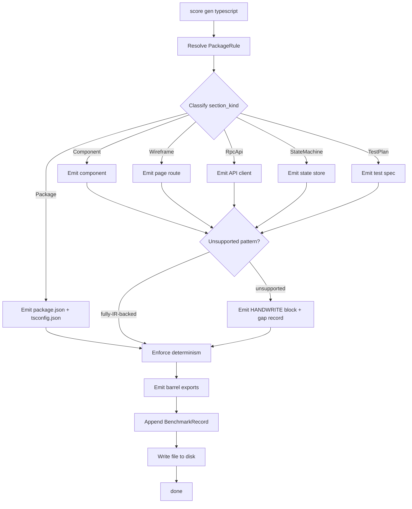

## Schema
<!-- type: schema lang: yaml -->

```yaml
section_type: schema
schemas:
  - name: TypeScriptEmitterRequest
    description: |
      Input envelope for the TS emitter. Wraps one or more `UiComponentIr`
      payloads + a `Packageboundary` so files can be routed to the right
      monorepo package (R6).
    fields:
      - name: ir_specs
        type: Vec<TypeScriptSpec>
        description: One per source TD spec the emitter consumes.
      - name: package_boundary
        type: PackageBoundary
        description: Maps spec_id prefix → monorepo package + module path.
      - name: framework
        type: TargetFramework
        description: React | Vue | Svelte | Next — chosen per package.

  - name: TypeScriptSpec
    description: One unit of emission — an IR bundle for a single TD spec.
    fields:
      - name: spec_id
        type: String
        description: Source TD spec ID.
      - name: ui_components
        type: Vec<UiComponentIrRef>
        description: Refs to `UiComponentIr` instances (R1).
      - name: api_clients
        type: Vec<OpenApiPayloadRef>
        description: Refs to `OpenApiPayload` for `rpc-api` sections (R2).
      - name: state_machines
        type: Vec<StateMachineRef>
        description: Refs to Mermaid Plus state machines (R2).
      - name: tests
        type: Vec<TestPlanRef>
        description: Refs to `TestPlan` payloads.

  - name: TargetFramework
    description: Closed enum — supported TS frameworks.
    variants:
      - React
      - Vue
      - Svelte
      - Next

  - name: PackageBoundary
    description: |
      Maps a spec_id prefix to a monorepo package + module path (R6).
      Cross-package imports use `package.json` `name`, not relative paths.
    fields:
      - name: rules
        type: Vec<PackageRule>
      - name: monorepo_root
        type: String
        description: Repo-relative root containing `package.json` workspaces.

  - name: PackageRule
    description: One spec_id-prefix → package mapping rule.
    fields:
      - name: spec_prefix
        type: String
        description: e.g. `fixture_platform.frontend.orders`.
      - name: package_name
        type: String
        description: `package.json` `name` field, e.g. `@fixture-platform/orders-ui`.
      - name: module_path
        type: String
        description: Path inside the package, e.g. `src/components/`.

  - name: EmittedFile
    description: |
      One produced TS file. The emitter writes each EmittedFile to disk
      and emits a `BenchmarkRecord` describing it (R7).
    fields:
      - name: path
        type: String
        description: Repo-relative output path.
      - name: kind
        type: EmittedFileKind
        description: Closed enum of file families.
      - name: ir_source
        type: String
        description: `spec_id` + section_id of the IR that produced this file.
      - name: content
        type: String
        description: UTF-8 TS source (R4 — byte-equivalent across runs).
      - name: handwrite_gaps
        type: Vec<HandwriteGapRef>
        description: Reuses the #2185 `HandwriteGap` shape (R5).

  - name: EmittedFileKind
    description: Closed enum — each emitter file family is tracked.
    variants:
      - PackageJson
      - TsConfig
      - Component
      - Page
      - ApiClient
      - StateStore
      - Test
      - BarrelExport

  - name: BenchmarkRecord
    description: |
      Per-file emitter record (R7) consumed by the standardize driver
      to roll up coverage stats and surface remaining gaps.
    fields:
      - name: path
        type: String
      - name: kind
        type: EmittedFileKind
      - name: ir_source
        type: String
      - name: bytes_written
        type: u32
      - name: gap_count
        type: u32

  - name: TypeScriptEmitterReport
    description: |
      Terminal envelope emitted by `score gen typescript`. Aggregate
      report consumed by the replay gate (#2189) for determinism checks.
    fields:
      - name: files
        type: Vec<EmittedFile>
      - name: benchmarks
        type: Vec<BenchmarkRecord>
      - name: total_gaps
        type: u32
```

## Logic
<!-- type: logic lang: mermaid -->



## Test Plan
<!-- type: test-plan lang: mermaid -->

```mermaid
---
tests:
  T1:
    purpose: R1 — emitter reads UiComponentIr (typed), not stringly Markdown.
    inputs: [examples/fixture_platform/frontend/orders/]
    expect: emitter call site has zero `&str` payload reads (asserted by grep test).
  T2:
    purpose: R2 — ComponentPayload → React component file with props + slots.
    inputs: [orders/ComponentPayload]
    expect: EmittedFile kind=Component contains exported React.FC + typed props interface.
  T3:
    purpose: R2 — WireframePayload → Next page route file.
    inputs: [orders/WireframePayload]
    expect: EmittedFile kind=Page at app/orders/page.tsx exporting default.
  T4:
    purpose: R2 — OpenApiPayload → typed fetch client.
    inputs: [orders/OpenApiPayload]
    expect: EmittedFile kind=ApiClient exposes one function per method with typed responses.
  T5:
    purpose: R2 — StateMachineRef → XState store with typed events.
    inputs: [orders/StateMachineRef]
    expect: EmittedFile kind=StateStore creates a machine + matches state literal type.
  T6:
    purpose: R3 — templates own scaffolding only (imports, naming), not behavior.
    inputs: [orders/ComponentPayload]
    expect: template files contain zero `if (`/`switch (` statements outside generated bodies.
  T7:
    purpose: R4 — determinism: same IR input produces byte-equivalent output across two runs.
    inputs: [orders/* ×2 runs]
    expect: SHA-256 of EmittedFile.content[run1] == [run2] for every file.
  T8:
    purpose: R5 — unsupported pattern produces HANDWRITE block + gap record.
    inputs: [synthetic component with custom runtime-only hook]
    expect: EmittedFile contains `HANDWRITE-BEGIN reason: missing-generator:custom-runtime-hook` and HandwriteGapRef in record.
  T9:
    purpose: R6 — package-boundary resolver routes cross-package imports via package name.
    inputs: [orders importing from accounts/api-client]
    expect: import path is `@fixture-platform/accounts-api`, never `../../accounts/...`.
  T10:
    purpose: R7 — benchmark records aggregate correctly per file kind.
    inputs: [orders/*]
    expect: TypeScriptEmitterReport.benchmarks grouped by kind sums to file count.
  T11:
    purpose: R7 — total_gaps reflects every HANDWRITE region emitted.
    inputs: [orders/* with 3 HANDWRITE blocks]
    expect: total_gaps == 3.
  T12:
    purpose: R6 — barrel exports include every public symbol from emitted module.
    inputs: [orders/* fully emitted]
    expect: src/index.ts re-exports every Component + ApiClient + StateStore.

graph TD:
  R1 --> T1
  R2 --> T2
  R2 --> T3
  R2 --> T4
  R2 --> T5
  R3 --> T6
  R4 --> T7
  R5 --> T8
  R6 --> T9
  R6 --> T12
  R7 --> T10
  R7 --> T11
---

graph TD
    R1 --> T1
    R2 --> T2
    R2 --> T3
    R2 --> T4
    R2 --> T5
    R3 --> T6
    R4 --> T7
    R5 --> T8
    R6 --> T9
    R6 --> T12
    R7 --> T10
    R7 --> T11
```

## Changes
<!-- type: changes lang: yaml -->

```yaml
section_type: changes
changes:
  - path: projects/agentic-workflow/src/generate/gen/typescript/mod.rs
    action: create
    section: schema
    section_id: ts-emitter-root
    symbol: typescript_emitter_mod
    impl_mode: hand-written
    handwrite_gap: missing-generator:typescript-emitter
    handwrite_tracker: 2186
    handwrite_reason: |
      Root module for the TS emitter (R1/R2). Dispatches per
      EmittedFileKind to the per-section sub-emitters.
    description: |
      TS emitter root — registers with `generate/gen/mod.rs` and dispatches.

  - path: projects/agentic-workflow/src/generate/gen/typescript/types.rs
    action: create
    section: schema
    section_id: ts-emitter-types
    symbol: ts_emitter_types
    impl_mode: hand-written
    handwrite_gap: missing-generator:schema-types
    handwrite_tracker: 2186
    handwrite_reason: |
      Schema record types from `## Schema` — TypeScriptEmitterRequest,
      TypeScriptSpec, PackageBoundary, EmittedFile, BenchmarkRecord,
      TypeScriptEmitterReport.
    description: Schema record types.

  - path: projects/agentic-workflow/src/generate/gen/typescript/component.rs
    action: create
    section: schema
    section_id: ts-emit-component
    symbol: emit_component
    impl_mode: hand-written
    handwrite_gap: missing-generator:ts-component
    handwrite_tracker: 2186
    handwrite_reason: |
      Component emitter: ComponentPayload → React/Vue/Svelte file (R2).
    description: Per-framework component file writer.

  - path: projects/agentic-workflow/src/generate/gen/typescript/page.rs
    action: create
    section: schema
    section_id: ts-emit-page
    symbol: emit_page
    impl_mode: hand-written
    handwrite_gap: missing-generator:ts-page
    handwrite_tracker: 2186
    handwrite_reason: |
      Page emitter: WireframePayload → Next/Vue Router entry (R2).
    description: Route page file writer.

  - path: projects/agentic-workflow/src/generate/gen/typescript/api_client.rs
    action: create
    section: logic
    section_id: ts-emit-api-client
    symbol: emit_api_client
    impl_mode: hand-written
    handwrite_gap: missing-generator:ts-api-client
    handwrite_tracker: 2186
    handwrite_reason: |
      API client emitter: OpenApiPayload → typed fetch client (R2).
    description: API client file writer.

  - path: projects/agentic-workflow/src/generate/gen/typescript/state.rs
    action: create
    section: schema
    section_id: ts-emit-state
    symbol: emit_state_store
    impl_mode: hand-written
    handwrite_gap: missing-generator:ts-state-store
    handwrite_tracker: 2186
    handwrite_reason: |
      State store emitter: StateMachineRef → XState/Zustand store (R2).
    description: State store file writer.

  - path: projects/agentic-workflow/src/generate/gen/typescript/test.rs
    action: create
    section: test-plan
    section_id: ts-emit-test
    symbol: emit_test
    impl_mode: hand-written
    handwrite_gap: missing-generator:ts-test
    handwrite_tracker: 2186
    handwrite_reason: |
      Test emitter: TestPlan → Vitest/Jest spec (R2).
    description: Test spec file writer.

  - path: projects/agentic-workflow/src/generate/gen/typescript/package_json.rs
    action: create
    section: schema
    section_id: ts-emit-package-json
    symbol: emit_package_json
    impl_mode: hand-written
    handwrite_gap: missing-generator:ts-package-json
    handwrite_tracker: 2186
    handwrite_reason: |
      Package config emitter: Package section → package.json + tsconfig.json (R2).
    description: package.json / tsconfig.json writer.

  - path: projects/agentic-workflow/src/generate/gen/typescript/determinism.rs
    action: create
    section: schema
    section_id: ts-emit-determinism
    symbol: enforce_determinism
    impl_mode: hand-written
    handwrite_gap: missing-generator:ts-determinism
    handwrite_tracker: 2186
    handwrite_reason: |
      Determinism pass (R4): sort imports, normalize newlines, stable
      identifier order across runs.
    description: Determinism normalization pass.

  - path: projects/agentic-workflow/tests/typescript_emitter.rs
    action: create
    section: test-plan
    section_id: test-ts-emitter
    symbol: test_ts_emitter
    impl_mode: hand-written
    handwrite_gap: missing-generator:test-plan
    handwrite_tracker: 2186
    handwrite_reason: |
      Integration test suite for T1..T12.
    description: Integration tests covering R1..R7.

  - path: examples/fixture_platform/tech_design/frontend/orders.md
    action: create
    section: test-plan
    section_id: fixture-orders
    symbol: fixture
    impl_mode: hand-written
    handwrite_gap: missing-generator:ts-fixture
    handwrite_tracker: 2186
    handwrite_reason: |
      Fixture frontend TD for Orders slice — exercises component +
      page + api-client + state-machine + test-plan in combination.
      Lives under SDD's tech_design tree (not the examples/ TS
      workspace) so codegen can target it without entering a
      package.json scope.
    description: First fixture frontend slice.
```

# Reviews

## Review 1 — 2026-05-16 (self-review)

**Verdict:** approved

- **Schema** — Closed-shape records: `TypeScriptEmitterRequest`,
  `TypeScriptSpec`, `PackageBoundary` (with `PackageRule` mapping
  rules), `EmittedFile` (with closed `EmittedFileKind`), `BenchmarkRecord`,
  `TypeScriptEmitterReport`. `TargetFramework` is closed. Closed
  enums let triage grep every variant.
- **Logic** — Single consolidated `flowchart TD` with `entry:
  ts_emit_dispatch`. Routes by `section_kind` to per-emitter steps,
  converges at `detect_unsupported` (R5 fork) → `enforce_determinism`
  (R4) → barrel + benchmark + write. Frontmatter map-form nodes/edges.
- **Test plan** — T1..T12 cover all R's: T1 (R1 typed IR), T2..T5 (R2
  per-section emitters), T6 (R3 templates own scaffolding), T7 (R4
  byte-equiv determinism), T8 (R5 HANDWRITE block), T9/T12 (R6
  package boundary + barrels), T10..T11 (R7 benchmark records).
- **Changes** — 11 entries: 1 root + 1 types + 6 per-section sub-emitters
  + 1 determinism + 1 test + 1 fixture. All `impl_mode: hand-written`
  with `handwrite_tracker: 2186`.
- **Dependency order** — Inputs from #2082 (`UiComponentIr`) and
  #2185 (importer pipeline) — both merged. Sibling #2187 (Python
  emitter) follows the same template. Downstream #2189 (replay gate)
  consumes the deterministic output.
- **Boundary** — Emitter primitives land here; React/Vue/Svelte
  runtime libs are external dependencies, never embedded by the
  emitter.

## Review 2 — 2026-05-16 (self-review after revise)

**Verdict:** approved

- Fixture path moved from `examples/fixture_platform/frontend/.../` to
  `examples/fixture_platform/tech_design/frontend/orders.md` so
  codegen can target it without entering the TS workspace's
  package.json scope (gen-code unsupported-language guard would
  otherwise abort).
- No other section changed; review 1's findings remain valid.
