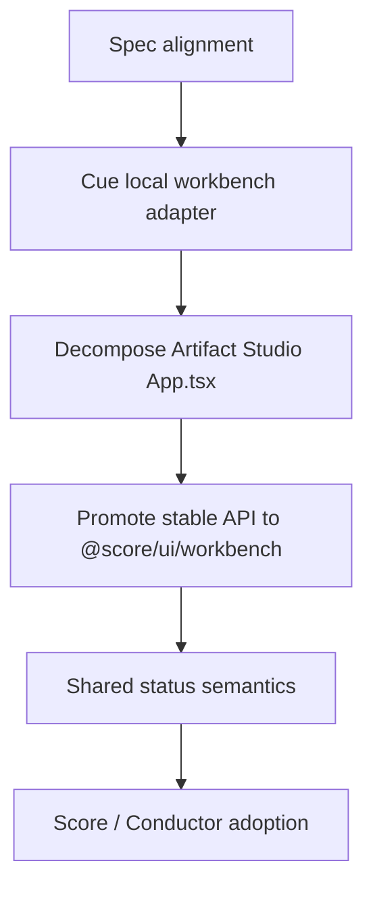

# SDD Workbench UI Migration Plan

This plan scopes the likely large change set behind the SDD Workbench UI
decision. The migration should be incremental. The current Cue Artifact Studio
can keep rendering the same product behavior while we introduce an owned
workbench boundary and pull vendor UI imports behind primitive implementations.

The main risk is not the number of files. The main risk is changing layout,
status semantics, and WorkItem execution meaning at the same time. Each slice
therefore has a clear owner and acceptance check.

## Migration Schema
<!-- type: schema lang: yaml -->

```yaml
$schema: "https://json-schema.org/draft/2020-12/schema"
$id: "https://cclab.dev/sdd/workbench-ui-migration-plan/v0"
title: SDD Workbench UI Migration Plan v0
type: object
additionalProperties: false
required: [impact_map, slices, import_boundaries, acceptance_gates]
properties:
  impact_map:
    type: array
    items:
      type: object
      additionalProperties: false
      required: [area, current_state, target_state, first_action]
      properties:
        area:
          enum:
            - sdd_specs
            - sdd_ui_package
            - cclab_ui_specs
            - cue_artifact_studio
            - cue_backend_contract
            - score_workspace
            - conductor_workspace
            - tests_and_browser_e2e
        current_state: { type: string }
        target_state: { type: string }
        first_action: { type: string }
  slices:
    type: array
    items:
      type: object
      additionalProperties: false
      required: [id, title, owner_path, objective, dependencies, done_when]
      properties:
        id:
          enum:
            - s0_spec_alignment
            - s1_cue_transitional_workbench
            - s2_cue_component_decomposition
            - s3_sdd_ui_package_contract
            - s4_status_semantics_shared
            - s5_score_conductor_adoption
        title: { type: string }
        owner_path: { type: string }
        objective: { type: string }
        dependencies:
          type: array
          items: { type: string }
        done_when:
          type: array
          items: { type: string }
  import_boundaries:
    type: object
    required: [allowed_vendor_imports, forbidden_vendor_imports]
    properties:
      allowed_vendor_imports:
        type: array
        items:
          enum:
            - "projects/cue/artifact-studio/src/workbench/**"
            - "crates/sdd/packages/@score/ui/src/**"
      forbidden_vendor_imports:
        type: array
        items:
          enum:
            - "projects/cue/artifact-studio/src/App.tsx"
            - "projects/conductor/fe/src/pages/**"
            - "crates/sdd/packages/@score/app/src/pages/**"
  acceptance_gates:
    type: array
    items:
      enum:
        - spec_conformance
        - cue_typecheck
        - cue_build
        - cue_browser_e2e
        - browser_manual_layout_check
        - import_boundary_check
        - no_status_semantic_drift
```
## Impact Map
<!-- type: schema lang: yaml -->

```yaml
impact_map:
  - area: sdd_specs
    current_state: |
      Workbench UI System and Primitive Design now exist at project/sdd level.
    target_state: |
      SDD owns UI workbench policy, primitive contracts, migration order, and
      shared state semantics.
    first_action: |
      Keep new workbench specs as the source of truth before changing Cue UI.

  - area: sdd_ui_package
    current_state: |
      Existing SDD UI specs are placeholders; unified-frontend.md already points
      toward @score/ui but the package implementation is not the active Cue path.
    target_state: |
      @score/ui/workbench exports the canonical workbench primitives after the
      Cue transitional wrapper proves the API.
    first_action: |
      Do not create @score/ui first; prove primitive boundaries in Cue adapter.

  - area: cclab_ui_specs
    current_state: |
      .aw/tech-design/packages/cclab-ui describes older shared components
      such as spec-viewer, pipeline, changes, editing, feedback, and layout.
    target_state: |
      Treat cclab-ui as source material to reconcile into @score/ui/workbench
      and related @score packages, not as a competing design system.
    first_action: |
      Map pipeline DAG and feedback/status pieces into WorkflowGraph, GatePanel,
      ArtifactInspector, and StatusChip.

  - area: cue_artifact_studio
    current_state: |
      projects/cue/artifact-studio/src/App.tsx is about 1000 lines and owns
      theme, MUI imports, layout, status visuals, project/session nav,
      conversation, context pane, workflow graph, artifact list, and operations
      dashboard in one file.
    target_state: |
      App.tsx composes WorkbenchShell, ProjectSessionNav, ConversationCommand,
      WorkContextPane, WorkflowGraph, ArtifactInspector, GatePanel, and
      StatusChip from a local transitional workbench adapter.
    first_action: |
      Create projects/cue/artifact-studio/src/workbench/ with tokens, status
      semantics, shell, and primitive wrappers while preserving current UX.

  - area: cue_backend_contract
    current_state: |
      api.ts already exposes projects, sessions, WorkItems, workflow_plan,
      artifacts, QC, and operations data.
    target_state: |
      Backend data maps into SurfaceContext and primitive props without frontend
      components inventing state.
    first_action: |
      Add adapter functions from current API types to Workbench primitive props.

  - area: score_workspace
    current_state: |
      Score has SDD viewer and unified-frontend specs, but this branch is not
      yet using shared workbench primitives.
    target_state: |
      Score local workspace can adopt @score/ui/workbench after Cue validates
      the primitives.
    first_action: |
      Keep Score adoption as a later slice; avoid blocking Cue UI cleanup.

  - area: conductor_workspace
    current_state: |
      Conductor references @cclab/ui in product docs and shares SDD concepts.
    target_state: |
      Conductor remote project workspace can reuse the same SDD state semantics
      and workbench primitives where appropriate.
    first_action: |
      Defer implementation until @score/ui/workbench has stable exports.

  - area: tests_and_browser_e2e
    current_state: |
      Cue already has e2e coverage for WorkItem flows and layout checks.
    target_state: |
      Tests assert SDD workbench behavior: project/session nav, bounded command
      surface, wider context pane, visible graph, no overflow, and stable status
      semantics.
    first_action: |
      Expand Artifact Studio e2e assertions while extracting primitives.
```

## Slice Logic
<!-- type: logic lang: mermaid -->



## Migration Slices
<!-- type: scenarios lang: yaml -->

```yaml
slices:
  - id: s0_spec_alignment
    title: SDD workbench specs are the source of truth
    owner_path: projects/agentic-workflow/tech-design/core/
    objective: |
      Capture policy, primitive design, and migration order before changing
      frontend implementation.
    dependencies: []
    done_when:
      - SDD README indexes workbench specs
      - Cue README references SDD Workbench UI System
      - aw td check passes for all workbench specs

  - id: s1_cue_transitional_workbench
    title: Cue local workbench adapter
    owner_path: projects/cue/artifact-studio/src/workbench/
    objective: |
      Introduce tokens, status semantics, shell, and primitive wrappers locally
      in Cue while keeping the visible UI behavior stable.
    dependencies: [s0_spec_alignment]
    done_when:
      - App.tsx imports workbench tokens and status helpers from local adapter
      - vendor UI imports begin moving into workbench implementation files
      - current e2e tests still pass

  - id: s2_cue_component_decomposition
    title: Decompose Artifact Studio screen
    owner_path: projects/cue/artifact-studio/src/
    objective: |
      Split the 1000-line App.tsx into WorkbenchShell, ProjectSessionNav,
      ConversationCommand, WorkContextPane, WorkflowGraph, ArtifactInspector,
      GatePanel, and OperationsDashboard composition.
    dependencies: [s1_cue_transitional_workbench]
    done_when:
      - App.tsx owns orchestration and data flow only
      - primitives own rendering and interactions
      - no product behavior changes
      - browser e2e validates layout and WorkItem workflow

  - id: s3_sdd_ui_package_contract
    title: Promote proven primitive API to SDD package
    owner_path: crates/sdd/packages/@score/ui/src/workbench/
    objective: |
      Move stable primitive contracts from Cue adapter into the canonical SDD UI
      package once the API shape is proven.
    dependencies: [s2_cue_component_decomposition]
    done_when:
      - @score/ui/workbench exports match primitive design
      - Cue adapter becomes a thin re-export or surface-specific adapter
      - cclab-ui specs are mapped to retained, moved, or retired modules

  - id: s4_status_semantics_shared
    title: Centralize status semantics
    owner_path: crates/sdd/packages/@score/ui/src/workbench/status/
    objective: |
      Make workflow, artifact, gate, and agent-run status labels, colors, and
      accessibility text consistent across SDD surfaces.
    dependencies: [s3_sdd_ui_package_contract]
    done_when:
      - StatusChip no longer accepts arbitrary colors from product screens
      - Cue, Score, and Conductor map domain state into shared semantic states
      - tests cover unknown status fallback

  - id: s5_score_conductor_adoption
    title: Adopt shared primitives in Score and Conductor
    owner_path: [crates/sdd/packages/@score/app/, projects/conductor/fe/]
    objective: |
      Apply the shared workbench primitives to Score and Conductor without
      forcing those surfaces to copy Cue's full layout.
    dependencies: [s4_status_semantics_shared]
    done_when:
      - Score uses shared status, table, and artifact primitives where relevant
      - Conductor uses shared governance/status primitives where relevant
      - each surface keeps its own product entrypoint
```

## Changes
<!-- type: changes lang: yaml -->

```yaml
changes:
  - path: projects/agentic-workflow/tech-design/core/specs/workbench-ui-migration-plan.md
    action: create
    section: logic
    impl_mode: hand-written
    description: Capture impact map, ordered migration slices, import boundaries, and acceptance gates.

  - path: projects/agentic-workflow/tech-design/core/README.md
    action: modify
    section: logic
    impl_mode: hand-written
    description: Add the migration plan to the SDD workbench spec index.

  - path: projects/agentic-workflow/tech-design/core/specs/workbench-ui-primitive-design.md
    action: modify
    section: logic
    impl_mode: hand-written
    description: Link the migration plan as the execution order for primitive adoption.

future_implementation:
  - path: projects/cue/artifact-studio/src/workbench/
    action: create
    impl_mode: hand-written
    description: First implementation slice; local Cue adapter around current UI substrate.

  - path: projects/cue/artifact-studio/src/App.tsx
    action: refactor
    impl_mode: hand-written
    description: Reduce to orchestration and compose extracted workbench primitives.

  - path: projects/cue/artifact-studio/e2e/workitems.e2e.mjs
    action: modify
    impl_mode: hand-written
    description: Expand e2e coverage for workbench layout and no-overflow behavior.
  - action: annotate
    section: scenarios
    impl_mode: hand-written
    description: "Traceability metadata edge for the scenarios section."

  - action: annotate
    section: schema
    impl_mode: hand-written
    description: "Traceability metadata edge for the schema section."

  - action: annotate
    section: unit-test
    impl_mode: hand-written
    description: "Traceability metadata edge for the unit-test section."

```

## Tests
<!-- type: tests lang: yaml -->

```yaml
tests:
  migration_spec_conformance:
    kind: score
    command: aw td check --section-type-conformance projects/agentic-workflow/tech-design/core/specs/workbench-ui-migration-plan.md --json
    verifies:
      - schema, logic, scenarios, changes, and tests sections are parseable

  cue_slice_validation:
    kind: frontend
    commands:
      - cd projects/cue/artifact-studio && npm run typecheck
      - cd projects/cue/artifact-studio && npm run build
      - cd projects/cue/artifact-studio && npm run test:e2e
    verifies:
      - Cue behavior remains stable while primitives are extracted

  import_boundary_check:
    kind: static
    verifies:
      - product screens stop importing vendor UI directly after s2
      - vendor imports remain allowed inside transitional workbench wrappers

  browser_layout_check:
    kind: browser
    verifies:
      - desktop context pane is wider than conversation command
      - project/session sublist remains visible
      - workflow graph node and edge rendering remains visible
      - mobile and desktop text does not overflow controls or panels
```

## Traceability Changes
<!-- type: changes lang: yaml -->

```yaml
# aw-traceability-repair-1780398547209
changes:
  - action: annotate
    section: scenarios
    impl_mode: hand-written
    description: "Traceability metadata edge for the scenarios section."
  - action: annotate
    section: schema
    impl_mode: hand-written
    description: "Traceability metadata edge for the schema section."
  - action: annotate
    section: unit-test
    impl_mode: hand-written
    description: "Traceability metadata edge for the unit-test section."
```
