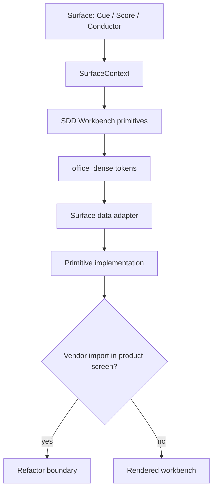
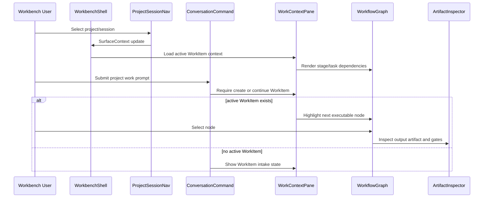

# SDD Workbench UI Primitive Design

This design makes the SDD Workbench UI System executable. The system spec owns
the policy: borrow enterprise design-system specifications, own the product
primitives. This design owns the primitive API shape and the migration path from
today's surface-local UI code toward shared SDD workbench primitives.

The target is not a generic design system. The target is a workbench for
goal-oriented SDD work: projects, sessions, WorkItems, workflow graphs,
artifacts, gates, review state, and operational evidence.

The ordered adoption plan is captured in
[`workbench-ui-migration-plan.md`](workbench-ui-migration-plan.md).

## Primitive Schema
<!-- type: schema lang: yaml -->

```yaml
$schema: "https://json-schema.org/draft/2020-12/schema"
$id: "https://cclab.dev/sdd/workbench-ui-primitive-design/v0"
title: SDD Workbench UI Primitive Design v0
type: object
additionalProperties: false
required: [package_boundary, surface_context, tokens, layout_slots, primitives, state_semantics]
properties:
  package_boundary:
    type: object
    additionalProperties: false
    required: [canonical_package, transitional_specs, surface_adapters, import_rule]
    properties:
      canonical_package:
        const: "crates/sdd/packages/@score/ui"
      transitional_specs:
        type: array
        items:
          enum:
            - ".aw/tech-design/packages/cclab-ui"
            - "projects/agentic-workflow/tech-design/core/logic/unified-frontend.md"
      surface_adapters:
        type: array
        items:
          enum:
            - "projects/cue/artifact-studio/src/workbench"
            - "projects/conductor/fe/src/sdd-workbench"
            - "crates/sdd/packages/@score/app/src/workbench"
      import_rule:
        const: "Product screens import SDD/Cue/Score workbench primitives; only primitive implementation files import vendor UI components."

  surface_context:
    type: object
    additionalProperties: false
    required: [surface, audience, project, session, active_workitem, route]
    properties:
      surface:
        enum: [cue_artifact_studio, cue_admin, score_workspace, conductor_workspace]
      audience:
        enum: [app_owner, platform_operator, developer]
      project:
        type: object
        required: [id, label]
        properties:
          id: { type: string }
          label: { type: string }
      session:
        type: object
        required: [id, title]
        properties:
          id: { type: string }
          title: { type: string }
          active_workitem_id: { type: [string, "null"] }
      active_workitem:
        type: [object, "null"]
        required: [id, title, stage, status]
        properties:
          id: { type: string }
          title: { type: string }
          stage: { enum: [intake, prd, td, codebase, test, deployment, operation] }
          status: { enum: [intake, ready, in_progress, blocked, done, canceled] }
      route:
        enum: [overview, workitem, artifact, gate, operation, settings]

  tokens:
    type: object
    additionalProperties: false
    required: [density, spacing, sizing, typography, radius, color, z_index]
    properties:
      density:
        const: office_dense
      spacing:
        type: object
        properties:
          unit_px: { const: 4 }
          xs_px: { const: 4 }
          sm_px: { const: 8 }
          md_px: { const: 12 }
          lg_px: { const: 16 }
          panel_gap_px: { const: 8 }
      sizing:
        type: object
        properties:
          nav_width_px: { enum: [224, 240, 256] }
          command_min_width_px: { const: 360 }
          command_max_width_px: { const: 640 }
          context_min_width_px: { const: 520 }
          toolbar_height_px: { const: 32 }
          input_height_px: { const: 36 }
          row_height_px: { enum: [28, 32, 36] }
          icon_button_px: { const: 28 }
          status_chip_height_px: { const: 22 }
      typography:
        type: object
        properties:
          body_px: { const: 13 }
          body_line_height: { const: 1.45 }
          label_px: { const: 12 }
          dense_label_px: { const: 11 }
          panel_title_px: { enum: [14, 15] }
          page_title_px: { enum: [18, 20] }
      radius:
        type: object
        properties:
          control_px: { const: 4 }
          panel_px: { const: 6 }
          card_px: { const: 8 }
      color:
        type: object
        properties:
          neutral_scale: { enum: [zinc_like, gray_like, slate_like] }
          status_scale: { enum: [semantic_distinct] }
          avoid_single_hue_dominance: { const: true }
      z_index:
        type: object
        properties:
          sticky_toolbar: { const: 10 }
          popover: { const: 20 }
          modal: { const: 40 }

  layout_slots:
    type: object
    additionalProperties: false
    required: [desktop, tablet, mobile]
    properties:
      desktop:
        type: object
        properties:
          min_width_px: { const: 1180 }
          shell:
            const: "grid: nav fixed, command bounded, context flexible"
          nav:
            const: "ProjectSessionNav, 224-256px"
          command:
            const: "ConversationCommand, min 360px, max 640px"
          context:
            const: "WorkContextPane, min 520px, must be wider than command when viewport allows"
      tablet:
        type: object
        properties:
          min_width_px: { const: 768 }
          shell:
            const: "nav collapsible, command and context use split tabs or resizable panes"
      mobile:
        type: object
        properties:
          max_width_px: { const: 767 }
          shell:
            const: "single column with bottom command input and context tabs"

  primitives:
    type: object
    additionalProperties: false
    required:
      - WorkbenchShell
      - ProjectSessionNav
      - ConversationCommand
      - WorkContextPane
      - WorkflowGraph
      - ArtifactInspector
      - GatePanel
      - StatusChip
    properties:
      WorkbenchShell:
        $ref: "#/$defs/primitive"
      ProjectSessionNav:
        $ref: "#/$defs/primitive"
      ConversationCommand:
        $ref: "#/$defs/primitive"
      WorkContextPane:
        $ref: "#/$defs/primitive"
      WorkflowGraph:
        $ref: "#/$defs/primitive"
      ArtifactInspector:
        $ref: "#/$defs/primitive"
      GatePanel:
        $ref: "#/$defs/primitive"
      StatusChip:
        $ref: "#/$defs/primitive"

  state_semantics:
    type: object
    additionalProperties: false
    required: [workflow_node, artifact, gate, agent_run]
    properties:
      workflow_node:
        enum: [not_started, ready, running, blocked, done, failed, skipped]
      artifact:
        enum: [missing, draft, reviewing, approved, failed, released, archived]
      gate:
        enum: [open, pending_input, passed, blocked, waived]
      agent_run:
        enum: [idle, queued, running, needs_input, completed, failed]

$defs:
  primitive:
    type: object
    additionalProperties: false
    required: [owns, props, states, interactions, forbidden]
    properties:
      owns:
        type: array
        items: { type: string }
      props:
        type: array
        items: { type: string }
      states:
        type: array
        items: { type: string }
      interactions:
        type: array
        items: { type: string }
      forbidden:
        type: array
        items: { type: string }
```

## Primitive Contracts
<!-- type: schema lang: yaml -->

```yaml
exports:
  "@score/ui/workbench":
    - WorkbenchShell
    - ProjectSessionNav
    - ConversationCommand
    - WorkContextPane
    - WorkflowGraph
    - ArtifactInspector
    - GatePanel
    - StatusChip
    - useWorkbenchTokens

primitive_contracts:
  WorkbenchShell:
    owns: [responsive_slot_layout, pane_ratio, global_density_tokens]
    props:
      - "context: SurfaceContext"
      - "nav: ReactNode"
      - "command: ReactNode"
      - "contextPane: ReactNode"
      - "inspector?: ReactNode"
      - "density?: 'office_dense'"
    states: [desktop_three_column, tablet_split, mobile_single_column]
    interactions: [resize_panes, collapse_nav, switch_context_tab]
    forbidden:
      - "owning WorkItem business state"
      - "importing backend clients"

  ProjectSessionNav:
    owns: [project_list, latest_session_sublist, active_project_session_highlight]
    props:
      - "projects: ProjectNavItem[]"
      - "activeProjectId: string"
      - "activeSessionId?: string"
      - "maxSessionsPerProject?: 3"
      - "onSelectProject(projectId)"
      - "onSelectSession(projectId, sessionId)"
    states: [loading, empty, populated, collapsed]
    interactions: [select_project, select_session, search_project]
    forbidden:
      - "showing GitLab or branch internals"
      - "making WorkItem the primary nav hierarchy"

  ConversationCommand:
    owns: [conversation_stream, command_input, create_or_continue_workitem_intent]
    props:
      - "messages: ConversationMessage[]"
      - "activeWorkItem?: WorkItemSummary"
      - "inputState: CommandInputState"
      - "onSubmit(prompt)"
      - "onAttachWorkItem(workItemId)"
    states: [no_workitem_intake, workitem_active, awaiting_input, submitting]
    interactions: [submit_prompt, choose_workitem, continue_workitem]
    forbidden:
      - "treating chat transcript as durable work state"
      - "executing project work without WorkItem context"

  WorkContextPane:
    owns: [workitem_goal, workflow_graph, artifact_summary, gate_summary, next_action]
    props:
      - "workItem: WorkItemDetail | null"
      - "selectedNodeId?: string"
      - "selectedArtifactId?: string"
      - "onSelectNode(nodeId)"
      - "onSelectArtifact(artifactId)"
      - "onAdvance(actionId)"
    states: [empty_intake, ready, running, blocked, done]
    interactions: [select_workflow_node, inspect_artifact, advance_next_action]
    forbidden:
      - "hiding blockers below chat history"
      - "using visual color as the only status cue"

  WorkflowGraph:
    owns: [node_positioning, dependency_edges, node_status_rendering]
    props:
      - "nodes: WorkflowNode[]"
      - "edges: WorkflowEdge[]"
      - "selectedNodeId?: string"
      - "onSelectNode(nodeId)"
      - "layout?: 'dag' | 'stage_column'"
    states: [empty, partial, active, complete, invalid_dependency]
    interactions: [select_node, keyboard_focus_node, inspect_edge]
    forbidden:
      - "creating workflow state locally"
      - "allowing later nodes to look executable when dependencies are blocked"

  ArtifactInspector:
    owns: [artifact_metadata, artifact_preview, version_state, review_state]
    props:
      - "artifact: ArtifactRef | null"
      - "onOpenArtifact(artifactId)"
      - "onCompare?(artifactId, versionId)"
    states: [none_selected, loading, rendered, error]
    interactions: [open_artifact, compare_version, copy_reference]
    forbidden:
      - "presenting runtime data as source artifact truth"

  GatePanel:
    owns: [gate_list, blocker_reason, approval_or_waiver_state]
    props:
      - "gates: GateState[]"
      - "onResolveGate?(gateId, action)"
    states: [all_passed, pending_input, blocked, waived]
    interactions: [request_input, approve, reject, waive]
    forbidden:
      - "hiding required human approval inside agent logs"

  StatusChip:
    owns: [semantic_label, semantic_color, accessible_status_text]
    props:
      - "kind: 'workflow_node' | 'artifact' | 'gate' | 'agent_run'"
      - "value: string"
      - "size?: 'dense' | 'normal'"
    states: [known_value, unknown_value]
    interactions: [show_tooltip]
    forbidden:
      - "accepting arbitrary color without semantic kind"
```

## Surface Logic
<!-- type: logic lang: mermaid -->



## Workbench Interaction
<!-- type: interaction lang: mermaid -->



## Scenarios
<!-- type: scenarios lang: yaml -->

```yaml
scenarios:
  - id: cue_three_column_contract
    given:
      - Cue Artifact Studio runs on a desktop viewport wider than 1180px
      - a project session has an active WorkItem
    when:
      - WorkbenchShell renders
    then:
      - ProjectSessionNav is fixed width between 224px and 256px
      - ConversationCommand is bounded and never becomes the widest column
      - WorkContextPane is wider than ConversationCommand when viewport allows
      - WorkflowGraph, artifacts, gates, blockers, and next action are visible in the context pane

  - id: no_workitem_is_intake_not_execution
    given:
      - active session has no WorkItem
    when:
      - user submits a project-work prompt
    then:
      - ConversationCommand enters WorkItem intake mode
      - WorkContextPane shows intake status and missing context
      - no PRD TD codebase test deployment or operation stage appears executable

  - id: vendor_swap_does_not_change_product_screen
    given:
      - Cue primitive implementation wraps MUI today
    when:
      - implementation migrates to owned CSS or headless primitives
    then:
      - product screen imports remain stable
      - e2e assertions remain about SDD behavior and density
      - vendor DOM structure is not part of the product contract

  - id: status_semantics_are_shared
    given:
      - Cue displays WorkItem stage state
      - Score displays TD lifecycle state
      - Conductor displays project governance state
    when:
      - each surface renders blocked, running, done, or failed status
    then:
      - StatusChip labels and accessibility text are semantically consistent
      - color is never the only status signal
      - each surface may add audience-specific detail without renaming the core state
```

## Changes
<!-- type: changes lang: yaml -->

```yaml
changes:
  - path: projects/agentic-workflow/tech-design/core/specs/workbench-ui-primitive-design.md
    action: create
    section: interaction
    impl_mode: hand-written
    description: Define concrete SDD workbench primitive API, layout slots, tokens, interactions, and migration path.

  - path: projects/agentic-workflow/tech-design/core/specs/workbench-ui-migration-plan.md
    action: create
    section: interaction
    impl_mode: hand-written
    description: Capture impact map and ordered migration slices for adopting the primitive design.

  - path: projects/agentic-workflow/tech-design/core/README.md
    action: modify
    section: logic
    impl_mode: hand-written
    description: Add the primitive design spec to the SDD project index.

  - path: projects/agentic-workflow/tech-design/core/specs/workbench-ui-system.md
    action: modify
    section: interaction
    impl_mode: hand-written
    description: Link the implementation-oriented primitive design from the system-level policy spec.

future_implementation:
  - path: crates/sdd/packages/@score/ui/src/workbench/
    action: create
    impl_mode: hand-written
    description: Canonical SDD workbench primitive package after unified frontend packaging lands.

  - path: projects/cue/artifact-studio/src/workbench/
    action: create
    impl_mode: hand-written
    description: Transitional Cue adapter/wrapper layer around existing Artifact Studio UI and current MUI substrate.

  - path: projects/cue/artifact-studio/src/App.tsx
    action: refactor
    impl_mode: hand-written
    description: Replace direct layout and vendor-component ownership with WorkbenchShell, ProjectSessionNav, ConversationCommand, and WorkContextPane composition.

  - path: .aw/tech-design/packages/cclab-ui/
    action: reconcile
    impl_mode: hand-written
    description: Treat existing cclab-ui specs as source material to migrate into @score/ui/workbench rather than a competing design system.
  - action: annotate
    section: scenarios
    impl_mode: hand-written
    description: "Traceability metadata edge for the scenarios section."

  - action: annotate
    section: schema
    impl_mode: hand-written
    description: "Traceability metadata edge for the schema section."

  - action: annotate
    section: unit-test
    impl_mode: hand-written
    description: "Traceability metadata edge for the unit-test section."

```

## Tests
<!-- type: tests lang: yaml -->

```yaml
tests:
  spec_section_conformance:
    kind: score
    command: aw td check --section-type-conformance projects/agentic-workflow/tech-design/core/specs/workbench-ui-primitive-design.md --json
    verifies:
      - schema, logic, interaction, scenarios, changes, and tests sections are parseable

  import_boundary_static_check:
    kind: static
    verifies:
      - product screens import workbench primitives
      - vendor UI imports are isolated to primitive implementation files

  cue_workbench_layout_e2e:
    kind: browser
    verifies:
      - desktop layout preserves project/session nav, bounded command column, and wider context pane
      - mobile layout remains usable as a single-column surface with context tabs
      - node labels, buttons, chips, and tables do not overflow their containers

  density_token_visual_regression:
    kind: visual
    verifies:
      - toolbar, row, chip, input, and graph node sizes follow office_dense tokens
      - screen does not regress to large Material defaults

  state_semantics_contract:
    kind: unit
    verifies:
      - workflow_node, artifact, gate, and agent_run statuses map to stable labels, colors, and accessibility text
```

## Traceability Changes
<!-- type: changes lang: yaml -->

```yaml
# aw-traceability-repair-1780398547209
changes:
  - action: annotate
    section: scenarios
    impl_mode: hand-written
    description: "Traceability metadata edge for the scenarios section."
  - action: annotate
    section: schema
    impl_mode: hand-written
    description: "Traceability metadata edge for the schema section."
  - action: annotate
    section: unit-test
    impl_mode: hand-written
    description: "Traceability metadata edge for the unit-test section."
```
