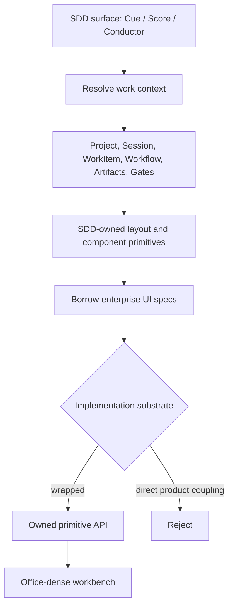

# SDD Workbench UI System

This spec captures the UI/UX study decision for SDD-based work products. The
goal is not to select a permanent component vendor. The goal is to define the
workbench contract that `score`, `cue`, and `conductor` can share while each
surface keeps its own product entrypoint.

The policy is: borrow mature enterprise design-system specifications, own the
SDD primitives in our codebase. Blueprint, Carbon, Fluent, Ant Design Pro, and
Material UI are useful references for density, interaction vocabulary,
accessibility, tables, command bars, and status semantics. They are not the
product architecture. Cue, Score, and Conductor should depend on SDD-level
workbench primitives rather than binding product logic directly to a vendor UI
kit.

The implementation-oriented primitive design is captured in
[`workbench-ui-primitive-design.md`](workbench-ui-primitive-design.md).

## Workbench Schema
<!-- type: schema lang: yaml -->

```yaml
$schema: "https://json-schema.org/draft/2020-12/schema"
$id: "https://cclab.dev/sdd/workbench-ui-system/v0"
title: SDD Workbench UI System v0
type: object
additionalProperties: false
required:
  - design_system_policy
  - surface
  - layout_primitive
  - component_primitive
  - density_profile
  - work_context
properties:
  design_system_policy:
    type: object
    additionalProperties: false
    required: [ownership, borrowed_references, allowed_substrates, forbidden_coupling]
    properties:
      ownership:
        const: "SDD owns product primitives, token names, layout contracts, and state semantics."
      borrowed_references:
        type: array
        items:
          type: object
          additionalProperties: false
          required: [name, borrow_for, do_not_borrow]
          properties:
            name:
              enum:
                - blueprint
                - carbon
                - fluent
                - ant_design_pro
                - material_ui
            borrow_for:
              type: array
              items:
                enum:
                  - office_density
                  - data_tables
                  - command_surfaces
                  - panes_and_splitters
                  - accessibility
                  - status_semantics
                  - admin_information_architecture
                  - theme_token_mechanics
            do_not_borrow:
              type: array
              items:
                enum:
                  - product_model
                  - domain_language
                  - navigation_hierarchy
                  - runtime_state_machine
                  - vendor_component_api_as_public_contract
      allowed_substrates:
        type: array
        items:
          enum: [owned_css_react, mui_wrapped, radix_wrapped, blueprint_wrapped, headless_aria_wrapped]
      forbidden_coupling:
        type: array
        items:
          enum:
            - product_logic_imports_vendor_component_directly
            - workflow_state_encoded_as_visual_only
            - chat_transcript_as_durable_work_state
            - surface_specific_component_contract_in_sdd_schema
  surface:
    enum:
      - cue_artifact_studio
      - cue_admin
      - score_workspace
      - conductor_workspace
      - generated_runtime_artifact
  layout_primitive:
    enum:
      - project_session_nav
      - conversation_command
      - work_context_pane
      - workflow_graph
      - artifact_inspector
      - gate_panel
      - operations_dashboard
      - registry_browser
  component_primitive:
    enum:
      - pane
      - splitter
      - toolbar
      - command_input
      - session_list
      - workitem_list
      - workflow_graph
      - workflow_node
      - workflow_edge
      - artifact_table
      - artifact_card
      - gate_status
      - status_chip
      - operation_metric
      - review_queue
  density_profile:
    type: object
    additionalProperties: false
    required: [name, target, rhythm, sizing, typography, radius, color_policy]
    properties:
      name: { const: office_dense }
      target:
        const: "Repeated daily work by app owners, platform operators, and developers."
      rhythm:
        type: object
        properties:
          base_grid_px: { const: 4 }
          compact_gap_px: { enum: [4, 6, 8] }
          section_gap_px: { enum: [12, 16] }
      sizing:
        type: object
        properties:
          toolbar_height_px: { enum: [32, 36] }
          list_row_height_px: { enum: [28, 32, 36] }
          icon_button_px: { enum: [28, 32] }
          input_height_px: { enum: [32, 36] }
      typography:
        type: object
        properties:
          body_px: { enum: [13, 14] }
          dense_label_px: { enum: [11, 12] }
          panel_heading_px: { enum: [14, 15, 16] }
      radius:
        type: object
        properties:
          standard_px: { maximum: 6 }
          card_px: { maximum: 8 }
      color_policy:
        type: object
        properties:
          use_status_palette_for_state: { const: true }
          avoid_single_hue_dominance: { const: true }
          avoid_decorative_gradients: { const: true }
  work_context:
    type: object
    additionalProperties: false
    required: [primary_state, secondary_state, command_surface]
    properties:
      primary_state:
        type: array
        items:
          enum:
            - workitem_goal
            - stage_task_graph
            - artifact_graph
            - gate_state
            - blocker_state
            - next_action
            - operational_health
      secondary_state:
        type: array
        items:
          enum:
            - conversation_transcript
            - freeform_notes
            - generated_preview
            - raw_logs
      command_surface:
        enum:
          - conversation_input
          - command_bar
          - contextual_toolbar
```

## Design Logic
<!-- type: logic lang: mermaid -->



## Scenarios
<!-- type: scenarios lang: yaml -->

```yaml
scenarios:
  - id: cue_uses_sdd_workbench_contract
    title: Cue Artifact Studio consumes the SDD workbench contract
    given:
      - Cue displays project sessions, active WorkItem, workflow graph, artifacts, and gates
      - the current frontend implementation may use MUI internally
    when:
      - Artifact Studio renders desktop work context
    then:
      - project and session navigation use the SDD project_session_nav primitive
      - conversation is a command surface, not the durable work state
      - the right work context pane owns workflow graph, artifacts, gates, blockers, and next action
      - MUI components are wrapped or hidden behind Cue/SDD primitives

  - id: score_and_conductor_share_sdd_primitives
    title: Score and Conductor reuse the same SDD state semantics
    given:
      - Score shows local TD/issues/workflow state
      - Conductor shows remote project governance and SDD state
    when:
      - both surfaces render artifact, gate, and workflow status
    then:
      - status labels, colors, and interactions mean the same thing
      - each surface may choose different layout composition
      - neither surface redefines SDD state names inside vendor UI props

  - id: design_system_swap_is_low_risk
    title: UI substrate can change without changing product contracts
    given:
      - a surface currently wraps MUI
      - a future implementation wants owned CSS, Radix, Blueprint, or headless ARIA
    when:
      - the substrate is migrated
    then:
      - product logic keeps importing SDD-owned primitives
      - e2e tests assert workbench behavior and density, not vendor DOM structure
      - the WorkItem, artifact, workflow, and gate contracts remain stable

  - id: dense_office_layout_beats_consumer_material_default
    title: Work surfaces prefer compact office density
    given:
      - a daily operator or project owner needs to compare many items
    when:
      - lists, toolbars, inputs, node labels, and status chips render
    then:
      - row height, spacing, and typography follow office_dense targets
      - cards are used only for repeated items, modals, and framed tools
      - decorative marketing layout patterns are avoided
```

## Changes
<!-- type: changes lang: yaml -->

```yaml
changes:
  - path: projects/agentic-workflow/tech-design/core/README.md
    action: create
    section: logic
    impl_mode: hand-written
    description: Index cross-surface SDD project specs.

  - path: projects/agentic-workflow/tech-design/core/specs/workbench-ui-system.md
    action: create
    section: logic
    impl_mode: hand-written
    description: Define the shared SDD-level workbench UI policy, primitives, density profile, and reference borrowing rule.

  - path: projects/agentic-workflow/tech-design/core/specs/workbench-ui-primitive-design.md
    action: create
    section: logic
    impl_mode: hand-written
    description: Define implementation-oriented primitive API, layout slots, density tokens, interactions, and migration path.

  - path: .aw/tech-design/projects/cue/README.md
    action: modify
    section: changes
    impl_mode: hand-written
    description: Point Cue architecture at the SDD Workbench UI System as the shared UI contract.

future_implementation:
  - path: crates/sdd/packages/@score/ui/
    action: create_or_extend
    impl_mode: hand-written
    description: Preferred future home for SDD-owned React workbench primitives when unified frontend packaging lands.

  - path: projects/cue/artifact-studio/src/
    action: wrap_existing_vendor_components
    impl_mode: hand-written
    description: Current Cue Artifact Studio may keep MUI as substrate while introducing SDD/Cue-owned primitives around panes, workflow graph, artifacts, gates, and command input.

  - path: .aw/tech-design/packages/cclab-ui/
    action: reconcile
    impl_mode: hand-written
    description: Existing shared component specs should be reconciled with the SDD workbench contract instead of becoming a competing product-level design system.
  - action: annotate
    section: scenarios
    impl_mode: hand-written
    description: "Traceability metadata edge for the scenarios section."

  - action: annotate
    section: schema
    impl_mode: hand-written
    description: "Traceability metadata edge for the schema section."

  - action: annotate
    section: unit-test
    impl_mode: hand-written
    description: "Traceability metadata edge for the unit-test section."

```

## Tests
<!-- type: tests lang: yaml -->

```yaml
tests:
  spec_section_conformance:
    kind: score
    command: aw td check --section-type-conformance projects/agentic-workflow/tech-design/core/specs/workbench-ui-system.md --json
    verifies:
      - schema, logic, scenarios, changes, and tests sections are parseable by Score

  cue_artifact_studio_layout_e2e:
    kind: browser
    verifies:
      - left navigation remains project/session oriented
      - conversation column is a bounded command surface
      - right work context pane is wider than conversation on desktop
      - workflow graph nodes and edges are visible
      - no panel text overflows at desktop and mobile breakpoints

  primitive_import_boundary:
    kind: static
    verifies:
      - product workflow logic imports owned SDD or Cue primitives
      - vendor UI imports stay inside primitive implementation files

  density_regression:
    kind: visual
    verifies:
      - list rows, toolbar controls, command input, workflow nodes, artifact tables, and status chips follow office_dense sizing
      - UI does not regress into large consumer Material defaults
```

## Traceability Changes
<!-- type: changes lang: yaml -->

```yaml
# aw-traceability-repair-1780398547209
changes:
  - action: annotate
    section: scenarios
    impl_mode: hand-written
    description: "Traceability metadata edge for the scenarios section."
  - action: annotate
    section: schema
    impl_mode: hand-written
    description: "Traceability metadata edge for the schema section."
  - action: annotate
    section: unit-test
    impl_mode: hand-written
    description: "Traceability metadata edge for the unit-test section."
```
