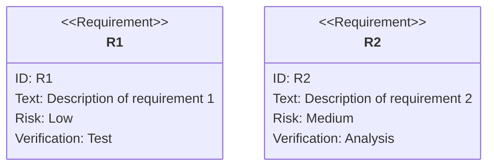
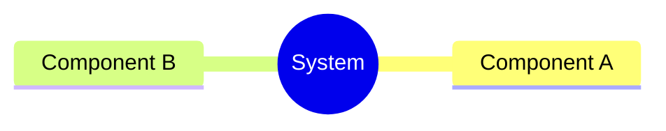
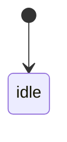
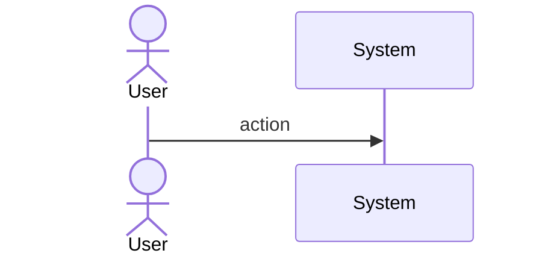
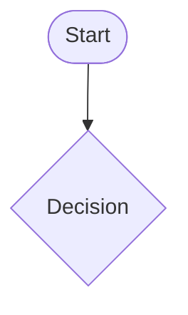
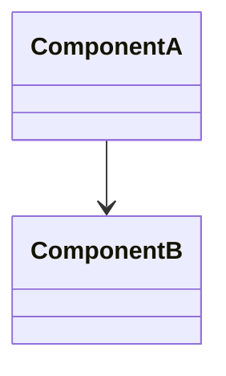
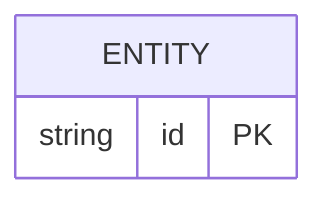

# sdd tools common change spec preamble

## Overview
<!-- type: overview lang: markdown -->

Public API manifest for `projects/agentic-workflow/src/tools/common_change_spec.rs` generated from AST during Score force-regeneration standardization.

### Symbols

| Name | Target | Kind | Visibility | Line | Signature |
|------|--------|------|------------|------|-----------|
| `ALL_SECTIONS` | projects/agentic-workflow/src/tools/common_change_spec.rs | constant | pub | 285 |  |
| `SpecSubState` | projects/agentic-workflow/src/tools/common_change_spec.rs | enum | pub | 439 |  |
| `UNIVERSAL_SKELETON` | projects/agentic-workflow/src/tools/common_change_spec.rs | constant | pub | 30 |  |
| `fill_section_base_name` | projects/agentic-workflow/src/tools/common_change_spec.rs | function | pub | 1281 | fill_section_base_name(s: &str) -> &str |
| `find_spec_path` | projects/agentic-workflow/src/tools/common_change_spec.rs | function | pub | 343 | find_spec_path(change_dir: &std::path::Path, spec_id: &str) -> std::path::PathBuf |
| `generate_skeleton` | projects/agentic-workflow/src/tools/common_change_spec.rs | function | pub | 770 | generate_skeleton(     spec_id: &str,     title: &str,     main_spec_ref: Option<&str>,     merge_strategy: Option<&str>,     project_root: &Path, ) -> String |
| `get_primary_specs_dir` | projects/agentic-workflow/src/tools/common_change_spec.rs | function | pub | 369 | get_primary_specs_dir(change_dir: &std::path::Path) -> std::path::PathBuf |
| `get_spec_path` | projects/agentic-workflow/src/tools/common_change_spec.rs | function | pub | 329 | get_spec_path(     change_dir: &std::path::Path,     group_id: Option<&str>,     spec_id: &str, ) -> std::path::PathBuf |
| `get_specs_dir` | projects/agentic-workflow/src/tools/common_change_spec.rs | function | pub | 320 | get_specs_dir(change_dir: &std::path::Path, group_id: Option<&str>) -> std::path::PathBuf |
| `is_create_complete` | projects/agentic-workflow/src/tools/common_change_spec.rs | function | pub | 1344 | is_create_complete(content: &str) -> bool |
| `is_fill_section_optional` | projects/agentic-workflow/src/tools/common_change_spec.rs | function | pub | 1287 | is_fill_section_optional(s: &str) -> bool |
| `parse_fill_section` | projects/agentic-workflow/src/tools/common_change_spec.rs | function | pub | 1272 | parse_fill_section(s: &str) -> (&str, bool) |
| `prune_todo_sections` | projects/agentic-workflow/src/tools/common_change_spec.rs | function | pub | 1091 | prune_todo_sections(content: &str) -> String |
| `read_fill_sections` | projects/agentic-workflow/src/tools/common_change_spec.rs | function | pub | 1171 | read_fill_sections(content: &str) -> Vec<String> |
| `read_filled_sections` | projects/agentic-workflow/src/tools/common_change_spec.rs | function | pub | 1218 | read_filled_sections(content: &str) -> Vec<String> |
| `read_main_spec_ref` | projects/agentic-workflow/src/tools/common_change_spec.rs | function | pub | 1295 | read_main_spec_ref(content: &str) -> Option<String> |
| `replace_section` | projects/agentic-workflow/src/tools/common_change_spec.rs | function | pub | 911 | replace_section(content: &str, section: &str, new_content: &str) -> String |
| `resolve_group_id_for_spec` | projects/agentic-workflow/src/tools/common_change_spec.rs | function | pub | 395 | resolve_group_id_for_spec(change_dir: &std::path::Path, spec_id: &str) -> Option<String> |
| `resolve_next_spec` | projects/agentic-workflow/src/tools/common_change_spec.rs | function | pub | 463 | resolve_next_spec(change_dir: &Path, change_id: &str) -> Result<SpecSubState> |
| `strip_change_spec_fields` | projects/agentic-workflow/src/tools/common_change_spec.rs | function | pub | 1324 | strip_change_spec_fields(content: &str) -> String |
## Source
<!-- type: source lang: rust -->

````rust
// ─── Universal Skeleton ─────────────────────────────────────────────────────

// @spec projects/agentic-workflow/tech-design/core/logic/spec-format-unification.md#R6
// @spec projects/agentic-workflow/tech-design/core/logic/spec-format-unification.md#R7
// @spec projects/agentic-workflow/tech-design/core/logic/spec-format-unification.md#R8
/// Universal skeleton template with ALL possible sections.
/// Sections are annotated with `<!-- type: xxx lang: yyy -->`.
/// Agent decides which to fill; prune removes unfilled sections.
///
/// Format decisions (D1-D9 from issue):
/// - 3 langs only: markdown, yaml, mermaid. JSON removed.
/// - requirements/unit-test: Mermaid Plus requirementDiagram (YAML frontmatter inside mermaid block)
/// - e2e-test: YAML journey plus machine-verifiable assertions
/// - scenarios: YAML GWT structured format {id, given, when, then, diagram_ref?}
/// - schema/rpc-api/config/component/design-token: yaml (not json)
/// - all diagram sections: Mermaid Plus (YAML frontmatter inside mermaid block)
/// - changes: optional satisfies: [R-id] field for requirement traceability
pub const UNIVERSAL_SKELETON: &str = r#"---
id: {spec_id}
main_spec_ref: ~
merge_strategy: new
---

# {title}

## Overview
<!-- type: overview lang: markdown -->

<!-- TODO -->

## Requirements
<!-- type: requirements lang: mermaid -->

<!-- TODO: Use Mermaid Plus requirementDiagram (SysML v1.6). Example:

-->

## Scenarios
<!-- type: scenarios lang: yaml -->

<!-- TODO: Use YAML GWT structured format. Example:
```yaml
- id: S1
  given: Initial state description
  when: Action or event that triggers the scenario
  then: Expected outcome

- id: S2
  given: Another initial state
  when: Another action
  then: Another expected outcome
  diagram_ref: interaction-S2
```
-->

## Mindmap
<!-- type: mindmap lang: mermaid -->
<!-- TODO: Use Mermaid Plus mindmap (YAML frontmatter inside mermaid block).

-->

## State Machine
<!-- type: state-machine lang: mermaid -->
<!-- TODO: Use Mermaid Plus stateDiagram-v2 (YAML frontmatter inside mermaid block).

-->

## Interaction
<!-- type: interaction lang: mermaid -->
<!-- TODO: Use Mermaid Plus sequenceDiagram (YAML frontmatter inside mermaid block).

-->

## Logic
<!-- type: logic lang: mermaid -->
<!-- TODO: Use Mermaid Plus flowchart (YAML frontmatter inside mermaid block).

-->

## Dependencies
<!-- type: dependency lang: mermaid -->
<!-- TODO: Use Mermaid Plus classDiagram (YAML frontmatter inside mermaid block).

-->

## Data Model
<!-- type: db-model lang: mermaid -->
<!-- TODO: Use Mermaid Plus erDiagram (YAML frontmatter inside mermaid block).

-->

## REST API
<!-- type: rest-api lang: yaml -->
<!-- TODO -->

## RPC API
<!-- type: rpc-api lang: yaml -->
<!-- TODO: OpenRPC 1.3 as YAML. Example:
```yaml
openrpc: "1.3.2"
info:
  title: Service Name
  version: "1.0.0"
methods: []
```
-->

## Async API
<!-- type: async-api lang: yaml -->
<!-- TODO -->

## CLI
<!-- type: cli lang: yaml -->
<!-- TODO -->

## Schema
<!-- type: schema lang: yaml -->
<!-- TODO: JSON Schema as YAML. Example:
```yaml
"$schema": "https://json-schema.org/draft/2020-12/schema"
type: object
properties:
  id:
    type: string
required: [id]
```
-->

## Config
<!-- type: config lang: yaml -->
<!-- TODO -->

## Unit Test
<!-- type: unit-test lang: mermaid -->

<!-- TODO: Use Mermaid Plus requirementDiagram with element nodes and verifies relationships.
```mermaid
---
id: unit-test
---
requirementDiagram

element T1 {
  type: "Test"
}

element T2 {
  type: "Test"
}

T1 - verifies -> R1
T2 - verifies -> R2
```
-->

## E2E Test
<!-- type: e2e-test lang: yaml -->

<!-- TODO: Use YAML to describe product journeys, machine-verifiable assertions, and optional evidence artifacts. Example:
```yaml
e2e_tests:
  - id: project-capability-define
    capability_id: capability-control-plane
    contract_id: capability-define-onboarding
    category: product-journey
    command: "vat run manual --gpu none"
    assertions:
      - "user can complete the capability definition journey"
      - "visual evidence captures the primary UI states"
      - "agent evaluation report has no blocking violations"
    evidence:
      screenshots:
        - path: "e2e-results/user-manual/images/capability-setup.png"
          label: "Capability setup"
          locator: "[data-testid=capability-setup]"
      reports:
        - path: "e2e-results/agent-eval/project-capability-define.json"
          kind: agent-eval
          label: "Agent evaluation report"
      docs:
        - path: "docs/aw-ec-manual.md"
          kind: generated-manual
          label: "Generated product manual"
          format: markdown
          command: "aw ec --project agentic-workflow doc gen"
    evaluators:
      - id: capability-agent-eval
        tool: codex
        command: "codex exec --json --output e2e-results/agent-eval/project-capability-define.json"
        report_path: "e2e-results/agent-eval/project-capability-define.json"
        rubric:
          - "agent response reflects the user-created project goal"
          - "agent asks for missing capability details instead of inventing commitments"
          - "agent produces no blocking contradiction with the README capability contract"
        pass_criteria:
          - "score >= 4"
          - "blocking_violations is empty"
```
-->

## Changes
<!-- type: changes lang: yaml -->

<!-- TODO -->

## Wireframe
<!-- type: wireframe lang: yaml -->

<!-- TODO -->

## Component
<!-- type: component lang: yaml -->

<!-- TODO -->

## Design Token
<!-- type: design-token lang: yaml -->

<!-- TODO -->

## Doc
<!-- type: doc lang: markdown -->

<!-- TODO -->

# Reviews
"#;

// @spec projects/agentic-workflow/tech-design/core/logic/spec-structure.md#R2
/// All fillable section names (used for analyze step).
///
/// Ordered by `SectionType::fill_order()` — top-down human reasoning order.
/// Must match `SectionType::as_str()` values.
pub const ALL_SECTIONS: &[&str] = &[
    "overview",      // 0
    "requirements",  // 1
    "scenarios",     // 2
    "mindmap",       // 3
    "state-machine", // 4
    "interaction",   // 5
    "logic",         // 6
    "dependency",    // 7
    "db-model",      // 8
    "schema",        // 9
    "rest-api",      // 10
    "rpc-api",       // 11
    "async-api",     // 12
    "cli",           // 13
    "wireframe",     // 14
    "component",     // 15
    "design-token",  // 16
    "config",        // 17
    "unit-test",     // 18
    "e2e-test",      // 19
    "changes",       // 20
    "doc",           // 21
];

// ─── Spec Path Helpers ──────────────────────────────────────────────────────

/// Get the specs directory for a change, respecting group structure.
///
/// - If `group_id` is `Some(gid)`, returns `change_dir/groups/{gid}/specs/`
/// - If `group_id` is `None`, returns `change_dir/specs/` (backward compat)
///
/// This is the canonical path helper — all tools must use this function
/// instead of hardcoding paths.
/// @spec projects/agentic-workflow/tech-design/core/tools/common_change_spec/preamble.md#source
pub fn get_specs_dir(change_dir: &std::path::Path, group_id: Option<&str>) -> std::path::PathBuf {
    match group_id {
        Some(gid) => change_dir.join("groups").join(gid).join("specs"),
        None => change_dir.join("specs"),
    }
}

/// Get the spec file path for a given spec_id within a change.
/// @spec projects/agentic-workflow/tech-design/core/tools/common_change_spec/preamble.md#source
pub fn get_spec_path(
    change_dir: &std::path::Path,
    group_id: Option<&str>,
    spec_id: &str,
) -> std::path::PathBuf {
    get_specs_dir(change_dir, group_id).join(format!("{}.md", spec_id))
}

/// Find a spec file by ID, searching groups/*/specs/ first, then specs/.
///
/// Returns the path to the spec file if found, or falls back to the legacy
/// `change_dir/specs/{spec_id}.md` path (which may not exist) so callers
/// get a deterministic path for creation.
/// @spec projects/agentic-workflow/tech-design/core/tools/common_change_spec/preamble.md#source
pub fn find_spec_path(change_dir: &std::path::Path, spec_id: &str) -> std::path::PathBuf {
    // Search groups/*/specs/ first
    let groups_dir = change_dir.join("groups");
    if groups_dir.is_dir() {
        if let Ok(entries) = std::fs::read_dir(&groups_dir) {
            let mut sorted: Vec<_> = entries.filter_map(|e| e.ok()).collect();
            sorted.sort_by_key(|e| e.file_name());
            for entry in sorted {
                if entry.path().is_dir() {
                    let candidate = entry.path().join("specs").join(format!("{}.md", spec_id));
                    if candidate.exists() {
                        return candidate;
                    }
                }
            }
        }
    }
    // Fallback: legacy specs/ path
    change_dir.join("specs").join(format!("{}.md", spec_id))
}

/// Get the effective specs directory for a change (groups-aware, for legacy compat).
///
/// Returns the first group's specs dir if `groups/` exists and has subdirs,
/// otherwise returns `change_dir/specs/`.
/// @spec projects/agentic-workflow/tech-design/core/tools/common_change_spec/preamble.md#source
pub fn get_primary_specs_dir(change_dir: &std::path::Path) -> std::path::PathBuf {
    let groups_dir = change_dir.join("groups");
    if groups_dir.is_dir() {
        if let Ok(entries) = std::fs::read_dir(&groups_dir) {
            let mut sorted: Vec<_> = entries.filter_map(|e| e.ok()).collect();
            sorted.sort_by_key(|e| e.file_name());
            for entry in sorted {
                if entry.path().is_dir() {
                    let group_specs = entry.path().join("specs");
                    if group_specs.is_dir() {
                        return group_specs;
                    }
                }
            }
        }
    }
    change_dir.join("specs")
}

/// Resolve the group_id for a spec in a multi-group change.
///
/// Searches in this order:
/// 1. `groups/*/specs/{spec_id}.md` — spec already created in a group
/// 2. `groups/*/spec_plan.yaml` — spec assigned to group in spec plan
/// 3. `None` — spec belongs to root layout or single-group change
/// @spec projects/agentic-workflow/tech-design/core/tools/common_change_spec/preamble.md#source
pub fn resolve_group_id_for_spec(change_dir: &std::path::Path, spec_id: &str) -> Option<String> {
    let groups_dir = change_dir.join("groups");
    if !groups_dir.is_dir() {
        return None;
    }

    let mut entries: Vec<_> = std::fs::read_dir(&groups_dir)
        .ok()?
        .filter_map(|e| e.ok())
        .collect();
    entries.sort_by_key(|e| e.file_name());

    // Pass 1: check if spec already exists in a group's specs dir
    for entry in &entries {
        if entry.path().is_dir() {
            let spec_path = entry.path().join("specs").join(format!("{}.md", spec_id));
            if spec_path.exists() {
                return entry.file_name().to_str().map(String::from);
            }
        }
    }

    // Pass 2: check spec_plan.yaml for group membership
    for entry in &entries {
        if entry.path().is_dir() {
            let plan_path = entry.path().join("spec_plan.yaml");
            if let Ok(content) = std::fs::read_to_string(&plan_path) {
                if content.contains(&format!("spec_id: {}", spec_id)) {
                    return entry.file_name().to_str().map(String::from);
                }
            }
        }
    }

    None
}
````

## Changes
<!-- type: changes lang: yaml -->

```yaml
changes:
  - path: projects/agentic-workflow/src/tools/common_change_spec.rs
    action: modify
    section: source
    impl_mode: codegen
    replaces:
      - "<handwrite-tracker:projects-sdd-src-tools-common-change-spec-rs-preamble>"
    description: "Universal skeleton constants and group-aware spec path helpers."
```
