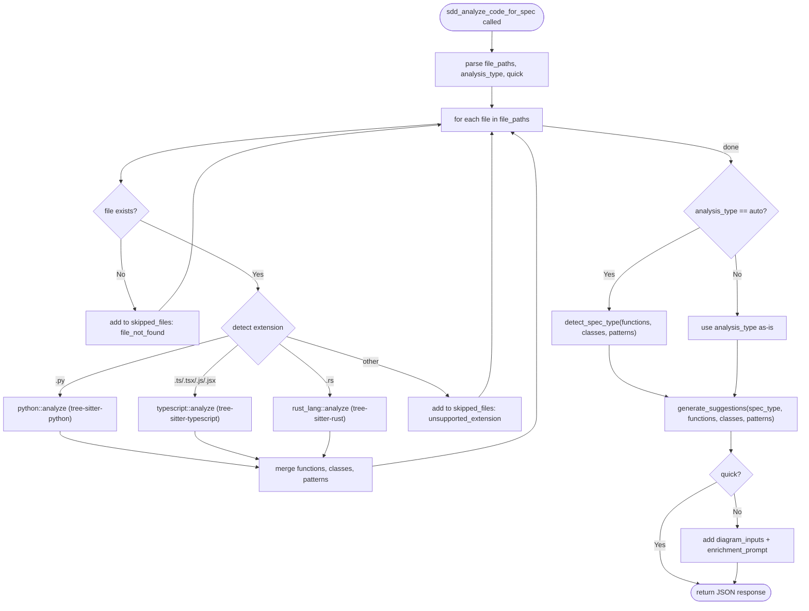

---
files:
  - tools/analyze/mod.rs
  - tools/analyze/python.rs
  - tools/analyze/typescript.rs
  - tools/analyze/rust_lang.rs
  - tools/analyze/suggestions.rs
capability_refs:
  - id: existing-project-standardization
    role: primary
    gap: managed-and-semantic-production-gates
    claim: managed-and-semantic-production-gates
    coverage: full
    rationale: "Analyze-code tool TDs support brownfield semantic coverage and standardization readiness."
---

# sdd_analyze_code_for_spec: Code Analysis for Spec Generation

Analyze source code files using tree-sitter to extract functions, classes, and architectural patterns, then suggest spec structure (spec type, diagrams, requirements) for downstream code generation.

**Supported languages**: Python (.py), TypeScript/JavaScript (.ts, .tsx, .js, .jsx), Rust (.rs).
**Callers**: Used by the SDD workflow to bootstrap specs from existing code. Standalone CLI tool -- no state machine interaction.

## OpenRPC Method Definition
<!-- type: rpc-api lang: yaml -->

```yaml
name: sdd_analyze_code_for_spec
summary: Analyze code files with tree-sitter and suggest spec structure for code generation
params:
  - name: project_path
    required: true
    schema:
      type: string
      description: Project root path (use $PWD for current directory)
  - name: file_paths
    required: true
    schema:
      type: array
      items:
        type: string
      description: List of file paths to analyze (relative to project root)
  - name: analysis_type
    required: true
    schema:
      type: string
      enum:
        - api
        - data-model
        - module
        - auto
      description: "Type of analysis: api (HTTP endpoints), data-model (schemas/classes), module (general), auto (detect automatically)"
  - name: quick
    required: false
    schema:
      type: boolean
      default: false
      description: "Fast-path: return AST-only analysis without LLM enrichment prompts or diagram inputs"
result:
  name: result
  schema:
    type: object
    required:
      - suggested_spec_type
      - detected_patterns
      - extracted_types
      - extracted_functions
      - suggested_requirements
      - suggested_diagrams
      - quick
    properties:
      suggested_spec_type:
        type: string
        enum:
          - http-api
          - event-driven
          - data-model
          - algorithm
          - utility
        description: Detected or user-specified spec type
      detected_patterns:
        type: array
        items:
          type: string
        description: Architectural patterns detected from code (e.g. http-api, data-model, event-driven)
      extracted_types:
        type: array
        items:
          type: object
          properties:
            name:
              type: string
            kind:
              type: string
              enum:
                - class
                - derived
            bases:
              type: array
              items:
                type: string
            fields:
              type: array
              items:
                type: object
                properties:
                  name:
                    type: string
                  type:
                    type: string
      extracted_functions:
        type: array
        items:
          type: object
          properties:
            name:
              type: string
            is_async:
              type: boolean
            params:
              type: array
              items:
                type: object
                properties:
                  name:
                    type: string
                  type:
                    type: string
            return_type:
              type: string
            decorators:
              type: array
              items:
                type: string
      suggested_requirements:
        type: array
        items:
          type: object
          properties:
            id:
              type: string
              pattern: "^R\\d+$"
            title:
              type: string
            description:
              type: string
            priority:
              type: string
              enum:
                - high
                - medium
                - low
      suggested_diagrams:
        type: array
        items:
          type: object
          properties:
            type:
              type: string
              enum:
                - sequence
                - class
                - erd
                - flowchart
                - state
            reason:
              type: string
      api_spec_recommendation:
        type: string
        description: Present when spec_type is http-api or event-driven. Suggests OpenAPI or AsyncAPI.
      quick:
        type: boolean
      diagram_inputs:
        type: array
        description: Structured inputs for diagram generation. Only present when quick=false.
        items:
          type: object
      enrichment_prompt:
        type: string
        description: LLM prompt to transform AST data into rich specs. Only present when quick=false.
      skipped_files:
        type: array
        description: Files that could not be analyzed. Only present when files were skipped.
        items:
          type: object
          properties:
            path:
              type: string
            reason:
              type: string
              enum:
                - file_not_found
                - "unsupported_extension: .<ext>"
```

## Behavior
<!-- type: doc lang: markdown -->

### Execution Flow



### Tree-Sitter Extraction by Language

Each language module parses source code with tree-sitter and returns an `AnalysisResult` containing functions, classes, and detected patterns.

| Language | Functions Extracted From | Classes Extracted From | Pattern Detection |
|----------|------------------------|----------------------|-------------------|
| Python | `function_definition`, `async_function_definition` | `class_definition` | Decorators containing route/get/post/put/delete/api -> `http-api`; event/handler/subscribe -> `event-driven`; Base classes containing BaseModel/Schema/Model/DataClass -> `data-model` |
| TypeScript | `function_declaration`, `arrow_function`, `method_definition` | `class_declaration`, `interface_declaration`, `type_alias_declaration` | Call expressions with .get()/.post()/.put()/.delete()/router./app. -> `http-api`; Interfaces/type aliases -> `data-model` |
| Rust | `function_item` | `struct_item` | Attributes with get/post/put/delete/route -> `http-api`; `impl Handler`/`impl Service` -> `http-api`; derive(Serialize/Deserialize) -> `data-model` |

### Auto Spec Type Detection

When `analysis_type` is `"auto"`, the tool applies the following priority rules:

1. If `http-api` pattern detected -> `"http-api"`
2. If `event-driven` pattern detected -> `"event-driven"`
3. If `data-model` pattern detected -> `"data-model"`
4. If more classes than functions -> `"data-model"`
5. If async functions + CRUD-named functions (create/read/update/delete/get/set) -> `"http-api"`
6. If more than 5 functions -> `"algorithm"`
7. Otherwise -> `"utility"`

### Suggested Diagrams by Spec Type

| Spec Type | Suggested Diagrams |
|-----------|-------------------|
| `http-api` | `sequence` (API request/response flow) + `class` (request/response models, if classes present) |
| `event-driven` | `sequence` (event publishing and handling flow) |
| `data-model` | `erd` (entity relationships) + `class` (class structure and attributes) |
| `algorithm` | `flowchart` (algorithm logic flow) + `state` (state transitions if applicable) |
| other | `flowchart` (module logic flow, if functions present) |

### API Spec Recommendation

| Spec Type | Recommendation |
|-----------|---------------|
| `http-api` | "Include OpenAPI 3.1 specification" |
| `event-driven` | "Include AsyncAPI 2.6 specification" |
| other | `null` |

### Quick Mode vs Full Mode

| Field | `quick=true` | `quick=false` |
|-------|-------------|---------------|
| `suggested_spec_type` | Included | Included |
| `detected_patterns` | Included | Included |
| `extracted_types` | Included | Included |
| `extracted_functions` | Included | Included |
| `suggested_requirements` | Included | Included |
| `suggested_diagrams` | Included | Included |
| `diagram_inputs` | Omitted | Included (structured inputs for diagram generation tools) |
| `enrichment_prompt` | Omitted | Included (LLM prompt to generate rich specs from AST data) |

### Requirement Generation

Requirements are auto-generated from extracted symbols:

- **Functions** with docstrings or parameters generate a requirement with title `"{name} function"` and priority `"high"` if async, `"medium"` otherwise.
- **Classes** always generate a requirement with title `"{name} data model"` and priority `"high"`.

### Enrichment Prompt (Full Mode Only)

The enrichment prompt is a formatted text block containing:
1. Detected spec type
2. List of extracted functions (up to 20) with signatures
3. List of extracted types (up to 20) with fields
4. Instructions to generate semantic descriptions, requirements (R1, R2, ...), GIVEN/WHEN/THEN acceptance criteria, and priority classifications

## Side Effects
<!-- type: doc lang: markdown -->

None. This tool is read-only -- it parses files via tree-sitter and returns structured analysis. It does not modify STATE.yaml or any files on disk.

## Changes
<!-- type: changes lang: yaml -->

```yaml
changes:
  - action: annotate
    section: rpc-api
    impl_mode: hand-written
    description: "Traceability metadata edge for the rpc-api section."

```