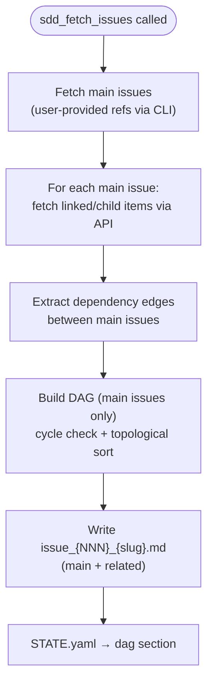
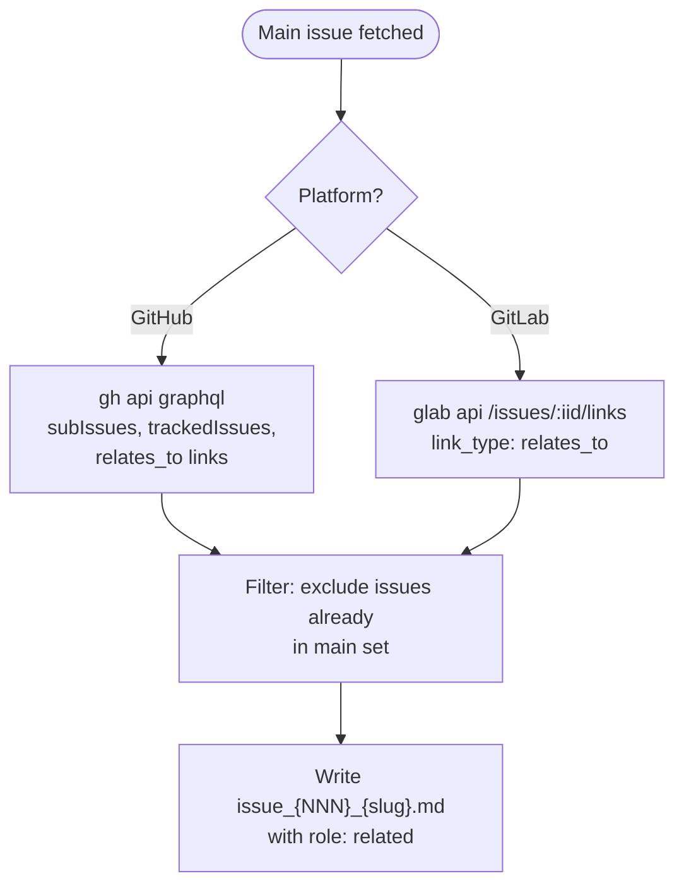
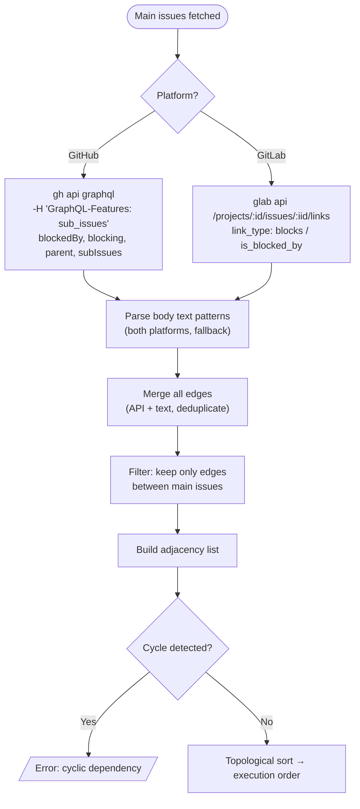
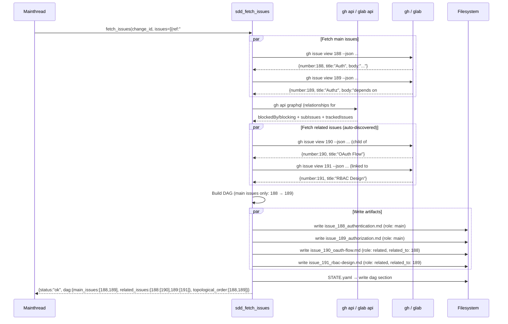
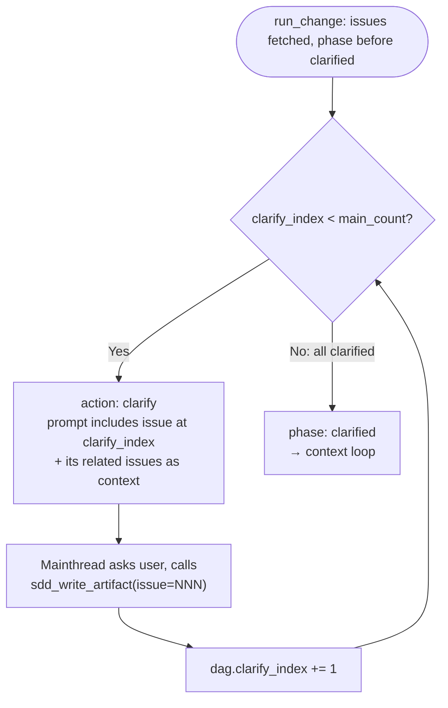
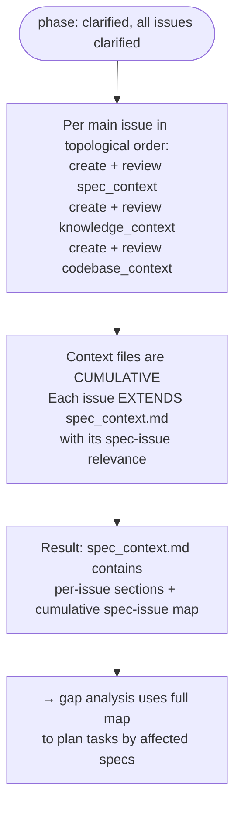
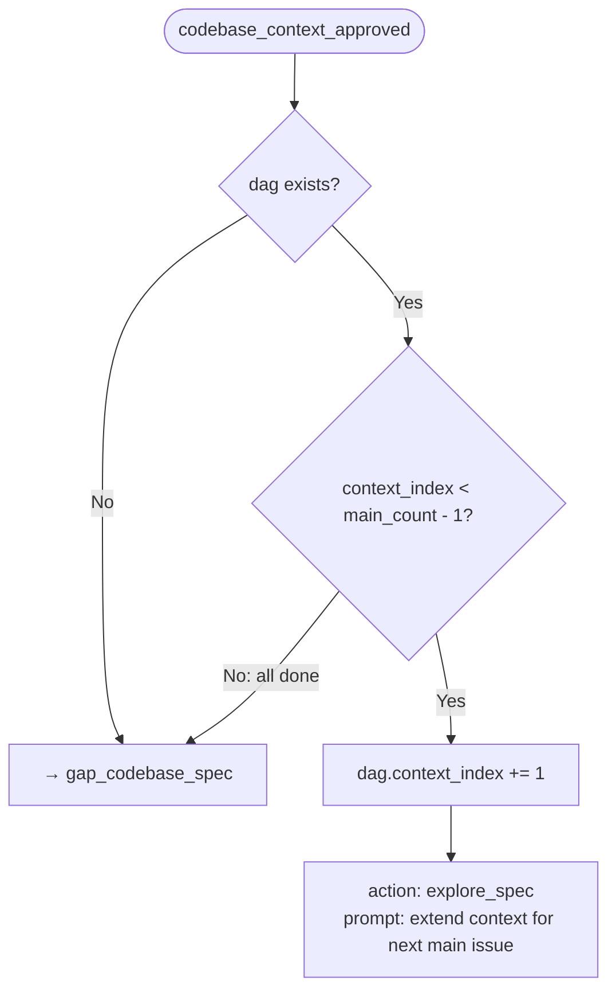
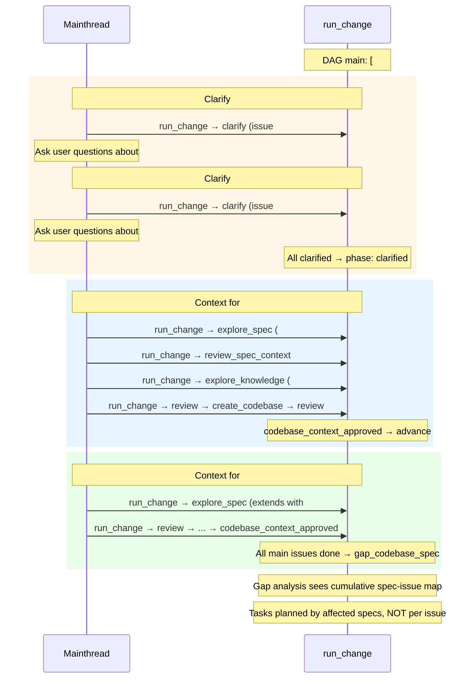
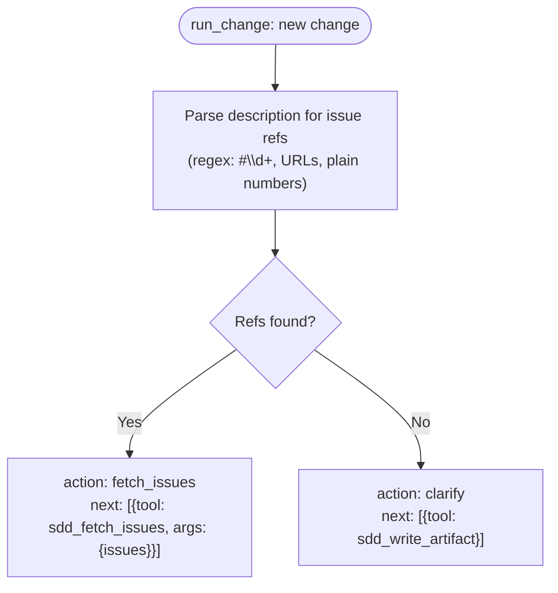

---
files:
  - tools/fetch_issues.rs
capability_refs:
  - id: td-cb-lifecycle-automation
    role: primary
    gap: td-lifecycle-dispatch
    claim: td-lifecycle-dispatch
    coverage: full
    rationale: "Tool TDs implement TD/CB lifecycle artifact authoring, review, revision, merge, and validation commands."
---

# sdd_fetch_issues: Fetch Issues with Dependency DAG

> **Deprecated as standalone CLI tool.** The fetch logic is now invoked internally by `sdd_run_change` when the `issues` param is provided (or issue refs are detected in `description`). This file is retained as internal implementation reference documenting gh CLI integration, BFS discovery, DAG construction, and dependency extraction.

Fetch **main issues** (user-provided) and their **related issues** (link items, child items — context only), extract dependency relationships between main issues, build execution DAG.

**Key concepts**:
- **Main issues**: User-provided refs. Get clarification, context creation, and drive task planning.
- **Related issues**: Auto-fetched from main issues' link/child items. Provide context but are NOT clarified or separately contexted.

**Key behaviors**:
- Fetches main issues via platform CLI
- Auto-fetches related issues (linked/child items) for each main issue
- Extracts dependency edges between main issues (platform API + body text)
- Builds DAG with topological ordering (main issues only)
- Writes per-issue artifacts + `dependency_graph.md`
- Writes DAG to STATE.yaml for `run_change` routing

## OpenRPC
<!-- type: rpc-api lang: yaml -->

```yaml
name: sdd_fetch_issues
summary: Fetch main + related issues from platform with dependency DAG
params:
  - name: project_path
    required: true
    schema:
      type: string
  - name: change_id
    required: true
    schema:
      type: string
      pattern: "^[a-z0-9-]+$"
  - name: issues
    required: true
    schema:
      type: array
      minItems: 1
      items:
        type: object
        required:
          - ref
        properties:
          ref:
            type: string
            description: "Main issue reference: number, #NNN, or full URL"
result:
  name: result
  schema:
    type: object
    required:
      - status
      - change_id
      - artifacts
      - issues
      - dag
    properties:
      status:
        type: string
        enum:
          - ok
          - partial
          - error
      change_id:
        type: string
      artifacts:
        type: array
        items:
          type: string
        description: Paths to written files (issue_*_{slug}.md files)
      issues:
        type: array
        items:
          type: object
          required:
            - number
            - title
            - state
            - role
          properties:
            number:
              type: integer
            title:
              type: string
            state:
              type: string
              enum:
                - open
                - closed
            role:
              type: string
              enum:
                - main
                - related
            related_to:
              type: integer
              description: Parent main issue number (related only)
            labels:
              type: array
              items:
                type: string
            url:
              type: string
            depends_on:
              type: array
              items:
                type: integer
              description: Main issues this issue depends on (main only)
      dag:
        type: object
        required:
          - main_issues
          - related_issues
          - edges
          - topological_order
        properties:
          main_issues:
            type: array
            items:
              type: integer
            description: User-provided issue numbers
          related_issues:
            type: object
            additionalProperties:
              type: array
              items:
                type: integer
            description: "Map: main issue number -> related issue numbers"
          edges:
            type: array
            items:
              type: object
              required:
                - from
                - to
                - type
              properties:
                from:
                  type: integer
                  description: Blocking main issue
                to:
                  type: integer
                  description: Blocked main issue
                type:
                  type: string
                  enum:
                    - blocks
                    - parent_of
                    - text_pattern
          topological_order:
            type: array
            items:
              type: integer
            description: Main issues in dependency-resolved execution order
      next:
        type: array
        items:
          type: object
          required:
            - tool
          properties:
            tool:
              type: string
            args:
              type: object
```

## Fetch Flow
<!-- type: doc lang: markdown -->



### Related Issue Auto-Fetch

For each main issue, fetch linked/child items via platform API:



Related issues include: `relates_to` links, child/sub-issues, tracked issues. Dependency edges (`blocks`/`is_blocked_by`) are used for main issue DAG only.

## Dependency Extraction (main issues only)
<!-- type: doc lang: markdown -->



### Platform API Details

**GitHub** (GraphQL):

```graphql
query($owner: String!, $repo: String!, $numbers: [Int!]!) {
  repository(owner: $owner, name: $repo) {
    issues(first: 100, filterBy: {numbers: $numbers}) {
      nodes {
        number
        title
        parent { number }
        subIssues(first: 50) { nodes { number } }
        blockedBy(first: 50) { nodes { number } }
        blocking(first: 50) { nodes { number } }
        trackedIssues(first: 50) { nodes { number } }
      }
    }
  }
}
```

Requires header: `GraphQL-Features: sub_issues`

**GitLab** (REST — one call per issue):

```
GET /projects/:id/issues/:iid/links
```

| `link_type` | Usage | Tier |
|-------------|-------|------|
| `blocks` / `is_blocked_by` | Main issue DAG edges | Premium+ |
| `relates_to` | Related issues (context) | Free |

### Body Text Patterns (fallback)

| Pattern | Regex | Edge direction |
|---------|-------|---------------|
| `depends on #N` | `(?i)depends?\s+on\s+#(\d+)` | N blocks current |
| `blocked by #N` | `(?i)blocked?\s+by\s+#(\d+)` | N blocks current |
| `blocks #N` | `(?i)blocks?\s+#(\d+)` | current blocks N |
| `after #N` | `(?i)after\s+#(\d+)` | N blocks current |
| `requires #N` | `(?i)requires?\s+#(\d+)` | N blocks current |

## Platform Resolution
<!-- type: doc lang: markdown -->

```mermaid
flowchart TD
    Start([Parse each ref]) --> CheckRef{Full URL?}
    CheckRef -->|Yes| ParseURL["Extract platform + repo + number<br/>github.com → gh / gitlab.com → glab"]
    CheckRef -->|No| LoadConfig{config.toml [platform]?}
    LoadConfig -->|Yes| UseConfig["Use config.platform.type + repo"]
    LoadConfig -->|No| ErrConfig[/"Error: cannot resolve '#NNN'<br/>without [platform] config"/]
    ParseURL --> Fetch["Fetch via CLI"]
    UseConfig --> Fetch
```

| `platform.type` | CLI | Fetch command |
|-----------------|-----|---------------|
| `github` | `gh` | `gh issue view NNN --repo owner/repo --json number,title,body,labels,state,comments` |
| `gitlab` | `glab` | `glab issue view NNN --repo owner/repo` |

## Sequence Diagram
<!-- type: doc lang: markdown -->



## Artifact Formats
<!-- type: doc lang: markdown -->

### Per-Issue: `issue_{NNN}_{slug}.md`

Filename includes a slugified title for readability (e.g., `issue_188_authentication.md`). Slug is lowercase alphanumeric with hyphens, max 50 chars.

```markdown
---
number: {{number}}
title: "{{title}}"
state: {{state}}
role: {{main|related}}
related_to: {{parent_main_issue_number|null}}
labels:
  - {{label}}
url: {{url}}
depends_on: [{{dep_numbers}}]
fetched_at: {{iso8601}}
---

# Issue #{{number}}: {{title}}

\## Body

{{body}}

\## Labels

- {{label}}

\## Comments

### Comment by {{author}} ({{created_at}})

{{comment_body}}
```

### Dependency Graph

> **Note**: `dependency_graph.md` is NOT written as a standalone file. The dependency graph is embedded in `context_clarifications.md` as a `## Dependency Graph` section when DAG exists. See [pre-clarifications.md](../workflow/pre-clarifications.md) for the artifact format.

## STATE.yaml DAG Section
<!-- type: doc lang: markdown -->

Written by `sdd_fetch_issues`, consumed by `run_change`:

```yaml
dag:
  issues:
    - number: 188
      title: "Authentication"
      blocked_by: []
    - number: 189
      title: "Authorization"
      blocked_by: [188]
  clarify_index: 0       # current main issue being clarified
  context_index: 0        # current main issue in context loop
```

## Per-Issue Clarification Loop
<!-- type: doc lang: markdown -->

After fetch, `run_change` routes to `clarify` per main issue in topological order.



Phase stays `clarified` after each issue. `run_change` checks `dag.clarify_index` to decide whether to loop or proceed to context.

## Per-Issue Context Loop (Spec-Issue Relevance Map)
<!-- type: doc lang: markdown -->

After all issues clarified, context creation runs **per main issue in topological order**. The goal is NOT per-issue fix planning — it's building a **cumulative spec-issue relevance map**.



### run_change Routing at codebase_context_approved



### Per-Node Prompt Enrichment

| Field | Value |
|-------|-------|
| `current_issue` | Main issue number + title + its related issues |
| `processed_issues` | Already-contexted main issue numbers |
| `remaining_issues` | Not-yet-processed main issue numbers |
| `previous_context` | Existing cumulative context file content |

### Full Traversal Example



### No New Phases Required

Both loops use **counters**, not new phases:

| Counter | Controls | Checked by |
|---------|----------|------------|
| `dag.clarify_index` | Per-issue clarification loop | `run_change` at phase `clarified` |
| `dag.context_index` | Per-issue context loop | `run_change` at phase `codebase_context_approved` |

## Description Resolution (in run_change code)
<!-- type: doc lang: markdown -->

`run_change` parses `description` for issue references using regex. If refs are found, it returns `action: "fetch_issues"` with `next` pointing to `sdd_fetch_issues` — **before** routing to `clarify`.



Issue detection regex patterns:
- `#(\d+)` — hash ref
- `https?://(?:github|gitlab)\.com/.+/issues/(\d+)` — full URL
- `(\d+)` — plain number (only when description is purely numeric refs)

## Side Effects
<!-- type: doc lang: markdown -->

| Effect | Value |
|--------|-------|
| Files written | `issue_{NNN}_{slug}.md` per main + related issue |
| STATE.yaml `dag` | `{issues: [{number, title, blocked_by}], clarify_index: 0, context_index: 0}` |
| STATE.yaml `phase` | **not modified** |

> Dependency graph is embedded in `context_clarifications.md`, not as a standalone file.

## Changes
<!-- type: changes lang: yaml -->

```yaml
changes:
  - action: annotate
    section: rpc-api
    impl_mode: hand-written
    description: "Traceability metadata edge for the rpc-api section."

```