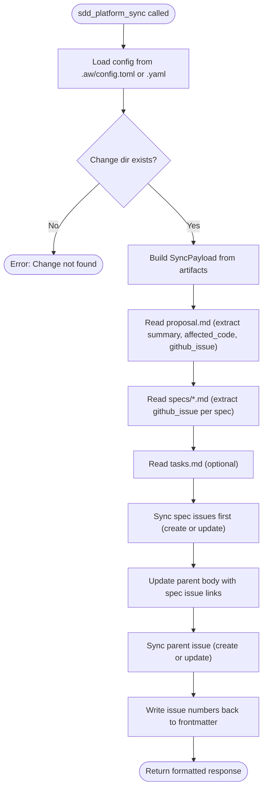

---
files:
  - tools/platform_sync.rs
  - services/platform_sync/mod.rs
  - services/platform_sync/config.rs
  - services/platform_sync/types.rs
  - services/platform_sync/payload.rs
  - services/platform_sync/github.rs
capability_refs:
  - id: aw-core-client-model-workitem-first-artifact-lifecycle
    role: primary
    gap: client-boundary-model
    claim: client-boundary-model
    coverage: full
    rationale: "Issue and platform-sync tool TDs expose AW Core workflow state through configured external clients."
---

# sdd_platform_sync: Sync Change Artifacts to External Platforms

Sync SDD change artifacts (proposal, specs, tasks) to external issue trackers (GitHub/GitLab). Creates or updates issues on the target platform, writes issue numbers back to artifact frontmatter, and auto-generates labels including scope labels from affected code paths.

**Callers**: `/cclab:sdd:run-change` skill (post-merge phase) and direct CLI tool invocation.
**Key invariant**: Issue numbers are persisted in artifact frontmatter (`github_issue: N`) so subsequent syncs update existing issues rather than creating duplicates.

## OpenRPC Method Definition
<!-- type: rpc-api lang: yaml -->

```yaml
name: sdd_platform_sync
summary: Sync SDD change artifacts to external platforms (GitHub/GitLab)
params:
  - name: project_path
    required: true
    schema:
      type: string
      description: Project root path (use $PWD for current directory)
  - name: change_id
    required: true
    schema:
      type: string
      description: The change ID to sync (must exist under .aw/changes/{change_id}/)
result:
  name: result
  schema:
    type: string
    description: Human-readable sync report including status, issue URLs, spec results, platform, and repository
```

## Configuration
<!-- type: doc lang: markdown -->

Config is loaded from `.aw/config.toml` (preferred) or `.aw/config.yaml` (legacy). Two config paths are checked in order:

1. `[agentic_workflow.issue_platform]` (namespaced, preferred)
2. `[platform]` (legacy, fallback)

### Full Config Schema (TOML)

```yaml
agentic_workflow.issue_platform:
  type: github          # github or gitlab (gitlab not yet implemented)
  repo: owner/repo      # Repository in owner/repo format
  auth:
    envfile: ".env"          # Path to .env file (relative to project root)
    envfield: GITHUB_TOKEN   # Field name in .env file
  labels:
    auto_create: true
    proposal: "cclab:sdd:proposal"
    spec: "cclab:sdd:spec"
    scope:
      enabled: true
      pattern: "crate:{scope}"
      auto_detect:
        path_regex: "crates/cclab-([^/]+)/"
  title:
    proposal: "[{change_id}] {title}"
    spec: "[{change_id}/spec] {spec_id}"
```

### Authentication Resolution Order

1. Environment variable directly (e.g., `GITHUB_TOKEN` in process env)
2. `.env` file at the configured path (supports quoted values, `export` prefix, escape sequences)
3. `gh auth status` (CLI fallback, no token needed)

## Behavior
<!-- type: doc lang: markdown -->

### Sync Flow



### Issue Hierarchy

The tool creates a parent-child issue structure:

| Issue Type | Source File | Title Format | Labels |
|------------|------------|--------------|--------|
| Parent (proposal) | `proposal.md` | `[{change_id}] {summary}` | `proposal` label + scope labels |
| Child (spec) | `specs/{spec_id}.md` | `[{change_id}/spec] {spec_id}` | `spec` label |

Spec issues are synced **before** the parent so the parent body can include links to spec issues via a `<!-- SPEC_TASKLIST_START -->` / `<!-- SPEC_TASKLIST_END -->` marker block. Checkbox state in the marker block is preserved across updates.

### Create vs Update (Upsert)

The tool determines create vs update by checking `github_issue` in each artifact's YAML frontmatter:

| `github_issue` in frontmatter | Action | SyncStatus |
|-------------------------------|--------|------------|
| Absent | Create new issue | `Created` |
| Present (e.g., `42`) | Update issue #42 | `Updated` |

After sync, issue numbers are written back to frontmatter automatically.

### GitHub Provider

Two transport modes, chosen automatically:

| Mode | Condition | Mechanism |
|------|-----------|-----------|
| API | Token available (env var or `.env` file) | `reqwest` HTTP client with `Bearer` auth |
| CLI | No token, `gh auth` authenticated | `gh issue create/edit` subprocess |

Error output from `gh` CLI is sanitized to redact tokens (`ghp_*`, `gho_*`, `Bearer ...`) before returning to the caller.

### Sync Statuses

| Status | Meaning |
|--------|---------|
| `Created` | New issue created on platform |
| `Updated` | Existing issue updated |
| `Partial` | Parent succeeded but some spec syncs failed |
| `Error` | Sync failed |

### Payload Construction

The parent issue body is assembled from:

1. **Header**: `# SDD Change: {change_id}` + auto-generation notice
2. **Proposal**: Full `proposal.md` content in a `<details>` collapsible
3. **Specifications**: Tasklist of spec issue links (with `<!-- SPEC_TASKLIST_START/END -->` markers)
4. **Tasks**: Full `tasks.md` content in a `<details>` collapsible (if present)
5. **Footer**: "Synced by cclab sdd" attribution

### Scope Label Auto-Detection

When `labels.scope.enabled = true`, the tool:

1. Extracts `affected_code` paths from proposal frontmatter
2. Applies `path_regex` to each path (captures group 1 as scope name)
3. Deduplicates scope names
4. Formats labels using `pattern` (e.g., `crate:{scope}` becomes `crate:sdd`)

## Side Effects
<!-- type: doc lang: markdown -->

### Filesystem

| File | Modification |
|------|-------------|
| `.aw/changes/{change_id}/proposal.md` | `github_issue: N` added/updated in frontmatter |
| `.aw/changes/{change_id}/specs/{spec_id}.md` | `github_issue: N` added/updated in frontmatter |

### External Platform

| Resource | Action |
|----------|--------|
| GitHub/GitLab issue (parent) | Created or updated with proposal + task list + spec links |
| GitHub/GitLab issues (specs) | Created or updated, one per spec file |

## Error Cases
<!-- type: doc lang: markdown -->

| Condition | Error |
|-----------|-------|
| No config file | `"Platform config not found at .aw/config.toml"` with setup instructions |
| No `[platform]` or `[agentic_workflow.issue_platform]` section | `"No platform section in config file"` with setup instructions |
| Change directory missing | `"Change '{id}' not found"` |
| `proposal.md` missing | `"proposal.md not found for change '{id}'"` |
| GitLab platform type | `"GitLab not yet implemented"` |
| No auth (token or CLI) | `"GitHub not authenticated. Set GITHUB_TOKEN in .env or run 'gh auth login'"` |
| GitHub API error | HTTP status code + response body (tokens redacted) |

## Changes
<!-- type: changes lang: yaml -->

```yaml
changes:
  - action: annotate
    section: rpc-api
    impl_mode: hand-written
    description: "Traceability metadata edge for the rpc-api section."

```