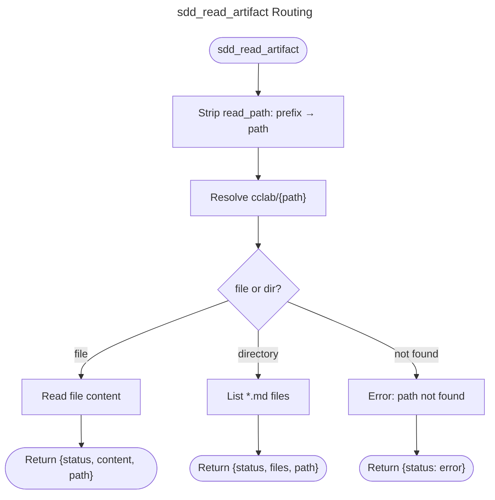

---
files:
  - tools/artifact_read.rs
  - services/file_service.rs
capability_refs:
  - id: td-cb-lifecycle-automation
    role: primary
    gap: td-lifecycle-dispatch
    claim: td-lifecycle-dispatch
    coverage: full
    rationale: "Tool TDs implement TD/CB lifecycle artifact authoring, review, revision, merge, and validation commands."
---

# sdd_read_artifact: Unified Artifact Reader

Read any file or list any directory under `cclab/` by relative path.

**Key design**: single `scope` parameter with `read_path:{path}` prefix. If path is a file → return content. If path is a directory → list `*.md` files. Workflow prompts provide exact paths — no magic name resolution needed.

## OpenRPC Method Definition
<!-- type: rpc-api lang: yaml -->

```yaml
name: sdd_read_artifact
summary: Read any SDD artifact by path (file -> content, directory -> list files)
params:
  - name: project_path
    required: true
    schema:
      type: string
  - name: scope
    required: true
    schema:
      type: string
      description: "read_path:{cclab-relative-path}. File -> returns content. Directory -> returns file list."
result:
  name: result
  schema:
    type: object
    required:
      - status
    properties:
      status:
        type: string
        enum:
          - ok
          - error
      content:
        type: string
        description: File content (when path is a file)
      files:
        type: array
        items:
          type: string
        description: File listing (when path is a directory)
      path:
        type: string
        description: Resolved absolute path
```

## Scope Reference
<!-- type: doc lang: markdown -->

`read_path:{path}` resolves to `{project_path}/cclab/{path}`.

### File → returns content

| example scope | resolves to |
|---------------|-------------|
| `read_path:changes/my-change/proposal.md` | `.aw/changes/my-change/proposal.md` |
| `read_path:changes/my-change/issues/issue_502.md` | `.aw/changes/my-change/issues/issue_502.md` |
| `read_path:specs/cclab-sdd/tools/run-change.md` | `.aw/tech-design/cclab-sdd/tools/run-change.md` |

### Directory → lists `*.md` files

| example scope | lists |
|---------------|-------|
| `read_path:specs/cclab-sdd` | Specs in cclab-sdd group |
| `read_path:changes/my-change/specs` | Change specs |
| `read_path:changes/my-change/issues` | Issue files |
| `read_path:specs` | All main spec groups |

## Routing
<!-- type: doc lang: markdown -->



## Validation Rules
<!-- type: doc lang: markdown -->

1. **Prefix required**: scope must start with `read_path:`. Other values are rejected.
2. **Path safety**: path must be relative (no leading `/`), must not contain `..`.
3. **Existence**: returns error if path does not exist (neither file nor directory).

## Changes
<!-- type: changes lang: yaml -->

```yaml
changes:
  - action: annotate
    section: rpc-api
    impl_mode: hand-written
    description: "Traceability metadata edge for the rpc-api section."

```