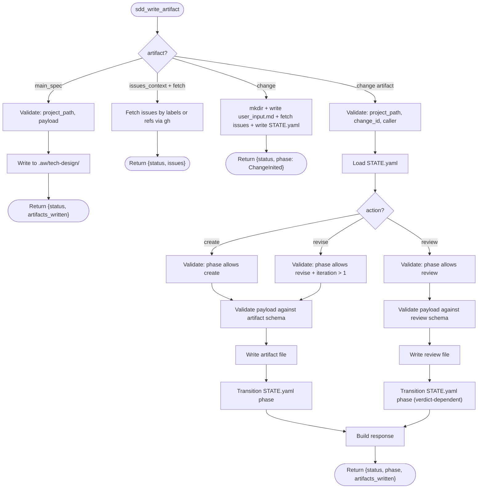
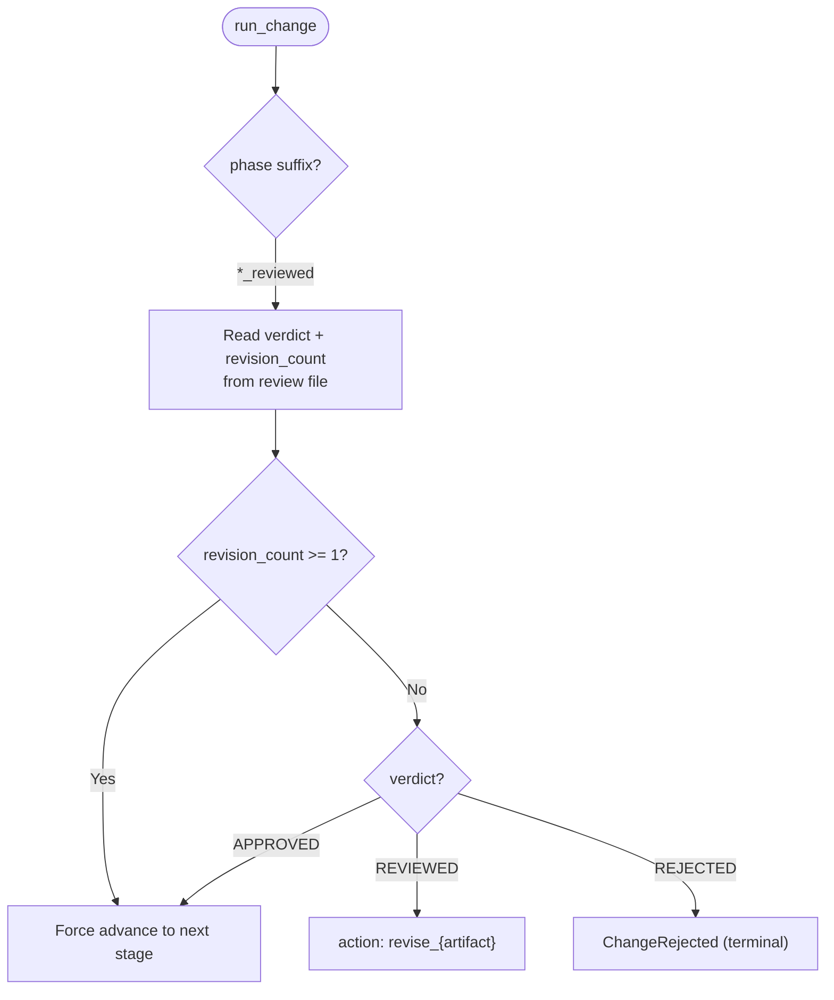
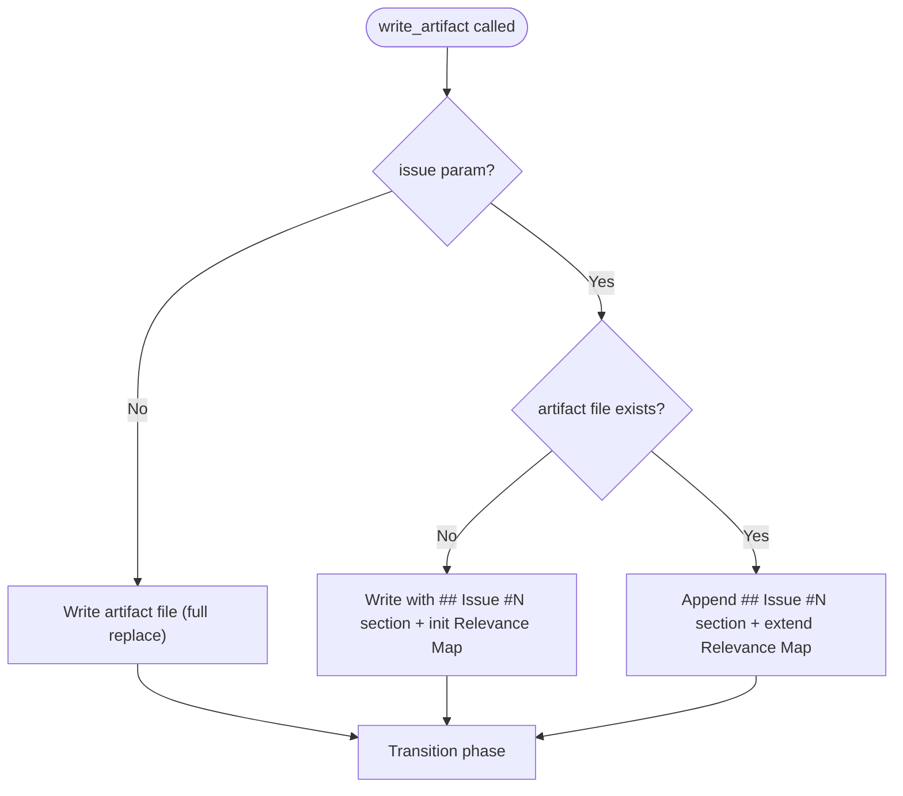

---
files:
  - tools/artifact_write.rs
refs: [init-change, create-pre-clarifications, create-reference-context, review-reference-context, create-post-clarifications, create-change-spec, review-change-spec, create-change-implementation, create-change-merge]
capability_refs:
  - id: td-cb-lifecycle-automation
    role: primary
    gap: td-lifecycle-dispatch
    claim: td-lifecycle-dispatch
    coverage: full
    rationale: "Tool TDs implement TD/CB lifecycle artifact authoring, review, revision, merge, and validation commands."
---

# sdd_write_artifact: Unified Artifact Writer

Unified tool for all artifact lifecycle operations: **create**, **revise**, and **review**. Single dispatch point for all change artifacts and knowledge documents.

**Key design**: artifact-specific params are passed via `payload` (opaque JSON object). The tool routes by `(artifact, action)` to the correct handler, validates the payload schema, and writes the file.

**Phase-write decoupling (three-role contract)**: Writing an artifact MUST NOT advance `STATE.yaml.phase` or issue frontmatter `phase:`. Phase advancement is owned exclusively by `score workflow validate` (invoked by the SubagentStop hook). The historical 6 call sites of `workflow_common::update_phase` inside artifact tools have been removed. See `projects/agentic-workflow/specs/three-role-contract.md` R8.

## OpenRPC Method Definition
<!-- type: rpc-api lang: yaml -->

```yaml
name: sdd_write_artifact
summary: Create, revise, review, or fetch any workflow artifact, or write main_spec
params:
  - name: project_path
    required: true
    schema:
      type: string
  - name: change_id
    required: false
    schema:
      type: string
      pattern: "^[a-z0-9-]+$"
      description: Required for change artifacts. Not used for knowledge/main_spec.
  - name: artifact
    required: true
    schema:
      type: string
      enum:
        - change
        - pre_clarifications
        - reference_context
        - codebase_context
        - spec_context
        - knowledge_context
        - gap_codebase_spec
        - gap_codebase_knowledge
        - gap_spec_knowledge
        - post_clarifications
        - change_spec
        - change_implementation
        - change_merge
        - issues_context
        - main_spec
  - name: action
    required: true
    schema:
      type: string
      enum:
        - create
        - revise
        - review
        - write
        - fetch
      description: create/revise/review for change artifacts. write for main_spec. fetch for issues_context.
  - name: caller
    required: false
    schema:
      type: string
      enum:
        - agent
        - mainthread
      description: Who is calling. Required for change artifacts.
  - name: payload
    required: true
    schema:
      type: object
      description: Action-specific parameters. Schema depends on (artifact, action) -- see Payload Schemas section.
  - name: issue
    required: false
    schema:
      type: integer
      description: Issue number (DAG multi-issue mode). Controls per-issue append vs full replace.
  - name: iteration
    required: false
    schema:
      type: integer
      minimum: 1
      default: 1
result:
  name: result
  schema:
    type: object
    required:
      - status
      - artifact
      - action
    properties:
      status:
        type: string
        enum:
          - ok
          - error
      change_id:
        type: string
      artifact:
        type: string
      action:
        type: string
      artifacts_written:
        type: array
        items:
          type: string
      phase:
        type: string
        description: New STATE.yaml phase (change artifacts only)
      verdict:
        type: string
        enum:
          - APPROVED
          - REVIEWED
          - REJECTED
        description: Only present when action=review
      issues_count:
        type: object
        properties:
          high:
            type: integer
          medium:
            type: integer
          low:
            type: integer
        description: Only present when action=review
```

## Artifact Categories
<!-- type: doc lang: markdown -->

### Change Artifacts (require change_id, lifecycle phases)

| artifact | artifact_file | spec reference |
|----------|--------------|----------------|
| `change` | `user_input.md`, `STATE.yaml` | [init-change](../workflows/init-change.md) |
| `change_spec` | `specs/{spec_group}/{spec_id}.md` | [create-change-spec](../workflow/create-change-spec.md) |
| `change_implementation` | `implementation.md` | [create-change-implementation](../workflow/create-change-implementation.md) |
| `issues_context` | `issues_context.md` | (fetch action only) |

### Issue-Level Artifacts (not SDD change artifacts)

> **NOTE (issue-lifecycle-crr):** The following artifact types are now issue-level artifacts,
> not SDD change artifacts. They are written during issue authoring (via `aw wi create`
> and `aw wi enrich`), not during the SDD change workflow. The issue body sections
> (`## Reference Context`, `## Requirements`, etc.) serve as the canonical source of this data.

| artifact | Former role | Now handled by |
|----------|------------|----------------|
| `pre_clarifications` | Phase 3 artifact | Issue `## Key Decisions` section |
| `reference_context` | Phase 4-6 artifact | Issue `## Reference Context` section |
| `post_clarifications` | Phase 7 artifact | Issue `## Scope` + `## Acceptance Criteria` sections |
| `spec_context` | Reference context sub-artifact | Issue `## Reference Context` section |
| `knowledge_context` | Reference context sub-artifact | Issue `## Reference Context` section |
| `codebase_context` | Reference context sub-artifact | Issue `## Reference Context` section |
| `gap_codebase_spec` | Reference context sub-artifact | Issue `## Reference Context` section |
| `gap_codebase_knowledge` | Reference context sub-artifact | Issue `## Reference Context` section |
| `gap_spec_knowledge` | Reference context sub-artifact | Issue `## Reference Context` section |

### Static Artifacts (no change_id, no lifecycle)

| artifact | action | directory | description |
|----------|--------|-----------|-------------|
| `main_spec` | `write` | `.aw/tech-design/` | Spec files (full content with frontmatter) |

### Review-only Artifacts (no create/revise, separate output file)

This artifact type only supports `action: review` and writes a separate file rather than inline.

| artifact | artifact_file | spec reference |
|----------|--------------|----------------|
| `change_merge` | `review_merge.md` | [review-change-merge](../workflow/review-change-merge.md) |

## Routing: (artifact, action) → handler
<!-- type: doc lang: markdown -->



## Phase Transition Matrix
<!-- type: doc lang: markdown -->

### action: create

| artifact | required_phase | new_phase | output_file |
|----------|---------------|-----------|-------------|
| `change` | (none — new change, no directory) | `ChangeInited` | `user_input.md`, `STATE.yaml` |
| `change_spec` | `ChangeInited` | `ChangeSpecCreated` | `specs/{spec_group}/{spec_id}.md` |
| `change_implementation` | `ChangeImplementationCreated` | _(no phase transition)_ | `implementation.md` |

> **NOTE (issue-lifecycle-crr):** The `pre_clarifications`, `reference_context`, `post_clarifications`,
> and sub-context artifacts (`spec_context`, `knowledge_context`, `codebase_context`, `gap_*`) are no
> longer created during the SDD change workflow. They are now issue-level data written during issue
> authoring. The `change_spec` phase now starts directly from `ChangeInited`.

### action: revise

| artifact | required_phase | new_phase |
|----------|---------------|-----------|
| `change_spec` | `*Reviewed` | `ChangeSpecRevised` |
| `change_implementation` | `*Reviewed` | `ChangeImplementationRevised` |

On revise: `revision_counts.{artifact}` is incremented by 1.

### action: review

Reviews are written **inline** as a `# Reviews` section inside the original artifact file (not as separate files). The artifact's YAML frontmatter is updated with `review_verdict` and `review_iteration` fields. For APPROVED, these fields and the `# Reviews` section are cleared.

**Exception**: merge reviews (`review_merge.md`) remain as a separate file.

| artifact | required_phase | APPROVED | REVIEWED | REJECTED | output_file |
|----------|---------------|----------|----------|----------|-------------|
| `change_spec` | `*Created` or `*Revised` | `ChangeSpecReviewed` | `ChangeSpecReviewed` | `ChangeRejected` | `specs/{spec_id}.md` (inline) |
| `change_implementation` | `ChangeImplementationCreated` or `ChangeImplementationRevised` | `ChangeImplementationReviewed` | `ChangeImplementationReviewed` | `ChangeRejected` | `implementation.md` (inline, `## Review: {spec_id}` section) |
| `change_merge` | `ChangeMergeCreated` or `ChangeMergeRevised` | `ChangeMergeReviewed` | `ChangeMergeReviewed` | `ChangeRejected` | `review_merge.md` (separate) |

**Note**: Both APPROVED and REVIEWED verdicts produce `{artifact}_reviewed` phase. `run_change` then routes based on verdict + revision_count: APPROVED on 1st review (revision_count=0) → advance; REVIEWED → revise; 2nd review (revision_count >= 1) → force-advance regardless of verdict. REJECTED is reserved for severe failures and produces `ChangeRejected` terminal state.

## Payload Schemas
<!-- type: doc lang: markdown -->

### Create / Revise Payloads (change artifacts)

| artifact | payload keys | spec reference |
|----------|-------------|----------------|
| `change` | `description` (required), `issue_refs` (optional array), `git_workflow` (optional enum) | [init-change](../workflows/init-change.md) |
| `pre_clarifications` | `questions[]` with `{topic, question, answer, rationale}` | [create-pre-clarifications](../workflows/create-pre-clarifications.md) |
| `reference_context` | `specs[]`, `knowledge[]`, `codebase[]`, `gaps[]` | [create-reference-context](../workflow/create-reference-context.md) |
| `spec_context` | `specs[]` with id, relevance, dependencies | [create-reference-context](../workflow/create-reference-context.md) |
| `knowledge_context` | `patterns[]`, `conventions[]`, `pitfalls[]` | [create-reference-context](../workflow/create-reference-context.md) |
| `codebase_context` | `modules[]`, `dependencies[]`, `code_patterns[]` | [create-reference-context](../workflow/create-reference-context.md) |
| `gap_codebase_spec` | `gaps[]` with description, severity, recommendation | [create-reference-context](../workflow/create-reference-context.md) |
| `gap_codebase_knowledge` | `gaps[]` with description, severity, recommendation | [create-reference-context](../workflow/create-reference-context.md) |
| `gap_spec_knowledge` | `gaps[]` with description, severity, recommendation | [create-reference-context](../workflow/create-reference-context.md) |
| `post_clarifications` | `questions[]`, `contradictions[]` | [create-post-clarifications](../workflow/create-post-clarifications.md) |
| `change_spec` | `spec_group`, `spec_id`, `title`, `overview`, `spec_type`, `refs[]`, `merge_strategy`, `requirements` (structured input → `generate_requirement_plus`), `scenarios` (structured input → `generate_journey_plus`), `diagrams[]` (structured input → `generate_*_plus` per type), `api_spec` | [create-change-spec](../workflow/create-change-spec.md) |
| `change_implementation` | `diff` (string, required — full `git diff` output), `summary` (string, optional) | [create-change-implementation](../workflow/create-change-implementation.md) |

Revise uses the same payload schema as create — the handler overwrites the artifact file.

### Fetch Payload (issues_context)

| artifact | payload keys |
|----------|-------------|
| `issues_context` | `labels` (array of strings, list via gh then fetch) or `issue_refs` (array of strings, direct fetch) |

### Write Payloads (static artifacts)

| artifact | payload keys |
|----------|-------------|
| `main_spec` | `path` (relative to .aw/tech-design/), `content` (full markdown with frontmatter) |

### Review Payload (all change artifacts)

```json
{
  "verdict": { "type": "string", "enum": ["APPROVED", "REVIEWED", "REJECTED"], "required": true },
  "summary": { "type": "string", "minLength": 10, "required": true },
  "checklist_results": {
    "type": "array",
    "items": {
      "type": "object",
      "required": ["item", "passed"],
      "properties": {
        "item": { "type": "string" },
        "passed": { "type": "boolean" },
        "note": { "type": "string" }
      }
    }
  },
  "issues": {
    "type": "array",
    "items": {
      "type": "object",
      "required": ["severity", "description"],
      "properties": {
        "severity": { "type": "string", "enum": ["HIGH", "MEDIUM", "LOW"] },
        "description": { "type": "string" },
        "recommendation": { "type": "string" }
      }
    }
  }
}
```

Review checklist items are artifact-specific — see the corresponding `review.md` spec.

### Change Merge Review Payload (change_merge only)

The `change_merge` review payload includes an additional required field:

```json
{
  "verdict": { "type": "string", "enum": ["APPROVED", "REVIEWED", "REJECTED"], "required": true },
  "summary": { "type": "string", "minLength": 10, "required": true },
  "merge_quality": { "type": "string", "enum": ["CLEAN", "PARTIAL", "FAILED"], "required": true },
  "checklist_results": { "type": "array", "items": { "$ref": "#/checklist_item" } },
  "issues": { "type": "array", "items": { "$ref": "#/issue" } }
}
```

`merge_quality` values: `CLEAN` (all specs merged correctly), `PARTIAL` (some issues found), `FAILED` (fundamental merge problems).

## Threshold Escalation
<!-- type: doc lang: markdown -->

`run_change` (not `write_artifact`) enforces revision thresholds. When routing a `*_reviewed` phase, `run_change` reads **verdict + revision_count** from the review file to decide next action:

| verdict | revision_count | behavior |
|---------|---------------|----------|
| `APPROVED` | 0 (1st review) | → advance to next artifact or stage |
| `REVIEWED` | 0 (1st review) | → revise (auto) |
| any | >= 1 (2nd review) | → force-advance to next artifact or stage |
| `REJECTED` | any | → `ChangeRejected` terminal state |

Total artifact modification attempts: create(1) + revise(max 1) = 2 chances (2nd review always advances).



## Multi-Issue Write Logic (DAG mode)
<!-- type: doc lang: markdown -->

When `issue` param is provided, `write_artifact` uses append-or-extend behavior:



## Review Artifact Format
<!-- type: doc lang: markdown -->

### Inline Review (reference_context, change_spec, change_implementation)

Reviews are written as a `# Reviews` section appended to the original artifact file. The artifact's YAML frontmatter is updated with `review_verdict` and `review_iteration` fields.

**APPROVED** clears `review_verdict`/`review_iteration` from frontmatter and removes the `# Reviews` section.
**REVIEWED / REJECTED** updates frontmatter fields and replaces the `# Reviews` section.

```markdown
---
id: {{change_id}}
type: {{artifact}}
review_verdict: REVIEWED
review_iteration: 2
---

# {{Artifact Title}}

{{original artifact content}}

# Reviews

\## Review: {{artifact}} (Iteration 2)

**Change ID**: {{change_id}}

**Verdict**: REVIEWED

### Summary

{{summary}}

### Checklist

- [pass/fail] {{item}}
  - {{note}}

### Issues

- **[HIGH]** {{description}}
  - *Recommendation*: {{recommendation}}
```

### Inline Review: change_implementation (per-spec sections)

Implementation reviews are appended inline in `implementation.md` as `## Review: {spec_id}` sub-sections inside the `# Reviews` section. Each spec gets its own sub-section.

```markdown
---
id: {{change_id}}
type: change_implementation
review_verdict: REVIEWED
review_iteration: 1
---

# Implementation

{{git diff + summary content}}

# Reviews

\## Review: {{spec_id}} (Iteration {{iteration}})

**Verdict**: REVIEWED

### Summary

{{summary}}

### Checklist

- [pass/fail] {{item}}
  - {{note}}

### Issues

- **[HIGH]** {{description}}
  - *Recommendation*: {{recommendation}}
```

### Separate Review File (change_merge only)

Merge reviews remain as a separate file `review_merge.md` with its own frontmatter:

```markdown
---
verdict: {{verdict}}
file: change_merge
merge_quality: {{merge_quality}}
iteration: {{iteration}}
---

# Review: change_merge (Iteration {{iteration}})

**Change ID**: {{change_id}}

\## Summary

{{summary}}

\## Checklist

- [pass/fail] {{item}} — {{note}}

\## Issues

- **[HIGH]** {{description}}
  - *Recommendation*: {{recommendation}}

\## Verdict

- [x] APPROVED / REVIEWED / REJECTED
```

## Side Effects
<!-- type: doc lang: markdown -->

### STATE.yaml — phase transition (change artifacts only)

| action | STATE.yaml field | Value |
|--------|-----------------|-------|
| create | `phase` | `{artifact}_created` |
| revise | `phase` | `{artifact}_revised` |
| revise | `revision_counts.{artifact}` | increment +1 |
| review (APPROVED) | `phase` | `{artifact}_reviewed` |
| review (REVIEWED) | `phase` | `{artifact}_reviewed` |
| review (REJECTED) | `phase` | `ChangeRejected` (terminal) |
| all | `updated_at` | ISO 8601 |

### Knowledge / Main Spec — no STATE.yaml changes

`action: write` with `artifact: knowledge` or `artifact: main_spec` only writes files. No phase transitions.

## Backward Compatibility
<!-- type: doc lang: markdown -->

`sdd_write_artifact` replaces these tools:

| Old tool | Equivalent call |
|----------|----------------|
| `sdd_create_clarifications(...)` | `write_artifact(artifact="pre_clarifications", action="create", ...)` |
| `sdd_append_clarifications(...)` (removed) | `write_artifact(artifact="pre_clarifications", action="create", issue=N, ...)` |
| `sdd_create_context(context_type="codebase_context", ...)` | `write_artifact(artifact="reference_context", action="create", ...)` |
| `sdd_create_context(context_type="spec_context", ...)` | `write_artifact(artifact="reference_context", action="create", ...)` |
| `sdd_create_context(context_type="knowledge_context", ...)` | `write_artifact(artifact="reference_context", action="create", ...)` |
| `sdd_create_proposal(...)` | (removed — ChangeSpec IS the task) |
| `sdd_create_spec(...)` | `write_artifact(artifact="change_spec", action="create", ...)` |
| `sdd_review_file(file="...", ...)` | `write_artifact(artifact="...", action="review", ...)` |
| `sdd_review_proposal(...)` | (removed — no proposal step) |
| `sdd_review_spec(...)` | `write_artifact(artifact="change_spec", action="review", ...)` |
| `sdd_write_main_spec(...)` | `write_artifact(artifact="main_spec", action="write", payload={path, content})` |

## Validation Rules
<!-- type: doc lang: markdown -->

1. **Phase guard**: checks STATE.yaml phase before writing. Invalid phase → error.
2. **Payload schema**: validated against the artifact-specific schema. Missing required fields → error with field names.
3. **Verdict values**: only `APPROVED`, `REVIEWED`, `REJECTED` accepted.
4. **Iteration consistency**: on revise, `iteration` must be > 1. On create, defaults to 1.
5. **Artifact file existence**: on revise/review, the target artifact file must exist. On create with `issue` param, the file may or may not exist (append mode).
6. **Static artifact validation**: `main_spec` requires `path`, `content`. Directory traversal prevented.
7. **change_spec diagram generation**: on create/revise, `write_artifact` internally runs `generate_*_plus` for each diagram. `requirements` → `generate_requirement_plus`, `scenarios` → `generate_journey_plus`, `diagrams[i]` → the appropriate `generate_{type}_plus`. Structured input is validated before rendering; invalid input returns an error with a concrete example of the expected schema — not just the field name. Agent never writes raw Mermaid syntax.

## Changes
<!-- type: changes lang: yaml -->

```yaml
changes:
  - action: annotate
    section: rpc-api
    impl_mode: hand-written
    description: "Traceability metadata edge for the rpc-api section."

```