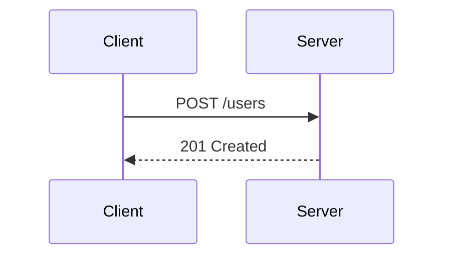
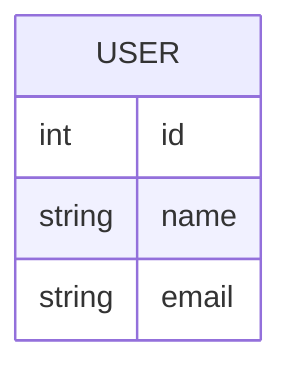
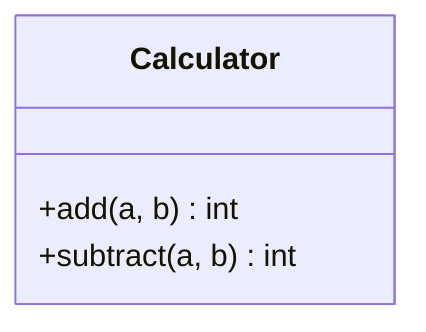
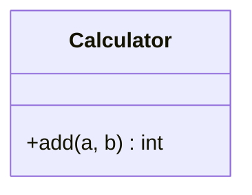
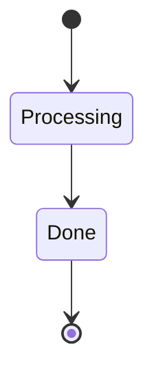
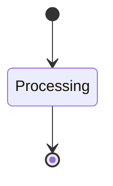

# sdd tools validate spec tests

## Overview
<!-- type: overview lang: markdown -->

Public API manifest for `projects/agentic-workflow/src/tools/validate_spec.rs` generated from AST during Score force-regeneration standardization.

### Symbols

| Name | Target | Kind | Visibility | Line | Signature |
|------|--------|------|------------|------|-----------|
| `definition` | projects/agentic-workflow/src/tools/validate_spec.rs | function | pub | 19 | definition() -> ToolDefinition |
| `execute` | projects/agentic-workflow/src/tools/validate_spec.rs | function | pub | 62 | execute(args: &Value, project_root: &Path) -> Result<String> |
## Source
<!-- type: source lang: rust -->

````rust
#[cfg(test)]
mod tests {
    use super::*;
    use tempfile::TempDir;

    fn create_test_spec(content: &str) -> TempDir {
        let temp_dir = TempDir::new().unwrap();
        let project_root = temp_dir.path();

        // Create spec directory
        let spec_dir = project_root.join(".aw/changes/test-change/specs");
        std::fs::create_dir_all(&spec_dir).unwrap();

        // Write spec file
        std::fs::write(spec_dir.join("test-spec.md"), content).unwrap();

        temp_dir
    }

    #[test]
    fn test_validate_complete_http_api_spec() {
        let content = r#"---
id: test-spec
title: Test API Spec
spec_type: http-api
---

## Overview

This is a test API spec.

## Requirements

### R1: Create User
Create a new user in the system.

## Acceptance Criteria

### Scenario: Create user successfully
**GIVEN** valid user data
**WHEN** POST /users is called
**THEN** user is created

## Flow Diagram



## API Specification

```yaml
openapi: 3.1.0
info:
  title: Test API
  version: 1.0.0
paths:
  /users:
    post:
      summary: Create user
```
"#;

        let temp_dir = create_test_spec(content);
        let args = json!({
            "project_path": temp_dir.path().to_str().unwrap(),
            "change_id": "test-change",
            "spec_id": "test-spec"
        });

        let result = execute(&args, temp_dir.path()).unwrap();
        let output: Value = serde_json::from_str(&result).unwrap();

        assert!(output["is_complete"].as_bool().unwrap());
        assert!(output["missing_elements"].as_array().unwrap().is_empty());
    }

    #[test]
    fn test_validate_incomplete_http_api_spec() {
        let content = r#"---
id: test-spec
title: Test API Spec
spec_type: http-api
---

## Overview

This is a test API spec.

## Requirements

### R1: Create User
Create a new user in the system.

## Acceptance Criteria

### Scenario: Create user successfully
**GIVEN** valid user data
**WHEN** POST /users is called
**THEN** user is created
"#;

        let temp_dir = create_test_spec(content);
        let args = json!({
            "project_path": temp_dir.path().to_str().unwrap(),
            "change_id": "test-change",
            "spec_id": "test-spec"
        });

        let result = execute(&args, temp_dir.path()).unwrap();
        let output: Value = serde_json::from_str(&result).unwrap();

        assert!(!output["is_complete"].as_bool().unwrap());
        let missing = output["missing_elements"].as_array().unwrap();
        assert!(missing
            .iter()
            .any(|m| m.as_str().unwrap().contains("Sequence diagram")));
        assert!(missing
            .iter()
            .any(|m| m.as_str().unwrap().contains("OpenAPI")));
    }

    #[test]
    fn test_validate_data_model_spec() {
        let content = r#"---
id: test-spec
title: Data Model Spec
spec_type: data-model
---

## Overview

This is a data model spec.

## Requirements

### R1: User Entity
Define the User entity.

## Acceptance Criteria

### Scenario: User has required fields
**WHEN** User is created
**THEN** it has id, name, email

## Entity Diagram



## Data Model

```json
{
  "$schema": "https://json-schema.org/draft/2020-12/schema",
  "title": "User",
  "type": "object",
  "properties": {
    "id": { "type": "integer" },
    "name": { "type": "string" },
    "email": { "type": "string" }
  }
}
```
"#;

        let temp_dir = create_test_spec(content);
        let args = json!({
            "project_path": temp_dir.path().to_str().unwrap(),
            "change_id": "test-change",
            "spec_id": "test-spec"
        });

        let result = execute(&args, temp_dir.path()).unwrap();
        let output: Value = serde_json::from_str(&result).unwrap();

        assert!(output["is_complete"].as_bool().unwrap());
    }

    #[test]
    fn test_validate_spec_coverage() {
        let content = r#"---
id: test-spec
title: Test Spec
spec_type: utility
---

## Overview

This is a test spec.

## Requirements

### R1: First requirement
Description.

### R2: Second requirement
Description.

### R3: Third requirement
Description.

## Acceptance Criteria

### Scenario: First scenario
**WHEN** something happens
**THEN** result occurs
"#;

        let temp_dir = create_test_spec(content);
        let args = json!({
            "project_path": temp_dir.path().to_str().unwrap(),
            "change_id": "test-change",
            "spec_id": "test-spec"
        });

        let result = execute(&args, temp_dir.path()).unwrap();
        let output: Value = serde_json::from_str(&result).unwrap();

        // Should be complete (utility has no required diagrams)
        assert!(output["is_complete"].as_bool().unwrap());

        // But should have coverage warning
        let warnings = output["warnings"].as_array().unwrap();
        assert!(warnings.iter().any(|w| w
            .as_str()
            .unwrap()
            .contains("Only 1 scenarios for 3 requirements")));

        // Check coverage stats
        let coverage = &output["coverage"];
        assert_eq!(coverage["requirements_count"].as_i64().unwrap(), 3);
        assert_eq!(coverage["scenarios_count"].as_i64().unwrap(), 1);
    }

    #[test]
    fn test_validate_spec_without_type() {
        let content = r#"---
id: test-spec
title: Test Spec
---

## Overview

This is a test spec.

## Requirements

### R1: Requirement
Description.

## Acceptance Criteria

### Scenario: Test scenario
**WHEN** something happens
**THEN** result occurs
"#;

        let temp_dir = create_test_spec(content);
        let args = json!({
            "project_path": temp_dir.path().to_str().unwrap(),
            "change_id": "test-change",
            "spec_id": "test-spec"
        });

        let result = execute(&args, temp_dir.path()).unwrap();
        let output: Value = serde_json::from_str(&result).unwrap();

        // Should be complete (no spec_type means no required elements)
        assert!(output["is_complete"].as_bool().unwrap());

        // But should have warning about missing spec_type
        let warnings = output["warnings"].as_array().unwrap();
        assert!(warnings
            .iter()
            .any(|w| w.as_str().unwrap().contains("No spec_type specified")));
    }

    #[test]
    fn test_validate_complete_rpc_api_spec() {
        let content = r#"---
id: test-spec
title: RPC API Spec
spec_type: rpc-api
---

## Overview

This is an RPC API spec.

## Requirements

### R1: Method Definition
Define the RPC methods.

## Acceptance Criteria

### Scenario: Call method successfully
**WHEN** client calls method
**THEN** server responds

## Class Diagram



## API Specification

```yaml
openrpc: 1.3.0
info:
  title: Calculator API
  version: 1.0.0
methods:
  - name: add
    params: []
```
"#;

        let temp_dir = create_test_spec(content);
        let args = json!({
            "project_path": temp_dir.path().to_str().unwrap(),
            "change_id": "test-change",
            "spec_id": "test-spec"
        });

        let result = execute(&args, temp_dir.path()).unwrap();
        let output: Value = serde_json::from_str(&result).unwrap();

        assert!(output["is_complete"].as_bool().unwrap());
        assert!(output["missing_elements"].as_array().unwrap().is_empty());
    }

    #[test]
    fn test_validate_incomplete_rpc_api_spec_wrong_api_type() {
        // rpc-api with OpenAPI instead of OpenRPC should fail
        let content = r#"---
id: test-spec
title: RPC API Spec
spec_type: rpc-api
---

## Overview

This is an RPC API spec with wrong API type.

## Requirements

### R1: Method Definition
Define the RPC methods.

## Acceptance Criteria

### Scenario: Call method
**WHEN** client calls
**THEN** server responds

## Class Diagram



## API Specification (OpenAPI 3.1)

```yaml
openapi: 3.1.0
info:
  title: Wrong API Type
  version: 1.0.0
paths: {}
```
"#;

        let temp_dir = create_test_spec(content);
        let args = json!({
            "project_path": temp_dir.path().to_str().unwrap(),
            "change_id": "test-change",
            "spec_id": "test-spec"
        });

        let result = execute(&args, temp_dir.path()).unwrap();
        let output: Value = serde_json::from_str(&result).unwrap();

        // Should NOT be complete - has OpenAPI but needs OpenRPC
        assert!(!output["is_complete"].as_bool().unwrap());
        let missing = output["missing_elements"].as_array().unwrap();
        assert!(missing
            .iter()
            .any(|m| m.as_str().unwrap().contains("OpenRPC 1.3")));
    }

    #[test]
    fn test_validate_complete_workflow_spec() {
        let content = r#"---
id: test-spec
title: Workflow Spec
spec_type: workflow
---

## Overview

This is a workflow spec.

## Requirements

### R1: State Transitions
Define the workflow states.

## Acceptance Criteria

### Scenario: Complete workflow
**WHEN** workflow starts
**THEN** transitions to end state

## State Diagram



## API Specification

```yaml
specVersion: 0.8.0
id: my-workflow
name: My Workflow
start: Processing
states:
  - name: Processing
    type: operation
```
"#;

        let temp_dir = create_test_spec(content);
        let args = json!({
            "project_path": temp_dir.path().to_str().unwrap(),
            "change_id": "test-change",
            "spec_id": "test-spec"
        });

        let result = execute(&args, temp_dir.path()).unwrap();
        let output: Value = serde_json::from_str(&result).unwrap();

        assert!(output["is_complete"].as_bool().unwrap());
        assert!(output["missing_elements"].as_array().unwrap().is_empty());
    }

    #[test]
    fn test_validate_incomplete_workflow_spec() {
        // workflow without Serverless Workflow spec should fail
        let content = r#"---
id: test-spec
title: Workflow Spec
spec_type: workflow
---

## Overview

This is a workflow spec without API spec.

## Requirements

### R1: State Transitions
Define the workflow states.

## Acceptance Criteria

### Scenario: Complete workflow
**WHEN** workflow starts
**THEN** transitions to end

## State Diagram


"#;

        let temp_dir = create_test_spec(content);
        let args = json!({
            "project_path": temp_dir.path().to_str().unwrap(),
            "change_id": "test-change",
            "spec_id": "test-spec"
        });

        let result = execute(&args, temp_dir.path()).unwrap();
        let output: Value = serde_json::from_str(&result).unwrap();

        // Should NOT be complete - missing Serverless Workflow spec
        assert!(!output["is_complete"].as_bool().unwrap());
        let missing = output["missing_elements"].as_array().unwrap();
        assert!(missing
            .iter()
            .any(|m| m.as_str().unwrap().contains("Serverless Workflow 0.8")));
    }
}
````

## Changes
<!-- type: changes lang: yaml -->

```yaml
changes:
  - path: projects/agentic-workflow/src/tools/validate_spec.rs
    action: modify
    section: source
    impl_mode: codegen
    replaces:
      - "tests"
      - "<module-trailer>"
    description: "Regression tests for validate-spec completeness checks."
```
